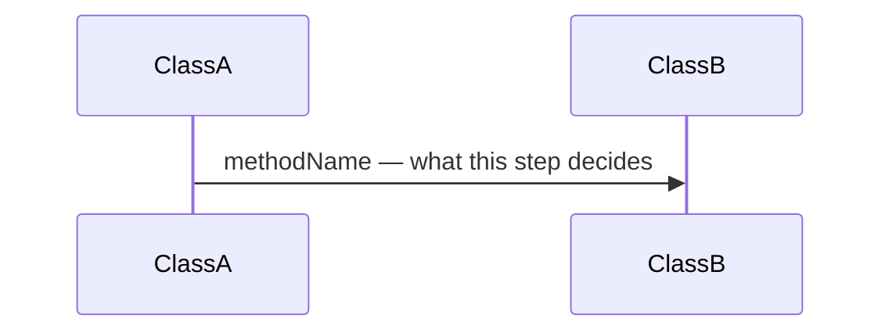

# <System name>

<!--
  PASS 3 NOTE (2026-09-02). This skeleton is the pass-1 template, and every
  one of the 79 pages follows it heading for heading — which is the site's
  biggest readability problem. Pass 3 session A rewrites this file into a
  MENU OF SHAPES (trace · pipeline · state machine · policy · comparison ·
  vocabulary · pattern · landing page), with the devices, the bullet budgets
  and the lane key, after piloting it on two pages. Until then the spec is
  ruling R2 in docs/plan.md. Do not draft a new page from the skeleton below.
-->

> Verified against **Minecraft 26.2** · Part <N> · <one-line scenario this page traces>

## Responsibility

One paragraph: what this system is for, and the one sentence a player would
recognise it by.

## The data it owns

The types, by name, and what each holds. Who else may touch them, and on
which thread. (`ServerLevel` owns …; `ClientLevel` holds the client's copy
of …; nothing outside `X` writes `Y`.)

## When it runs

Its place in the server tick and/or the client frame, and the thread it runs
on. Where it hands work to another thread and how the result comes back.

## The trace: <scenario>

Narrate the diagram: each arrow is a decision, not a call. Name the class and
method so a reader with the decompile can find it; never paste the body.

## Interfaces

- **Called by:** …
- **Calls into:** …
- **Crosses the network as:** the packets by name, and in which direction.
- **Data-driven by:** the registry / JSON / tag that configures it.

## Invariants and surprises

The things that are wrong in every forum answer. Bullet each with the
class that makes it true.

## Where to look

Entry-point class names only, in the order you'd read them.

---

*Rules: names, never code · how the system works, not how the code reads ·
newest version only · every backticked name passes `tools/verify_names.py`.*
