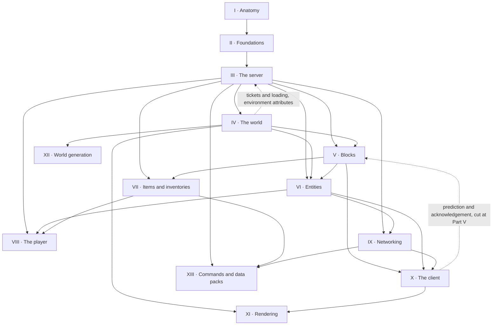

```mermaid
flowchart TB
    P1["I · Anatomy"]
    P2["II · Foundations"]
    P3["III · The server"]
    P4["IV · The world"]
    P5["V · Blocks"]
    P6["VI · Entities"]
    P7["VII · Items and inventories"]
    P8["VIII · The player"]
    P9["IX · Networking"]
    P10["X · The client"]
    P11["XI · Rendering"]
    P12["XII · World generation"]
    P13["XIII · Commands and data packs"]
    P1 --> P2 --> P3
    P3 --> P4
    P3 --> P5
    P3 --> P6
    P3 --> P7
    P3 --> P8
    P3 --> P9
    P3 --> P13
    P4 --> P5
    P4 --> P6
    P4 --> P11
    P4 --> P12
    P5 --> P6
    P5 --> P7
    P5 --> P10
    P6 --> P8
    P6 --> P9
    P6 --> P10
    P7 --> P8
    P7 --> P13
    P9 --> P10
    P9 --> P13
    P10 --> P11
    P4 -. "tickets and loading, environment attributes" .-> P3
    P10 -. "prediction and acknowledgement, cut at Part V" .-> P5
```
