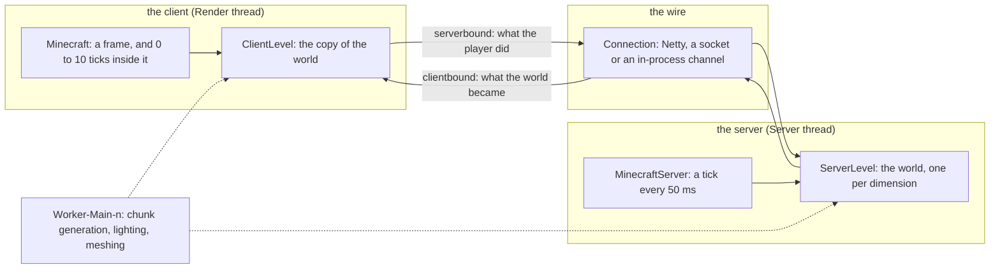

# Introduction

> Verified against **Minecraft 26.2**

Java Minecraft is one codebase that runs as two programs. The **server** is
the world: a loop that ticks twenty times a second, owns every chunk, entity
and block, and is the only thing allowed to change them. The **client** is a
window, a loop that draws a frame as often as it can, and a copy of the
world it is *told about*. They talk over a real Netty connection even when
both run in the same process — in singleplayer the connection never touches
a socket, but the packets are real, and an `IntegratedServer` is a
`MinecraftServer` with the client half attached rather than absent. Almost
everything a player experiences is a consequence of that split: the
client predicts and the server overrules; a chunk exists on the server long
before the client is sent it; a sword swing is a packet, a hit is a reply.

The whole thing is 7,055 classes and about 720,000 lines of Java 25. Just
under a third of it is client-only; the rest ships in both jars. Four threads carry nearly
all of it — the Render thread, which is also the client's game thread; the
Server thread; the Netty event loop; and a shared worker pool — and the
first page of the book, [Anatomy](systems/anatomy/anatomy.md), is those
four threads and the two loops.

## How the book is read

The site is a book in three tiers, and the sidebar is its table of
contents.

**Parts** are watched in order. Thirteen of them, I to XIII, each a system
— the server tick, the world, blocks, entities, the player, networking, the
client, rendering, world generation, commands — and each opening on a
landing page that says what shape the part is, what it assumes from earlier
parts, and which of its pages to watch in which order. A page is one
lecture's notes: it follows one scenario through the system (a player walks
east across a chunk boundary; a server is clicked in the list) and its
figure is the artefact — a sequence diagram whose lanes are class names, a
state machine, a flowchart of a decision. Every diagram enlarges on click.
Each part only assumes the ones before it, and the
[lecture map](lectures.md) says where that is not quite true.

**Maps** are looked at once. The [atlas](maps/README.md) is generated from
the decompile — where the mass is, which classes everything imports, the
widest hierarchies — and is the "where is everything" answer a newcomer
wants before any system page makes sense.

**Reference** is looked up. Every packet, registry, data component, game
rule and thread, a class index that answers "which page talks about
`ChunkMap`", and the [diagram lanes](reference/lanes.md). The rule for what
belongs here is *would a viewer pause the video to read this*.

For agents, the whole site is one file:
[llms-full.txt](https://minecraftdocs.dev/llms-full.txt), regenerated on
every deploy.

## The rules the book keeps

**Names, never code.** A page names classes, methods, fields and packages so
that anyone with the decompiled source can find them in a minute, and
explains what they own, when they run and how they interact. It never
reproduces the source — not a method body, not a snippet. Anyone who needs
the code decompiles the game themselves, which is also the line Mojang's
mappings licence draws.

**Mojang's names.** Every identifier is Mojang's official mapping, which the
decompile uses. Fabric's Yarn names differ; where a modder would not
recognise a class under its official name, the Yarn name is noted once.
Names have moved since 1.21 — `Identifier` was *ResourceLocation*,
`Lightmap` was *LightTexture*, `DeltaTracker` was *Timer* — and the
[naming drift](systems/appendix/naming-drift.md) table is the list.

**Newest version only.** Every page says what it was verified against, and
it is one version: 26.2. There are no version-difference sections and no
"in 1.x this was". When a release lands, every page is re-read against it.

**Verified means tested.** Every backticked name on every page is checked
against the decompile before the site publishes, and every diagram is
parsed by the same mermaid the site ships. A page that fails either check
does not go up.

**How the system works, not how the code reads.** Object-level: this class
owns that state, this call happens on that thread, this packet is sent
then. Never line-level. Code makes boring video and dates fast.

## What this book skips

Save migration (the `util/datafix` tree, which is version-difference code by
definition), Realms, telemetry, the profiler, the management server, RCON,
the data generators, the game-test harness and a few packages nobody will
recognise are all in the jar and not in the parts. The
[out-of-scope tour](systems/appendix/out-of-scope-tour.md) draws that
boundary honestly — what each thing is, how big, whether the dedicated
server ships it, and the two or three class names to start at if you need
it anyway — so a viewer knows the edge of the map before investing in
thirteen parts.
