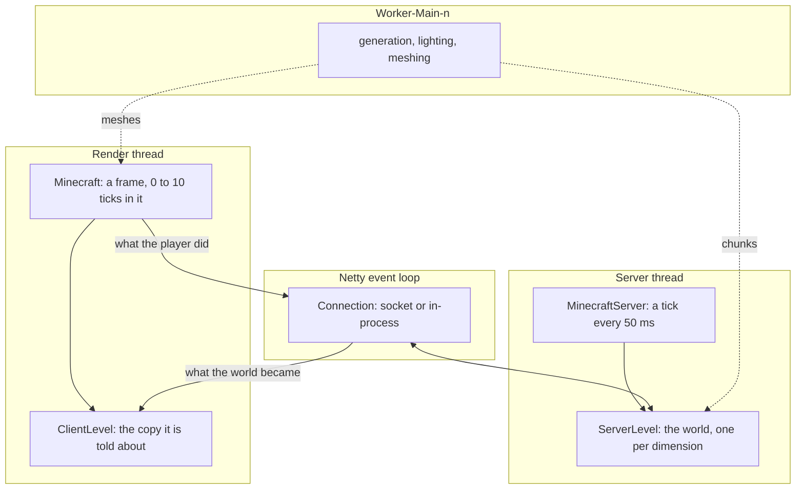

# Introduction

> Verified against **Minecraft 26.3**

Java Minecraft is one codebase that runs as two programs. The **server** is
the world: a loop that ticks twenty times a second, owns every chunk, entity and block, and decides what they are — save a few things it takes from your client once it has checked them, chief among them where the player you control, and anything it steers, stands. The **client** is a
window, a loop that draws frames as fast as vsync or the frame-rate limit allow, and a copy of the
world it is *told about* — which it will happily change on its own and be
overruled about. It ticks too, nought to ten times inside each frame, catching its own copy up to the same twenty-a-second clock and dropping any tick owed beyond ten. They talk over a real Netty connection even when
both run in the same process — in singleplayer the connection never touches
a socket, but the packets are real, and an `IntegratedServer` is a
`MinecraftServer` with the client half attached rather than absent. The split is behind some of the first things a player notices: the
client predicts and the server overrules; a chunk exists on the server long
before the client is sent it; a sword swing is a packet, a hit is a reply.

```mermaid
flowchart TD
    subgraph Client["Render thread"]
        MC["Minecraft: a frame, 0 to 10 ticks in it"]
        CL["ClientLevel: the copy it is told about"]
    end
    subgraph Netty["Netty event loop"]
        Conn["Connection: socket or in-process"]
    end
    subgraph Server["Server thread"]
        MS["MinecraftServer: a tick every 50 ms"]
        SL["ServerLevel: the world, one per dimension"]
    end
    subgraph Pool["Worker-Main-n"]
        W["generation, lighting, meshing"]
    end
    MC --> CL
    MS --> SL
    MC -- "what the player did" --> Conn
    Conn -- "what the world became" --> CL
    Conn <--> SL
    W -. "chunks" .-> SL
    W -. "meshes" .-> MC
```

*The two programs and the four threads they run on: the client and the server each own their copy of the world and talk through the connection, and the worker pool hands its results back, dotted, to whichever of them asked.*

The whole thing is 7,301 source files and about 740,000 lines of Java 25. Just
under a third of those lines is client-only; the rest ships in both jars, and the
picture below is the split — orange is the client's, blue is everything the dedicated server also ships, and the hatched boxes are the packages Part I's *what this book skips* tours, most of them what this book leaves out.

<figure class="map">
{{#include generated/packages-treemap.svg}}
<figcaption>The two jars. Every box is a package, its area is lines of decompiled source; the <a href="maps/packages.html">atlas</a> walks through it. Click to enlarge.</figcaption>
</figure>

The four boxes of the first picture are the four threads that carry nearly all of
it — the Render thread, which is also the client's game thread; the Server
thread; the Netty event loop; and a shared worker pool, whose threads are named
*Worker-Main-n* — and the first lecture of the book,
[Anatomy](systems/anatomy/anatomy.md#four-threads-worth-memorising), is those
four threads and the two loops.

## How the book is read

**This site is the notes for a video lecture series**, and that is why it
keeps saying *watched* where a book would say *read*. One system page is one lecture; the page stands alone and nothing on it leans on the video to make
sense, but the order, the scenarios and the figures are all built for
someone who will eventually be shown them. The site is that series in three
tiers, and the sidebar is its table of contents.

**Parts** are watched in order. Thirteen of them, I to XIII, each a system:
the anatomy of the two programs, the foundations they are both built out of,
the server, the world, blocks, entities, items, the player, networking, the
client, rendering, world generation, and commands. Each opens on a landing
page that argues what its part claims about its system, says what shape the
part is, names the parts it assumes and what it uses each of them for, lists its pages in the order to watch them, says where the part stops, and says which Reference pages the part reads. A page is one
lecture's notes: it follows one scenario through the system (a player walks
east across a chunk boundary; a server is clicked in the list) and its
figure is the artefact — a sequence diagram whose lanes are class names, a
state machine, a flowchart of a decision. Every diagram enlarges on click.
Each part only assumes the ones before it, and the
[lecture map](lectures.md) says where that is not quite true. The picture
below is the whole of that, drawn as the line it nearly is: the parts in
watch order, and a solid arc from a part to each part that assumes it. The two dependencies the whole book leans on, whether or not a landing page lists them — Part I for the threads, Part II for codecs and registries — keep their boxes and the one arc each along the spine but
have the rest of theirs left off, because those would reach almost every box,
and the two dashed arcs are the only places a part assumes a later one, each
cut on purpose rather than solved by reordering.

{{#include figures/parts-dependency.md}}

**Maps** are looked at once. The [atlas](maps/README.md) is four views of the
decompile — [where the code is](maps/packages.md), [where the mass
is](maps/biggest.md), [what everything imports](maps/fanin.md) and [what
extends what](maps/hierarchy.md). Each view's figure and its table are
regenerated on every deploy, so their numbers are re-derived each time; the prose around them is written by hand from those tables, or from the tree where no table holds a number, and is re-read when the version moves.
It is the "where is everything" answer a newcomer wants before any system page
makes sense.

**Reference** is looked up. Twenty-three [pages](reference/README.md), of
which these are the ones a reader reaches for first: the
[glossary](reference/glossary.md), the [naming
drift](reference/naming-drift.md) table, a [class
index](reference/class-index.md) that answers "which page talks about
`ChunkMap`", the [diagram lanes](reference/lanes.md) and the
[threads](reference/threads.md). Thirteen of the twenty-three are rewritten from the decompile or from the corpus on every deploy, so their rows are re-derived each time; the other ten are hand-kept, and the shelf's own
[front page](reference/README.md) says which is which. The rule for what
belongs here is *would a viewer pause the video to read this*.

For agents, the whole site is one file:
[llms-full.txt](https://minecraftdocs.dev/llms-full.txt), regenerated on
every deploy.

## The rules the book keeps

**Names, never code.** A page names classes, methods, fields and packages so
that anyone with the decompiled source can find them in a minute, and
explains what they own, when they run and how they interact. It never
reproduces the source — not a method body, not a snippet. Anyone who needs
the code decompiles the game themselves, which is also the line Mojang's
mappings licence draws.

**Mojang's names.** Every game identifier is Mojang's official mapping, which the
decompile uses. Fabric's Yarn names differ; where a modder would not
recognise a class under its official name, the Yarn name is noted once.
Names have moved since 1.21 — even since 1.21.11, `Lightmap` was *LightTexture* and `RedstoneWireBlock` was *RedStoneWireBlock* — and the [naming drift](reference/naming-drift.md) table is the translation.

**Newest version only.** Every page that describes the game says in its header which release it was verified against, or for a generated view which release it was generated from, and the book's is 26.3. There are no version-difference
sections, and the only "in 1.x this was" on a system page is the *For a 1.21-era reader* note at its foot. When a release lands, every page is re-read
against it, and until a page has been, its header still names the release it
was checked against.

**Verified means tested.** Every backticked name on every written page, and every class name of more than one word and every member named with its class or its lane inside a diagram, is checked against the decompile of
the release the page's header names before the site publishes, every diagram is parsed
by the same mermaid the site ships, every lane in every diagram is
checked against the one [key](reference/lanes.md) the whole book uses, and
every link and anchor between pages is checked to land. A
page that fails any of those does not go up, and neither does a change that
puts the landing pages, the sidebar, the lecture map, the dependency figure and
the Reference shelf's own index of who uses it out of step with each other.
That is a narrow
guarantee, and it is worth stating narrowly: it proves the names are real
in that release, not that the sentence around them is true. The
sentences are what the passes are for.
The book has been fact-checked against the decompile three times — as drafted, after the pages were restructured into the book you are reading, and again for this release — and a page written after the first check has had every check since. The first two times every page checked had something wrong on it, and the third found errors again in every part. What is left is a
correction waiting to be filed, and the [repository](https://github.com/AlexanderjFraser/MinecraftDocs)
is where to file it.

**How the system works, not how the code reads.** Object-level: this class
owns that state, this call happens on that thread, this packet is sent
then. Never line-level. Code makes boring video and dates fast.

## What this book skips

Most of what the treemap hatches is left out, and it falls into three kinds. **Code that is
version differences by definition** — save migration, the `util/datafix` and
`util/filefix` trees — which rule three excludes on sight. **Code that is not
the game** — Realms, telemetry, the profiler, the management server, RCON,
the data generators. And **code that is the game's bookkeeping rather than
its behaviour** — statistics, player reporting, and a package of id constants
nobody will recognise.
[What this book skips](systems/anatomy/what-this-book-skips.md), the second
lecture of Part I, draws that boundary honestly — what each thing is, how big, whether the dedicated
server ships it, and the two or three class names to start at if you need
it anyway — so a viewer knows the edge of the map before investing in
thirteen parts. It also tours three things that are *not* skipped and are only
surprising for where they live: the OpenAL backend, which sits in Blaze3D beside the window and `RenderSystem` rather than in the client's sound package; the
recipe book, which sits in the statistics package and belongs to Part VII; and
the debug-drawing API every debug renderer in the game is now written against.

## Unofficial, and free to reuse

This is an independent description of how the game works. It is not
endorsed by, sponsored by or associated with Mojang Studios or Microsoft,
and *Minecraft* is a trademark of Mojang Synergies AB.

The book is [CC BY-SA
4.0](https://creativecommons.org/licenses/by-sa/4.0/): take it, adapt it,
teach from it — credit [minecraftdocs.dev](https://minecraftdocs.dev) and
keep what you build under the same licence. That covers the writing and the
figures, which are the only things here that are anyone's to license. It
does not cover the game, its source, its assets or Mojang's mappings; none
of those are in this book, which is why it names identifiers and never
reproduces code. Corrections, and the repository the book is written in,
are on [GitHub](https://github.com/AlexanderjFraser/MinecraftDocs).
