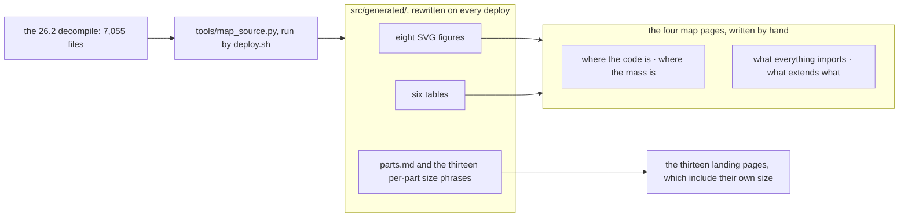

# The atlas

> Verified against **Minecraft 26.2** · Maps · Four views of the whole decompile, drawn by `tools/map_source.py` from the source tree on every deploy.

Before any system page makes sense you want the answer to a newcomer's
question: *where is everything?* The atlas is that answer, looked at once.
Each map is a figure drawn from the decompile, a page of prose saying what
the figure shows, and then the table the figure was drawn from.

No number in the atlas is counted by hand — every one of them comes from
`tools/map_source.py`, which reads all 7,055 files — but the four pages are
not all one thing, and the distinction matters as much here as on the
[Reference shelf](../reference/README.md). **The figures and the tables are
generated**: they live in *src/generated/*, are rewritten on every deploy, and
cannot drift from the source they describe. **The prose is written by a
person**, and every number quoted in a sentence is a number a session read off
one of those tables and typed. So a version bump re-derives the tables by
itself and leaves the sentences around them to be re-read — which is what the
version pass is for, and it is the one obligation this tier has that the
Reference tier's generated half does not.

## The four maps

| map | the question it answers | the figure |
|---|---|---|
| [Where the code is](packages.md) | how big is each package, which jar ships it, and which parts of the book cover it | the jar as a treemap of packages, area by lines |
| [Where the mass is](biggest.md) | which classes are the largest, and what kind of thing gets that big | the thirty largest classes as bars |
| [What everything imports](fanin.md) | which Mojang classes the rest of the code cannot be written without, and where the book teaches each | the thirty most-imported Mojang classes as bars |
| [What extends what](hierarchy.md) | which inheritance trees are widest, and what shape they are | four trees with the descendant count on every node |

The treemap is also the book's picture of the *two jars*: the
[introduction](../introduction.md) uses it to show how much of the code the
dedicated server ships, and Part I's [what this book
skips](../systems/anatomy/what-this-book-skips.md#the-sizes-and-which-jar-ships-them)
uses its hatching to draw the boundary of the book.

## How the numbers are counted

The decompile is the **client jar**, which is a strict superset of the
server jar; beside it sits `server-classes.txt`, the list of classes the
dedicated server also ships. From those two things every number on these
pages follows.

| number | how it is counted |
|---|---|
| a class | one `.java` file in the decompile — nested types are not counted as classes, and the 542 four-line `package-info.java` markers are counted like any other file |
| a line | one line of the decompiled file, so counts are comparable with each other and not with Mojang's own source |
| client-only | the file is not listed in `server-classes.txt`; *shared* means it is |
| fan-in | how many files have a *net.minecraft* or *com.mojang* import statement naming the class — the JDK is not counted, and same-package use needs no import, which is what [what everything imports](fanin.md#what-the-count-misses) then has to allow for |
| descendants | every type reachable from a root through *extends* and *implements*, nested types included; a parent written as *outer dot inner* resolves inside the outer class's own file, so two types with the same simple name stay two types |

The line counts include what the decompiler adds — braces on their own
lines, expanded switches — which is why a table-of-constants class can be
longer than a class that does something. Read length as *where the reading
is*, not where the difficulty is.

---

*Rules: names, never code · how the system works, not how the code reads ·
newest version only · every backticked name passes `tools/verify_names.py`.*
