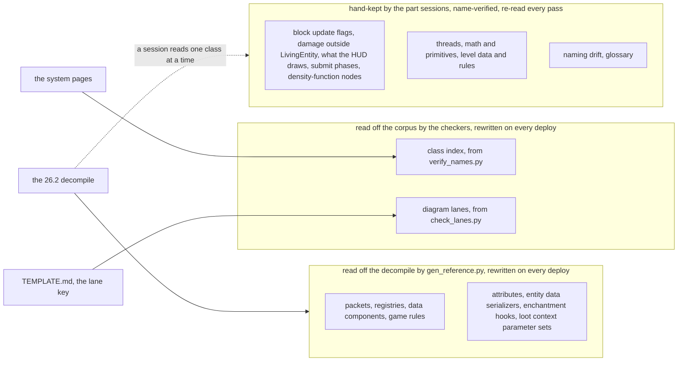

# Reference

> Verified against **Minecraft 26.2** · Reference · The shelf behind the lectures: everything a viewer would pause the video to read, kept where no lecture has to stop for it.

A lecture explains one thing at a time, and it cannot stop to list the 43
entity-data serializers or the ten bits of a flag word without losing the
room. The rule for this tier is the one pass 3 set: *would a viewer pause
the video to read this?* If yes, it lives here and the page links to it.
Twenty pages on the shelf and this one in front of them, and the useful way
to tell the twenty apart is not by subject but by **how each one is kept** — because a catalogue is only as good as
the version it was read from, and the first question to ask of any page on
this shelf is *what regenerates it.*

## The shelf

## How each page is kept, and who leans on it

| page | what it lists | kept by | the parts whose landing pages point at it |
|---|---|---|---|
| [Packets](packets.md) | every packet, by protocol group and direction | generated | III, V, VI, VII, VIII, IX, X, XIII |
| [Registries](registries.md) | every registry key: built-in, data-pack, synced | generated | II, V, VI, VII, IX, XII, XIII |
| [Data components](components.md) | every `DataComponentType`, persistent and synced | generated | II, V, VII, VIII, IX |
| [Game rules](gamerules.md) | every rule, type, category, default | generated | III, IV, V, VI, VIII |
| [Attributes](attributes.md) | every attribute: default, range, sentiment, syncable | generated | VI, VIII |
| [Entity data serializers](entity-data-serializers.md) | all 43, in registration order, which is the wire id | generated | VI |
| [Enchantment hooks](enchantment-hooks.md) | every public `EnchantmentHelper` entry point and its callers | generated | VII |
| [Loot context parameter sets](loot-context-params.md) | all twenty-six, with required and optional keys | generated | VII, XIII |
| [Block update flags](block-update-flags.md) | the ten bits of `Level.setBlock`'s flag word | hand-kept | V |
| [Damage outside `LivingEntity`](non-living-damage.md) | what each of the twenty-one non-living classes does when hit | hand-kept | VI |
| [What the HUD draws, and when](hud-elements.md) | every HUD element and the condition it is behind | hand-kept | X |
| [Submit phases and feature renderers](submit-phases.md) | the fifteen phases and the thirteen renderers, in declaration order | hand-kept | XI |
| [Density-function nodes](density-function-nodes.md) | the thirty-four node types and what the rewrite installs for each | hand-kept | XII |
| [Threads](threads.md) | every thread, who makes it, what may run on it | hand-kept | I, III, IV, IX, X, XI |
| [Math and primitives](math-and-primitives.md) | the coordinate spaces, packings, shapes and random sources | hand-kept | II, IV, V, VI |
| [Level data and rules](level-data-and-rules.md) | who owns the seed, spawn, rules and border, and which file each is in | hand-kept | IV, VIII, XII |
| [Naming drift](naming-drift.md) | every 1.21-era name a reader will reach for, and what 26.2 calls it | hand-kept | I, II, XI, XII |
| [Glossary](glossary.md) | one sentence per term, and the page that owns it | hand-kept | X, XI, XII, XIII |
| [Diagram lanes](lanes.md) | every lane abbreviation and the class it means, and the nine that mean a thread instead | generated from the lane key | every part |
| [Class index](class-index.md) | every class backticked on a page, and the pages that name it | generated from the pages | — |

*Generated* means `python tools/gen_reference.py all` rewrites the file
from the decompile's declaration lines, so a version bump re-derives it
rather than re-reading it; the two indexes are rewritten by
`python tools/verify_names.py --index` and `python tools/check_lanes.py
--index`. *Hand-kept* means a part session read the classes and wrote the
rows, `tools/verify_names.py` checks every name on the page, and the
second fact-check re-reads the rows — declaration orders drift on a version
bump, and two of these pages (submit phases, density-function nodes) are
nothing but declaration order.

For agents: the whole site is also served as one file at
[/llms-full.txt](https://minecraftdocs.dev/llms-full.txt).

---

*Rules: names, never code · how the system works, not how the code reads ·
newest version only · every backticked name passes `tools/verify_names.py`.*
