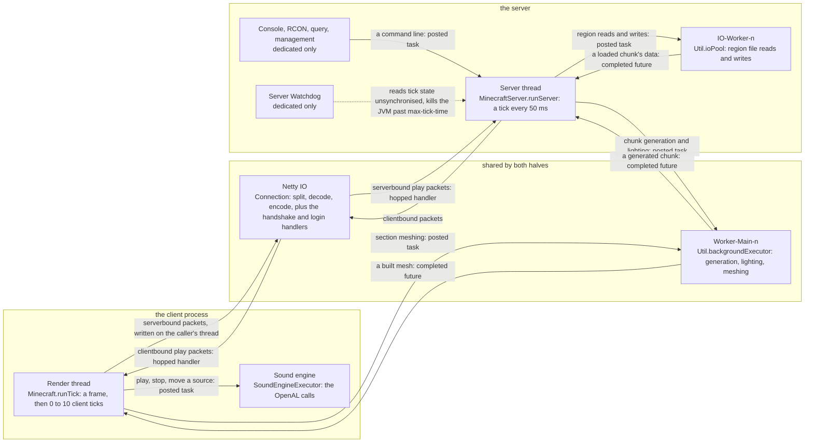

# Threads

> Verified against **Minecraft 26.2** · Reference · Hand-kept from `net/minecraft/util/thread` and every `Thread` the game starts, beside [Anatomy](../systems/anatomy/anatomy.md)'s four — looked up, not watched.

Every thread the game creates, who creates it, what runs on it, and what
is *allowed* to run on it. The last column is the rule the rest of the
documentation leans on: game state belongs to exactly one thread, and
anything else submits a task to that thread's event loop.

## The picture

Two threads own game state — the Render thread owns the client's, the
Server thread owns the world's — and everything else is a way of getting
work to them or from them. Work crosses a thread boundary in exactly three
ways, and the figure labels each edge with which: a **posted task** (a
`Runnable` on the owner's `BlockableEventLoop`), a **completed future** (a
worker's result, completed onto the owner's executor), or a **hopped
handler** (a packet decoded on Netty and re-posted to its owner by
`PacketUtils.ensureRunningOnSameThread`).

The table is the figure's rows. Netty is drawn once and shared because
it is: in singleplayer the client's `Connection` and the integrated
server's run on the same `Netty Local IO` threads, and the packets between
them are real.

## The threads a lecture leans on

| thread | made by | runs | may touch |
|---|---|---|---|
| **Render thread** (client) | the JVM main thread, renamed in `client/main/Main` | `Minecraft.run` → `Minecraft.runTick` once per frame; `Minecraft.tick` 0–10 times inside it | Everything client-side: `ClientLevel`, `LocalPlayer`, the GPU (`RenderSystem.assertOnRenderThread`), screens, options. It is also the client's event loop (`Minecraft` is a `ReentrantBlockableEventLoop`), so packet handlers run here after `PacketUtils.ensureRunningOnSameThread`. |
| **Server thread** | `MinecraftServer.spin` | `MinecraftServer.runServer` → `MinecraftServer.processPacketsAndTick` every `TickRateManager.nanosecondsPerTick` (50 ms by default); `MinecraftServer.waitUntilNextTick` drains the task queue in the slack | Every `ServerLevel`, every chunk, entity and block entity, the `PlayerList`. Serverbound *play* packet handlers run here, not on Netty. One per server; singleplayer has exactly one. |
| **Netty IO** (`Netty NIO IO #n`, `Netty Epoll IO #n`, `Netty Kqueue IO #n`, `Netty Local IO #n`) | `EventLoopGroupHolder` | the `Connection` pipeline: split, decrypt, decompress, decode; encode, compress, encrypt — **and the handshake and login handlers** | Bytes and `Packet` objects — plus, in handshake and login, the handlers themselves: `ServerHandshakePacketListenerImpl` and `ServerLoginPacketListenerImpl` never hop. The login *state machine* is not all theirs, though: `ServerLoginPacketListenerImpl` is a `TickablePacketListener`, so the Server thread advances it once a tick through `MinecraftServer.tickConnection`. A *play* handler that needs game state re-posts to the owning thread. *Local* is the in-process channel of singleplayer. |
| **Worker-Main-n** | `Util.backgroundExecutor` — a `ForkJoinPool` sized to `availableProcessors()` minus one, clamped by `Util.maxAllowedExecutorThreads` and capped by the *max.bg.threads* property (`Util.getMaxThreads`) | chunk generation and lighting via `ChunkTaskDispatcher`; section meshing via `SectionRenderDispatcher`; resource-reload *prepare* phases; chunk serialisation | Its own inputs. Results return to the owning thread as a `CompletableFuture` completed onto that thread's executor. Never `Level` state directly. |
| **IO-Worker-n** | `Util.ioPool` | region file reads and writes through `IOWorker`, one `PriorityConsecutiveExecutor` per storage so writes to one file stay ordered | Files. `Util.nonCriticalIoPool` (`Download-n`) is the same shape for downloads, telemetry and sound decoding. |
| **Sound engine** | `SoundEngineExecutor` | a `BlockableEventLoop` that owns the per-source OpenAL calls | The `SoundEngine`'s channels; see [the sound engine](../systems/client/sound-engine.md). Device open/close and buffer deletion stay on the Render thread. |
| **Server Watchdog** | `DedicatedServer.initServer` (dedicated only, positive limit only) | `ServerWatchdog` | Writes nothing, but *reads* game state unsynchronised while the Server thread is mid-tick — the game rules and every level's `ServerLevel.getWatchdogStats`, for the crash report. It kills the JVM past `DedicatedServerProperties.maxTickTime`, and that kill does **not** save the world. |
| **Server console handler** | `DedicatedServer.initServer` | reads stdin | Queues each line to the server thread as a command; runs nothing itself. |
| **RCON Listener #n** / **RCON Client** | `RconThread` from `DedicatedServer.initServer`, when *enable-rcon* **and** *rcon.password* is set | accepts RCON sockets; one `RconClient` thread per connection | Sockets. Each command is queued to the server thread. Dedicated only, and **non-daemon** — `DedicatedServer.onServerExit` must stop it or the JVM will not exit. |
| **Query Listener #n** | `QueryThreadGs4` from `DedicatedServer.initServer`, when *enable-query* | the GS4 query protocol | Its own cached status. Dedicated only, and **non-daemon**, like RCON. |
| **Management server IO #n** | `ManagementServer`, built by `JsonRpc` in `server/Main` | a second, independent Netty event-loop group: the JSON-RPC/WebSocket management API and its heartbeat | Its own pipeline; management calls reach the game through the server's task queue. Dedicated only. |
| Timer hack thread | `Util.startTimerHackThread` | sleeps forever | Nothing. Keeps the JVM's timer resolution high by existing. |

## The nine client handlers that never hop

`Connection.channelRead0` calls a packet's handler on the Netty thread, and
a handler's first line is normally `PacketUtils.ensureRunningOnSameThread`,
which re-posts it to the owning thread and aborts
([the connection](../systems/networking/the-connection.md)). Nine handlers on the client's play listener omit it, so they run to completion
on Netty and must touch nothing the Render thread owns. Seven are declared in
`ClientPacketListener` itself; the last two are inherited from
`ClientCommonPacketListenerImpl` and are the two that matter most, because a
keep-alive is answered and a disconnect is acted on without the game thread
being involved at all.

| handler | what it does on the Netty thread |
|---|---|
| `ClientPacketListener.handlePlayerCombatEnter` | nothing — the body is empty |
| `ClientPacketListener.handlePlayerCombatEnd` | nothing — the body is empty |
| `ClientPacketListener.handleChunkBatchStart` | starts the `ChunkBatchSizeCalculator`'s clock |
| `ClientPacketListener.handleChunkBatchFinished` | stops it and sends `ServerboundChunkBatchReceivedPacket` with the chunks-per-tick it now wants — so the loop in [what the client is told](../systems/networking/what-the-client-is-told.md) times packet decode, not mesh building |
| `ClientPacketListener.handleDebugSample` | hands the sample to `DebugScreenOverlay.logRemoteSample` |
| `ClientPacketListener.handlePongResponse` | records the round trip in `PingDebugMonitor` |
| `ClientPacketListener.handleLowDiskSpaceWarning` | calls `Minecraft.sendLowDiskSpaceWarning`, which posts the toast to the Render thread itself — the one that crosses after all, by `Minecraft.execute` rather than by the hop |
| `ClientCommonPacketListenerImpl.handleKeepAlive` | replies with `ServerboundKeepAlivePacket` through `ClientCommonPacketListenerImpl.sendWhen`, deferred while the window is frozen at `RenderSystem.isFrozenAtPollEvents` — so the answer that keeps a connection alive never waits for a frame |
| `ClientCommonPacketListenerImpl.handleDisconnect` | calls `Connection.disconnect` straight from the event loop |

## Situational threads

Real, but nothing in the corpus hangs on them: *User Authenticator* (one per
login, for the session-server call), *Chat-Filter-Worker*, *Server Pinger* and
*Server Connector* (the multiplayer screen), *Telemetry-Sender*,
`LanServerPinger` and its detector, *World Upgrader*, *Datafixer Bootstrap*
(priority 1, so it yields to everything), the client and server shutdown
hooks with `ClientShutdownWatchdog` behind them, Swing's event dispatch
thread when a dedicated server is started without *--nogui* and runs its
`MinecraftServerGui`, the *Friends List* fetcher behind the social screen,
and `ChaseServer`'s two threads and `ChaseClient`'s one, which exist only
behind `SharedConstants.DEBUG_CHASE_COMMAND` and the */chase* command it
registers. Realms starts nine more, and is out of scope with the rest of
*com/mojang/realmsclient*.

## The rules that follow

- **Two owners, one wire.** Client state is the Render thread's; server state
  is the Server thread's; in singleplayer they share a JVM and still only
  talk about the *world* through packets over the local channel. (Settings —
  pause, view distance, publishing — do cross by direct call; see Anatomy.)
- **Handlers hop.** A play packet is decoded on Netty and *handled* on the
  owning game thread; `PacketUtils.ensureRunningOnSameThread` is the hop.
  Handshake and login are the exception: their handlers run to completion on
  Netty. The login state machine is still advanced from the Server thread,
  which ticks the listener once a tick.
- **Workers compute, owners commit.** Chunk generation, lighting and meshing
  produce results on the worker pool; only the owning thread installs them.
- **Waiting drains.** An owning thread never blocks idle: `BlockableEventLoop.managedBlock`
  keeps running its own queue while it waits on a future, which is why a
  server tick that waits for a chunk does not deadlock the chunk that needs
  the server tick. `ServerChunkCache.MainThreadExecutor` is the extra event
  loop that makes that work.
