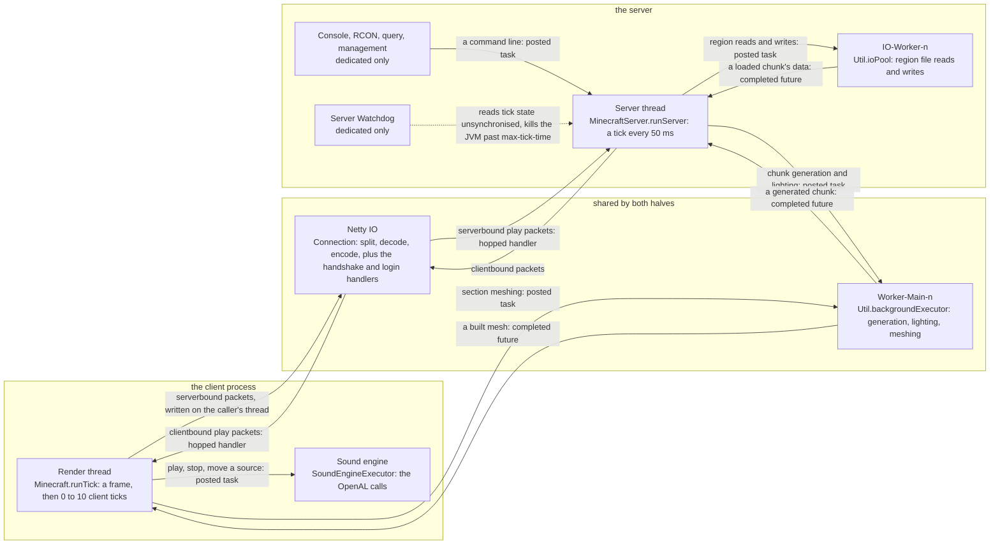

# Threads

> Verified against **Minecraft 26.2** · Reference · Hand-kept from `net/minecraft/util/thread` and every `Thread` the game starts, beside [Anatomy](../systems/anatomy/anatomy.md)'s four — looked up, not watched.

Every thread the game creates, who creates it, what runs on it, and what
is *allowed* to run on it. The last column is the rule the rest of the
documentation leans on: game state belongs to exactly one thread, and
anything else submits a task to that thread's event loop.

## Three ways work crosses a thread boundary

Two threads own game state — the Render thread owns the client's, the
Server thread owns the world's — and everything else is a way of getting
work to them or from them. Work crosses a thread boundary in exactly three
ways, and the figure labels each edge with which: a **posted task** (a
`Runnable` on the owner's `BlockableEventLoop`), a **completed future** (a
worker's result, completed onto the owner's executor), or a **hopped
handler** (a packet decoded on Netty and re-posted to its owner by
`PacketUtils.ensureRunningOnSameThread`).

The *daemon* column is the one that decides how the process ends, because a
non-daemon thread holds the JVM open until something stops it. Four kinds of
thread on a dedicated server are non-daemon: the Server thread, `Util.ioPool`'s
workers, and the RCON and query listeners. The first two are retired
deliberately — the Server thread by returning, the IO pool by
`Util.shutdownExecutors` — and the other two are `GenericThread`s, which is
where the half-second socket timeout and `GenericThread.running` come from:
each polls so that it notices the flag within half a second of being told to
stop. Everything else the game starts is a daemon and simply stops existing
([how a server dies](../systems/server/how-a-server-dies.md#the-closes-and-the-last-thread)).

The table is the figure's rows. Netty is drawn once and shared because
it is: in singleplayer the client's `Connection` and the integrated
server's run on the same `Netty Local IO` threads, and the packets between
them are real.

## The threads a lecture leans on

| thread | made by | daemon | runs | may touch |
|---|---|---|---|---|
| **Render thread** (client) | the JVM main thread, renamed in `client/main/Main` | no — it *is* main | `Minecraft.run` → `Minecraft.runTick` once per frame; `Minecraft.tick` 0–10 times inside it | Everything client-side: `ClientLevel`, `LocalPlayer`, the GPU (`RenderSystem.assertOnRenderThread`), screens, options. It is also the client's event loop (`Minecraft` is a `ReentrantBlockableEventLoop`), so packet handlers run here after `PacketUtils.ensureRunningOnSameThread`. |
| **main** (dedicated) | the JVM | no | the whole of boot: the properties, the EULA, the `ManagementServer`, `session.lock`, the `WorldLoader`, the `DedicatedServer` constructor, then `MinecraftServer.spin` and the shutdown hook | Everything, until the Server thread exists; after that, nothing ([starting a server](../systems/server/starting-a-server.md#everything-main-does-before-there-is-a-second-thread)) |
| **Server thread** | `MinecraftServer.spin` | no | `MinecraftServer.runServer` → `MinecraftServer.processPacketsAndTick` every `TickRateManager.nanosecondsPerTick` (50 ms by default); `MinecraftServer.waitUntilNextTick` drains the task queue in the slack | Every `ServerLevel`, every chunk, entity and block entity, the `PlayerList`. Serverbound *play* packet handlers run here, not on Netty. One per server; singleplayer has exactly one. |
| **Netty IO** (`Netty NIO IO #n`, `Netty Epoll IO #n`, `Netty Kqueue IO #n`, `Netty Local IO #n`) | `EventLoopGroupHolder` | yes | the `Connection` pipeline: split, decrypt, decompress, decode; encode, compress, encrypt — **and the handshake and login handlers** | Bytes and `Packet` objects — plus, in handshake and login, the handlers themselves: `ServerHandshakePacketListenerImpl` and `ServerLoginPacketListenerImpl` never hop. The login *state machine* is not all theirs, though: `ServerLoginPacketListenerImpl` is a `TickablePacketListener`, so the Server thread advances it once a tick ([protocol phases](../systems/networking/protocol-phases.md#login) walks that state machine) through `MinecraftServer.tickConnection`. A *play* handler that needs game state re-posts to the owning thread. *Local* is the in-process channel of singleplayer. |
| **Worker-Main-n** | `Util.backgroundExecutor` — a `ForkJoinPool` sized to the JDK's available-processor count minus one, clamped by `Util.maxAllowedExecutorThreads` and capped by the *max.bg.threads* property (`Util.getMaxThreads`) | yes | chunk generation and lighting via `ChunkTaskDispatcher`; section meshing via `SectionRenderDispatcher`; resource-reload *prepare* phases; chunk serialisation | Its own inputs. Results return to the owning thread as a `CompletableFuture` completed onto that thread's executor. Never `Level` state directly. |
| **IO-Worker-n** | `Util.ioPool` | **no** | region file reads and writes through `IOWorker`, one `PriorityConsecutiveExecutor` per storage so writes to one file stay ordered | Files. `Util.nonCriticalIoPool` (`Download-n`) is the same cached pool for downloads, telemetry and sound decoding, and the one difference is this column: its threads *are* daemons, so nothing waits for them. |
| **Sound engine** | `SoundEngineExecutor` | yes | a `BlockableEventLoop` that owns the per-source OpenAL calls | The `SoundEngine`'s channels; see [the sound engine](../systems/client/sound-engine.md). Device open/close and buffer deletion stay on the Render thread. |
| **Server Watchdog** | `DedicatedServer.initServer` (dedicated only, positive limit only) | yes | `ServerWatchdog` | Writes nothing, but *reads* game state unsynchronised while the Server thread is mid-tick — the game rules and every level's `ServerLevel.getWatchdogStats`, for the crash report. It kills the JVM past `DedicatedServerProperties.maxTickTime`, and that kill does **not** save the world. |
| **Server console handler** | `DedicatedServer.initServer` | yes | reads stdin | Queues each line to the server thread as a command; runs nothing itself. |
| **RCON Listener #n** / **RCON Client** | `RconThread.create` from `DedicatedServer.initServer`, when *enable-rcon* is on **and** `RconThread.create` gets past both of its own gates: it returns nothing if *rcon.port* is outside 1–65535, and nothing if *rcon.password* is empty | **no** | accepts RCON sockets on a 500 ms timeout, so it notices `GenericThread.running` going false within half a second; one `RconClient` thread per connection, which blocks with no timeout | Sockets. Each command is queued to the server thread. Dedicated only. `DedicatedServer.onServerExit` must stop it or the JVM will not exit ([how a server dies](../systems/server/how-a-server-dies.md#the-closes-and-the-last-thread)). |
| **Query Listener #n** | `QueryThreadGs4.create` from `DedicatedServer.initServer`, when *enable-query* | **no** | the GS4 query protocol, on the same 500 ms socket timeout and for the same reason | Its own cached status. Dedicated only, and stopped by the same call as RCON. |
| **Management server IO #n** | `ManagementServer`, built by `JsonRpc` in `server/Main` | yes | a second, independent Netty event-loop group: the JSON-RPC/WebSocket management API and its heartbeat | Its own pipeline; management calls reach the game through the server's task queue. Dedicated only. |
| Timer hack thread | `Util.startTimerHackThread` | yes | sleeps forever | Nothing. Keeps the JVM's timer resolution high by existing. |

## The handlers that never hop

`Connection.channelRead0` calls a packet's handler on the Netty thread, and
a handler's first line is normally `PacketUtils.ensureRunningOnSameThread`,
which re-posts it to the owning thread and aborts
([the connection](../systems/networking/the-connection.md#one-packet-there-and-one-back)). Both play listeners have exactly nine handlers that omit it, and the two nines
are different in kind: the client's really do run to completion on Netty, and
five of the server's use the Netty thread only to hand the work somewhere else.

Nine on the client, then. Seven are declared in
`ClientPacketListener` itself; the last two are inherited from
`ClientCommonPacketListenerImpl` and are the two that matter most, because a
keep-alive is answered and a disconnect is acted on without the game thread
being involved at all. One row is an exception to the section's own rule and
says so.

| handler | what it does on the Netty thread |
|---|---|
| `ClientPacketListener.handlePlayerCombatEnter` | nothing — the body is empty |
| `ClientPacketListener.handlePlayerCombatEnd` | nothing — the body is empty |
| `ClientPacketListener.handleChunkBatchStart` | starts the `ChunkBatchSizeCalculator`'s clock |
| `ClientPacketListener.handleChunkBatchFinished` | stops it and sends `ServerboundChunkBatchReceivedPacket` with the chunks-per-tick it now wants — so the loop in [what the client is told](../systems/networking/what-the-client-is-told.md) times packet decode, not mesh building |
| `ClientPacketListener.handleDebugSample` | hands the sample to `DebugScreenOverlay.logRemoteSample` |
| `ClientPacketListener.handlePongResponse` | records the round trip in `PingDebugMonitor` |
| `ClientPacketListener.handleLowDiskSpaceWarning` | calls `Minecraft.sendLowDiskSpaceWarning`, which posts the toast to the Render thread itself — the one that crosses after all, by `Minecraft.execute` rather than by the hop |
| `ClientCommonPacketListenerImpl.handleKeepAlive` | replies with `ServerboundKeepAlivePacket` through `ClientCommonPacketListenerImpl.sendWhen`, deferred while the window is frozen at `RenderSystem.isFrozenAtPollEvents` — so the answer that keeps a connection alive never waits for a frame |
| `ClientCommonPacketListenerImpl.handleDisconnect` | calls `Connection.disconnect` straight from the event loop |

Nine on the server, out of `ServerGamePacketListenerImpl`'s sixty-one game
handlers — the other fifty-two open on the hop
([the server tick](../systems/server/server-tick.md#every-packet-since-last-time-in-one-drain)
has what that costs the tick). They fall into four kinds, and only the first
kind is what the client's nine are: two that touch nothing, three that post a
task, two that wait on a future, and two that write listener state on Netty
because nothing else can be asked to.

| handler | what it does on the Netty thread |
|---|---|
| `ServerGamePacketListenerImpl.handlePingRequest` | sends `ClientboundPongResponsePacket` back with the time it arrived, and nothing else |
| `ServerGamePacketListenerImpl.handleCustomPayload` | nothing — the body is empty |
| `ServerGamePacketListenerImpl.handleChat` | advances the acknowledgement window under the listener's lock, then `ServerGamePacketListenerImpl.tryHandleChat`: illegal characters disconnect, a hidden chat visibility answers with a system message, and everything else resets the last-action time and posts the work through `MinecraftServer.execute` |
| `ServerGamePacketListenerImpl.handleChatCommand` | the same door without a signature — `ServerGamePacketListenerImpl.tryHandleChat` posts the parse and the run |
| `ServerGamePacketListenerImpl.handleSignedChatCommand` | the same, with the signed arguments collected on the way through |
| `ServerGamePacketListenerImpl.handleSignUpdate` | strips formatting and sends the four lines to the text filter; the result comes back on the server's own executor |
| `ServerGamePacketListenerImpl.handleEditBook` | the same shape for a book's title and pages, and the same hand-back |
| `ServerGamePacketListenerImpl.handleChatAck` | applies the offset to `LastSeenMessagesValidator` under a lock, and disconnects the player if it does not validate — real listener state, written off the main thread |
| `ServerGamePacketListenerImpl.handleConfigurationAcknowledged` | swaps the inbound protocol and installs a `ServerConfigurationPacketListenerImpl`, so the return to configuration begins on the network thread ([protocol phases](../systems/networking/protocol-phases.md#configuration)) |

## Situational threads

Real, but nothing in the corpus hangs on them: *User Authenticator* (one per
login, for the session-server call), *Chat-Filter-Worker*, *Server Pinger* and
*Server Connector* (the multiplayer screen), *Telemetry-Sender*,
`LanServerPinger` and its detector, *World Upgrader*, *Datafixer Bootstrap*
(priority 1, so it yields to everything), the client and server shutdown
hooks with `ClientShutdownWatchdog` behind them, Swing's event dispatch
thread when a dedicated server is started without *--nogui* and runs its
`MinecraftServerGui`, the *Friends List* fetcher behind the social screen,
and `ChaseServer`'s two threads and `ChaseClient`'s one, which exist only
behind `SharedConstants.DEBUG_CHASE_COMMAND` and the */chase* command it
registers. Realms starts nine more, and is out of scope with the rest of
*com/mojang/realmsclient*.

## The rule the last column is stating

Two threads own game state and everything else is a way of getting work to
them: client state is the Render thread's, server state is the Server thread's,
and in singleplayer they share a JVM and still talk about the *world* only
through packets over the local channel
([anatomy](../systems/anatomy/anatomy.md#four-threads-worth-memorising) has
the four to memorise, and the settings that do cross by direct call). Three
consequences run through the table and each is owned by a lecture, not here: a
play packet is decoded on Netty and *handled* on its owner's thread
([the connection](../systems/networking/the-connection.md#one-packet-there-and-one-back));
workers compute and owners commit, so a generated chunk or a built mesh is
installed by the thread that owns it, never by the pool
([the level tick](../systems/server/server-level-tick.md#the-chunk-source-does-five-things-in-one-call));
and an owning thread waiting on a future keeps draining its own queue through
`BlockableEventLoop.managedBlock`, which is why a tick that waits for a chunk
does not deadlock the chunk that needs the tick
([the server tick](../systems/server/server-tick.md#the-event-loop-and-what-a-ticks-spare-time-buys)).

## Where to look

`Util.backgroundExecutor` · `Util.ioPool` · `Util.startTimerHackThread` ·
`MinecraftServer.spin` · `EventLoopGroupHolder` · `GenericThread` ·
`SoundEngineExecutor` · `ServerWatchdog` ·
`PacketUtils.ensureRunningOnSameThread` · `BlockableEventLoop.managedBlock`

---

*Rules: names, never code · how the system works, not how the code reads ·
newest version only · every backticked name passes `tools/verify_names.py`.*
