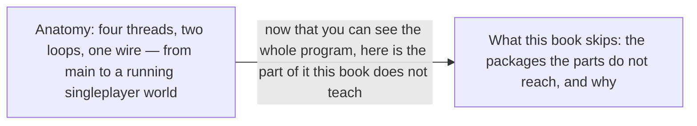

# I · Anatomy

> Verified against **Minecraft 26.2** · Part I · The whole program at once: which threads exist, which loop each runs, and how the two halves talk.

Part I is the program the other twelve parts run inside. Java Minecraft is
one codebase running as two programs — a server whose whole life is a tick
loop, and a client whose life is a frame loop with ticks inside it — on four
threads worth memorising: the **Render thread**, which is also the client's
game thread; the **Server thread**, which is the world; the **Netty event
loop**, which carries the packets; and one **shared worker pool** that chunk
generation, lighting and section meshing all queue onto. A player recognises
the split by its symptom, the game that keeps drawing while the world stands
still, and almost every surprise later in this book is one of those two
loops waiting on the other. Read this part first for the plainest reason
there is: nearly every [lane](../../reference/lanes.md) in every sequence
diagram after it is one of these classes, and the nine that are not a class
at all are one of these threads, a process, or the boundary between the two
programs.

## The shape of the part

Two pages: what the program is, and where the *book* stops. The first is a
trace and the second is a boundary, and the boundary is drawn second because
a reader decides whether to go on once they can see the whole program.

## Before you start

Nothing. This is the first part, and it assumes only that you have played
the game.

## Watch in this order

1. [Anatomy](anatomy.md) — from *main* to a running singleplayer world:
   the Render thread that is also the game thread, the Server thread that
   is the world, the Netty threads that run more than bytes, and the one CPU
   pool that chunk generation, lighting and section meshing all share.
2. [What this book skips](what-this-book-skips.md) — the boundary, drawn
   honestly on the treemap of the jar: save migration, Realms, telemetry,
   the profiler, the management server, the data generators, and where to
   start if you need one anyway. It is the second lecture and not the last
   because a boundary is worth drawing before you invest in thirteen parts,
   not after.

## Where the part stops

Part I says which threads exist and hands each of them on. What the Server
thread *does* with a tick is [Part III](../server/README.md); what the frame
loop does between ticks is [Part X](../client/README.md); what crosses the
wire between them is [Part IX](../networking/README.md). This part owes you
only enough of each to read a lane.

The part's own packages are the four entry points and the two loop classes,
and it leaves none of them unnamed: {{#include ../../generated/coverage-anatomy.md}}.
The boundary that matters here is the book's rather than the part's, and
drawing it is the second lecture's whole job.

## Reference this part uses

[Diagram lanes](../../reference/lanes.md) — the abbreviations every sequence
diagram uses, needed from the first figure of the first lecture onward.
[Threads](../../reference/threads.md) — every thread, who makes it and what
may run on it; Part I names the four to memorise and this is the rest.
[Naming drift](../../reference/naming-drift.md) — the 1.21-era names that
have moved. The [atlas](../../maps/packages.md) — where everything is, and
the treemap the second lecture reads.

---

*Rules: names, never code · how the system works, not how the code reads ·
newest version only · every backticked name passes `tools/verify_names.py`.*
