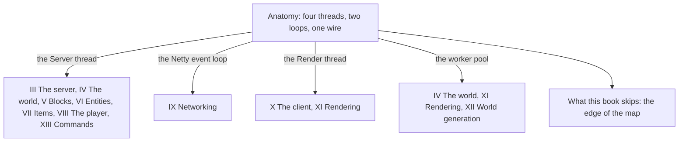

# I · Anatomy

> Verified against **Minecraft 26.2** · Part I · The whole program at once: which threads exist, which loop each runs, and how the two halves talk.

Part I is the vocabulary the other twelve parts speak. Java Minecraft is one
codebase running as two programs — a server that ticks and a client that
draws — on four threads worth memorising, and every diagram in this book
has lanes that assume you know which thread each one is on. A player
recognises this part by its symptom: the game that keeps drawing while the
world freezes, because the server thread stalled and the render thread did
not.

## The shape of the part

Part I is a root. It has one lecture, and every part after it starts from a
thread that lecture names.

## Before you start

Nothing. This is the first part, and it assumes only that you have played
the game.

## Watch in this order

1. [Anatomy](anatomy.md) — from `main()` to a running singleplayer world:
   the Render thread that is also the game thread, the Server thread that
   is the world, the Netty threads that run more than bytes, and the one
   worker pool that everything else is serialised onto.
2. [What this book skips](../appendix/out-of-scope-tour.md) — the boundary,
   drawn honestly: save migration, Realms, telemetry, the profiler, the
   management server, the data generators, and where to start if you need
   one anyway. *(Today in the appendix; it moves here in pass-3 session C,
   with the treemap of the jar beside it.)*

## Reference this part uses

[Threads](../../reference/threads.md) — every thread, who makes it and what
may run on it. [Naming drift](../appendix/naming-drift.md) — the 1.21-era
names that have moved. [Diagram lanes](../../reference/lanes.md) — the
abbreviations every diagram uses. The [maps](../../maps/README.md) — where
the mass is.

---

*Rules: names, never code · how the system works, not how the code reads ·
newest version only · every backticked name passes `tools/verify_names.py`.*
