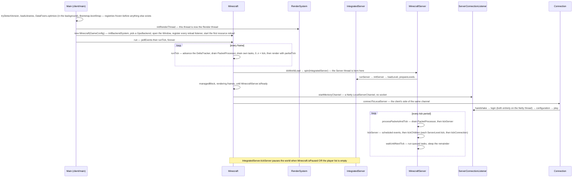

# Anatomy

> Verified against **Minecraft 26.2** · Part I · From `main()` to a running singleplayer world: which threads exist, which loop each one runs, and how the two halves of the game talk.

## Responsibility

Java Minecraft is one codebase that runs as two programs. The **client** is a
window, a frame loop and a copy of the world it is told about. The **server**
is the world itself: a 20 Hz tick loop that owns every chunk, entity and block
and is the only thing allowed to change them. In singleplayer both run in the
same JVM, on different threads, and talk to each other through a real Netty
connection that never touches a socket. A dedicated server is the same server
class with the client half absent.

The one sentence a player recognises: *the server is the game; the client is
a view of it.*

## The data it owns

- `Minecraft` (client, one instance, `Minecraft.getInstance`) owns the window
  (`Window`), the resource system (`ReloadableResourceManager` and every
  manager registered on it — `TextureManager`, `ShaderManager`, `ModelManager`,
  `AtlasManager`, `FontManager`, `SoundManager`), the renderers (`GameRenderer`,
  `LevelRenderer`, `EntityRenderDispatcher`, `BlockEntityRenderDispatcher`,
  `ParticleEngine`), input (`MouseHandler`, `KeyboardHandler`), the 2D UI layer
  (`Gui`) and `Options`. Three fields are nullable and define "are we in a world":
  `Minecraft.level` (a `ClientLevel`), `Minecraft.player` (a `LocalPlayer`) and
  `Minecraft.gameMode` (a `MultiPlayerGameMode`). A fourth,
  `Minecraft.singleplayerServer`, is the `IntegratedServer` when one is running.
- **`Gui` is not the HUD.** In 26.2 `Gui` is the whole 2D layer — it owns the
  current `Screen` (`Gui.screen`), the overlay, toasts, chat and the render
  state — and the HUD proper is a separate `Hud` class held as `Gui.hud`. A
  1.21 reader who reaches for `Gui` expecting hearts and the hotbar wants
  `Hud`.
- `MinecraftServer` (abstract) owns the levels (`ServerLevel`, one per
  dimension), the `PlayerList`, the `ServerConnectionListener`, the
  `ServerFunctionManager`, the `ServerTickRateManager`, a `PacketProcessor`,
  a `TimerQueue` of scheduled events and the `ServerClockManager`. There are
  **three** concrete subclasses: `IntegratedServer` (singleplayer),
  `DedicatedServer`, and `GameTestServer`, the headless harness the gametest
  entry point launches.
- Nothing on the client writes server *world* state and nothing on the server
  writes client world state; every block, entity and inventory change crosses
  as a packet, even in singleplayer. There are, however, singleplayer
  back-channels that are not packets, and they are worth knowing before you
  trust the rule absolutely — see the invariants below.

## When it runs

There are two loops and they are not the same shape.

**The client loop** runs on the *Render thread* — the JVM main thread, renamed
in `Main` before `Minecraft` is constructed, and the thread `RenderSystem`
guards with `RenderSystem.assertOnRenderThread`. `Minecraft.run` polls GLFW
events (`RenderSystem.pollEvents`) and then calls `Minecraft.runTick` once per
**frame**, as fast as vsync or the frame-rate limit allow. Inside each frame
a `DeltaTracker.Timer` (20 ticks per second) says how many whole game ticks
have elapsed since the last frame — usually 0 or 1, at most 10 are run — and
`Minecraft.tick` is called that many times. The fractional remainder is
`partialTick`, which the renderers use to interpolate between the last two
tick states. So the client *has* a 20 Hz tick, but it is a sub-step of the
frame loop, not a loop of its own.

**The server loop** runs on the *Server thread*, created by
`MinecraftServer.spin`. `MinecraftServer.runServer` loops on
`MinecraftServer.tickServer` at a cadence it re-reads every iteration from
`TickRateManager.nanosecondsPerTick` — 50 ms by default, whatever `/tick rate`
says otherwise, and zero while sprinting. After each tick it calls
`MinecraftServer.waitUntilNextTick`, which spends the slack running queued
tasks and then blocks until the next tick is due. There is no frame and no
`partialTick` on the server.

Both loops are **event loops** first and game loops second. `MinecraftServer`
and `Minecraft` both extend `ReentrantBlockableEventLoop` — the same base
class, not an analogy — so each is an `Executor` whose queue drains on its own
thread, and any other thread that wants to touch game state submits a task and
waits. The blocking form, `BlockableEventLoop.managedBlock`, is how the owning
thread waits for a future without deadlocking: it keeps draining its own queue
while it waits.

## The threads

| Thread | Made by | Runs | Notes |
|---|---|---|---|
| **Render thread** | JVM main, renamed in `client/main/Main` | `Minecraft.run` | Also the client "game thread": `Minecraft.gameThread` is this thread. Priority 10 on machines with more than 4 cores. |
| **Server thread** | `MinecraftServer.spin` | `MinecraftServer.runServer` | One per server, so singleplayer has exactly one. Priority 8, on the same more-than-4-cores condition. |
| **Netty IO** | `EventLoopGroupHolder` | the Netty pipeline | Named "Netty NIO IO #n" (or Epoll/Kqueue when native transport is on); "Netty Local IO #n" for the in-process singleplayer channel. Decode, decrypt, decompress — and, unlike the play phase, the whole handshake and login state machines. |
| **Worker-Main-n** | `Util.backgroundExecutor` | a `ForkJoinPool` sized to `availableProcessors()` minus one | `Util.maxAllowedExecutorThreads` clamps it, and `Util.getMaxThreads` reads a *max.bg.threads* system property that overrides the ceiling. The shared CPU pool: chunk generation and lighting (`ChunkMap` through `ChunkTaskDispatcher`), section meshing (`SectionRenderDispatcher`), resource-reload *prepare* phases, chunk serialisation. |
| **IO-Worker-n** | `Util.ioPool` | region-file reads and writes | Fed through `IOWorker`, one `PriorityConsecutiveExecutor` per storage kind so writes to one file stay ordered. `Util.nonCriticalIoPool` ("Download-n") is the same idea for downloads and telemetry. |
| **Sound engine** | `SoundEngineExecutor` | a `BlockableEventLoop` for OpenAL | The client's third event loop; see [Sound](../client/sound.md). |
| **Server Watchdog** | `DedicatedServer.initServer` | `ServerWatchdog` | Dedicated only, and only when the limit is positive. Kills the JVM if a tick exceeds `DedicatedServerProperties.maxTickTime` (default one minute). |
| **Server console handler** | `DedicatedServer.initServer` | reads stdin | Commands typed at the console are queued to the server thread, not run on this one. |
| **RCON Listener #n** | `RconThread` from `DedicatedServer.initServer` | accepts RCON sockets | Dedicated only, when *enable-rcon*. Spawns one **RCON Client** thread per connection (`RconClient`), each of which queues its command to the server thread. |
| **Query Listener #n** | `QueryThreadGs4` from `DedicatedServer.initServer` | the GS4 query protocol | Dedicated only, when *enable-query*. |
| **Management server IO #n** | `ManagementServer`, built by `JsonRpc` in `server/Main` | a **second Netty event-loop group** | Dedicated only. The JSON-RPC/WebSocket management API has its own bootstrap, its own channel pipeline and a heartbeat scheduled on the same group. |
| Timer hack thread | `Util.startTimerHackThread` | sleeps forever | A daemon thread that does nothing but sleep — the long-standing workaround for keeping the JVM's timer resolution high while a sleeping thread exists. Both `Main` classes start it. |

That table is the set worth memorising, not the set that exists. The game
also spins short-lived or situational threads that no lecture hangs on:
*User Authenticator* per login, *Chat-Filter-Worker* when a filter is
configured, *Server Pinger* and *Server Connector* on the multiplayer screen,
*Telemetry-Sender*, `LanServerPinger` and its detector, *World Upgrader*,
*Datafixer Bootstrap* (deliberately at priority 1, so it loses to everything),
the shutdown hooks (`ClientShutdownWatchdog` will halt a JVM whose shutdown
hangs), and — on a dedicated server started without *--nogui* —
`MinecraftServerGui`, which drags in Swing's event dispatch thread.

Everything else that matters is *serialised onto* one of these. The two
`ConsecutiveExecutor` classes in `util/thread` are the mechanism: a queue that
promises to run its tasks one at a time on a pool that otherwise runs many —
which is how "worldgen", "light" and the IO workers stay ordered without
owning a thread. `ServerChunkCache.MainThreadExecutor` is a fourth event loop
on top of the server thread, and it is why a tick that waits on a chunk does
not deadlock the chunk that needs the tick.

## The trace: launching the game and opening a singleplayer world

Narrated:

1. **Bootstrap before anything.** After argument parsing and crash-report
   preloading, `SharedConstants.tryDetectVersion` reads `version.json`;
   `NativeLibrariesBootstrap.loadLibraries` unpacks the natives;
   `Bootstrap.bootStrap` builds and freezes the static registries (blocks,
   items, entity types — the things that cannot be data-driven because the
   data loader itself needs them) and `Bootstrap.validate` checks the result;
   `ClientBootstrap` does the client-only equivalents. `DataFixers.optimize`
   is kicked off concurrently at the very start and joined much later. This
   ordering is why nothing in `world/` can be touched from a static
   initialiser.
2. **The GPU backend is chosen in the constructor.** `RenderSystem.initBackendSystem`
   runs first and, among other things, installs GLFW's clock as
   `Util.setTimeSource` — the game's entire notion of time comes from the
   windowing library. Then `PreferredGraphicsApi` from `Options` decides the
   order `PreferredGraphicsApi.getBackendsToTry` returns: OpenGL first by
   default, Vulkan first only if the player opts in; the first `GpuBackend`
   (`GlBackend` or `VulkanBackend`) that can create a `Window` wins, and from
   then on the renderer only ever sees the `GpuDevice` abstraction in
   `com/mojang/blaze3d`.
3. **Construction registers, it does not load.** The constructor creates each
   manager and registers it on the `ReloadableResourceManager`; the actual
   loading is one `ReloadInstance` whose *prepare* phases run on
   `Util.backgroundExecutor` and whose *apply* phases run on the Render
   thread, with the `LoadingOverlay` on screen. Resource reloads (F3+T) are
   the same path re-run — see [the resource system](../foundations/resource-system.md).
4. **`Minecraft.run` is the frame loop.** `Minecraft.run` polls GLFW events;
   `Minecraft.runTick` then advances the `DeltaTracker`, drains the
   `PacketProcessor`, drains its own task queue, runs the tick(s), and
   renders. Every frame does all of these; a tick is merely a thing that
   happens in some frames.
5. **Opening a world spins a server.** `Minecraft.doWorldLoad` calls
   `MinecraftServer.spin`, which creates the Server thread and constructs the
   `IntegratedServer` *on the caller's thread* handing it the new thread
   object; the thread then runs `MinecraftServer.runServer`, which calls
   `IntegratedServer.initServer` and enters the loop. Meanwhile the Render
   thread keeps rendering frames and draining its own queue (`BlockableEventLoop.managedBlock`) until
   `MinecraftServer.isReady` — a textbook instance of "waiting drains".
6. **The client connects like any other client.**
   `ServerConnectionListener.startMemoryChannel` binds a Netty `LocalAddress`;
   `Connection.connectToLocalServer` connects to it; the client then walks the
   same handshake → login → configuration → play state machine it would with a
   remote server, via `ClientHandshakePacketListenerImpl`. Nothing in the play
   path knows it is singleplayer.
7. **Pause is decided on the client and enforced on the server.**
   `IntegratedServer.tickServer` runs `IntegratedServer.tickPaused` — connections
   only, no world tick, one save on the transition — when `Minecraft.isPaused`
   **or** the player list is empty. The interesting half is `Minecraft.isPaused`
   itself, which the client computes as "there is a singleplayer server, a
   pausing screen is open, and the server is *not* published". That is why a
   published LAN world never pauses.

## Interfaces

- **Called by:** the JVM. There are five `Main` classes: `client/main/Main`
  for the client, `server/Main` for the dedicated server, `data/Main` for the
  data generator, `client/data/Main` for the generated client assets (models,
  equipment assets, waypoint styles), and `gametest/Main` for `GameTestServer`.
- **Calls into:** everything; this page is the frame the rest hang on. The
  first lane of every later diagram is one of the thread names above.
- **Crosses the network as:** nothing of its own — but the *thread crossing*
  for packets is defined here and every networking page relies on it. A packet
  arrives on a Netty IO thread and `Connection.channelRead0` hands it to the
  current `PacketListener`; handlers that touch game state call
  `PacketUtils.ensureRunningOnSameThread`, which, when off-thread, queues the
  packet on the owning side's `PacketProcessor` and aborts the handler with
  `RunningOnDifferentThreadException`. The queue is drained first thing in
  `MinecraftServer.processPacketsAndTick` and early in `Minecraft.runTick`
  (after the delta tracker advances, before the ticks). Sending is the
  reverse: `Connection.send` writes and flushes from any thread, re-posting to
  the channel's event loop if it is not already on it.
- **Data-driven by:** `version.json` (`SharedConstants`), `options.txt`
  (`Options`), `server.properties` (`DedicatedServerProperties`).

## Invariants and surprises

- **The Render thread *is* the game thread.** There is no separate client
  logic thread; `Minecraft.gameThread` and the thread `RenderSystem` asserts
  on are the same one. There is no *initGameThread* and no *isOnGameThread*
  anywhere in the tree — only `RenderSystem.isOnRenderThread`. A slow client
  tick costs frames directly.
- **The server never renders and the client never simulates authoritatively.**
  `ClientLevel` does tick entities and block entities (`Minecraft.tick` calls
  `ClientLevel.tickEntities`) but only to predict and animate; the server's
  packets overwrite whatever the prediction got wrong.
- **Singleplayer is multiplayer with a loopback — with named exceptions.**
  `IntegratedServer` is a `MinecraftServer`; the connection is a Netty
  `LocalChannel`; the packets are real. But because both halves share a JVM,
  a handful of things *do* cross by direct call rather than by packet, and
  every one of them is a setting rather than world state: the server reads
  `Minecraft.isPaused` and the client's render and simulation distances every
  tick; `IntegratedServer.updateCommandsAllowedForOtherPlayers` reaches into
  `LocalPlayer.setPermissions`; the options screens call
  `IntegratedServer.publishServer` and its siblings straight from the Render
  thread; and `IntegratedServer.latestTicksGizmos` is a volatile list written
  by the server thread and read by the client. Treat "everything crosses as a
  packet" as a rule about the *world*, not about the process.
- **Singleplayer differs in more than pausing.** Beyond pause and the
  distances following `Options`, `IntegratedServer` caps the player list at
  eight, owns LAN publishing and the `LanServerPinger`, relaxes the packet
  rate limit and the chat and command spam thresholds, disables native
  transport, and answers the operator-permission questions differently.
- **The dedicated server pauses too.** With *pause-when-empty-seconds*
  (default 60) elapsed and nobody online, `MinecraftServer.tickServer` returns
  after ticking connections alone. Pausing is not a singleplayer concept.
- **One worker pool, many queues.** `Util.backgroundExecutor` is a single
  `ForkJoinPool`; the ordering guarantees the game needs (worldgen steps in
  order, light before mesh, one writer per region file) come from
  `ConsecutiveExecutor` and `PriorityConsecutiveExecutor` layered on top,
  never from dedicated threads.
- **`MinecraftServer.haveTime` is a narrower budget than it looks.**
  `MinecraftServer.tickServer` receives a `BooleanSupplier`
  (`MinecraftServer.haveTime`) and passes it down through `ServerLevel.tick`
  to `ServerChunkCache.tick`, where it gates exactly three things: chunk
  *unloading* (`ChunkMap.processUnloads`), eager chunk saving
  (`ChunkMap.saveChunksEagerly`) and section-storage flushing
  (`SectionStorage.tick`). Chunk loading and generation are **not** gated by
  it — `ServerChunkCache.tickChunks` runs regardless.
- **Sprinting does not mean "skip work".** While sprinting (`/tick sprint`)
  the supplier is always false, so the deferrable work above is skipped — but
  `MinecraftServer.pollTaskInternal` short-circuits on
  `ServerTickRateManager.isSprinting` and polls every level's chunk source
  *unconditionally*. Sprint runs more chunk work per wall-clock second, not
  less.
- **A stale task runs anyway.** Server tasks are wrapped as `TickTask` by
  `MinecraftServer.wrapRunnable` with the tick they were submitted on; one
  more than three ticks old runs whether or not there is budget. The task
  queue cannot starve.
- **"Can't keep up!" is rate-limited, and the game does try to catch up.**
  `MinecraftServer.OVERLOADED_THRESHOLD_NANOS` is one second, and the
  overload test adds twenty ticks on top, so the trigger is ~2 s behind at
  20 TPS. But the skip-ahead only fires when the last warning was at least
  `MinecraftServer.OVERLOADED_WARNING_INTERVAL_NANOS` plus a hundred ticks
  ago — about fifteen seconds. Between skips the server genuinely tries to
  catch up, and both thresholds scale with the configured tick rate.
- **Netty threads run more than bytes.** Decode, decrypt and decompress are
  the play-phase story, and a play handler that touches game state hops to
  the owning thread. The **handshake and login state machines have no hop at
  all** — `ServerHandshakePacketListenerImpl` and
  `ServerLoginPacketListenerImpl` run to completion on the Netty thread (and
  spawn their own *User Authenticator* threads for the session-server call).
  The first `PacketUtils.ensureRunningOnSameThread` appears in the
  configuration phase.
- **Flushing is bracketed by the tick.** `Connection.send` writes and flushes,
  but for the duration of `MinecraftServer.tickChildren` the server calls
  `ServerCommonPacketListenerImpl.suspendFlushing` and resumes afterwards, so
  a tick's worth of packets leaves in one batch rather than one flush per
  send.
- **The tick rate is a server field, not a constant.** `ServerTickRateManager`
  (shared base `TickRateManager`) owns the nanoseconds-per-tick, freeze and
  sprint state that `/tick` manipulates; the client mirrors it in
  `ClientLevel` so `DeltaTracker` can freeze too.
- **Crashes are collected, not thrown.** Both loops catch everything, wrap it
  in a `CrashReport`, and on the client try an emergency save first; a
  background thread that dies reports through `BlockableEventLoop.delayCrash`
  so the crash surfaces on the owning thread.

## Where to look

`client/main/Main` · `Minecraft` · `Gui` · `Hud` · `DeltaTracker` ·
`MinecraftServer` · `IntegratedServer` · `server/Main` · `DedicatedServer` ·
`GameTestServer` · `BlockableEventLoop` · `Util` (the executors) ·
`PacketProcessor` · `PacketUtils` · `EventLoopGroupHolder` ·
`ServerConnectionListener` · `Connection` · `PreferredGraphicsApi` ·
`GpuBackend` · `RconThread` · `QueryThreadGs4` · `ManagementServer`

---

*Rules: names, never code · how the system works, not how the code reads ·
newest version only · every backticked name passes `tools/verify_names.py`.*
