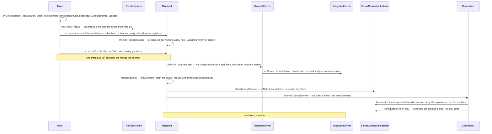
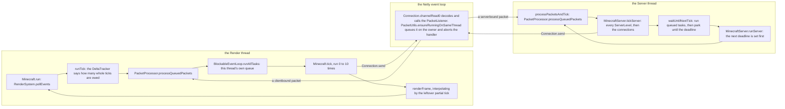

# Anatomy

> Verified against **Minecraft 26.2** · Part I · Clicking Singleplayer, picking a world, and standing in it a few seconds later.

A player clicks Singleplayer, picks a world from the list and waits. One
thread has been running since `main()`; by the time the world appears there
are two that matter, and the second was created by the first, mid-frame,
while the first went on drawing. They are two programs sharing a JVM. The
server is the world — every chunk, entity and block, and the only thing
allowed to change them; the client is a window, a frame loop and a copy of
the world it is told about. Between them runs a Netty channel that never
touches a socket, and over it the client walks the same handshake, login,
configuration and play state machine it would walk against a server on the
other side of the planet. The packets are real. What leaks between the two
halves is not world state but a setting: pause is *decided* on the client,
by `Minecraft.isPaused`, and *enforced* on the server, by
`IntegratedServer.tickServer` running `IntegratedServer.tickPaused` instead
of the world — which is why a world published to LAN never pauses, however
deep in the options menu you are.

## The cast

| class | what it decides | thread |
|---|---|---|
| `Minecraft` | the client: the `Window`, the resource system, the renderers, input and `Options` — and, in three fields, whether we are in a world at all | Render |
| `MinecraftServer` | the world and the loop that advances it. Abstract, with three concrete subclasses: `IntegratedServer`, `DedicatedServer`, and `GameTestServer`, the headless harness the gametest entry point launches | Server |
| `IntegratedServer` | everything singleplayer does differently: the pause, LAN publishing, the player cap, the relaxed limits | Server |
| `BlockableEventLoop` | the queue-and-thread pairing both loops are — `Minecraft` and `MinecraftServer` each extend `ReentrantBlockableEventLoop` | one per queue, and a thread may own more than one |
| `Connection` | one channel, and which `PacketListener` is currently on it | Netty |
| `ServerConnectionListener` | which channels the server listens on, including the in-memory one singleplayer uses | Server, binding into Netty |
| `PacketProcessor` | which decoded packets are waiting to be handled on the thread that owns their state | filled from Netty, drained by the owner |
| `Util` | the pools everything else is serialised onto: `Util.backgroundExecutor`, `Util.ioPool`, `Util.nonCriticalIoPool` | — |

Three of `Minecraft`'s nullable fields between them mean "we are in a
world": `Minecraft.level` (a `ClientLevel`), `Minecraft.player` (a
`LocalPlayer`) and `Minecraft.gameMode` (a `MultiPlayerGameMode`). A fourth,
`Minecraft.singleplayerServer`, holds the `IntegratedServer` when one is
running, and is the client's answer to "am I the host".

> **For a 1.21-era reader.** `Gui` is not the HUD. In 26.2 `Gui` is the whole
> 2D layer — it owns the current `Screen` (`Gui.screen`), the overlay,
> toasts, chat and the render state — and the hearts and the hotbar are a
> separate `Hud` class held as `Gui.hud`. Reach for `Gui` expecting the
> health bar and you want `Hud`.

## From `main()` to a world

**Bootstrap before anything exists.** `SharedConstants.tryDetectVersion`
reads *version.json* as the first statement of both *main* methods, before
the option parser exists; `NativeLibrariesBootstrap.loadLibraries` unpacks
the natives, `CrashReport.preload` warms the reporter, and
`Bootstrap.bootStrap` builds and freezes the static registries — blocks,
items, entity types, the things that cannot be data-driven because the data
loader itself needs them. `ClientBootstrap` does the client-only equivalents
between that and `Bootstrap.validate`, which checks the result.
`DataFixers.optimize` is kicked off concurrently before the registries are
built and joined much later. That ordering is why nothing in `world/` can be
touched from a static initialiser.

**The GPU backend is chosen in the constructor.**
`RenderSystem.initBackendSystem` runs first and returns GLFW's clock, which
`Minecraft` installs through `Util.setTimeSource` — on the client, the game's
entire notion of time comes from the windowing library. Then
`PreferredGraphicsApi` from `Options` decides the order `PreferredGraphicsApi.getBackendsToTry` returns: OpenGL
first by default, Vulkan first only if the player opts in. The first
`GpuBackend` that can create a `Window` wins — `GlBackend` or
`VulkanBackend` — and from then on the renderer only ever sees the
`GpuDevice` abstraction in `com/mojang/blaze3d`.

**Construction registers, it does not load.** The constructor creates each
manager and registers it on the `ReloadableResourceManager`; the loading is
one `ReloadInstance` whose *prepare* phases run on `Util.backgroundExecutor`
and whose *apply* phases run on the Render thread, with the `LoadingOverlay`
on screen. Pressing F3+T re-runs exactly that path — see
[the resource system](../foundations/resource-system.md).

**Opening a world spins a server.** `Minecraft.doWorldLoad` calls
`MinecraftServer.spin`, which makes the thread object, constructs the
`IntegratedServer` *on the caller's thread* around it, and only then starts
it; the new thread's body is `MinecraftServer.runServer`, which calls
`IntegratedServer.initServer` and enters the loop. Meanwhile the Render
thread keeps drawing frames and draining its own queue through
`BlockableEventLoop.managedBlock` until `MinecraftServer.isReady` — the
textbook case of *waiting drains*.

**The client connects like any other client.**
`ServerConnectionListener.startMemoryChannel` binds a Netty local address and
`Connection.connectToLocalServer` connects to it; the client then walks
handshake, login, configuration and play through
`ClientHandshakePacketListenerImpl` exactly as it would against a remote
server. Almost nothing in the play path knows it is singleplayer: the
exceptions are the handful of places that ask `Connection.isMemoryConnection`
directly, among them `ClientPacketListener.handleUpdateTags`, which skips
applying the tags it was sent because the server's registries are already
the client's. [Protocol phases](../networking/protocol-phases.md) is that
walk in full.

## Two loops, and a wire between them

The client's loop is a frame loop with ticks inside it; the server's is a
tick loop with no frames at all. They are not the same shape, and no page
later in this book is readable until that difference is fixed in mind.

**The frame loop.** `Minecraft.run` polls GLFW events and calls
`Minecraft.runTick` once per **frame**, as fast as vsync or the frame-rate
limit allow. Inside each frame a `DeltaTracker.Timer` running at twenty ticks
a second says how many whole game ticks have elapsed since the last frame —
usually zero or one, at most ten are run — and `Minecraft.tick` is called that
many times. The fractional remainder is the partial tick the renderers
interpolate with. So the client *has* a 20 Hz tick, but it is a sub-step of
the frame loop rather than a loop of its own; [the client
loop](../client/the-client-loop.md) is the arithmetic in detail.

**The tick loop.** `MinecraftServer.runServer` re-reads this tick's length
every iteration from `TickRateManager.nanosecondsPerTick` — 50 ms by default,
whatever `/tick rate` says otherwise, and zero while sprinting — and calls
`MinecraftServer.processPacketsAndTick`, which drains the `PacketProcessor`
and then runs `MinecraftServer.tickServer`. Afterwards
`MinecraftServer.waitUntilNextTick` spends the slack running queued tasks and
then parks until the next tick is due. There is no frame and no partial tick
here at all. The "Can't keep up!" warning is `MinecraftServer.runServer`'s
own, decided
before either call from how far behind the deadline already is; [the server
tick](../server/server-tick.md) owns what is inside them — the tick budget,
the deferrable work and the flush bracket around outbound packets.

**Both are event loops first and game loops second.** `Minecraft` and
`MinecraftServer` both extend `ReentrantBlockableEventLoop` — the same base
class, not an analogy — so each is an `Executor` whose queue drains on its own
thread, and any other thread that wants to touch that half's state submits a
task and waits. `BlockableEventLoop.managedBlock` is the blocking form, and
the reason the owning thread can wait for a future without deadlocking: it
keeps draining its own queue while it waits.

**A packet is decoded on one thread and handled on another.** A packet
arrives on a Netty IO thread and `Connection.channelRead0` hands it to the
current `PacketListener`; a handler that touches game state calls
`PacketUtils.ensureRunningOnSameThread`, which, when it is off-thread, queues
the packet on the owning side's `PacketProcessor` and aborts the handler with
`RunningOnDifferentThreadException`. That queue is drained first thing in
`MinecraftServer.processPacketsAndTick` and early in `Minecraft.runTick` —
after the delta tracker advances, before the ticks. Sending is the reverse:
`Connection.send` writes and flushes from any thread, re-posting to the
channel's event loop if it is not already on it.

## Four threads worth memorising

| thread | made by | runs | notes |
|---|---|---|---|
| **Render thread** | the JVM main thread, renamed in `client/main/Main` | `Minecraft.run` | Also the client's game thread: `Minecraft.gameThread` is this thread. Priority 10 on machines with more than four cores. |
| **Server thread** | `MinecraftServer.spin` | `MinecraftServer.runServer` | One per server, so singleplayer has exactly one. Priority 8, on the same more-than-four-cores condition. |
| **Netty IO** | `EventLoopGroupHolder` | the `Connection` pipeline | Named *Netty NIO IO n* — Epoll or Kqueue when native transport is on, *Netty Local IO n* for the in-process singleplayer channel. Decode, decrypt, decompress — and, unlike the play phase, the handshake and login *handlers*, which never call `PacketUtils.ensureRunningOnSameThread`; the first handler that hops is in configuration. The login state machine is still advanced from the Server thread, because `ServerLoginPacketListenerImpl` is a `TickablePacketListener` and `MinecraftServer.tickConnection` ticks it. |
| **Worker-Main-n** | `Util.backgroundExecutor` | a `ForkJoinPool` sized to `availableProcessors()` minus one | `Util.maxAllowedExecutorThreads` clamps it, and `Util.getMaxThreads` reads a *max.bg.threads* system property that overrides the ceiling. The shared CPU pool: chunk generation and lighting (`ChunkMap` through `ChunkTaskDispatcher`), section meshing (`SectionRenderDispatcher`), resource-reload *prepare* phases, chunk serialisation. |

That is the set worth memorising, not the set that exists. The IO workers,
the sound engine's event loop, the dedicated server's watchdog, console,
RCON, query and management threads, the timer hack thread and the
situational ones — authentication, chat filtering, server pinging, telemetry,
world upgrades, the shutdown hooks — are all in
[Threads](../../reference/threads.md), with who makes each and what it is
allowed to touch.

There is no fifth thread hiding on the client. The Render thread *is* the
game thread: `Minecraft.gameThread` and the thread `RenderSystem` guards with
`RenderSystem.assertOnRenderThread` are the same one, and there is no
*initGameThread* and no *isOnGameThread* anywhere in the tree — only
`RenderSystem.isOnRenderThread`. A slow client tick costs frames directly.
What that thread does with a world is animate and predict one — `Minecraft.tick`
calls `ClientLevel.tickEntities`, and block entities tick too — but nothing it
concludes is authoritative, and the server's packets overwrite whatever the
prediction got wrong.

Everything else that matters is *serialised onto* a pool rather than given a
thread. The two `ConsecutiveExecutor` classes in `util/thread` are the
mechanism: a queue that promises to run its tasks one at a time on a pool
that otherwise runs many, which is how "worldgen" and "light" stay ordered on
the worker pool, and how the `IOWorker` stays ordered on `Util.ioPool` —
which is its own pool of *IO-Worker-n* threads, not one of the four. `PriorityConsecutiveExecutor` adds a priority to
the same idea. And `ServerChunkCache.MainThreadExecutor` is a further event
loop layered on the server thread, which is why a tick that waits on a chunk
does not deadlock the chunk that needs the tick.

## What singleplayer shares by direct call

Nothing on the client writes server world state and nothing on the server
writes client world state. Every block, entity and inventory change crosses
as a packet, even in one process. But the two halves share a JVM, and a
handful of things do cross by direct call — every one of them a setting
rather than world state. The server reads `Minecraft.isPaused` and the
client's render and simulation distances every tick;
`IntegratedServer.updateCommandsAllowedForOtherPlayers` reaches into
`LocalPlayer.setPermissions`; the options screens call
`IntegratedServer.publishServer` and its siblings straight from the Render
thread; and `IntegratedServer.latestTicksGizmos` is a volatile list the
server thread writes and the client reads. Treat "everything crosses as a
packet" as a rule about the *world*, not about the process.

Singleplayer differs in more than pausing, too. Beyond the pause and the
distances following `Options`, `IntegratedServer` caps the player list at
eight, owns LAN publishing and the `LanServerPinger`, drops the chat and
command spam thresholds to zero where a dedicated server defaults to ten,
takes native transport from the client's own option rather than a server
property, and answers the operator-permission questions differently.

## Questions players ask

**Does a dedicated server pause?** Yes. With *pause-when-empty-seconds*
(default 60) elapsed and nobody online, `MinecraftServer.tickServer` returns
after ticking connections alone. Pausing is not a singleplayer concept — only
the client-decides-it half is.

**Is twenty ticks a second a constant?** No, it is a server field.
`ServerTickRateManager`, over the shared `TickRateManager`, owns the
nanoseconds-per-tick, the freeze and the sprint state that `/tick`
manipulates, and the client mirrors it in `ClientLevel` so the
`DeltaTracker` can freeze too.

**Does a busy server skip work?** Less than the budget's name suggests.
`MinecraftServer.haveTime` travels from `MinecraftServer.tickServer` down
through every level, and what it actually gates is a short list that does
not include loading or generating a chunk. [The server
tick](../server/server-tick.md) has that list, and the sprint's inverted
effect on it.

**What happens when something throws?** It is collected, not thrown. Both
loops catch everything, wrap it in a `CrashReport` and, on the client, try
`Minecraft.emergencySaveAndCrash` first. A background thread that dies goes
through `Util.onThreadException` into `BlockableEventLoop.relayDelayCrash`,
which parks the report in one **static** slot; the next loop to check it
rethrows — but only a loop constructed to propagate crashes, which is
`Minecraft` and `DedicatedServer` and never `IntegratedServer`. So a worker
that dies in singleplayer surfaces on the client, not on the server thread
whose work it was doing.

**Which entry point starts all this?** One of five. `client/main/Main` for the
client, `server/Main` for the dedicated server, `data/Main` for the data
generator, `client/data/Main` for the generated client assets — models,
atlases, equipment assets, waypoint styles — and `gametest/Main` for
`GameTestServer`. The tree holds a sixth *main*, `SnbtDatafixer`, which
converts files and starts nothing.
The client reads *options.txt* through `Options`, the dedicated server
*server.properties* through `DedicatedServerProperties`, and both read
*version.json* through `SharedConstants`.

## Where to look

`client/main/Main` · `Minecraft` · `Gui` · `Hud` · `DeltaTracker` ·
`MinecraftServer` · `IntegratedServer` · `server/Main` · `DedicatedServer` ·
`GameTestServer` · `BlockableEventLoop` · `ReentrantBlockableEventLoop` ·
`Util` (the executors) · `PacketProcessor` · `PacketUtils` ·
`EventLoopGroupHolder` · `ServerConnectionListener` · `Connection` ·
`PreferredGraphicsApi` · `GpuBackend`

---

*Rules: names, never code · how the system works, not how the code reads ·
newest version only · every backticked name passes `tools/verify_names.py`.*
