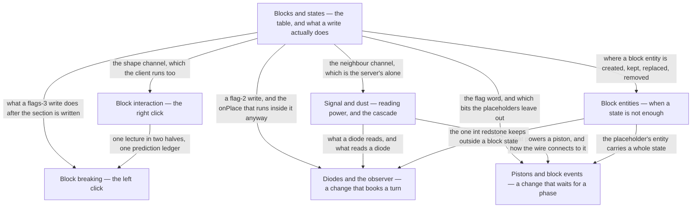

# V · Blocks

> Verified against **Minecraft 26.2** · Part V · Everything that happens at the moment one block state replaces another: the click that asks for it, the write that performs it, and the four kinds of answer a block can give back.

You open a door and both halves swing. You flip a lever and the lamp across
the room stays dark for a moment longer than you expected. Both are the same
event underneath — a position in a chunk section stops holding one block state
and starts holding another — and everything here is either choosing the state
that goes in, performing the write, or being a block that answers one. A block
has exactly four ways to answer, and this part is organised around them rather
than around the three hundred blocks that use them: a **neighbour update**
(*something near you changed*), a **shape update** (*your neighbour's state is
now this — do you still fit?*), a **block event** (*do this at a named moment
later in the tick*) and a **scheduled tick** (*do this in n ticks*). A reader
who has those four can read any block in the game.

Two of them are the two channels a write can leave by, and that is where the
door and the lamp part company: **the neighbour channel exists only on the
server, and the shape channel runs on both sides.** The door's other half comes
down the channel your own client also runs, so it moves before the server has
been asked; the lamp waits on the channel that exists only on the server. Half
the surprises in this part are that sentence in another costume.

## The shape of the part

Counting the two packages [the atlas](../../maps/packages.md#where-each-part-lives)
lists for this part, that is {{#include ../../generated/part-blocks.md}} — and
seven lectures is the fewest of any part this size, on purpose. Most of those
classes are one `Block` subclass each, filling in two or three of the hooks
[blocks and states](blocks-and-states.md) enumerates.

Part V is a hub and six spokes. The hub is `blocks-and-states`, and what each
spoke takes from it is not the state table — it is the tail of a write, drawn
there as the part's largest flowchart and pointed at from every other page.
Each arrow below is labelled with what the hub hands that spoke.

## Before you start

Five pages are load-bearing, each for one reason. [Chunk
anatomy](../world/chunk-anatomy.md#what-placing-a-block-actually-does) is the
first half of every write here. [The level
tick](../server/server-level-tick.md#the-whole-tick-and-its-three-gates)
matters because half of this part's surprises are really claims about which
phase of a tick something ran in, and [the server
tick](../server/server-tick.md#what-minecraftservertickchildren-runs-and-in-what-order)
sits behind it for the two claims about what happens *outside* one: a packet
handler runs before the levels do, a connection is flushed after. [Scheduled
ticks](../world/scheduled-ticks.md#booking-a-type-a-position-a-time-and-a-tie-breaker)
is how a block gets a turn later, which is the whole of the diode lecture. And
[fluids](../world/fluids.md#two-registry-objects-one-substance) owns the
`FluidState` that shares a `StateHolder` with every block state. [Identifiers
and
registries](../foundations/identifiers-and-registries.md#the-freeze-rule-stated)
is assumed rather than used: the hub rests throughout on every block state
having been built into one table before any world existed.

One dependency runs the other way. [Prediction and
acknowledgement](../client/prediction-and-acks.md#two-state-machines-running-against-each-other)
is Part X, and the two click lectures use three of its six windows — but its own
scenario is a block placed against a wall, which needs this part's vocabulary.
So watch Part V first: both click pages open with the same four-sentence
statement of the contract, which is all either lecture needs. Part X is also
where the third thing a player notices about this part lives, after the door and
the lamp above — the block that appears under the crosshair before the server
has heard about it.

## Watch in this order

1. [Blocks and states](blocks-and-states.md) — a right-click on stone puts one
   of oak stairs' eighty states into the world. Every state the game will ever
   have was built before the world was, and the world stores an index into
   that table. The second half — what a write does after the section has been
   written — is the figure the other six lectures point back at.
2. [Block interaction](block-interaction.md) — the right click, in full: a
   door opened by hand. It fires no neighbour update at all, and the top half
   follows anyway.
3. [Block breaking](block-breaking.md) — the same lecture's other half: two
   clocks that agree without exchanging a packet, because the one comparison
   that matters happens in the packet drain rather than in the tick. Let go too
   early and the block comes back, then vanishes again, and nothing short of
   the block itself going away stops it.
4. [Block entities](block-entities.md) — a furnace smelts while nobody is
   looking. It tells nobody anything: the fire is a block state, the arrow is
   four ints from a menu, and both are a tick late by construction.
5. [Signal and dust](signal-and-dust.md) — a lever, two dust, and the
   cascade. A line turning off is visited once for every intermediate value it
   passes through, none of which is ever sent to anybody, and the game ships a
   second implementation behind a flag that does not do it at all.
6. [Pistons and block events](pistons-and-block-events.md) — the part's
   deferral with no delay in it: the work waits for one named phase of the
   level tick rather than for a number of ticks, and usually gets it in the
   same tick — and the one place the client is handed a re-simulation rather
   than a result.
7. [Diodes and the observer](diodes-and-observers.md) — the part's closer.
   Three blocks that learn about their neighbours three different ways, and the one
   whose entire job is noticing change turns out not to be listening on the
   channel that carries it.

## Where the part stops

Part V owns the write and the four answers; it does not own most of the
*blocks*. {{#include ../../generated/coverage-blocks.md}}, and most of that is
deliberate: a block is usually the place some other system surfaces, so it is
taught where its scenario is — the sculk family with [game events and
vibrations](../world/game-events-and-vibrations.md), `LiquidBlock` with
[fluids](../world/fluids.md), the containers with [Part
VII](../items/README.md), signs and chests *as things drawn* with [Part
XI](../rendering/README.md), the structure block with
[jigsaw and templates](../worldgen/jigsaw-and-templates.md#where-a-template-comes-from),
the command block with [Part
XIII](../commands/brigadier-and-commands.md#three-parsers-see-one-string). What
comes back here is the moment any of them writes a state.

Three mechanisms belong to nobody, and this is the sentence that says so rather
than leaving the silence to be found. The **hopper** is the largest —
`HopperBlockEntity` and `HopperBlock` are named on three pages and the transfer
itself is explained on none. **Sculk spread** is the second: `SculkSpreader`'s
charges walking through `SculkBehaviour`, `SculkBlock` and `SculkVeinBlock`,
where the page
that owns the catalyst owns it only as a *listener*. The third is a family —
`BeaconBlockEntity`, `ConduitBlockEntity` and the trial-spawner and vault
sub-packages, whose outer classes Parts VI and VII name while their state
machines go unexplained. Each is lecture-sized and each waits for a second
edition.

## Reference this part uses

[Block update flags](../../reference/block-update-flags.md) is the one to open
first, because every page here spends at least one flag word: the ten bits of
`Level.setBlock`'s argument and what reads each. Then
[registries](../../reference/registries.md) for `Registries.BLOCK` and
`Registries.BLOCK_ENTITY_TYPE`, [packets](../../reference/packets.md) for every
block update, block event and acknowledgement in one table, [data
components](../../reference/components.md) for `DataComponents.TOOL`, [game
rules](../../reference/gamerules.md) for `GameRules.BLOCK_DROPS`, and [math and
primitives](../../reference/math-and-primitives.md) for `BlockPos`,
`Direction` and the packings every page here assumes. The
[glossary](../../reference/glossary.md) defines the four answers and the two
things they act on, all from pages in this part, and [diagram
lanes](../../reference/lanes.md) explains the abbreviations these figures use.

---

*Rules: names, never code · how the system works, not how the code reads ·
newest version only · every backticked name passes `tools/verify_names.py`.*
