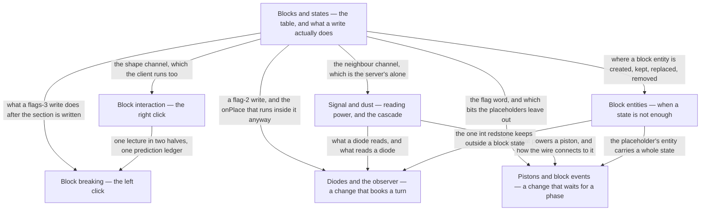

# V · Blocks

> Verified against **Minecraft 26.2** · Part V · Everything that happens at the moment one block state replaces another: the click that asks for it, the write that performs it, and the four kinds of block that answer back.

You open a door and both halves swing. You flip a lever and the lamp across
the room stays dark for a moment longer than you expected. Both are the same
event underneath — a position in a chunk section stops holding one block state
and starts holding another — and the difference between them is the whole of
this part: **there are two entirely different ways a block hears that its
neighbour changed, and the client runs only one of them.** The door's other
half comes down the channel your own client also runs, so it moves before the
server has been asked; the lamp waits on the channel that exists only on the
server. Everything here is either choosing the state that goes in, performing
the write, or being a block that answers one.

Counting the two packages [the atlas](../../maps/packages.md#where-each-part-lives)
lists for this part, that is {{#include ../../generated/part-blocks.md}} — and
seven lectures is the fewest of any part this size, on purpose. Most of those
classes are one `Block` subclass each, filling in two or three of the hooks
[blocks and states](blocks-and-states.md) enumerates, and the four kinds of
answer a block can give are what this part teaches instead of the blocks that
give them: a neighbour update, a shape update, a block event and a scheduled
tick. A reader who has those four can read any of the three hundred.

## Where the part stops

Part V owns the write and the four answers; it does not own most of the
*blocks*. About ten thousand lines of its own two packages are taught in other
parts, because a block is usually the place some other system surfaces: the
sculk family is [game events and
vibrations](../world/game-events-and-vibrations.md)', `LiquidBlock` is
[fluids](../world/fluids.md)', the containers and their menus are [Part
VII](../items/README.md), signs and chests as things that are *drawn* are
[Part XI](../rendering/README.md), and the command and structure blocks are
[Part XIII](../commands/README.md)'s. What comes back here is the moment any
of them writes a state.

## The shape of the part

Part V is a hub and six spokes. The hub is `blocks-and-states`, and what the
spokes reach back into it for is not the state table — it is the tail of a
write, drawn there as the part's one flowchart and linked to from everywhere
else.

## Before you start

[Chunk anatomy](../world/chunk-anatomy.md#what-placing-a-block-actually-does), because the first half of every
write in this part is a section write with four heightmaps and a light check
behind it, and [the level tick](../server/server-level-tick.md#the-whole-tick-and-its-three-gates), because half
of this part's surprises are really claims about which phase of a tick
something ran in — with [the server tick](../server/server-tick.md#what-minecraftservertickchildren-runs-and-in-what-order) behind
it, for the two claims this part makes about what happens *outside* the level
tick: that a packet handler runs before the levels do, and that a connection
is flushed after they have. Two more Part IV pages are load-bearing here
rather than merely adjacent: [scheduled
ticks](../world/scheduled-ticks.md#booking-a-type-a-position-a-time-and-a-tie-breaker) is how a block gets a turn *later*, which
is the whole of the diode lecture, and [fluids](../world/fluids.md#two-registry-objects-one-substance) owns the
`FluidState` that shares a `StateHolder` with every block state, and the
waterlogging this part keeps writing around.

[Identifiers and
registries](../foundations/identifiers-and-registries.md#the-freeze-rule-stated)
is assumed rather than used: every block state in the world was built into one
table before any world existed, which is the freeze rule seen from the inside,
and the hub page rests on it throughout.

One dependency runs the other way. [Prediction and
acknowledgement](../client/prediction-and-acks.md#two-state-machines-running-against-each-other)
is Part X, and the two click lectures here use three of its six windows between
them — but its own scenario is a block placed against a wall, which needs this
part's vocabulary. So watch Part V first: both click pages open with the same
four-sentence statement of the contract, which is all either lecture needs, and
the machinery keeps until Part X. That is also where the third thing a player
notices about this part lives — the block that appears under the crosshair
before the server has heard about it.

## Watch in this order

1. [Blocks and states](blocks-and-states.md) — a right-click on stone puts one
   of oak stairs' eighty states into the world. Every state the game will ever
   have was built before the world was, and the world stores an index into
   that table. The second half — what a write does after the section has been
   written — is the figure the other six lectures point back at.
2. [Block interaction](block-interaction.md) — the right click, in full: a
   door opened by hand. It fires no neighbour update at all, and the top half
   follows anyway.
3. [Block breaking](block-breaking.md) — the same lecture's other half: two
   clocks that agree without exchanging a packet. Let go too early and the
   block comes back, then vanishes again, and nothing short of the block
   itself going away stops it.
4. [Block entities](block-entities.md) — a furnace smelts while nobody is
   looking. It tells nobody anything: the fire is a block state, the arrow is
   four ints from a menu, and both are a tick late by construction.
5. [Signal and dust](signal-and-dust.md) — a lever, two dust, and the
   cascade. A line turning off is visited once for every intermediate value it
   passes through, none of which is ever sent to anybody, and the game ships a
   second implementation behind a flag that does not do it at all.
6. [Pistons and block events](pistons-and-block-events.md) — the part's
   deferral with no delay in it: the work waits for one named phase of the
   level tick rather than for a number of ticks, and usually gets it in the
   same tick — and the one place the client is handed a re-simulation rather
   than a result.
7. [Diodes and the observer](diodes-and-observers.md) — the part's closer.
   Three blocks that learn about their neighbours three different ways, and the one
   whose entire job is noticing change turns out not to be listening on the
   channel that carries it.

## Reference this part uses

[Block update flags](../../reference/block-update-flags.md) — the ten bits of
`Level.setBlock`'s flag word and what reads each. [Registries](../../reference/registries.md) — `Registries.BLOCK` and
`Registries.BLOCK_ENTITY_TYPE` are two of its rows.
[Packets](../../reference/packets.md) — every block update, block event and
acknowledgement in one table. [Data
components](../../reference/components.md) — `DataComponents.TOOL`, which
decides how fast a stack mines and whether the block drops. [Game
rules](../../reference/gamerules.md) — `GameRules.BLOCK_DROPS`, which decides
whether a broken block leaves anything behind. [Math and
primitives](../../reference/math-and-primitives.md) — `BlockPos`,
`Direction` and the packings every page here assumes. [Glossary](../../reference/glossary.md) —
*block*, *block state*, *block entity*, *block event*, *neighbour update* and
*shape update* are all defined from pages in this part. [Diagram
lanes](../../reference/lanes.md) — for the abbreviations these figures use.

---

*Rules: names, never code · how the system works, not how the code reads ·
newest version only · every backticked name passes `tools/verify_names.py`.*
