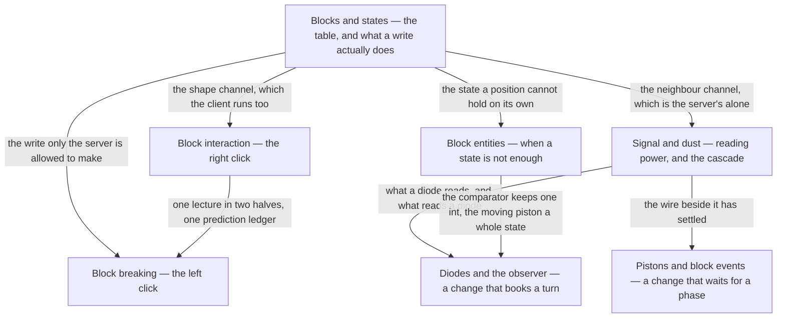

# V · Blocks

> Verified against **Minecraft 26.2** · Part V · Everything that happens at the moment one block state replaces another: the click that asks for it, the write that performs it, and the four kinds of block that answer back.

Part IV built the container. This part is about what is *in* it, and it has
one moment at its centre: a position in a chunk section stops holding one
block state and starts holding another. Every page here is either about
choosing that state, about the write itself, or about a block that reacts
because a neighbour's write happened. A player recognises the part by how it
*feels* — the block that appears under the crosshair before the server has
heard about it, the door whose top half swings with the bottom, the redstone
lamp that does not light until the server says so. All three of those
feelings come from one distinction: **there are two entirely different ways a
block hears that its neighbour changed, and the client runs only one of
them.**

## The shape of the part

Part V is a hub and six spokes. The hub is `blocks-and-states`, and what the
spokes reach back into it for is not the state table — it is the tail of a
write, drawn there once as a flowchart and linked to from everywhere else.

## Before you start

[Chunk anatomy](../world/chunk-anatomy.md), because a block state's home is a
palette entry in a section, and [the level
tick](../server/server-level-tick.md), because half of this part's surprises
are really claims about which phase of a tick something ran in. Two Part IV
pages are load-bearing here rather than merely adjacent: [scheduled
ticks](../world/scheduled-ticks.md) is how a block gets a turn *later*, which
is the whole of the diode lecture, and [fluids](../world/fluids.md) owns
waterlogging and the flowing block that this part keeps writing around.

One dependency runs the other way. [Prediction and
acknowledgement](../client/prediction-and-acks.md) is Part X, and the two
click lectures here are its two applications — but its own scenario is a
block placed against a wall, which needs this part's vocabulary. So watch
Part V first: both click pages open with the same four-sentence statement of
the contract, which is all either lecture needs, and the machinery keeps
until Part X.

## Watch in this order

1. [Blocks and states](blocks-and-states.md) — a right-click on stone puts one
   of oak stairs' eighty states into the world. Every state the game will ever
   have was built before the world was, and the world stores an index into
   that table. The second half — what a write does after the section has been
   written — is the figure the other six lectures point back at.
2. [Block interaction](block-interaction.md) — the right click, in full: a
   door opened by hand. It fires no neighbour update at all, and the top half
   follows anyway.
3. [Block breaking](block-breaking.md) — the same lecture's other half: two
   clocks that agree without exchanging a packet. Let go too early and the
   block comes back, then vanishes again, and nothing you do in between can
   stop it.
4. [Block entities](block-entities.md) — a furnace smelts while nobody is
   looking. It tells nobody anything: the fire is a block state, the arrow is
   four ints from a menu, and both are a tick late by construction.
5. [Signal and dust](signal-and-dust.md) — a lever, two dust, and the
   cascade. A line turning off counts down through every intermediate value,
   and the game ships a second implementation, behind a flag, that does not.
6. [Pistons and block events](pistons-and-block-events.md) — the one
   mechanism in the part that defers work to a named phase of the tick, and
   the one place the client is handed a re-simulation instead of a result.
   The moving blocks are never sent to anybody.
7. [Diodes and the observer](diodes-and-observers.md) — the part's closer.
   Three blocks that read their neighbours three different ways, and the one
   whose entire job is noticing change turns out not to be listening on the
   channel that carries it.

## Reference this part uses

[Registries](../../reference/registries.md) — `BuiltInRegistries.BLOCK` and
`BuiltInRegistries.BLOCK_ENTITY_TYPE` are two of its rows.
[Packets](../../reference/packets.md) — every block update, block event and
acknowledgement in one table. [Data
components](../../reference/components.md) — the tool, the block state and
the block-entity data an item can carry. [Game
rules](../../reference/gamerules.md). [Math and
primitives](../../reference/math-and-primitives.md) — `BlockPos`,
`Direction` and the packings every page here assumes. [Diagram
lanes](../../reference/lanes.md).

---

*Rules: names, never code · how the system works, not how the code reads ·
newest version only · every backticked name passes `tools/verify_names.py`.*
