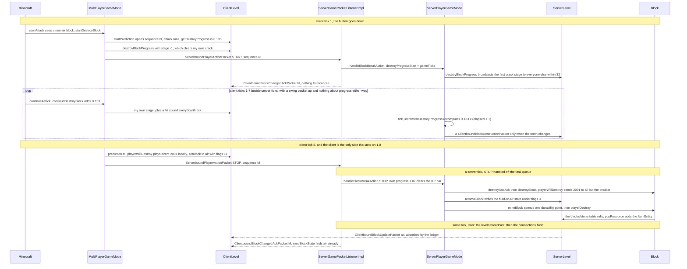

# Block breaking

> Verified against **Minecraft 26.2** · Part V · A survival player holds left-click on stone with an iron pickaxe for eight ticks: two clocks that agree without talking, one loot roll, one cobblestone.

Hold the button on a stone block and two programs start counting. The client
adds a fraction to `MultiPlayerGameMode.destroyProgress` every client tick and
paints the crack; the server sets `ServerPlayerGameMode.destroyProgressStart`
to the tick the dig began and recomputes, from scratch, how far along it ought
to be. Between the first packet and the last, **neither clock is ever
mentioned on the wire** — no progress reports, no heartbeat, nothing but the
swing animation going up — and on the eighth tick the two answers are the same
number. That agreement is what the whole design rests on, and it is
also why the failure mode is so strange: **releasing the button does not
cancel a break.** A client that stops too early gets a deferral, not a
rejection. The receipt for the STOP goes out in the same tick, the client
dutifully puts the stone back — and then watches it vanish a second time when
the server's own clock finishes the job, with nothing the player can do in
between.

> **The contract both halves run under.** The client acts at once and remembers the state it overwrote, under a sequence number it sends with the action. The server's `ClientboundBlockChangedAckPacket` is a receipt for that number and *not* a verdict — it is sent for actions the server refused exactly as for actions it allowed — and correctness comes from ordering instead: any correction the server means to send travels in the same tick and earlier in the stream than the receipt. A correction *replaces* what the client remembered rather than being weighed against it, so when the receipt arrives the client writes back whatever the entry now holds — and only where that differs from what is on screen. [Prediction and acknowledgement](../client/prediction-and-acks.md#two-state-machines-running-against-each-other) owns that machinery; [block interaction](block-interaction.md) and this page are its two applications.

## The cast

| class | what it decides | thread |
|---|---|---|
| `Minecraft` | that the button is down and the crosshair is on a block, and whether this frame's tick starts a dig or continues one | Render |
| `MultiPlayerGameMode` | the client's clock: accumulated progress, the five-tick pause after a break, when to predict the removal and send STOP | Render |
| `ClientLevel` | the predicted air, and the crack overlays — every breaker's, including the local player's | Render |
| `ServerGamePacketListenerImpl` | which of the eight `ServerboundPlayerActionPacket.Action`s this is, and when the receipt for its sequence is flushed | Server |
| `ServerPlayerGameMode` | the server's clock, the reach and permission gates, the 0.7 verdict, and the deferral | Server |
| `BlockBehaviour.BlockStateBase` | hardness, whether the block needs the right tool for drops, and the per-tick fraction | either |
| `Tool` | how fast this stack mines this block, and whether it drops — two separate answers from one rule list | either |
| `Block` | the removal, the particles and sound event, the stat, the exhaustion and the loot roll | Server |

## One dig, end to end

## Two clocks, and the plus one that makes them agree

`BlockBehaviour.getDestroyProgress` is the shared formula, and both sides call
it through `BlockBehaviour.BlockStateBase.getDestroyProgress` with the same
arguments. It answers the fraction of the block broken *per tick*: the
player's speed, divided by the block's hardness, divided by **30** when
`Player.hasCorrectToolForDrops` says yes — which it does for every block that
does not require a tool at all — and by **100** when it says no. Hardness −1
returns zero forever. Hardness *zero* is not special-cased, so an instabreak
block divides by zero and returns infinity: that, and not a branch on
hardness, is what sends the START handler down its insta-mine path on the
first tick.

`Player.getDestroySpeed` builds the numerator from `Inventory.getSelectedItem`
in one pass, and the surprising parts are all constants rather than data. The
stack's `ItemStack.getDestroySpeed` gives the base. If that is above 1.0 —
only then — `Attributes.MINING_EFFICIENCY` is *added*, which is where
`Enchantments.EFFICIENCY` lands, at level² + 1. Haste and conduit power are
read together through `MobEffectUtil.hasDigSpeed` and
`MobEffectUtil.getDigSpeedAmplification`, which returns the **greater** of the
two amplifiers — a beacon and a conduit are interchangeable and do not stack —
and multiply by 1 + 0.2 × (amplifier + 1). Mining fatigue is
not an attribute at all but four literal factors switched on the amplifier —
0.3, 0.09, 0.0027, and 0.00081 for anything higher. Then
`Attributes.BLOCK_BREAK_SPEED`, then `Attributes.SUBMERGED_MINING_SPEED` (0.2
by default) if the eyes are in `FluidTags.WATER`, and finally **divide by five
if the player is not on the ground**.

For stone at hardness 1.5 and an iron pickaxe at 6.0, that is 6 ÷ 1.5 ÷ 30 =
0.133 per tick, so the eighth tick is the one that passes 1.0.

### Why the two answers match

The two clocks count differently and still land on the same number. The client
accumulates: `MultiPlayerGameMode.continueDestroyBlock` adds one tick's
fraction each time it runs. The server keeps no accumulator, and its number is
in fact a tick *ahead* of the client's all the way down — it simply never acts
on it, because the live branch of `ServerPlayerGameMode.tick` throws the value
away and only the delayed branch compares it with 1.0.
`ServerPlayerGameMode.incrementDestroyProgress` multiplies the per-tick
fraction by *elapsed ticks plus one*, and that plus one is exactly the client's
first `Minecraft.continueAttack`, which happens in the same client tick as the
`Minecraft.startAttack` that opened the dig. Recomputing rather than
accumulating has a second consequence: swap tools or lose haste mid-dig and the
server rescales the *whole* dig retroactively, while the client keeps the
progress it already banked.

They agree without talking because every input is either static data both
sides loaded — hardness, the block tags, the `Tool` component travelling with
the stack — or a syncable attribute, or a synced effect. The inputs that could
drift are the ones the client reports rather than shares, and the sharpest of
them is which slot is selected:
`MultiPlayerGameMode.ensureHasSentCarriedItem` runs at the top of every
`MultiPlayerGameMode.continueDestroyBlock` to send a
`ServerboundSetCarriedItemPacket` the moment it changes.

## The button is not the switch

**Seventy per cent** — how much of the server's own clock a STOP must have run
before the block breaks immediately (`ServerPlayerGameMode.handleBlockBreakAction`).

For stone that is about two ticks of slack. Below the bar the STOP is not
refused: the handler sets `ServerPlayerGameMode.hasDelayedDestroy`, copies the
position and the *original* start tick into
`ServerPlayerGameMode.delayedDestroyPos` and
`ServerPlayerGameMode.delayedTickStart`, and lets its own clock run on. The
sequence is acknowledged regardless — `ServerGamePacketListenerImpl.handlePlayerAction`
calls `ServerGamePacketListenerImpl.ackBlockChangesUpTo` for all three break
actions, unconditionally, after the game mode has run. So the receipt arrives
with no correction in front of it, the client settles prediction M against the
stone it recorded, and `ClientLevel.syncBlockState` puts the stone back. The
block is visibly there again. A tick or two later the server's clock crosses
1.0, `ServerPlayerGameMode.destroyBlock` runs, and the air arrives as an
ordinary block update. The prediction was not wrong — it was undone and then
redone.

Letting go changes nothing. The ABORT branch clears
`ServerPlayerGameMode.isDestroyingBlock` and erases the crack, and it never
touches `ServerPlayerGameMode.hasDelayedDestroy` — and
`ServerPlayerGameMode.tick` tests the delayed dig **first**, before the live
one. Starting a dig on a different block does not help either: the START is
processed normally, but the delayed branch keeps winning the tick. The delayed
path re-checks almost nothing on its way through — not reach, not
`MinecraftServer.isUnderSpawnProtection`, not `ServerLevel.mayInteract`, not
that the player is still in the same room. It calls
`ServerPlayerGameMode.destroyBlock` directly rather than
`ServerPlayerGameMode.destroyAndAck`, so a failure there is silent, with no
corrective block update. Its only escape is the block turning to air: that is
the one condition `ServerPlayerGameMode.tick` tests before recomputing
progress.

### What a real refusal looks like

The refusals that *are* refusals differ in what they send back, and the
difference is observable. A failed `Player.isWithinBlockInteractionRange`
check — which allows a full block of slack — sends **nothing at all**, and it
guards ABORT as well as START, so an abort from too far away is dropped on the
floor. Being above `LevelHeightAccessor.getMaxY`, failing
`ServerLevel.mayInteract` or failing `Player.blockActionRestricted` each answer
with a `ClientboundBlockUpdatePacket` carrying the true state. Spawn protection
answers with an overlay message from `ServerPlayer.sendSpawnProtectionMessage`
and no block update whatsoever. Every one of those exits is named in a string
behind `SharedConstants.DEBUG_BLOCK_BREAK`, which is the best map of this state
machine there is.

Worth holding the two click lectures side by side here, because the same two
gates answer oppositely. Breaking above the build height sends the true state
back; *placing* above it sends an action-bar line and no block update at all.
Breaking inside spawn protection sends the message and no block update;
placing there sends the message *and* both updates ([block
interaction](block-interaction.md#the-gate-list-and-what-each-refusal-answers-with)).
The rule is not the gate but the pipeline. A placement's two corrective updates
sit in one branch below the build-height test and go out for every outcome that
reaches it, refusal or not. A break has no such branch: each refusal decides
for itself, and three of the four send the true state back while spawn
protection sends only its message.

## Speed and drops are two scans of one list

`DataComponents.TOOL` holds a `Tool`: a list of `Tool.Rule`, a
`Tool.defaultMiningSpeed`, a `Tool.damagePerBlock` and a
`Tool.canDestroyBlocksInCreative`. Each rule names a set of blocks and carries
an *optional* speed and an *optional* drop verdict, so a rule can answer one
question and stay silent on the other. `Tool.getMiningSpeed` and
`Tool.isCorrectForDrops` are two independent walks of the same list, each
taking the first rule that both matches the block *and* carries the field it
came for. `ToolMaterial.applyToolProperties` builds every pickaxe, axe, shovel
and hoe from exactly two rules, in this order:

| the iron pickaxe's rules, in order | what `Tool.getMiningSpeed` does | what `Tool.isCorrectForDrops` does |
|---|---|---|
| deny drops on `BlockTags.INCORRECT_FOR_IRON_TOOL` — no speed field | skips it | obsidian matches, answers **no** |
| mine and drop `BlockTags.MINEABLE_WITH_PICKAXE` at 6.0 | obsidian matches, answers **6.0** | never reached |
| nothing matched | `Tool.defaultMiningSpeed`, 1.0 | false |

That is why an iron pickaxe mines obsidian and drops nothing. The speed scan
falls through the deny rule — it has no speed — and takes the full pickaxe
6.0; the drop scan stops at the deny. The block still takes forever, but for a
different reason: `Player.hasCorrectToolForDrops` is false, so
`BlockBehaviour.getDestroyProgress` divides by 100 instead of 30. No item in
the game uses all three rule shapes: `Tool.Rule.deniesDrops` and
`Tool.Rule.overrideSpeed` never appear in the same `Tool`, because the items
that deny drops on a tag are exactly the ones that name their own speed on
another. The sword is one of exactly three whose
`Tool.canDestroyBlocksInCreative` is false — the other two are the mace and the
trident.

## The cracks belong to everyone but you

`ServerLevel.destroyBlockProgress` sends a `ClientboundBlockDestructionPacket`
to every player in the level within 32 blocks whose entity id is not the
breaker's. You are never sent your own cracks. What you see is
`MultiPlayerGameMode` writing straight into `ClientLevel.destroyBlockProgress`
each tick — the same method the packet handler calls, reached by a different
road. The same asymmetry runs through the break itself: `Block.playerWillDestroy`
posts level event 2001, which `ServerLevel.levelEvent` broadcasts within 64
blocks *excluding* the breaker, because the breaker already played it locally
inside `MultiPlayerGameMode.destroyBlock`.

`BlockDestructionProgress` is a plain holder — id, position, progress, a last
touched tick — and `BlockDestructionProgress.setProgress` clamps only the top,
at 10. The 0–9 window everybody quotes is enforced by the *caller*:
`ClientLevel.destroyBlockProgress` stores a stage only for values in [0, 10),
and reads anything else — including the −1 that
`MultiPlayerGameMode.getDestroyStage` returns at zero progress — as an
instruction to **remove** that breaker's entry. Entries are indexed twice, by
breaker id and by position, the latter into a sorted set so the deepest crack
at a position wins; `LevelExtractor` collects those within 32 blocks of the
camera each frame. Entries untouched for 400 ticks are swept every twentieth
tick, which is what eventually clears the cracks left by someone who
disconnected mid-dig.

## Remove, damage, roll, drop

`ServerPlayerGameMode.destroyBlock` runs a short gauntlet before it writes
anything: `ItemStack.canDestroyBlock`, then `GameMasterBlock` against
`Player.canUseGameMasterBlocks`, then `Player.blockActionRestricted`. It
captures the `BlockEntity` first, because the write is about to destroy it.
Then `Block.playerWillDestroy` — particles and sound to everyone else, piglins
angered for `BlockTags.GUARDED_BY_PIGLINS`, and a `GameEvent.BLOCK_DESTROY`
posted for sculk ([game events](../world/game-events-and-vibrations.md#the-dispatcher-never-queues)).

The write itself is `Level.removeBlock`, not `Level.destroyBlock`. It puts the
*fluid* that was in the block back — water for a waterlogged block, air here —
under flags 3, and everything that follows from those flags is the one
flowchart on [blocks and
states](blocks-and-states.md#the-two-update-channels).

Drops come last and in a fixed order. If `Player.preventsBlockDrops` (creative)
the method returns here. Otherwise the tool is copied,
`Player.hasCorrectToolForDrops` is asked *once* and remembered, and
`ItemStack.mineBlock` is called **unconditionally** — though what it does is
conditional four ways over, and not one of those conditions is this page's
([items and
stacks](../items/items-and-stacks.md#a-pickaxes-last-point-of-durability)).
Only then, and only if the
write succeeded and the remembered answer was yes, does `Block.playerDestroy`
run: `Stats.BLOCK_MINED`, 0.005 of food exhaustion, and `Block.dropResources`.

The loot side is thin. `Block.getDrops` supplies `LootContextParams.ORIGIN` at
the block centre, `LootContextParams.TOOL` and `LootContextParams.THIS_ENTITY`,
`BlockBehaviour.getDrops` adds `LootContextParams.BLOCK_STATE`, and the set is
`LootContextParamSets.BLOCK`. The table key is not looked up by name at break
time: `BlockBehaviour.Properties.effectiveDrops` resolves the block's id under
*blocks/* once, when the block is constructed. What *blocks/stone* then does is
two lines of JSON — a silk-touch alternative, else cobblestone if it survives
an explosion — rolled from a seeded per-table sequence rather than the level
random ([loot tables](../items/loot-tables.md#where-the-randomness-comes-from)). Each surviving stack goes to
`Block.popResource`, which respects `GameRules.BLOCK_DROPS`, jitters the
position ±0.25 on all three axes around the block centre, gives the
`ItemEntity` its small upward kick in the constructor and a ten-tick pickup
delay. Ores add their experience afterwards, in
`BlockBehaviour.BlockStateBase.spawnAfterBreak`.

## Questions players ask

**Why did the block come back, and then break anyway?** You released a tick or
two before the server's clock agreed you were done, so the STOP fell under 0.7
and became a deferral. The receipt for it carried no correction, so your client
rolled the prediction back and restored the stone; the server finished the dig
on its own a tick or two later. See *The button is not the switch*.

**Why does my pickaxe lose durability on obsidian, which drops nothing, but
not on short grass, which does?** Durability is spent by `ItemStack.mineBlock`,
which runs before the drop verdict is consulted and does not care about it —
what it cares about is that the block's hardness is non-zero and the tool has a
damage-per-block above zero. Obsidian is hard and drops nothing: you pay. Short
grass is `Blocks.SHORT_GRASS`, hardness zero: you never pay, whatever it drops.
Shears are the exception at both ends — `ShearsItem` is the only override of
`Item.mineBlock` in the game, and it tests neither hardness nor drops, only
that the block is not in `BlockTags.FIRE`. Shearing grass costs a point.

**Why can't I break blocks with a sword in creative?** Because
`Tool.canDestroyBlocksInCreative` is false on the sword's component and
`ItemStack.canDestroyBlock` checks it on both sides. It is a property of the
item, not a special case in the game mode — which is why the client refuses
first, and why the correcting block update the server sends back is a no-op:
the client predicted nothing to correct.

**Why do other players' cracks lag behind mine?** Yours are written locally
every client tick from your own accumulator. Theirs arrive as packets, sent
only when the server's tenth-of-progress changes, from the server's own clock,
and only if you are within 32 blocks.

## Where to look

`Minecraft.startAttack` · `Minecraft.continueAttack` ·
`MultiPlayerGameMode.startDestroyBlock` ·
`MultiPlayerGameMode.continueDestroyBlock` ·
`MultiPlayerGameMode.destroyBlock` ·
`ServerGamePacketListenerImpl.handlePlayerAction` ·
`ServerPlayerGameMode.handleBlockBreakAction` · `ServerPlayerGameMode.tick` ·
`ServerPlayerGameMode.incrementDestroyProgress` ·
`ServerPlayerGameMode.destroyBlock` · `BlockBehaviour.getDestroyProgress` ·
`Player.getDestroySpeed` · `Tool.getMiningSpeed` · `Tool.isCorrectForDrops` ·
`Block.playerWillDestroy` · `Block.playerDestroy` · `Block.popResource` ·
`ServerLevel.destroyBlockProgress` · `ClientLevel.destroyBlockProgress`

---

*Rules: names, never code · how the system works, not how the code reads ·
newest version only · every backticked name passes `tools/verify_names.py`.*
