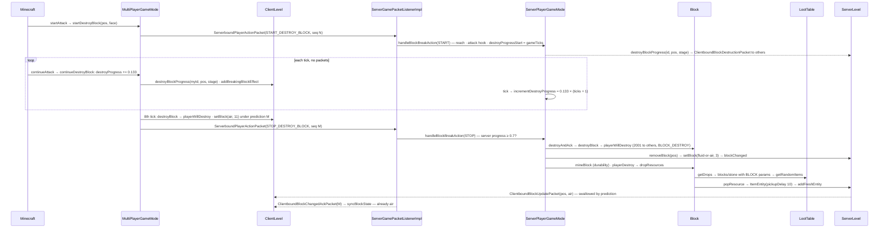

# Block breaking

> Verified against **Minecraft 26.2** · Part V · A survival player with an iron pickaxe holds left-click on stone for eight ticks: two clocks that agree without talking, one loot roll, one cobblestone.

## Responsibility

Breaking a block is a *negotiated* event. The client runs its own progress
clock and tells the server only when it starts, stops or gives up; the
server runs an independent clock from the same inputs and, when the
client says "done", checks that its own answer is close enough. Then the
server — and only the server — removes the block, damages the tool, rolls
the loot table and spawns the drop. The client's crack overlay, break
sound and particles all happen locally first and are confirmed later.

The one sentence a player recognises: *stone takes eight ticks — four
tenths of a second — with an iron pickaxe, drops nothing without one, and
the cracks you see on other players' blocks lag behind theirs.*

## The data it owns

- **The block's side:** `BlockBehaviour.Properties.strength` sets two
  numbers, `BlockBehaviour.Properties.destroyTime` (hardness — 1.5 for
  `Blocks.STONE`, −1 for bedrock) and `BlockBehaviour.Properties.explosionResistance`;
  `BlockBehaviour.Properties.instabreak` is strength zero;
  `BlockBehaviour.Properties.requiresCorrectToolForDrops` is the flag
  stone carries. Per state these become `BlockBehaviour.BlockStateBase.destroySpeed`
  (the field is named *speed* but holds the hardness; read through
  `BlockBehaviour.BlockStateBase.getDestroySpeed`) and
  `BlockBehaviour.BlockStateBase.requiresCorrectToolForDrops`. The loot
  table is `BlockBehaviour.drops`, an optional `ResourceKey` resolved
  **once, at construction**, from the block's registry id prefixed
  *blocks/* (the `BlockBehaviour.Properties.drops` `DependantName`;
  `BlockBehaviour.Properties.noLootTable` and
  `BlockBehaviour.Properties.overrideLootTable` are the overrides;
  `BlockBehaviour.getLootTable` the getter).
- **The tool's side** is a data component: `DataComponents.TOOL`, a `Tool`
  record of `Tool.Rule`s (each a block `HolderSet`, an optional speed and
  an optional *correct for drops*), a `Tool.defaultMiningSpeed`,
  `Tool.damagePerBlock` and `Tool.canDestroyBlocksInCreative`. There are
  three shapes of rule — `Tool.Rule.minesAndDrops` (speed *and* verdict),
  `Tool.Rule.deniesDrops` (verdict only) and `Tool.Rule.overrideSpeed`
  (speed only) — because `Tool.getMiningSpeed` and `Tool.isCorrectForDrops`
  are **two independent scans**: each walks the rule list and takes the
  first rule that both matches the block *and* carries the field it is
  looking for, skipping rules that do not. `ToolMaterial.applyToolProperties`
  builds a tool's component as *deny drops on
  `ToolMaterial.incorrectBlocksForDrops`* then *mine-and-drop at the
  material's speed* over a tag passed in by the caller — `Item.pickaxe`
  supplies `BlockTags.MINEABLE_WITH_PICKAXE`. `ToolMaterial.IRON` is
  `BlockTags.INCORRECT_FOR_IRON_TOOL`, 250 durability, speed 6.0.
  `ToolMaterial.applySwordProperties` is the one that uses all three
  shapes: cobweb mined-and-dropped at 15.0, then
  `BlockTags.SWORD_INSTANTLY_MINES` and `BlockTags.SWORD_EFFICIENT` as
  speed overrides, with `Tool.damagePerBlock` 2 and
  `Tool.canDestroyBlocksInCreative` false.
- **The player's side** is four synced attributes —
  `Attributes.BLOCK_BREAK_SPEED`, `Attributes.MINING_EFFICIENCY` (the
  target of `Enchantments.EFFICIENCY`, level² + 1, via
  `EnchantmentEffectComponents.ATTRIBUTES`), `Attributes.SUBMERGED_MINING_SPEED`
  (0.2 by default; what aqua affinity now raises) and
  `Attributes.BLOCK_INTERACTION_RANGE` — plus two effects read two
  different ways. `MobEffects.HASTE` and `MobEffects.CONDUIT_POWER` go
  through `MobEffectUtil.hasDigSpeed` and
  `MobEffectUtil.getDigSpeedAmplification`, which is why a conduit and a
  beacon are interchangeable here; `MobEffects.MINING_FATIGUE` is read
  directly off the player with `LivingEntity.hasEffect` and its amplifier
  switched over in `Player.getDestroySpeed` itself.
- **The server's clock**, on `ServerPlayerGameMode` (one per
  `ServerPlayer`): `ServerPlayerGameMode.gameTicks` (a private counter),
  `ServerPlayerGameMode.isDestroyingBlock`, `ServerPlayerGameMode.destroyPos`,
  `ServerPlayerGameMode.destroyProgressStart` (the tick the dig began —
  there is no accumulated progress field), `ServerPlayerGameMode.lastSentState`
  (the last crack stage broadcast), and the deferral trio
  `ServerPlayerGameMode.hasDelayedDestroy`,
  `ServerPlayerGameMode.delayedDestroyPos`,
  `ServerPlayerGameMode.delayedTickStart`.
- **The client's clock**, on `MultiPlayerGameMode`:
  `MultiPlayerGameMode.destroyProgress` (accumulated),
  `MultiPlayerGameMode.destroyBlockPos`, `MultiPlayerGameMode.destroyingItem`,
  `MultiPlayerGameMode.destroyTicks`, `MultiPlayerGameMode.destroyDelay`
  (the five-tick pause after a break), `MultiPlayerGameMode.isDestroying`.
- **The cracks** everyone else sees: `BlockDestructionProgress` — a class
  in `server/level` that ships in the server jar but is only used by the
  client — holding an id, a position, a progress that
  `BlockDestructionProgress.setProgress` clamps to at most 10, and a
  `BlockDestructionProgress.updatedRenderTick`. The 0–9 window everyone
  quotes is enforced by the *caller*: `ClientLevel.destroyBlockProgress`
  treats anything outside it (the −1 that
  `MultiPlayerGameMode.getDestroyStage` returns at zero progress
  included) as an instruction to **remove** that breaker's entry, not to
  store a stage. Entries live in `ClientLevel.destroyingBlocks` (by
  breaker entity id) and `ClientLevel.destructionProgress` (by position, a
  sorted set whose last entry is the deepest crack), and
  `ClientLevel.removeBlockBreakingProgress` sweeps every twentieth tick
  for entries untouched for 400 — which is what eventually clears the
  cracks left by a player who disconnected mid-dig. `LevelExtractor`
  turns those within 32 blocks into `BlockBreakingRenderState`s each
  frame, drawn with `ModelBakery.DESTROY_TYPES` — Part XI.
- **The loot side:** `LootContextParamSets.BLOCK` requires
  `LootContextParams.BLOCK_STATE`, `LootContextParams.ORIGIN` and
  `LootContextParams.TOOL`, and accepts `LootContextParams.THIS_ENTITY`,
  `LootContextParams.BLOCK_ENTITY` and `LootContextParams.EXPLOSION_RADIUS`;
  tables come from `ReloadableServerRegistries.Holder.getLootTable`
  through `MinecraftServer.reloadableRegistries`.

## When it runs

**Client main thread.** `Minecraft.startAttack` on the key press,
`Minecraft.continueAttack` every client tick while held, both through
`MultiPlayerGameMode`. **Server main thread.** Packets through
`ServerGamePacketListenerImpl.handlePlayerAction`; the clock in
`ServerPlayerGameMode.tick`, called from `ServerPlayer.tick`. Loot,
drops and the item entity are server-only and synchronous inside the
STOP handler.

### The formula

`BlockBehaviour.getDestroyProgress` returns the fraction of the block
broken *per tick*: the player's speed, divided by the block's hardness,
divided by **30** if `Player.hasCorrectToolForDrops` — which is true for
any block that does not require a tool — else **100**. Hardness −1 means
zero forever — but note that hardness **zero** is not special-cased, so an
instabreak block divides by zero and yields infinity, which is exactly
what makes the START handler take its insta-mine branch on the first
tick. `Player.getDestroySpeed` builds the player's speed from
`Inventory.getSelectedItem` — which for a player *is* the main hand, since
`PlayerEquipment` redirects `EquipmentSlot.MAINHAND` to the selected
hotbar slot — as: `ItemStack.getDestroySpeed` → `Tool.getMiningSpeed` (6.0
for iron on a pickaxe block, 1.0 otherwise); if that is above 1.0, **add**
`Attributes.MINING_EFFICIENCY`; if hasted, multiply by 1 + 0.2 × (haste
amplifier + 1); if mining-fatigued, multiply by one of four hard-coded
factors chosen by amplifier — 0.3, 0.09, 0.0027, and 0.00081 for anything
higher; multiply by `Attributes.BLOCK_BREAK_SPEED`; multiply by
`Attributes.SUBMERGED_MINING_SPEED` if the eyes are in `FluidTags.WATER`;
divide by five if not on the ground. Iron pickaxe on stone:
6 ÷ 1.5 ÷ 30 = 0.133 per tick, so the eighth tick crosses 1.0.

The two sides agree because every input is either static data both
loaded (hardness, tags, the `Tool` component that travels with the
stack), an attribute flagged syncable, a synced effect or a synced entity
flag — and because `MultiPlayerGameMode.ensureHasSentCarriedItem` sends
`ServerboundSetCarriedItemPacket` before any progress is reported.

## The trace: mining one stone

1. **Mouse down.** `Minecraft.startAttack`: `Minecraft.hitResult` is a
   block → `MultiPlayerGameMode.startDestroyBlock`. Survival, not
   restricted (`Player.blockActionRestricted`), inside the border. Under
   `MultiPlayerGameMode.startPrediction` (sequence N) it calls
   `BlockBehaviour.BlockStateBase.attack` — but only while
   `MultiPlayerGameMode.destroyProgress` is still zero, so re-starting a
   dig part-way through does not re-run it — computes
   `BlockBehaviour.BlockStateBase.getDestroyProgress` — 0.133, so no
   insta-mine — sets `MultiPlayerGameMode.isDestroying`, zeroes progress,
   and calls `ClientLevel.destroyBlockProgress` with
   `MultiPlayerGameMode.getDestroyStage`, which at zero progress is −1 and therefore
   *clears* any crack this player already had rather than writing one. The
   prediction concludes with `ServerboundPlayerActionPacket` action
   `ServerboundPlayerActionPacket.Action.START_DESTROY_BLOCK`. For stone
   nothing in the world changed, so nothing is retained in the prediction
   ledger — but that is a fact about stone, not a rule: the one
   `BlockBehaviour.attack` override that is not side-gated,
   `RedStoneOreBlock.attack`, lights the ore on both sides and therefore
   does file a ledger entry for a mere left-click. See
   [prediction and acknowledgement](../client/prediction-and-acks.md).
   (Creative takes a separate branch entirely: it predicts
   `MultiPlayerGameMode.destroyBlock` at once, never calls
   `BlockBehaviour.BlockStateBase.attack`, sends START alone and arms the
   five-tick `MultiPlayerGameMode.destroyDelay`.)
2. **The server starts its clock.** `ServerGamePacketListenerImpl.handlePlayerAction`
   → `ServerPlayerGameMode.handleBlockBreakAction`: reach
   (`Player.isWithinBlockInteractionRange`, 1.0 of slack), below
   `LevelHeightAccessor.getMaxY`, `MinecraftServer.isUnderSpawnProtection`,
   `ServerLevel.mayInteract`, and — before the clock is touched and before
   `Player.blockActionRestricted` — a creative check that jumps straight to
   `ServerPlayerGameMode.destroyAndAck`; `ServerPlayerGameMode.destroyProgressStart`
   = `ServerPlayerGameMode.gameTicks`; `EnchantmentHelper.onHitBlock`
   (`EnchantmentEffectComponents.HIT_BLOCK`); `BlockBehaviour.BlockStateBase.attack`;
   progress below 1 → `ServerPlayerGameMode.isDestroyingBlock`,
   `ServerPlayerGameMode.destroyPos`, and `ServerLevel.destroyBlockProgress`
   broadcasts a `ClientboundBlockDestructionPacket` to every other player
   within 32 blocks. Then `ServerGamePacketListenerImpl.ackBlockChangesUpTo`
   (N), emitted as a `ClientboundBlockChangedAckPacket` by
   `ServerGamePacketListenerImpl.tick` in the connection phase, with
   nothing to reconcile. The refusals are **not** uniform: build height,
   `ServerLevel.mayInteract` and `Player.blockActionRestricted` each answer
   with a `ClientboundBlockUpdatePacket` of the true state, spawn
   protection answers with an overlay message from
   `ServerPlayer.sendSpawnProtectionMessage` and no block update at all,
   and a failed reach check sends **nothing** — it only writes a debug
   line, leaving the client to discover its mistake when nothing else
   arrives.
3. **Seven silent ticks.** Client: `Minecraft.continueAttack` →
   `MultiPlayerGameMode.continueDestroyBlock` checks
   `MultiPlayerGameMode.sameDestroyTarget` (same position *and*
   `ItemStack.isSameItemSameComponents` with `MultiPlayerGameMode.destroyingItem`),
   adds 0.133 to `MultiPlayerGameMode.destroyProgress`, plays the hit
   sound every fourth tick, updates its own crack through
   `ClientLevel.destroyBlockProgress` and returns true — whereupon
   `Minecraft.continueAttack`, not the game mode, spawns one
   `TerrainParticle` via `ClientLevel.addBreakingBlockEffect` and calls
   `LivingEntity.swing`. **No packets** for a steady dig, though
   `MultiPlayerGameMode.ensureHasSentCarriedItem` runs first every tick and
   will send a `ServerboundSetCarriedItemPacket` if the slot moved, and
   swapping targets mid-dig emits an ABORT and a fresh START. Server:
   `ServerPlayerGameMode.tick` bumps `ServerPlayerGameMode.gameTicks` and
   `ServerPlayerGameMode.incrementDestroyProgress` recomputes progress
   *from scratch* as per-tick × (ticks elapsed + 1), re-broadcasting the
   stage to the others whenever the tenth changes. The breaker never
   receives their own cracks.
4. **The client finishes.** Eighth tick: progress ≥ 1.0 → under a new
   prediction (sequence M), `MultiPlayerGameMode.destroyBlock` — the
   client mirror of the server's: `Player.blockActionRestricted`,
   `ItemStack.canDestroyBlock`, then `Block.playerWillDestroy` (which on
   the client plays level event 2001 locally — `LevelEventHandler.levelEvent`
   → `SoundType.getBreakSound` and `ClientLevel.addDestroyBlockEffect`),
   `ClientLevel.setBlock` to the fluid-or-air `FluidState.createLegacyBlock`
   with flags 11 — retained as *stone* under M — and `Block.destroy`. No
   drops, no stats. Sends `ServerboundPlayerActionPacket.Action.STOP_DESTROY_BLOCK`
   and sets `MultiPlayerGameMode.destroyDelay` to 5.
5. **The server checks.** `ServerPlayerGameMode.handleBlockBreakAction`
   (STOP): position matches `ServerPlayerGameMode.destroyPos`; its own
   progress — 0.133 × (ticks + 1) — is at least **0.7** → clear the dig,
   `ServerLevel.destroyBlockProgress` with −1 to erase the others' cracks,
   `ServerPlayerGameMode.destroyAndAck`. Below 0.7 it does *not* reject:
   it sets `ServerPlayerGameMode.hasDelayedDestroy` (only if one is not
   already armed), keeps ticking that position from the original start,
   and breaks the block itself when its own clock reaches 1.0.
6. **The removal.** `ServerPlayerGameMode.destroyBlock`:
   `ItemStack.canDestroyBlock` (a creative sword would say no);
   `GameMasterBlock` needs `Player.canUseGameMasterBlocks`;
   `Player.blockActionRestricted` (adventure mode consults
   `ItemStack.canBreakBlockInAdventureMode` — `DataComponents.CAN_BREAK`);
   then `Block.playerWillDestroy` — `Block.spawnDestroyParticles` sends
   level event 2001 to everyone within 64 blocks *except the breaker*,
   `BlockTags.GUARDED_BY_PIGLINS` angers piglins, and `GameEvent.BLOCK_DESTROY`
   is posted for sculk ([game events](../world/game-events-and-vibrations.md)).
   `Level.removeBlock` → `Level.setBlock` of the fluid that was in the
   block (water for a waterlogged block, air here) with flags 3 →
   `ServerLevel.sendBlockUpdated` → `ServerChunkCache.blockChanged`.
   `Block.destroy`. Not `Player.preventsBlockDrops` (creative), so: copy
   the tool, `Player.hasCorrectToolForDrops` (stone requires; iron passes),
   `ItemStack.mineBlock` (which also awards `Stats.ITEM_USED`) →
   `Item.mineBlock` → `ItemStack.hurtAndBreak` by `Tool.damagePerBlock`
   — server-side only, and only when the block's hardness is non-zero
   (unbreaking through `EnchantmentHelper.processDurabilityChange`,
   `CriteriaTriggers.ITEM_DURABILITY_CHANGED`), then `Block.playerDestroy`.
7. **Drops.** `Block.playerDestroy`: `Stats.BLOCK_MINED`,
   `Player.causeFoodExhaustion` (0.005), `Block.dropResources` (the
   six-argument form, with the player and the tool) → `Block.getDrops`
   builds a `LootParams.Builder` — `LootContextParams.ORIGIN` at the
   block centre, `LootContextParams.TOOL`, `LootContextParams.THIS_ENTITY`,
   no block entity — → `BlockBehaviour.BlockStateBase.getDrops` →
   `BlockBehaviour.getDrops` adds `LootContextParams.BLOCK_STATE`, builds
   the params for `LootContextParamSets.BLOCK`, fetches
   *minecraft:blocks/stone* and calls `LootTable.getRandomItems`. That
   table is an alternatives entry: silk touch (*match_tool*) → stone,
   else *survives_explosion* → cobblestone. `LootContext.Builder.create`
   uses `MinecraftServer.getRandomSequence` for the table's
   *random_sequence* — a seeded per-table stream, not the level random.
8. **The item entity.** `Block.popResource`: `GameRules.BLOCK_DROPS`
   true → a new `ItemEntity` at a ±0.25 horizontal offset (and half its
   own height below the given Y); the small random velocity is not
   `Block.popResource`'s doing but the `ItemEntity` constructor's.
   `ItemEntity.setDefaultPickUpDelay` (ten ticks),
   `LevelWriter.addFreshEntity` (Part VI; it reaches clients as
   `ClientboundAddEntityPacket`). Then `BlockBehaviour.BlockStateBase.spawnAfterBreak`
   — nothing for stone; for ores `DropExperienceBlock.spawnAfterBreak` →
   `Block.tryDropExperience` → `EnchantmentHelper.processBlockExperience`
   → `Block.popExperience` → `ExperienceOrb.award`.
9. **Confirmation.** `ServerGamePacketListenerImpl.handlePlayerAction`
   records M; `ServerChunkCache.broadcastChangedChunks` →
   `ChunkHolder.broadcastChanges` sends `ClientboundBlockUpdatePacket`
   (pos, air) to every watcher including the breaker;
   `ServerGamePacketListenerImpl.tick` sends `ClientboundBlockChangedAckPacket`
   (M). On the client, the block update for a predicted position is
   absorbed by `BlockStatePredictionHandler.updateKnownServerState`
   (stone → air in the ledger, world untouched); the ack →
   `ClientLevel.handleBlockChangedAck` → `BlockStatePredictionHandler.endPredictionsUpTo`
   → `ClientLevel.syncBlockState`: already air. Had the server refused,
   `ServerPlayerGameMode.destroyAndAck` would have sent the stone back
   before the ack, and `ClientLevel.syncBlockState` would restore it and
   `Entity.absSnapTo` the player if now inside it.
10. **The next block.** `MultiPlayerGameMode.destroyDelay` counts down
    five ticks before a held button starts on whatever the crosshair now
    hits. Other players saw the cracks through
    `ClientPacketListener.handleBlockDestruction`, heard the break through
    `ClientPacketListener.handleLevelEvent`, and got the air from the
    block update.

## Interfaces

- **Called by:** `Minecraft.startAttack` / `Minecraft.continueAttack`
  (client); `ServerGamePacketListenerImpl.handlePlayerAction`,
  `ServerPlayer.tick` → `ServerPlayerGameMode.tick` (server). The other
  actions in `ServerboundPlayerActionPacket.Action` —
  `ServerboundPlayerActionPacket.Action.ABORT_DESTROY_BLOCK` (sent with
  sequence 0 by `MultiPlayerGameMode.stopDestroyBlock`),
  `ServerboundPlayerActionPacket.Action.DROP_ITEM`,
  `ServerboundPlayerActionPacket.Action.SWAP_ITEM_WITH_OFFHAND` … — share
  the packet, not the mechanism.
- **Calls into:** `Level.removeBlock` → `Level.setBlock` ([blocks and states](blocks-and-states.md));
  the loot system ([loot tables](../items/loot-tables.md)); `ItemEntity` and `ExperienceOrb` (Part VI);
  `ItemStack.hurtAndBreak` ([items and stacks](../items/items-and-stacks.md)). The non-player removal path is
  `Level.destroyBlock` — pistons, commands, explosions — which drops with
  an empty tool and skips stats.
- **Crosses the network as:** `ServerboundSetCarriedItemPacket`,
  `ServerboundPlayerActionPacket` (client → server; START once, STOP or
  ABORT once); `ClientboundBlockDestructionPacket` (server → other
  players within 32 blocks, per stage change), `ClientboundBlockUpdatePacket`
  (server → all watchers, and alone as the "it's still there" correction),
  `ClientboundLevelEventPacket` type 2001 (server → within 64 blocks,
  excluding the breaker), `ClientboundBlockChangedAckPacket` (server →
  breaker), `ClientboundAddEntityPacket` for the drop.
- **Data-driven by:** *data/\<ns\>/loot_table/blocks/\<block\>.json*;
  the *minecraft:tool* component on tools (rules over
  `BlockTags.MINEABLE_WITH_PICKAXE`, `BlockTags.INCORRECT_FOR_IRON_TOOL`
  and friends — `BlockTags.NEEDS_IRON_TOOL` still exists but is a
  data-generation input, not read at runtime); the four attributes;
  `Enchantments.EFFICIENCY`, `EnchantmentEffectComponents.HIT_BLOCK`,
  `EnchantmentEffectComponents.BLOCK_EXPERIENCE`; `GameRules.BLOCK_DROPS`
  (there is no *doTileDrops*); `DataComponents.CAN_BREAK` for adventure
  mode.

## Invariants and surprises

- **The client sends nothing while digging** — in survival, on one
  target. START, then STOP or ABORT. (Creative is the exception: it sends
  a fresh START every five ticks, because each break is its own
  prediction.) The server's `ServerPlayerGameMode.incrementDestroyProgress`
  recomputes from `ServerPlayerGameMode.destroyProgressStart` every tick
  rather than accumulating, so a tool or effect change mid-dig rescales
  the whole dig retroactively on the server.
- **A too-early STOP is a deferral, not a rejection — and the block comes
  back while you wait.** Below 0.7 the server sets
  `ServerPlayerGameMode.hasDelayedDestroy` and finishes the block itself
  when *its* clock reaches 1.0. But the STOP's sequence is acknowledged in
  the same tick, so the client settles its entry against the stone it
  recorded, `ClientLevel.syncBlockState` puts the stone back, and the block
  visibly reappears until the server's own clock finishes it and broadcasts
  air. The prediction does not stand: it is undone and then redone. Hard rejections differ in what they send back: build
  height, `ServerLevel.mayInteract` and `Player.blockActionRestricted`
  send a block update; spawn protection sends only a chat overlay; a
  failed reach check sends nothing at all.
- **Releasing the button does not cancel a deferred break.** The ABORT
  branch clears `ServerPlayerGameMode.isDestroyingBlock` and erases the
  cracks, but never touches `ServerPlayerGameMode.hasDelayedDestroy` — and
  `ServerPlayerGameMode.tick` tests the delayed dig *first*. So a client
  that stops early and then lets go still gets the block broken, and the
  delayed path re-checks nothing on its way there: not reach, not spawn
  protection, not `ServerLevel.mayInteract`, not even that the player is
  still nearby. Its only escape is the block turning to air. A START on a
  *different* block meanwhile is processed normally — it is only
  `ServerPlayerGameMode.tick` that ignores it, because the delayed branch
  runs instead.
- **The two anti-desync paths.** A START that arrives while the server
  already thinks it is destroying sends a block update for the **old**
  position — the debug string calls it *client insta mine, server
  disagreed* — and an ABORT whose position does not match clears the
  cracks at **both** positions and logs a mismatch.
- **You never see your own crack packets.** `ServerLevel.destroyBlockProgress`
  skips the breaker; the local overlay is `MultiPlayerGameMode` writing
  into `ClientLevel.destroyBlockProgress`. Likewise the 2001 break event
  is broadcast *excluding* the breaker, who played it in
  `MultiPlayerGameMode.destroyBlock`.
- **Player removal is `Level.removeBlock`, not `Level.destroyBlock`.** It
  writes `FluidState.createLegacyBlock` — waterlogged blocks leave water —
  and the drops happen in `Block.playerDestroy`, after `ItemStack.mineBlock`.
- **Efficiency and aqua affinity are attributes.** `Enchantments.EFFICIENCY`
  is an `Attributes.MINING_EFFICIENCY` modifier, added only when the tool
  is already effective; underwater speed is `Attributes.SUBMERGED_MINING_SPEED`.
  What is *not* an attribute is mining fatigue: four literal factors in a
  switch inside `Player.getDestroySpeed`, alongside the haste multiplier,
  the 30/100 divisor and the ÷5 in the air.
- **Speed and drops are two separate scans of the same rule list.** A
  tool's `Tool.Rule`s carry an optional speed and an optional drop
  verdict, and `Tool.getMiningSpeed` and `Tool.isCorrectForDrops` each
  skip rules missing the field they want. That is why an iron pickaxe
  mines obsidian at full pickaxe speed and drops nothing: the
  *denies-drops* rule has no speed, so the speed scan falls through to the
  *mines-and-drops* rule, while the drop scan stops at the deny.
- **One predicate, two consequences.** `Player.hasCorrectToolForDrops`
  chooses 100 versus 30 *and* decides whether `Block.playerDestroy` runs
  at all. The tool takes durability either way — provided the block's
  hardness is non-zero and the tool's `Tool.damagePerBlock` is above zero,
  which is why breaking grass or a torch never costs a point.
- **The loot key is fixed at construction.** `BlockBehaviour.Properties.effectiveDrops`
  resolves *blocks/\<id\>* when the block is built; there is no lazy
  lookup and no *dropsLike*. And drops roll from a per-table seeded
  sequence — but only if the table names one. `LootContext.Builder.create`
  takes an explicit random if given one, else the table's
  `MinecraftServer.getRandomSequence`, else the level random; every vanilla
  table gets a sequence at data-generation time, so a data-pack table
  without the field is the case that silently falls back.
- **Creative swords do not break blocks** because of `Tool.canDestroyBlocksInCreative`,
  checked by `ItemStack.canDestroyBlock` on both sides — not a special
  case in the game mode.
- **`ServerPlayerGameMode.debugLogging`** names every exit — *too far*,
  *insta mine*, *destroyed*, *stopped destroying* — behind
  `SharedConstants.DEBUG_BLOCK_BREAK`; the strings are the best map of
  the state machine.

## Where to look

`Minecraft.startAttack` · `Minecraft.continueAttack` ·
`MultiPlayerGameMode.startDestroyBlock` · `MultiPlayerGameMode.continueDestroyBlock` ·
`MultiPlayerGameMode.stopDestroyBlock` · `MultiPlayerGameMode.destroyBlock` ·
`ServerGamePacketListenerImpl.handlePlayerAction` ·
`ServerPlayerGameMode.handleBlockBreakAction` · `ServerPlayerGameMode.tick` ·
`ServerPlayerGameMode.incrementDestroyProgress` · `ServerPlayerGameMode.destroyAndAck` ·
`ServerPlayerGameMode.destroyBlock` · `BlockBehaviour.getDestroyProgress` ·
`Player.getDestroySpeed` · `Player.hasCorrectToolForDrops` · `Tool` ·
`ToolMaterial.applyToolProperties` · `Block.playerWillDestroy` · `Block.playerDestroy` ·
`Block.dropResources` · `Block.getDrops` · `BlockBehaviour.getDrops` ·
`Block.popResource` · `Block.tryDropExperience` · `LootContextParamSets.BLOCK` ·
`ServerLevel.destroyBlockProgress` · `ClientLevel.destroyBlockProgress` ·
`BlockDestructionProgress`

---

*Rules: names, never code · how the system works, not how the code reads ·
newest version only · every backticked name passes `tools/verify_names.py`.*
