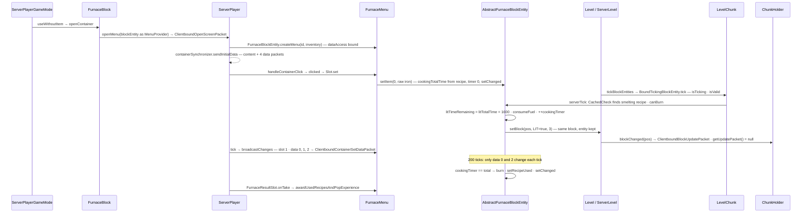

# Block entities

> Verified against **Minecraft 26.2** · Part V · A furnace smelts raw iron: where the per-position state lives, who ticks it, and why the client learns about the fire from a block state and the arrow from a menu — never from the block entity itself.

## Responsibility

A block state is one of a fixed table; a block entity is what a position
gets when it needs *more* — an inventory, a timer, a text, an owner. It
is a plain object owned by its chunk, keyed by position, created by the
block when the block is placed and removed when the block goes. Some
tick, on one side or both. Some tell the client about themselves; most
do not. This page follows the most familiar one — the furnace — through
its menu, its tick, its save and its removal, and uses it to show what
the base class does and does not do.

The one sentence a player recognises: *a furnace keeps smelting while
you're not looking at it, but you only see the arrow move when the screen
is open.*

## The data it owns

- **`BlockEntity`** holds `BlockEntity.type` (a `BlockEntityType`),
  `BlockEntity.worldPosition` (immutable), `BlockEntity.level` (null until
  the chunk adopts it), `BlockEntity.blockState` (a cached copy, refreshed
  by `BlockEntity.setBlockState`), the `BlockEntity.remove` flag
  (`BlockEntity.isRemoved`, `BlockEntity.setRemoved`, `BlockEntity.clearRemoved`)
  and `BlockEntity.components`, the item components carried over from
  the placing stack that the subclass did not claim. The constructor
  throws if `BlockEntity.isValidBlockState` fails.
- **Saving** is layered: `BlockEntity.saveAdditional` (the subclass hook)
  → `BlockEntity.saveCustomOnly` (just that) → `BlockEntity.saveWithoutMetadata`
  (plus *components*) → `BlockEntity.saveWithId` (plus *id*) →
  `BlockEntity.saveWithFullMetadata` (plus *x*, *y*, *z* — the chunk-save
  form). Loading mirrors it: `BlockEntity.loadAdditional` under
  `BlockEntity.loadWithComponents` or `BlockEntity.loadCustomOnly`, and the
  static `BlockEntity.loadStatic` reads *id* through `BlockEntity.TYPE_CODEC`,
  calls `BlockEntityType.create` and loads — returning null, with a log
  line, on any failure. Everything goes through `ValueInput` / `ValueOutput`
  ([foundations: NBT](../foundations/nbt.md)).
- **Syncing** is two hooks with weak defaults: `BlockEntity.getUpdateTag`
  returns an **empty tag** and `BlockEntity.getUpdatePacket` returns
  **null**. Nineteen of the 49 types override the packet — signs, banners,
  beacons, skulls, spawners, conduits, end gateways, structure and jigsaw
  blocks, campfires, decorated pots, vaults, shelves, brushable blocks,
  the creaking heart, copper golem statues, test blocks — and every one
  returns `ClientboundBlockEntityDataPacket.create` of itself.
  `PistonMovingBlockEntity` overrides the tag but not the packet.
- **Items ↔ block entities** is the components round trip:
  `BlockEntity.applyComponentsFromItemStack` → `BlockEntity.applyImplicitComponents`
  (the subclass pulls what it understands; what is left becomes
  `BlockEntity.components`), and back through `BlockEntity.collectComponents`
  → `BlockEntity.collectImplicitComponents`; `BlockEntity.removeComponentsFromTag`
  drops the NBT keys that are now components. The raw escape hatch is
  `DataComponents.BLOCK_ENTITY_DATA`, a `TypedEntityData` applied by
  `BlockItem.updateCustomBlockEntityTag` and refused for the six
  `BlockEntityTypes.OP_ONLY_CUSTOM_DATA` types unless
  `Player.canUseGameMasterBlocks`.
- **`BlockEntityType`** is almost nothing: a `BlockEntityType.factory`
  (`BlockEntityType.BlockEntitySupplier`) and `BlockEntityType.validBlocks`,
  a set of blocks; `BlockEntityType.isValid` is a set lookup on the block,
  `BlockEntityType.create` calls the factory, `BlockEntityType.getBlockEntity`
  is the typed read. `BlockEntityTypes.register` builds them into
  `BuiltInRegistries.BLOCK_ENTITY_TYPE` from keys in `BlockEntityTypeIds`;
  **49** in 26.2, including `BlockEntityTypes.SHELF`,
  `BlockEntityTypes.COPPER_GOLEM_STATUE` and `BlockEntityTypes.CREAKING_HEART`.
  There is no builder and no *getKey* — the name is the registry holder's.
- **The block's side** is `EntityBlock`: `EntityBlock.newBlockEntity` (the
  factory the chunk actually calls — not `BlockEntityType.create`),
  `EntityBlock.getTicker` (per level, so a block chooses client, server,
  both or neither) and `EntityBlock.getListener` for game events.
  `BaseEntityBlock` adds `BaseEntityBlock.triggerEvent` (block events →
  `BlockEntity.triggerEvent`), `BaseEntityBlock.getMenuProvider` and
  `BaseEntityBlock.createTickerHelper`, the type-equality guard around a
  ticker. `BlockBehaviour.BlockStateBase.hasBlockEntity` is literally
  *is the block an `EntityBlock`*; `BlockBehaviour.BlockStateBase.shouldChangedStateKeepBlockEntity`
  lets a block keep its entity across a block change.
- **The chunk** owns the map: `ChunkAccess.blockEntities` (position →
  entity), `ChunkAccess.pendingBlockEntities` (position → NBT not yet
  instantiated; `ChunkAccess.setBlockEntityNbt`), and on `LevelChunk`
  the tick side: `LevelChunk.tickersInLevel`, a map of
  `LevelChunk.RebindableTickingBlockEntityWrapper`s — a mutable
  indirection around a `LevelChunk.BoundTickingBlockEntity` — and
  `LevelChunk.NULL_TICKER`, whose `TickingBlockEntity.isRemoved` is true.
  `LevelChunk.getBlockEntity` takes a `LevelChunk.EntityCreationType`:
  `LevelChunk.EntityCreationType.IMMEDIATE` creates on read if the state
  has one, `LevelChunk.EntityCreationType.CHECK` does not, and
  `LevelChunk.EntityCreationType.QUEUED` is referenced by nothing.
- **The level** owns the tick list: `Level.blockEntityTickers` (of
  `TickingBlockEntity`), `Level.pendingBlockEntityTickers` for additions
  during iteration, and the `Level.tickingBlockEntities` re-entrancy flag.
- **The furnace:** `AbstractFurnaceBlockEntity` (parent of
  `FurnaceBlockEntity`, `BlastFurnaceBlockEntity`, `SmokerBlockEntity`)
  keeps three `AbstractFurnaceBlockEntity.items` (`AbstractFurnaceBlockEntity.SLOT_INPUT`,
  `AbstractFurnaceBlockEntity.SLOT_FUEL`, `AbstractFurnaceBlockEntity.SLOT_RESULT`),
  four ints — `AbstractFurnaceBlockEntity.litTimeRemaining`,
  `AbstractFurnaceBlockEntity.litTotalTime`, `AbstractFurnaceBlockEntity.cookingTimer`,
  `AbstractFurnaceBlockEntity.cookingTotalTime` — exposed to menus as a
  `ContainerData` of `AbstractFurnaceBlockEntity.NUM_DATA_VALUES` (4)
  through `AbstractFurnaceBlockEntity.dataAccess`, a
  `AbstractFurnaceBlockEntity.recipesUsed` counter map, and a
  `AbstractFurnaceBlockEntity.quickCheck` (`RecipeManager.CachedCheck`,
  which retries the last matching recipe before scanning). Its parent
  `BaseContainerBlockEntity` adds `BaseContainerBlockEntity.lockKey`
  (`LockCode`) and `BaseContainerBlockEntity.name`, and maps
  `DataComponents.CONTAINER`, `DataComponents.LOCK` and
  `DataComponents.CUSTOM_NAME` as implicit components. Constants:
  `AbstractFurnaceBlockEntity.BURN_TIME_STANDARD` (200) and
  `AbstractFurnaceBlockEntity.BURN_COOL_SPEED` (2, the decay while unlit).
  Fuel comes from `FuelValues`, held by `MinecraftServer.fuelValues` and
  read through `Level.fuelValues`.

## When it runs

**Server:** `ServerLevel.tick` runs `Level.tickBlockEntities` under the
*blockEntities* profiler section, after entities. **Client:**
`Minecraft.tick` calls the same `Level.tickBlockEntities` on the
`ClientLevel` after `Minecraft.tick`'s entity pass — `ClientLevel.tick`
itself does not. Each entry is a `LevelChunk.BoundTickingBlockEntity`:
skip if removed; `LevelChunk.isTicking` (inside the border, and on the
server the chunk is at least `FullChunkStatus.BLOCK_TICKING` with
`ServerLevel.areEntitiesLoaded`); profiler zone named by the type;
re-read the live state; tick only if `BlockEntityType.isValid` still
holds; crash reports wrap the rest.

Registration follows the chunk's life. `LevelChunk.setBlockState` creates
the entity (`EntityBlock.newBlockEntity` →
`LevelChunk.addAndRegisterBlockEntity`) after `BlockBehaviour.BlockStateBase.onPlace`,
and removes it (`BlockEntity.preRemoveSideEffects` unless
`Block.UPDATE_SKIP_BLOCK_ENTITY_SIDEEFFECTS`, then `LevelChunk.removeBlockEntity`)
when the *block* changes — a state change on the same block keeps it and
only calls `BlockEntity.setBlockState` + `LevelChunk.updateBlockEntityTicker`.
`ChunkStatusTasks` marks the chunk `LevelChunk.setLoaded` and calls
`LevelChunk.registerAllBlockEntitiesAfterLevelLoad` when it becomes full
([tickets and loading](../world/tickets-and-loading.md)); `ServerLevel.unload`
→ `LevelChunk.clearAllBlockEntities`. Removal never searches the level's
list: `LevelChunk.removeBlockEntityTicker` rebinds the wrapper to
`LevelChunk.NULL_TICKER` and `Level.tickBlockEntities` evicts it on its
next pass.

## The trace: a furnace smelts

1. **Opening.** `ServerPlayerGameMode.useItemOn` →
   `BlockBehaviour.BlockStateBase.useWithoutItem` → `AbstractFurnaceBlock.useWithoutItem`
   → on the server `FurnaceBlock.openContainer`: `Level.getBlockEntity`
   (which is `LevelChunk.getBlockEntity` in immediate mode, and on the
   server **returns null off the main thread**), then `ServerPlayer.openMenu`
   with the block entity as the `MenuProvider`: `ServerPlayer.nextContainerCounter`,
   `BaseContainerBlockEntity.createMenu` (a `LockCode.canUnlock` check)
   → `FurnaceBlockEntity.createMenu` → a `FurnaceMenu` over the entity's
   container and `AbstractFurnaceBlockEntity.dataAccess`; a
   `ClientboundOpenScreenPacket`; `ServerPlayer.initMenu` attaches
   `ServerPlayer.containerListener` and `ServerPlayer.containerSynchronizer`,
   whose `ContainerSynchronizer.sendInitialData` sends
   `ClientboundContainerSetContentPacket` plus one
   `ClientboundContainerSetDataPacket` per data slot. The client builds
   its own `FurnaceMenu` over a `SimpleContainer` and a `SimpleContainerData`
   and opens `FurnaceScreen` via `MenuScreens.create`. `Player.awardStat`
   `Stats.INTERACT_WITH_FURNACE`. Both sides return `InteractionResult.SUCCESS`
   ([block interaction](block-interaction.md)).
2. **Loading it.** Each click is a `ServerboundContainerClickPacket` →
   `ServerGamePacketListenerImpl.handleContainerClick` →
   `AbstractContainerMenu.clicked`. `FurnaceFuelSlot.mayPlace` asks
   `AbstractFurnaceMenu.isFuel` → `FuelValues.isFuel`. Slot writes reach
   `AbstractFurnaceBlockEntity.setItem`, which for the input slot with a
   different item recomputes `AbstractFurnaceBlockEntity.cookingTotalTime`
   from the recipe (`AbstractFurnaceBlockEntity.getTotalCookTime`), zeroes
   `AbstractFurnaceBlockEntity.cookingTimer` and calls `BlockEntity.setChanged`
   → `Level.blockEntityChanged` → `LevelChunk.markUnsaved`, and
   `Level.updateNeighbourForOutputSignal` for comparators. Nothing is
   sent for that; the menu's `AbstractContainerMenu.broadcastChanges`
   reconciles slots by hash (`RemoteSlot.Synchronized`) and sends
   `ClientboundContainerSetSlotPacket` only for what differs.
3. **The tick.** `Level.tickBlockEntities` reaches the furnace's wrapper →
   `LevelChunk.BoundTickingBlockEntity.tick` → the ticker
   `AbstractFurnaceBlock.createFurnaceTicker` handed out — **only when the
   level is a `ServerLevel`**; the client gets null — →
   `AbstractFurnaceBlockEntity.serverTick`. Not lit; has input and fuel;
   `RecipeManager.CachedCheck.getRecipeFor` with a `SingleRecipeInput`
   finds the `SmeltingRecipe` (an `AbstractCookingRecipe` — `RecipeType.SMELTING`;
   `AbstractCookingRecipe.cookingTime` 200 by default);
   `AbstractFurnaceBlockEntity.canBurn` says the result slot can take
   the ingot. So: `AbstractFurnaceBlockEntity.getBurnDuration` →
   `FuelValues.burnDuration` (coal, 1600), both lit fields set,
   `AbstractFurnaceBlockEntity.consumeFuel` (which also handles
   `Item.getCraftingRemainder` — a lava bucket leaves a bucket), and the
   timer advances to 1.
4. **The fire is a block state.** Lit-ness changed →
   `Level.setBlock` of `AbstractFurnaceBlock.LIT` true with `Block.UPDATE_ALL`.
   `LevelChunk.setBlockState` sees the same block: the entity is kept,
   `BlockEntity.setBlockState` refreshes its cached state,
   `LevelChunk.updateBlockEntityTicker` re-asks for a ticker and rebinds
   the wrapper. Then `ServerLevel.sendBlockUpdated` → `ServerChunkCache.blockChanged`
   → `ChunkHolder.blockChanged`; flag 1 → neighbours, and since
   `AbstractFurnaceBlock.hasAnalogOutputSignal`, `Level.updateNeighbourForOutputSignal`.
   `BlockEntity.setChanged` marks the chunk. Later in the tick,
   `ChunkHolder.broadcastChanges` sends the `ClientboundBlockUpdatePacket`
   and then `ChunkHolder.broadcastBlockEntityIfNeeded` →
   `ChunkHolder.broadcastBlockEntity` → `BlockEntity.getUpdatePacket` →
   **null**. That is the only place the game ever calls `BlockEntity.getUpdatePacket`.
   The client applies the state with `ClientLevel.setServerVerifiedBlockState`,
   keeps its bare client-side `FurnaceBlockEntity`, and
   `FurnaceBlock.animateTick` starts the smoke, flames and crackle.
5. **The arrow is menu data.** Same tick, `ServerPlayer.tick` →
   `AbstractContainerMenu.broadcastChanges`: the coal slot changed →
   `ClientboundContainerSetSlotPacket`; data slots 0, 1 and 2 differ from
   `AbstractContainerMenu.remoteDataSlots` → three
   `ClientboundContainerSetDataPacket`s via `ContainerSynchronizer.sendDataChange`.
   The client's `ClientPacketListener.handleContainerSetData` →
   `AbstractContainerMenu.setData`; `AbstractFurnaceScreen` draws
   the flame from `AbstractFurnaceMenu.getLitProgress` (data 0 over 1)
   and the arrow from `AbstractFurnaceMenu.getBurnProgress` (data 2 over
   3). From then on two packets a tick per viewer; no viewer, no packets,
   and the furnace ticks regardless.
6. **Two hundred ticks.** Each tick decrements `AbstractFurnaceBlockEntity.litTimeRemaining`,
   re-finds the recipe through the cache and increments the timer;
   nothing else changes, so no `BlockEntity.setChanged`, no block write.
7. **The ingot.** Timer equals total → reset, `AbstractFurnaceBlockEntity.burn`
   (result slot grows, input shrinks; a wet sponge fills an empty bucket
   in the fuel slot), `AbstractFurnaceBlockEntity.setRecipeUsed` counts the
   recipe, `BlockEntity.setChanged`. Taking it out runs
   `FurnaceResultSlot.onTake` → `AbstractFurnaceBlockEntity.awardUsedRecipesAndPopExperience`
   → `AbstractFurnaceBlockEntity.getRecipesToAwardAndPopExperience`
   (`ExperienceOrb.award` at the *player*, from `AbstractCookingRecipe.experience`)
   → `ServerPlayer.awardRecipes` and `ServerPlayer.triggerRecipeCrafted`.
   When the fuel runs out, lit-ness flips back and step 4 repeats with
   `AbstractFurnaceBlock.LIT` false.
8. **Breaking it.** `Level.setBlock` to air: `LevelChunk.setBlockState`
   sees the block change → `AbstractFurnaceBlockEntity.preRemoveSideEffects`:
   the base `BlockEntity.preRemoveSideEffects` drops the three slots
   (`Containers.dropContents`), then the XP for un-collected smelts pops
   at the block — no recipes are awarded to anyone. `LevelChunk.removeBlockEntity`
   sets the removed flag, rebinds the ticker to `LevelChunk.NULL_TICKER`,
   drops the game-event listener. `AbstractFurnaceBlock.affectNeighborsAfterRemoval`
   → `Containers.updateNeighboursAfterDestroy` refreshes comparators. An
   open menu fails `Container.stillValidBlockEntity` (same entity, within
   `Container.DEFAULT_DISTANCE_BUFFER` of 4.0) and `ServerPlayer.tick`
   closes it.
9. **Saving and sending.** `SerializableChunkData.copyOf` →
   `LevelChunk.getBlockEntityNbtForSaving` → `BlockEntity.saveWithFullMetadata`
   into the chunk's *block_entities* list (keys *lit_time_remaining*,
   *lit_total_time*, *cooking_time_spent*, *cooking_total_time*, *Items*,
   *RecipesUsed*); a pending tag is copied with *keepPacked* true
   ([chunk storage](../world/chunk-storage.md)). When a chunk is sent,
   `ClientboundLevelChunkPacketData` calls `BlockEntity.getUpdateTag` per
   entity — empty for a furnace, stored as null — and the client's
   `LevelChunk.replaceWithPacketData` creates a bare entity of the right
   type at the right position. The client never learns the contents
   except through an open menu.

## Interfaces

- **Called by:** `Level.tickBlockEntities` (`ServerLevel.tick`,
  `Minecraft.tick`); `LevelChunk.setBlockState` for the lifecycle;
  `ChunkHolder.broadcastBlockEntity` for sync; `ClientboundLevelChunkPacketData`
  for chunk sends; `BlockItem.place` → `BlockItem.updateCustomBlockEntityTag`
  and `BlockItem.updateBlockEntityComponents` for placed items;
  `Block.dropResources` passes the entity as `LootContextParams.BLOCK_ENTITY`
  ([block breaking](block-breaking.md)); `BaseEntityBlock.triggerEvent`
  for block events ([redstone](redstone.md)).
- **Calls into:** `Level.setBlock` (a block entity that wants the world
  to know changes a *block state*); `Level.blockEntityChanged` →
  `LevelChunk.markUnsaved`; `Level.updateNeighbourForOutputSignal`;
  `RecipeManager` (`ServerLevel.recipeAccess`; Part VII); `FuelValues`;
  `ServerPlayer.openMenu` and `AbstractContainerMenu.broadcastChanges`
  (Part VII owns menus); `BlockEntityRenderDispatcher` on the client
  (Part X — `ClientLevel.onBlockEntityAdded` registers globally rendered
  ones).
- **Crosses the network as:** `ClientboundBlockEntityDataPacket` (only
  the nineteen; pos, type, tag); the block entity's *type and position*
  inside `ClientboundLevelChunkWithLightPacket`, with the update tag if
  non-empty; otherwise only consequences — `ClientboundBlockUpdatePacket`
  for a state flip, `ClientboundOpenScreenPacket`,
  `ClientboundContainerSetContentPacket`, `ClientboundContainerSetSlotPacket`,
  `ClientboundContainerSetDataPacket` for a menu; `ServerboundContainerClickPacket`
  the other way.
- **Data-driven by:** `Registries.BLOCK_ENTITY_TYPE` (static);
  `RecipeType.SMELTING` recipes (`SmeltingRecipe.SERIALIZER`, fields
  *ingredient*, *result*, *experience*, *cookingtime*);
  `RecipePropertySet.FURNACE_INPUT`, sent in `ClientboundUpdateRecipesPacket`
  so `AbstractFurnaceMenu.canSmelt` can route shift-clicks without a
  recipe lookup; **fuel values are code** — `FuelValues.vanillaBurnTimes`
  is a `FuelValues.Builder` chain over item tags (`ItemTags.LOGS`,
  `ItemTags.PLANKS`, `ItemTags.WOOL` … minus `ItemTags.NON_FLAMMABLE_WOOD`),
  so a data pack can change membership but not durations; rebuilt on
  `MinecraftServer.reloadResources`, and the client builds its own copy
  in `ClientPacketListener.fuelValues`. Components: `DataComponents.CONTAINER`,
  `DataComponents.LOCK`, `DataComponents.CUSTOM_NAME`,
  `DataComponents.BLOCK_ENTITY_DATA`; `DataComponents.CONTAINER_LOOT` is
  `RandomizableContainerBlockEntity`'s, not the furnace's.

## Invariants and surprises

- **The furnace never sends its NBT.** The flame in the world is
  `AbstractFurnaceBlock.LIT`; the flame and arrow in the GUI are four
  ints from `ServerPlayer.containerSynchronizer`. Only nineteen types
  override `BlockEntity.getUpdatePacket`, and all of them just wrap
  `BlockEntity.getUpdateTag` in a `ClientboundBlockEntityDataPacket`.
- **`BlockEntity.setChanged` sends nothing.** `BlockEntity.setChanged` marks the
  chunk unsaved and pokes comparators. `BlockEntity.getUpdatePacket` is
  called from exactly one place, `ChunkHolder.broadcastBlockEntity`, and
  only for positions whose *block state* changed that tick. A sign edit
  reaches clients because `SignBlockEntity` triggers a block update.
- **The client never ticks a furnace**, and the client's block-entity
  tick is in `Minecraft.tick`, not `ClientLevel.tick`. What ticks on the
  client is animation: `ChestBlockEntity.lidAnimateTick` (client only —
  `ChestBlock.getTicker` returns null on the server),
  `BellBlockEntity.clientTick`, conduits, ender chests, spawners.
- **`Level.getBlockEntity` returns null off-thread on the server**,
  silently, and in immediate mode `LevelChunk.getBlockEntity` *creates* a
  missing entity on read.
- **The tick list is never searched.** Removal rebinds the chunk's
  wrapper to `LevelChunk.NULL_TICKER`; `Level.tickBlockEntities` evicts
  lazily; tickers registered during the pass wait in
  `Level.pendingBlockEntityTickers`.
- **Breaking a furnace pops XP but awards no recipes** (at the block,
  in `AbstractFurnaceBlockEntity.preRemoveSideEffects`); taking the ingot
  does both, at the player. `RecipeCraftingHolder` is a counter map here
  — `AbstractFurnaceBlockEntity.getRecipeUsed` returns null.
- **Changing the input resets progress; changing the state does not
  recreate the entity.** `AbstractFurnaceBlockEntity.setItem` zeroes the
  timer on a different input item; `LevelChunk.setBlockState` removes an
  entity only when the *block* changes.
- **`BlockEntityType.isValid` runs every tick** against the live chunk
  state, in `LevelChunk.BoundTickingBlockEntity.tick`; a mismatch logs
  once and stops ticking.
- **Drops on removal are the base class's doing**, not the block's:
  `BlockEntity.preRemoveSideEffects` calls `Containers.dropContents` for
  any `Container`; `BlockBehaviour.affectNeighborsAfterRemoval` is for
  neighbours, and there is no *onRemove*. `Block.UPDATE_SKIP_BLOCK_ENTITY_SIDEEFFECTS`
  (256, part of `Block.UPDATE_NONE`) exists to suppress exactly that.
- **There is no *saveToItem***; the item side is
  `BlockItem.setBlockEntityData` plus `BlockEntity.collectComponents`.

## Where to look

`BlockEntity.saveWithFullMetadata` · `BlockEntity.loadStatic` · `BlockEntity.setChanged` ·
`BlockEntity.getUpdateTag` · `BlockEntity.getUpdatePacket` · `BlockEntity.preRemoveSideEffects` ·
`BlockEntity.applyComponentsFromItemStack` · `BlockEntityType.isValid` ·
`BlockEntityTypes.register` · `EntityBlock.newBlockEntity` · `EntityBlock.getTicker` ·
`BaseEntityBlock.createTickerHelper` · `LevelChunk.setBlockState` ·
`LevelChunk.addAndRegisterBlockEntity` · `LevelChunk.getBlockEntity` ·
`LevelChunk.updateBlockEntityTicker` · `LevelChunk.BoundTickingBlockEntity` ·
`LevelChunk.promotePendingBlockEntity` · `LevelChunk.getBlockEntityNbtForSaving` ·
`Level.tickBlockEntities` · `Level.getBlockEntity` · `ChunkHolder.broadcastBlockEntity` ·
`ClientboundLevelChunkPacketData` · `AbstractFurnaceBlockEntity.serverTick` ·
`AbstractFurnaceBlockEntity.setItem` · `AbstractFurnaceBlock.createFurnaceTicker` ·
`BaseContainerBlockEntity` · `ServerPlayer.openMenu` · `AbstractContainerMenu.broadcastChanges` ·
`FuelValues.vanillaBurnTimes`

---

*Rules: names, never code · how the system works, not how the code reads ·
newest version only · every backticked name passes `tools/verify_names.py`.*
