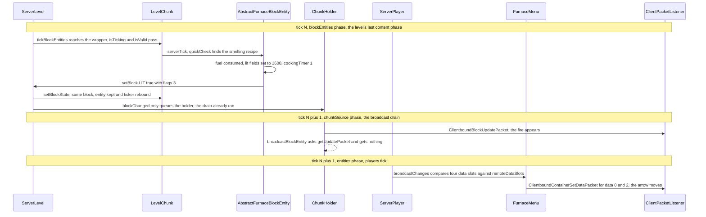

# Block entities

> Verified against **Minecraft 26.2** · Part V · A furnace smelts raw iron while nobody is watching, and the player who opens it learns the fire from a block state and the arrow from a menu — never from the block entity itself.

You drop raw iron in the top slot of a furnace, coal in the bottom, and walk
away. Two hundred ticks later there is an iron ingot in a box nobody is
looking at. A block state is one of a fixed table, shared by every position
that has it, so the moment a position needs something of its own — an
inventory, a timer, a name — it gets a `BlockEntity`: a plain object owned by
its chunk, keyed by its position, created by the block and destroyed with it.
The surprise is how little that object says for itself. A furnace tells
nobody anything: `BlockEntity.getUpdatePacket` returns null for it,
`BlockEntity.setChanged` sends nothing at all, and the two things a player
*does* see — the fire in the world and the arrow in the GUI — are a block
state and four ints from a menu, both of which arrive on the tick **after**
the smelting step that produced them, because block entities tick in the
level's last content phase, after the broadcast has already gone out.

## The cast

| class | what it decides | thread |
|---|---|---|
| `BlockEntity` | the position, the cached state, the components, and the four defaults every subclass inherits — two of which are *say nothing* | whichever thread owns the level |
| `BlockEntityType` | which blocks the entity is legal on, and what constructs it | immutable once the registry is built |
| `EntityBlock` | whether a block has an entity at all, which one, and which ticker *per level* | — |
| `LevelChunk` | the position-to-entity map, the ticker wrapper per position, and create / keep / replace / remove on every write | the chunk's owning thread |
| `Level` | the flat list of tickers and the two gates over it | server thread, or the client's main thread |
| `AbstractFurnaceBlockEntity` | three slots, four ints, a cached recipe check, and when the block's *lit* state has to change | server thread only — its ticker is null on the client |
| `ChunkHolder` | which positions changed since the last drain, and the single call to `BlockEntity.getUpdatePacket` | server thread, chunk-source phase |
| `FurnaceMenu` | what an open screen is allowed to see of all that: three slots and four ints | server thread, mirrored on the client |

## A furnace tells nobody anything

`BlockEntity` has four hooks a subclass is expected to fill in, and its own
answers to all four are deliberately weak. `BlockEntity.saveAdditional` and
`BlockEntity.loadAdditional` do nothing. `BlockEntity.getUpdateTag` returns
an empty tag. `BlockEntity.getUpdatePacket` returns **null** — the base class
declines to be synced, and a subclass that wants to be must say so.

**Nineteen** classes say so, and every one of them answers with
`ClientboundBlockEntityDataPacket.create` of itself: signs, banners, beacons,
skulls, spawners and trial spawners, conduits, end gateways, structure and
jigsaw blocks, campfires, decorated pots, vaults, shelves, brushable blocks,
creaking hearts, copper golem statues and the two test blocks. Counting those
declarations in the decompile and mapping each class onto the **49**
registrations in `BlockEntityTypes` gives **twenty** synced types out of
forty-nine, because `HangingSignBlockEntity` is a type of its own that
inherits `SignBlockEntity`'s override and adds nothing.

The overriders of the packet and the overriders of the tag are not the same
list, and the two classes that differ are instructive.
`PistonMovingBlockEntity` overrides `BlockEntity.getUpdateTag` but not the
packet, so its state travels only in a chunk send
([pistons and block events](pistons-and-block-events.md)).
`CopperGolemStatueBlockEntity` overrides the packet but not the tag, so what
it broadcasts is the base class's empty tag.

Everything else a client knows about a block entity it knows by consequence:
the block state it can see, and a menu it has been given. That is the whole
of the interface, and the trace below is what it costs.

## One save hook, four ways out

Saving is a tree, not a chain, and the branch a caller picks decides how much
metadata rides along. Only `BlockEntity.saveAdditional` belongs to the
subclass; everything else is bookkeeping the base class adds.

| what runs | what it writes | who calls it |
|---|---|---|
| `BlockEntity.saveAdditional` | the subclass's own fields, and nothing else | nobody directly |
| `BlockEntity.saveCustomOnly` | that alone | the pick-block path, which then strips the keys that are now components |
| `BlockEntity.saveWithoutMetadata` | that plus *components* | the two below |
| `BlockEntity.saveWithId` | that plus *id* | callers that already know the position |
| `BlockEntity.saveWithFullMetadata` | that plus *id*, *x*, *y* and *z* | `LevelChunk.getBlockEntityNbtForSaving`, the chunk-save form |

Reading back is `BlockEntity.loadWithComponents` (fields plus components) or
`BlockEntity.loadCustomOnly` (fields only) over a `ValueInput`
([codecs, NBT and JSON](../foundations/codecs-nbt-json.md)) — but something
has to decide *which class* to construct first, and that cannot come through
a `ValueInput`, because no entity exists yet to own one. So
`BlockEntity.loadStatic` reads *id* off the raw `CompoundTag` with
`BlockEntity.TYPE_CODEC`, calls `BlockEntityType.create`, and only then wraps
the same tag in a `ValueInput` and loads it. Any of those three steps failing
logs and returns null, and the position ends up with no entity at all.

The network reuses that path exactly:
`ClientPacketListener.handleBlockEntityData` finds the entity by position
*and* type and hands the tag to `BlockEntity.loadWithComponents`. There is no
separate network deserialiser. Where the chunk's *block_entities* list is
written and read is [chunk storage](../world/chunk-storage.md).

## Create, keep, replace, remove

Every block entity in the game is created and destroyed inside one method:
`LevelChunk.setBlockState`, after the section write, the heightmaps and the
light checks ([what a write
does](blocks-and-states.md#the-two-update-channels)). It makes two
decisions, in this order.

**Removal** happens only when the *block* changed, the old state had an
entity, and the new state does not claim it through
`BlockBehaviour.BlockStateBase.shouldChangedStateKeepBlockEntity` — which
exactly two blocks in 26.2 override, `CopperChestBlock` and
`CopperGolemStatueBlock`, both keeping the entity when the old state was
another block of the same family, so oxidising or waxing a copper chest does
not empty it. Removal is two halves with different gates. The side effects —
`BlockEntity.preRemoveSideEffects`, which for anything implementing
`Container` drops the contents through `Containers.dropContents` — run **only
on the server** and only with `Block.UPDATE_SKIP_BLOCK_ENTITY_SIDEEFFECTS`
clear. The bookkeeping, `LevelChunk.removeBlockEntity`, runs regardless: the
map entry goes, the game-event listener is unregistered (server only), the
entity is flagged removed, and its ticker is rebound to
`LevelChunk.NULL_TICKER`.

**Creation** happens after `BlockBehaviour.BlockStateBase.onPlace`, and only
if the state actually written still has a block entity. The chunk looks for
an existing one without creating it, and if what it finds does not pass
`BlockEntity.isValidBlockState` for the new state it logs a *mismatched block
entity* warning, removes it and builds a fresh one from
`EntityBlock.newBlockEntity` — the block's own factory, not
`BlockEntityType.create`. Only a surviving match is kept, with its cached
state refreshed and `LevelChunk.updateBlockEntityTicker` re-asking the block
for a ticker. That is why flipping a furnace's *lit* property costs nothing:
same block, valid state, same object.

Chunk load and unload use the ends of the same machinery.
`ChunkStatusTasks.full` runs `LevelChunk.runPostLoad` to turn the saved tags
into entities, then `LevelChunk.setLoaded` and
`LevelChunk.registerAllBlockEntitiesAfterLevelLoad`, which attaches listeners
and tickers to entities built before the chunk belonged to a level.
`ServerLevel.unload` calls `LevelChunk.clearAllBlockEntities`: every entity
flagged removed, every ticker pointed at `LevelChunk.NULL_TICKER`.

## Two hundred ticks nobody watches

The furnace's ticker is handed out by `AbstractFurnaceBlock.createFurnaceTicker`
**only when the level is a `ServerLevel`** — on the client it is null, so no
furnace anywhere ever ticks there. `AbstractFurnaceBlockEntity.serverTick` is
therefore the whole of smelting: burn down
`AbstractFurnaceBlockEntity.litTimeRemaining`, ask
`AbstractFurnaceBlockEntity.quickCheck` (a `RecipeManager.CachedCheck`, which
retries last tick's match before scanning the type) for a recipe on the input
slot, check that the result slot can take the output, and, if the fire is out
but fuel is present, light it: both lit fields take `FuelValues.burnDuration`
for that item — 1600 for coal — and one fuel item is consumed. Then
`AbstractFurnaceBlockEntity.cookingTimer` advances by one. Where the recipe
comes from is [recipes](../items/recipes.md).

Two writes leave the block entity, and neither leaves the server this tick.
The first is the fire: lit-ness is a *block state*, so the ticker calls
`Level.setBlock` on its own position with `AbstractFurnaceBlock.LIT` flipped.
`ServerChunkCache.blockChanged` marks the holder dirty — and the drain that
turns dirty holders into packets, `ServerChunkCache.broadcastChangedChunks`,
lives in the chunk-source phase, which ran before entities and long before
block entities. The second is progress: `BlockEntity.setChanged` marks the
chunk unsaved and pokes comparators through
`Level.updateNeighbourForOutputSignal`, and that is all it does. It sends
nothing.

So a viewer sees both a tick late, by two different routes. Next tick's drain
sends the `ClientboundBlockUpdatePacket` and then — for every broadcast
position whose state has a block entity, including each position inside a
`ClientboundSectionBlocksUpdatePacket` — calls `BlockEntity.getUpdatePacket`,
the only call site in the game, and gets null from the furnace. Next tick's
entity phase runs `ServerPlayer.tick`, which runs
`AbstractContainerMenu.broadcastChanges`, which compares the menu's four data
slots against the values last sent and emits a
`ClientboundContainerSetDataPacket` per difference. Those four ints are the
furnace's entire GUI: the flame is data 0 over data 1 and the arrow data 2
over data 3, read by `AbstractFurnaceMenu.getLitProgress` and
`AbstractFurnaceMenu.getBurnProgress`. While smelting, only 0 and 2 change,
so it is two packets a tick per open screen and none at all with no viewer.
How a menu is opened, synchronised and closed is
[containers and menus](../items/containers-and-menus.md).

At the end, `AbstractFurnaceBlockEntity.burn` moves the ingot into the result
slot and `AbstractFurnaceBlockEntity.setRecipeUsed` adds one to a counter map
— not to a recipe object, which is why
`AbstractFurnaceBlockEntity.getRecipeUsed` returns null. The experience is
paid out on collection: `FurnaceResultSlot.checkTakeAchievements`, reached
from a take *or* a shift-click, calls
`AbstractFurnaceBlockEntity.awardUsedRecipesAndPopExperience`, which pops the
orbs at the player and unlocks the recipes.

## Loaded is not enough to tick

`Level.tickBlockEntities` walks one flat list, `Level.blockEntityTickers`,
under two gates the tickers themselves never see.
`TickRateManager.runsNormally` is the first, so `/tick freeze` stops every
block entity in the game. `Level.shouldTickBlocksAt` is the second, and it is
where the interesting asymmetry lives: on `Level` it is always true, on
`ServerLevel` it is `DistanceManager.inBlockTickingRange` — the
**simulation** chunk tracker, not the loading one. A chunk your view distance
keeps loaded and your simulation distance does not reach holds furnaces that
do not smelt, and nothing about the block entity records this: it is simply
never called. Below the gates,
`LevelChunk.BoundTickingBlockEntity` adds its own — not removed, adopted by a
level, inside the world border, chunk at `FullChunkStatus.BLOCK_TICKING` with
its entities loaded — then re-reads the live state and ticks only while
`BlockEntityType.isValid` still holds, logging once and skipping while it
does not.

The list is never searched. Removal rebinds the chunk's
`LevelChunk.RebindableTickingBlockEntityWrapper` to `LevelChunk.NULL_TICKER`,
whose `TickingBlockEntity.isRemoved` is permanently true, and the next pass of
`Level.tickBlockEntities` drops it on the way past — an O(1) removal from a
list that is walked every tick anyway. Additions made *during* the walk go to
`Level.pendingBlockEntityTickers` and are folded in at the top of the next
pass, so a block entity created by another block entity's tick starts ticking
one tick later. The client runs the same method from `Minecraft.tick`, after
its entity pass and before `ClientLevel.tick`, and only while unpaused.

## Questions players ask

**Why does my furnace stop smelting when I walk away, even though the chunk
is still loaded?** Because loading and simulating are two different
distances, and `Level.shouldTickBlocksAt` asks about the second. The chunk is
in memory, its entity is in the map and its ticker is in the list — and
`Level.tickBlockEntities` walks past it every tick without calling it.

**Why doesn't the client know what is in a chest until I open it?**
`ChestBlockEntity` overrides neither sync hook, so a chunk send carries its
type and position with no tag at all (an empty update tag is stored as null)
and the client builds its chest from the *block state* the packet's sections
already decoded, with an empty container inside. What ticks on the client is
animation only: `ChestBlock.getTicker` hands out
`ChestBlockEntity.lidAnimateTick` on the client and null on the server, the
exact mirror of the furnace.

**Why does a shulker box keep its contents when every other container drops
them?** Because dropping is the *base class's* behaviour, not the block's:
`BlockEntity.preRemoveSideEffects` drops the contents of anything that
implements `Container`. Eight classes override that hook, and
`ShulkerBoxBlockEntity` overrides it to do nothing whatever. The furnace
overrides it too, to pop the experience owed for uncollected smelts at the
block — awarding the recipes to nobody.

**Why does the arrow only move when the screen is open?** Because the arrow
is not a property of the furnace. It is data slot 2 of an
`AbstractContainerMenu` that exists only while a player has that screen open,
reconciled once per tick by the player who owns it. Close the screen and the
menu is gone, and the furnace goes on smelting with no packets at all.

## Where to look

`BlockEntity.getUpdatePacket` · `BlockEntity.setChanged` ·
`BlockEntity.loadStatic` · `BlockEntity.saveWithFullMetadata` ·
`BlockEntity.preRemoveSideEffects` · `BlockEntityType.isValid` ·
`EntityBlock.newBlockEntity` · `EntityBlock.getTicker` ·
`BaseEntityBlock.createTickerHelper` · `LevelChunk.setBlockState` ·
`LevelChunk.updateBlockEntityTicker` · `LevelChunk.BoundTickingBlockEntity` ·
`LevelChunk.NULL_TICKER` · `Level.tickBlockEntities` ·
`Level.shouldTickBlocksAt` · `ChunkHolder.broadcastBlockEntity` ·
`AbstractFurnaceBlockEntity.serverTick` · `AbstractFurnaceMenu.getBurnProgress`

How a block entity is *drawn* — and why a chest's block model is empty — is
[block-entity rendering](../rendering/block-entity-rendering.md), in Part XI.

---

*Rules: names, never code · how the system works, not how the code reads ·
newest version only · every backticked name passes `tools/verify_names.py`.*
