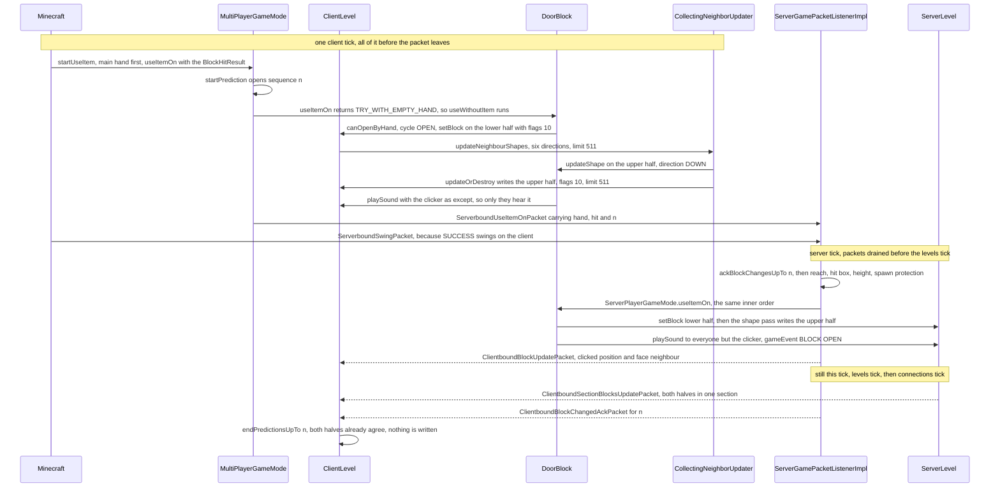

# Block interaction

> Verified against **Minecraft 26.2** · Part V · A player right-clicks the bottom half of an oak door, and the top half opens without a single neighbour update.

You are standing in front of a closed oak door, crosshair on its bottom half,
and you press the use key. Before the tick is over the door is open on your
screen, both halves of it, and a packet is on its way to a server that has
not yet been asked. The obvious guess about how the top half found out is
wrong. Opening a door fires **no neighbour updates at all** — `DoorBlock`
writes with flags 10, and the neighbour bit is not among them — and the top
half follows anyway, down the *shape* channel, which is the half of the
update machinery the client also runs. That is why a door feels instant on a
laggy server and a redstone lamp does not.

> **The contract both halves run under.** The client acts at once and remembers the state it overwrote, under a sequence number it sends with the action. The server's `ClientboundBlockChangedAckPacket` is a receipt for that number and *not* a verdict — it is sent for actions the server refused exactly as for actions it allowed — and correctness comes from ordering instead: any correction the server means to send travels in the same tick and earlier in the stream than the receipt. A correction *replaces* what the client remembered rather than being weighed against it, so when the receipt arrives the client writes back whatever the entry now holds — and only where that differs from what is on screen. [Prediction and acknowledgement](../client/prediction-and-acks.md) owns that machinery; this page and [block breaking](block-breaking.md) are its two applications.

## The cast

| class | what it decides | thread |
|---|---|---|
| `Minecraft` | that a use-key press becomes one `Minecraft.startUseItem`, and that the main hand is tried before the off hand | Render |
| `MultiPlayerGameMode` | the client's copy of the whole decision, wrapped in one prediction | Render |
| `InteractionResult` | whether the caller stops here, who swings, and what the hand ends up holding | a record, no thread |
| `BlockBehaviour.BlockStateBase` | which of the two block hooks a state answers with, and when its six neighbours are asked to re-fit | either side |
| `DoorBlock` | whether this door opens by hand, what it writes, and what the other half becomes | either side |
| `CollectingNeighborUpdater` | the order queued updates run in, and where a runaway cascade is cut | whichever thread wrote the block |
| `ServerGamePacketListenerImpl` | the gate list the packet must pass, and what each refusal answers with | Server |
| `ServerPlayerGameMode` | the same inner order as the client, plus the advancement triggers | Server |

## The whole click, both sides

## One press, one hand at a time

`Minecraft.handleKeybinds` runs from the client tick and only when no screen
and no overlay is open. Every queued press of the use key becomes its own
`Minecraft.startUseItem`, unthrottled; `Minecraft.rightClickDelay` gates the
held-down auto-repeat alone, and `Minecraft.startUseItem` is what sets it, to
four ticks, and only when `MultiPlayerGameMode.isDestroying` is false. A
player already using an item (drawing a bow, eating) never reaches that
branch at all: the queued presses are drained and discarded.

Inside, after `LocalPlayer.isHandsBusy`, the hands are tried in the order
`InteractionHand.MAIN_HAND` then `InteractionHand.OFF_HAND`. Each hand's
stack must pass `ItemStack.isItemEnabled` — a disabled item aborts the whole
loop, not just its own hand — and then, for a `BlockHitResult`, the hand goes
to `MultiPlayerGameMode.useItemOn`. A `InteractionResult.Success` or an
`InteractionResult.Fail` ends the loop; only an `InteractionResult.Pass`
falls through to `MultiPlayerGameMode.useItem` (right-click air,
`ServerboundUseItemPacket`) and then to the off hand. The door returns
success on the main hand, so the off hand is never asked.

`MultiPlayerGameMode.useItemOn` sends a `ServerboundSetCarriedItemPacket`
first if the hotbar selection has moved
(`MultiPlayerGameMode.ensureHasSentCarriedItem`), refuses outright if the
target is outside the world border, and otherwise opens the prediction with
`MultiPlayerGameMode.startPrediction`, which allocates sequence *n*, runs the
whole client-side interaction inside it, and sends the
`ServerboundUseItemOnPacket` the interaction returned.

## Block, then empty hand, then item

`MultiPlayerGameMode.performUseItemOn` and `ServerPlayerGameMode.useItemOn`
run the same three-step order. First the block is offered the item:
`BlockBehaviour.BlockStateBase.useItemOn`, whose `BlockBehaviour.useItemOn`
default answers `InteractionResult.TRY_WITH_EMPTY_HAND`. That sentinel — and
**only when the hand is `InteractionHand.MAIN_HAND`** — routes to
`BlockBehaviour.BlockStateBase.useWithoutItem`, whose
`BlockBehaviour.useWithoutItem` default is `InteractionResult.PASS`. If the
block consumed nothing, the item gets its turn through `ItemStack.useOn`,
provided the stack is non-empty and not held back by
`ItemCooldowns.isOnCooldown`. Sneaking skips the first two steps, but only
when *some* hand holds something: the guard is
`Player.isSecondaryUseActive` **and** a non-empty main or off hand, so an
empty-handed sneak still opens the door.

Three things differ between the two copies, and none of them is the inner
order. The server tests the block's `BlockBehaviour.requiredFeatures` through
`FeatureElement.isEnabled` as its very first statement, while the client
tests the same thing through `ClientPacketListener.isFeatureEnabled` inside
the not-sneaking branch. A spectator gets a flat
`InteractionResult.CONSUME` on the client, but on the server is routed to
`BlockBehaviour.BlockStateBase.getMenuProvider` and may end up with an open
container. And the advancement triggers exist only on the server:
`CriteriaTriggers.ITEM_USED_ON_BLOCK` when the item did it,
`CriteriaTriggers.DEFAULT_BLOCK_USE` when the empty-hand hook did, and
`CriteriaTriggers.ANY_BLOCK_USE` from the packet handler for anything that
consumed.

The result is the vocabulary the whole pipeline turns on.
`InteractionResult` is a sealed interface of four records —
`InteractionResult.Success`, `InteractionResult.Fail`,
`InteractionResult.Pass` and `InteractionResult.TryEmptyHandInteraction` —
and the swing is part of it, not a separate decision.
`InteractionResult.SUCCESS`, `InteractionResult.SUCCESS_SERVER` and
`InteractionResult.CONSUME` are all `InteractionResult.Success` values
differing only in `InteractionResult.SwingSource`: the client animates and
sends `ServerboundSwingPacket`, the server animates for the trackers, or
nobody does. `InteractionResult.consumesAction` is what the server's branches test — the
client's own loop matches on the record types instead —
but the record carries two more answers besides —
`InteractionResult.Success.wasItemInteraction`, which decides whether
`Stats.ITEM_USED` is awarded, and
`InteractionResult.Success.heldItemTransformedTo`, which both game modes use
to swap the stack the hand ends up holding.

## The door writes ten

`DoorBlock.useWithoutItem` asks `BlockSetType.canOpenByHand` and, if the
answer is no, returns `InteractionResult.PASS` and lets the item try. For oak
it is yes: `StateHolder.cycle` flips `DoorBlock.OPEN`, and `Level.setBlock`
is called with flags **10** — `Block.UPDATE_CLIENTS` and
`Block.UPDATE_IMMEDIATE`, with `Block.UPDATE_NEIGHBORS` **clear**. Then
`DoorBlock.playSound`, `LevelAccessor.gameEvent` with `GameEvent.BLOCK_OPEN` or
`GameEvent.BLOCK_CLOSE` (posting is [game events and
vibrations](../world/game-events-and-vibrations.md)), and
`InteractionResult.SUCCESS`. Exactly this code runs on both sides.

Ten is the whole story of the page. Bit 2 broadcasts, and on the client
`LevelExtractor.blockChanged` reads bit 8 not as *immediate* but as
*a player did this*, which can buy the section a priority remesh — `LevelRenderer`
acts on that mark only when the *Chunk Builder* option is set to prioritise
nearby or player-affected sections, which the fancy graphics preset does and
the default does not. Bit 1 is absent, so `Level.setBlock` never reaches its
neighbour fan-out — and on the client that would be a no-op anyway. What the flags then feed, and the rest of
what a write does, is the flowchart on [blocks and
states](blocks-and-states.md#the-two-update-channels); everything below is
the part of it the door
actually walks.

## The shape channel, which both sides run

With `Block.UPDATE_KNOWN_SHAPE` clear and the update limit still positive,
the tail of `Level.setBlock` calls
`BlockBehaviour.BlockStateBase.updateNeighbourShapes`, which walks all six of
`BlockBehaviour.UPDATE_SHAPE_ORDER` — west, east, north, south, down, up —
and asks each neighbour, one top-level cascade at a time, whether it still
fits. Note which direction travels: for the block above, the level is handed
`Direction.DOWN`, the direction pointing *from that neighbour back at the
door*. Each hop costs one from the limit, so the upper half is written at 511
and asks its own neighbours at 510.

The whole distinction rests on three method bodies. `Level.updateNeighborsAt`
and `Level.neighborChanged` are **empty on `Level`** and overridden only by
`ServerLevel`; `Level.neighborShapeChanged` is implemented on `Level` itself
and therefore runs on both sides. Shape updates are predictable because the
client genuinely runs them; neighbour updates are not because the client's
copy does nothing.

`DoorBlock.updateShape` answers four of its six callers with the state it was
given: the whole method is behind a test for the vertical axis, so the four
horizontals fall through to `BlockBehaviour.updateShape`, which returns the
state unchanged. The other two directions are where the door lives, and there
are three outcomes between them. Asked from the matching vertical direction — up
for a lower half, down for an upper — it returns **the neighbour's own state
with `DoorBlock.HALF` swapped to its own**, so open, facing, hinge and
powered are copied wholesale, which is why the top half is already open by
the time it is written. Asked from that same direction when the neighbour is
*not* the other half, it returns `Blocks.AIR`. And a lower half asked from
`Direction.DOWN` returns air when `DoorBlock.canSurvive` fails — the block
beneath must be face-sturdy upward. `Block.updateOrDestroy` then compares:
a different non-air state becomes a `Level.setBlock` at the inherited limit,
and air becomes a `Level.destroyBlock`, **but only when the level is not the
client's**. That server-gated destroy branch, which writes with flags 3 and
posts `GameEvent.BLOCK_DESTROY`, is the whole of "break the bottom and the
top pops".

## The updater underneath: a stack, drained depth-first

Every `Level` builds one `Level.neighborUpdater`, a
`CollectingNeighborUpdater`, in its constructor — on the client too. Requests
arrive as four small implementations of
`CollectingNeighborUpdater.NeighborUpdates`, three of them records:
`CollectingNeighborUpdater.ShapeUpdate` for the door's case,
`CollectingNeighborUpdater.SimpleNeighborUpdate` and
`CollectingNeighborUpdater.FullNeighborUpdate` for a single neighbour, and
`CollectingNeighborUpdater.MultiNeighborUpdate`, one request that walks up to
six directions in `NeighborUpdater.UPDATE_ORDER` — a different order from the
shape one, west, east, down, up, north, south.

`CollectingNeighborUpdater.addAndRun` decides where a request goes by whether
a cascade is already running. The first one is pushed on
`CollectingNeighborUpdater.stack` and drained immediately by
`CollectingNeighborUpdater.runUpdates`; anything requested from inside a
running hook lands in `CollectingNeighborUpdater.addedThisLayer` and is
pushed on top of the stack before the current record's remaining work, so the
drain is depth-first — a cascade finishes its children before its siblings.
`NeighborUpdater.executeShapeUpdate` and `NeighborUpdater.executeUpdate` do
the actual calls and wrap any throw in a crash report.

The chain limit is coarser than it looks and gentler than folklore says.
`CollectingNeighborUpdater.count` increments once per **request**, not per
depth level and not per block touched — a
`CollectingNeighborUpdater.MultiNeighborUpdate` is one
request that can expand to six calls — and past
`CollectingNeighborUpdater.maxChainedNeighborUpdates` further requests are
silently dropped after a single logged error, never a crash. The count is
reset when the outermost cascade unwinds, so the budget is per top-level
cascade. It is **not** a game rule: it is the *max-chained-neighbor-updates*
line in *server.properties*
(`DedicatedServerProperties.maxChainedNeighborUpdates`, default one million,
read through `DedicatedServer.getMaxChainedNeighborUpdates`), with
`MinecraftServer.getMaxChainedNeighborUpdates` hard-coding the same number
for the integrated server and `ClientLevel` passing the literal. Keep it
distinct from `Block.UPDATE_LIMIT`, the 512 that bounds nested writes: that
one counts *recursion depth* and is what the door's 511 and 510 come from.

## The gate list, and what each refusal answers with

`ServerGamePacketListenerImpl.handleUseItemOn` tests in this order, and the
interesting column is the second one — the refusals do not answer alike, and
one of them lies.

| the gate | what the client gets when it fails |
|---|---|
| `ServerGamePacketListenerImpl.hasClientLoaded` | nothing, not even the receipt |
| `ItemStack.isItemEnabled` on the held stack | nothing |
| `Player.isWithinBlockInteractionRange`, with 1.0 of slack | nothing |
| the hit location lying within one block of the clicked block's centre on every axis — a 2×2×2 box, not the block | nothing, plus a server-side log line naming the player |
| above `LevelHeightAccessor.getMaxY` or below `LevelHeightAccessor.getMinY` | `ServerPlayer.sendBuildLimitMessage` — an action-bar line, and **no block update** |
| `MinecraftServer.isUnderSpawnProtection` | `ServerPlayer.sendSpawnProtectionMessage`, plus both block updates |
| a pending teleport, or `ServerLevel.mayInteract` refusing for the world border | `ServerPlayer.sendBuildLimitMessage` — you are told you are building too high, whatever the real reason |
| everything passed | `ServerPlayerGameMode.useItemOn` runs, plus both block updates |

The two block updates are a `ClientboundBlockUpdatePacket` for the clicked
position and one for the block on its clicked face, sent whatever the
interaction returned — and they sit inside the branch below the build-height
test, which is why a click that was out of reach or off the block is answered
with silence while a click into spawn protection is answered with the
truth. The door's *other* half is in neither: it reaches the client with
everyone else's copy, through `ChunkHolder.broadcastChanges`, which turns two
changed positions in one section into a single
`ClientboundSectionBlocksUpdatePacket` (and into two
`ClientboundBlockUpdatePacket`s when the halves straddle a section boundary).
`ServerGamePacketListenerImpl.ackBlockChangesUpTo` was called before any of
the gates, and `ServerGamePacketListenerImpl.tick` emits the receipt when
`MinecraftServer.tickChildren` reaches connections — after the levels have
already broadcast ([the server tick](../server/server-tick.md)).

## Questions players ask

**Why can't I open an iron door by hand?** Because
`DoorBlock.useWithoutItem`'s first question is `BlockSetType.canOpenByHand`,
false on `BlockSetType.IRON` and `BlockSetType.GOLD` and true on
`BlockSetType.COPPER`. Nothing on this path reads
`BlockTags.WOODEN_DOORS` — the copper door proves it, since it opens by hand
and is not in that tag. The tag is for mining and fuel. Mobs that open doors ask
somewhere else again: `InteractWithDoor` reads
`BlockTags.MOB_INTERACTABLE_DOORS`, while the older goals read
`DoorBlock.isWoodenDoor`, which is `BlockSetType.canOpenByHand` under
another name.

**Why does the door sound different to me than to everyone else?**
`DoorBlock.playSound` passes the clicking player as the *except* entity, and
the two sides read that word oppositely: `ClientLevel.playSeededSound` plays
the sound **only** when the except entity is the local player, while
`ServerLevel.playSeededSound` broadcasts a `ClientboundSoundPacket` to
everyone in range **but** them. So you hear your own prediction and never the
server's copy — and since each side draws its own pitch from its own
`Level.getRandom` and its own seed from `Level.soundSeedGenerator`, your door
is genuinely a different sound from the one your friend heard.

**Why does breaking the bottom of a door remove the top on the server but
not on my screen?** Because that removal is a *shape* update whose destroy
half is server-only. Both sides run `DoorBlock.updateShape` on the upper
half, both get `Blocks.AIR` back, and both hand it to
`Block.updateOrDestroy` — where the air branch is wrapped in a not-client
check. Your client leaves the top half standing until the section packet
arrives; the server has already dropped it, with the flags-3 neighbour
updates that `Level.destroyBlock` implies.

**Why does opening a door lag a busy server when nothing is powered?**
Because the write still reaches `ServerLevel.sendBlockUpdated`, which
compares the old and new collision shapes and, when they differ, walks
`ServerLevel.navigatingMobs` — every tracked mob in the level, in full — asking
each whether the position is near enough to its remaining path to be worth
`PathNavigation.recomputePath`. A door changes shape every time it moves.
None of that exists on the client, which is one more reason your half of the
click is the fast half.

Left-click is the same contract with a different pipeline:
`Minecraft.startAttack` opens its own prediction and sends a
`ServerboundPlayerActionPacket` instead, and the block hook is
`BlockBehaviour.BlockStateBase.attack`. [Block breaking](block-breaking.md)
takes it from there.

## Where to look

`Minecraft.handleKeybinds` · `Minecraft.startUseItem` ·
`MultiPlayerGameMode.useItemOn` · `MultiPlayerGameMode.performUseItemOn` ·
`InteractionResult` · `BlockBehaviour.BlockStateBase.useItemOn` ·
`BlockBehaviour.BlockStateBase.useWithoutItem` · `DoorBlock.useWithoutItem` ·
`Level.setBlock` · `BlockBehaviour.BlockStateBase.updateNeighbourShapes` ·
`Level.neighborShapeChanged` · `CollectingNeighborUpdater.addAndRun` ·
`CollectingNeighborUpdater.runUpdates` ·
`NeighborUpdater.executeShapeUpdate` · `DoorBlock.updateShape` ·
`Block.updateOrDestroy` · `ServerGamePacketListenerImpl.handleUseItemOn` ·
`ServerPlayerGameMode.useItemOn` · `ChunkHolder.broadcastChanges`

---

*Rules: names, never code · how the system works, not how the code reads ·
newest version only · every backticked name passes `tools/verify_names.py`.*
