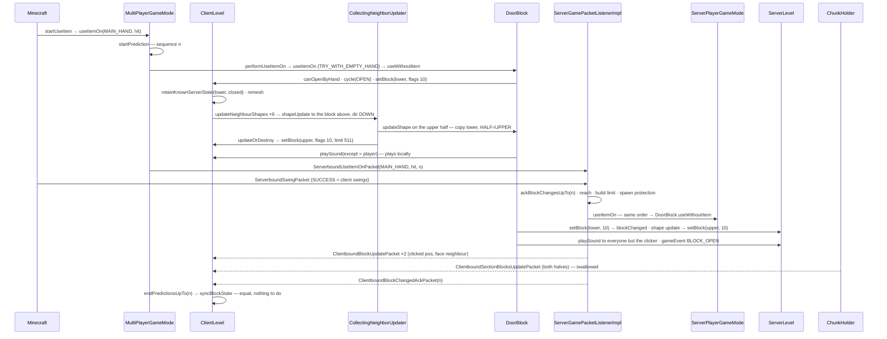

# Block interaction

> Verified against **Minecraft 26.2** · Part V · A player right-clicks the bottom half of an oak door: the click's path through prediction, packet, game mode and block, and how the top half finds out without a single neighbour update.

## Responsibility

A click on a block is two questions asked in a fixed order — *does the
item want this?* then *does the block want this?* — answered on the
client first, for responsiveness, and on the server second, for truth.
The answer is an `InteractionResult`, and the consequence is almost always
a `Level.setBlock`, whose flags decide which of two quite different
fan-outs run afterwards: **shape updates** (a block asking its neighbours
whether it still fits; runs on both sides) and **neighbour updates** (a
block telling its neighbours something changed; server only). The door
is the cleanest demonstration, because its second half follows the first
through shape updates alone.

The one sentence a player recognises: *you can open a wooden door by
hand but not an iron one, both halves move together, and the click feels
instant even on a laggy server.*

## The data it owns

- **`InteractionResult`** is a sealed interface of four records:
  `InteractionResult.Success` (carrying an `InteractionResult.SwingSource`
  — `InteractionResult.SwingSource.NONE`, `InteractionResult.SwingSource.CLIENT`
  or `InteractionResult.SwingSource.SERVER` — and an
  `InteractionResult.ItemContext`), `InteractionResult.Fail`,
  `InteractionResult.Pass` and `InteractionResult.TryEmptyHandInteraction`.
  The constants: `InteractionResult.SUCCESS` (client swings),
  `InteractionResult.SUCCESS_SERVER` (server swings to trackers and self),
  `InteractionResult.CONSUME` (nobody swings), `InteractionResult.FAIL`,
  `InteractionResult.PASS` and `InteractionResult.TRY_WITH_EMPTY_HAND`.
  `InteractionResult.consumesAction` is the boolean almost every branch
  turns on, but not the only one read: `InteractionResult.Success` also
  carries `InteractionResult.Success.wasItemInteraction`, which decides
  whether `Stats.ITEM_USED` is awarded, and
  `InteractionResult.Success.heldItemTransformedTo`, which the game modes
  use to swap the stack the hand ends up holding. There is no
  *ItemInteractionResult* any more.
- **The hooks** live on `BlockBehaviour`, all protected:
  `BlockBehaviour.useItemOn` (item-on-block; default
  `InteractionResult.TRY_WITH_EMPTY_HAND`, twenty-four blocks override
  it — cauldrons, beehives, cakes, campfires, candles, lecterns,
  jukeboxes, note blocks, signs, shelves, decorated pots and the rest),
  `BlockBehaviour.useWithoutItem` (default `InteractionResult.PASS`),
  `BlockBehaviour.attack` (left-click, default nothing),
  `BlockBehaviour.updateShape`, `BlockBehaviour.neighborChanged` (which
  now takes an `Orientation` rather than a source position),
  `BlockBehaviour.onPlace` and `BlockBehaviour.affectNeighborsAfterRemoval`.
  Callers never call those; they call the public dispatchers on
  `BlockBehaviour.BlockStateBase` — `BlockBehaviour.BlockStateBase.useItemOn`,
  `BlockBehaviour.BlockStateBase.useWithoutItem`,
  `BlockBehaviour.BlockStateBase.attack`, `BlockBehaviour.BlockStateBase.updateShape`,
  `BlockBehaviour.BlockStateBase.handleNeighborChanged`,
  `BlockBehaviour.BlockStateBase.updateNeighbourShapes`,
  `BlockBehaviour.BlockStateBase.getMenuProvider`.
- **`DoorBlock`** has five properties — `DoorBlock.FACING`, `DoorBlock.HALF`
  (`DoubleBlockHalf.LOWER` / `DoubleBlockHalf.UPPER`), `DoorBlock.HINGE`
  (`DoorHingeSide`), `DoorBlock.OPEN`, `DoorBlock.POWERED` — and a
  `DoorBlock.type`, a **`BlockSetType`**. That is a record, not a registry
  entry: fourteen components — name, `BlockSetType.canOpenByHand`,
  `BlockSetType.canOpenByWindCharge`,
  `BlockSetType.canButtonBeActivatedByArrows`,
  `BlockSetType.pressurePlateSensitivity`
  (`BlockSetType.PressurePlateSensitivity.EVERYTHING` or
  `BlockSetType.PressurePlateSensitivity.MOBS`), a `SoundType` and the
  eight open/close/click sound events. The seventeen instances
  (`BlockSetType.OAK`, `BlockSetType.IRON` with *canOpenByHand* false,
  `BlockSetType.COPPER`, `BlockSetType.GOLD` …) are public constants on
  the record itself; `BlockSetType.register` additionally files each in a
  private map that `BlockSetType.values` and the string
  `BlockSetType.CODEC` read.
  "Wooden door" for interaction purposes means `BlockSetType.canOpenByHand`;
  `BlockTags.WOODEN_DOORS` and `BlockTags.DOORS` exist but this path never
  reads them.
- **The neighbour updater.** Every `Level` owns one `Level.neighborUpdater`,
  a `CollectingNeighborUpdater` built in the `Level` constructor — on the
  client too. It holds a `CollectingNeighborUpdater.stack` of pending
  update records (`CollectingNeighborUpdater.ShapeUpdate`,
  `CollectingNeighborUpdater.SimpleNeighborUpdate`,
  `CollectingNeighborUpdater.FullNeighborUpdate`,
  `CollectingNeighborUpdater.MultiNeighborUpdate`), a
  `CollectingNeighborUpdater.addedThisLayer` list for requests made from
  inside a running hook, a `CollectingNeighborUpdater.count`, and
  `CollectingNeighborUpdater.maxChainedNeighborUpdates`. The static workers
  are `NeighborUpdater.executeShapeUpdate` (bail out if the target is
  redstone dust and `Block.UPDATE_SKIP_SHAPE_UPDATE_ON_WIRE` is set —
  the test is on the *target*, whatever the source; otherwise read the
  current state, call `BlockBehaviour.BlockStateBase.updateShape`, then
  `Block.updateOrDestroy`) and `NeighborUpdater.executeUpdate`
  (`BlockBehaviour.BlockStateBase.handleNeighborChanged`), each wrapping failures in a crash report.
  `InstantNeighborUpdater` exists but `Level` does not use it.
- **Two direction orders.** `BlockBehaviour.UPDATE_SHAPE_ORDER` — west,
  east, north, south, down, up — for shape updates;
  `NeighborUpdater.UPDATE_ORDER` — west, east, down, up, north, south —
  for neighbour updates. ([Blocks and states](blocks-and-states.md) lists
  the `Block.UPDATE_NEIGHBORS` … `Block.UPDATE_SKIP_ON_PLACE` flag bits.)
- **Reach** is an attribute: `Attributes.BLOCK_INTERACTION_RANGE` (default
  4.5, synced), read by `Player.blockInteractionRange` and tested by
  `Player.isWithinBlockInteractionRange` from the eye position to the
  block's **full unit cube**, not its collision shape — which is why a
  door, three sixteenths deep, is reachable from as far as a full block
  would be; creative adds `ServerPlayer.CREATIVE_BLOCK_INTERACTION_RANGE_MODIFIER`
  (0.5), and the server allows a further 1.0 of slack.
- **The prediction ledger** on the client:
  `ClientLevel.blockStatePredictionHandler`, a `BlockStatePredictionHandler`
  mapping positions to a remembered state, a sequence and a player position;
  the server's half is one int per connection,
  `ServerGamePacketListenerImpl.ackBlockChangesUpTo`. The mechanism belongs
  to [prediction and acknowledgement](../client/prediction-and-acks.md);
  this page uses it.

## When it runs

**Client main thread.** `Minecraft.handleKeybinds` — which only runs when
no screen and no overlay is open — drains every queued press of the use
key into `Minecraft.startUseItem`, unthrottled; `Minecraft.rightClickDelay`
gates only the *held-down* auto-repeat, and `Minecraft.startUseItem` is
what sets it, to four ticks. `Minecraft.startUseItem` loops the hands —
main then off — and calls `MultiPlayerGameMode.useItemOn` for a block hit. The
attack key goes to `Minecraft.startAttack` / `Minecraft.continueAttack` →
`MultiPlayerGameMode.startDestroyBlock` ([block breaking](block-breaking.md)).

**Server main thread.** The packet is re-posted by
`PacketUtils.ensureRunningOnSameThread` into the `PacketProcessor`, which
`MinecraftServer.processPacketsAndTick` drains *before* `MinecraftServer.tickServer`
— so interaction handlers run at the very start of a server tick, the
levels tick after them (broadcasting the block changes), and the
connections tick after *that*, sending the ack. (Connections are not the
last thing in the tick — the player list, the debug subscribers and the
chunk sender follow — but they are after the levels, which is the
ordering the ack depends on.)

Neighbour updates and shape updates run synchronously inside `Level.setBlock`,
on whichever thread called it; on the server that is always the main
thread.

## The trace: a door is opened

1. **The click.** `Minecraft.startUseItem` sets `Minecraft.rightClickDelay`
   and starts with `InteractionHand.MAIN_HAND`; `Minecraft.hitResult` is a
   `BlockHitResult` on the lower door block. `MultiPlayerGameMode.useItemOn`
   runs `MultiPlayerGameMode.ensureHasSentCarriedItem` (a
   `ServerboundSetCarriedItemPacket` if the hotbar slot moved), checks the
   world border, and opens a prediction with
   `MultiPlayerGameMode.startPrediction` →
   `BlockStatePredictionHandler.startPredicting`, sequence *n*.
2. **Block, then empty hand, then item.** `MultiPlayerGameMode.performUseItemOn`
   mirrors the server's *inner* order exactly, and its outer gates
   differ in three ways worth knowing: the server tests the block's
   feature flags as its very first statement while the client tests the
   item's inside the not-sneaking branch; a spectator gets
   `InteractionResult.CONSUME` on the client but is routed to
   `BlockBehaviour.BlockStateBase.getMenuProvider` on the server; and the
   advancement triggers exist only on the server. Sneaking suppresses the block only
   if *some* hand holds something (`Player.isSecondaryUseActive`), so an
   empty-handed sneak still opens doors. `BlockBehaviour.BlockStateBase.useItemOn`
   → the `BlockBehaviour.useItemOn` default, `InteractionResult.TRY_WITH_EMPTY_HAND`;
   that sentinel, and **only for the main hand**, leads to
   `BlockBehaviour.BlockStateBase.useWithoutItem` → `DoorBlock.useWithoutItem`.
   Had the block passed, `ItemStack.useOn` → `Item.useOn` would have been
   next; had everything passed, `Minecraft.startUseItem` would fall
   through to `MultiPlayerGameMode.useItem` (right-click air,
   `ServerboundUseItemPacket`) and then try the off hand.
3. **The door decides.** `DoorBlock.useWithoutItem`: if
   `BlockSetType.canOpenByHand` is false (iron, gold) →
   `InteractionResult.PASS` and the click falls through to the item.
   Otherwise `StateHolder.cycle` on `DoorBlock.OPEN` and `Level.setBlock`
   with flags **10** — `Block.UPDATE_CLIENTS` | `Block.UPDATE_IMMEDIATE`,
   and **no `Block.UPDATE_NEIGHBORS`**. Then `DoorBlock.playSound`
   (`BlockSetType.doorOpen` / `BlockSetType.doorClose`, with the player as
   the *except*), `Level.gameEvent` with `GameEvent.BLOCK_OPEN` or
   `GameEvent.BLOCK_CLOSE`, and `InteractionResult.SUCCESS`. The same code
   runs on both sides.
4. **The client's write.** `ClientLevel.setBlock` sees the prediction in
   progress, lets `Level.setBlock` run and then
   `BlockStatePredictionHandler.retainKnownServerState` remembers the
   closed lower half under *n*. Inside: `LevelChunk.setBlockState` writes
   the palette. The block did not change, so the removal hooks
   (`BlockEntity.preRemoveSideEffects`,
   `BlockBehaviour.BlockStateBase.affectNeighborsAfterRemoval`) are
   skipped; `BlockBehaviour.BlockStateBase.onPlace` is skipped for a
   different reason — it is gated on the side and on
   `Block.UPDATE_SKIP_ON_PLACE`, *not* on the block changing, so on the
   client it never runs at all (and on the server, in step 9, it does run
   for this same-block write). Then flag 2 →
   `ClientLevel.sendBlockUpdated` → `LevelExtractor.blockChanged`, which
   reads bit 8 as *player-caused* and schedules a priority remesh; flag 1
   absent (and `Level.updateNeighborsAt` is a no-op on the client anyway);
   flag 16 clear → `BlockBehaviour.BlockStateBase.updateNeighbourShapes`
   with flags 10 and limit 511.
5. **The upper half follows.** `Block.UPDATE_KNOWN_SHAPE` is clear, so
   `BlockBehaviour.BlockStateBase.updateNeighbourShapes` walks all six of
   `BlockBehaviour.UPDATE_SHAPE_ORDER` — `Direction.UP` is the last of
   them — and each is its own top-level cascade. Note the direction that
   travels: the door tells the block above about the change by sending
   `Direction.DOWN`, the direction *from the neighbour back to it*. That is
   `Level.neighborShapeChanged` → `CollectingNeighborUpdater.shapeUpdate`
   → `CollectingNeighborUpdater.addAndRun` → `CollectingNeighborUpdater.runUpdates`
   → `NeighborUpdater.executeShapeUpdate` → `DoorBlock.updateShape` on the
   **upper** block: the neighbour below is a `DoorBlock` of the other half,
   so it returns *the lower half's new state with `DoorBlock.HALF` set to
   upper* — open, hinge, facing and powered all copied. `Block.updateOrDestroy`
   sees a different state and calls `Level.setBlock` on the upper position
   with flags 10 and limit 511 (also retained under *n*). Its own shape
   pass, at limit 510, asks the lower half, whose `DoorBlock.updateShape`
   returns what is already there; `Block.updateOrDestroy` does nothing and
   the cascade stops. No `BlockBehaviour.neighborChanged` ran anywhere.
6. **Sound and swing, locally.** `ClientLevel.playSeededSound` plays a
   sound only when the *except* entity is the local player — so the
   clicker hears the door from prediction. `ClientLevel.gameEvent` is a
   no-op. `MultiPlayerGameMode.startPrediction` sends
   `ServerboundUseItemOnPacket` (hand, hit, *n*) and closes the ledger.
   Back in `Minecraft.startUseItem`, `InteractionResult.SUCCESS` carries
   `InteractionResult.SwingSource.CLIENT`, so `LocalPlayer.swing` animates
   the arm and sends `ServerboundSwingPacket`; the off hand is never tried.
7. **The server's gate.** `ServerGamePacketListenerImpl.handleUseItemOn`:
   `ServerGamePacketListenerImpl.hasClientLoaded`; **first**
   `ServerGamePacketListenerImpl.ackBlockChangesUpTo` records *n*; the
   item must be feature-enabled; `Player.isWithinBlockInteractionRange`
   with 1.0 of slack; the hit location must lie within the block (else
   the packet is logged and rejected); build height
   (`ServerPlayer.sendBuildLimitMessage`); `MinecraftServer.isUnderSpawnProtection`
   (`ServerPlayer.sendSpawnProtectionMessage`); no teleport pending
   (`ServerGamePacketListenerImpl.awaitingPositionFromClient`);
   `ServerLevel.mayInteract`. Then `ServerPlayerGameMode.useItemOn`.
8. **The server's decision.** `ServerPlayerGameMode.useItemOn`: a
   spectator gets only `BlockBehaviour.BlockStateBase.getMenuProvider`;
   otherwise the same block → empty-hand → item order as step 2, with
   advancement triggers at each exit (`CriteriaTriggers.ITEM_USED_ON_BLOCK`,
   `CriteriaTriggers.DEFAULT_BLOCK_USE`; `ServerGamePacketListenerImpl.handleUseItemOn`
   adds `CriteriaTriggers.ANY_BLOCK_USE`), and the item's count restored
   afterwards under `Player.hasInfiniteMaterials`. `DoorBlock.useWithoutItem`
   runs on the `ServerLevel`.
9. **The server's write.** `Level.setBlock` on the lower half:
   flag 2 and the chunk at least `FullChunkStatus.BLOCK_TICKING` →
   `ServerLevel.sendBlockUpdated` → `ServerChunkCache.blockChanged` →
   `ChunkHolder.blockChanged` records the position and queues the holder;
   path caches are invalidated and mobs whose paths cross a changed
   collision shape are asked to `PathNavigation.recomputePath`. The shape
   pass runs through the server's `CollectingNeighborUpdater` and sets the
   upper half exactly as in step 5, queuing a second changed position.
   `DoorBlock.playSound` → `ServerLevel.playSeededSound` → `PlayerList.broadcast`
   of a `ClientboundSoundPacket` to everyone in range **except the
   clicker**; `ServerLevel.gameEvent` → `GameEventDispatcher.post`
   ([game events](../world/game-events-and-poi.md)). The result is
   `InteractionResult.SUCCESS` with a client swing source, so the server
   does not swing; the swing arrives separately through
   `ServerGamePacketListenerImpl.handleAnimate` → `ServerPlayer.swing` →
   `LivingEntity.swing` → `ClientboundAnimatePacket` to the trackers.
10. **Three kinds of block update go back.** `ServerGamePacketListenerImpl.handleUseItemOn`
    ends by sending the clicker a `ClientboundBlockUpdatePacket` for the
    clicked position and one for the block on its clicked face — not the
    upper half. Those two are inside the branch that survives the reach and
    hit-location checks and the build-height test: fail either and **no**
    block update is sent, while the ack still goes out, because it was
    recorded as the handler's first statement. Then `ServerLevel.tick` → `ServerChunkCache.tick`
    → `ServerChunkCache.broadcastChangedChunks` → `ChunkHolder.broadcastChanges`:
    two changed positions in one section become one
    `ClientboundSectionBlocksUpdatePacket` to every player tracking the
    chunk (two `ClientboundBlockUpdatePacket`s if the halves straddle a
    section boundary). Then `MinecraftServer.tickChildren` reaches
    `ServerGamePacketListenerImpl.tick`, which sends one
    `ClientboundBlockChangedAckPacket` with the high-water mark and resets
    it to −1.
11. **Reconciling.** Both door positions are in the clicker's ledger, so
    `ClientPacketListener.handleBlockUpdate` / `ClientPacketListener.handleChunkBlocksUpdate`
    → `ClientLevel.setServerVerifiedBlockState` (flags 19) →
    `BlockStatePredictionHandler.updateKnownServerState` overwrite the
    remembered truth and leave the world alone; the face-neighbour update
    is not predicted and is applied normally (a no-op). On the ack,
    `ClientLevel.handleBlockChangedAck` → `BlockStatePredictionHandler.endPredictionsUpTo`
    → `ClientLevel.syncBlockState` for both halves: server state equals
    predicted state, nothing is written. Had the server disagreed — an
    iron door, spawn protection — the correction would already have
    arrived in step 10 and be written back here, with `Entity.absSnapTo`
    if the player is now inside it. Other clients simply apply the
    section packet.

Left-click, for contrast: `Minecraft.startAttack` →
`MultiPlayerGameMode.startDestroyBlock`, also under a prediction, calls
`BlockBehaviour.BlockStateBase.attack` client-side and sends a
`ServerboundPlayerActionPacket`; `ServerGamePacketListenerImpl.handlePlayerAction`
→ `ServerPlayerGameMode.handleBlockBreakAction` calls `BlockBehaviour.BlockStateBase.attack`
on the server (after `EnchantmentHelper.onHitBlock`) and then starts break
progress — same reach check, same ack machinery.
[Block breaking](block-breaking.md) takes it from there.

## Interfaces

- **Called by:** `Minecraft.startUseItem` / `Minecraft.startAttack` (client);
  `ServerGamePacketListenerImpl.handleUseItemOn`, `ServerGamePacketListenerImpl.handleUseItem`,
  `ServerGamePacketListenerImpl.handlePlayerAction`, `ServerGamePacketListenerImpl.handleInteract`
  (server). The sneak state arrives beforehand in `ServerboundPlayerInputPacket`
  → `ServerGamePacketListenerImpl.handlePlayerInput`. Villagers and wind
  charges open doors through `DoorBlock.setOpen`; commands re-run the
  flag-1 effects after the fact with `ServerLevel.updateNeighboursOnBlockSet`.
- **Calls into:** `Level.setBlock` → `LevelChunk.setBlockState`
  ([chunk anatomy](../world/chunk-anatomy.md)); `CollectingNeighborUpdater`;
  `ServerLevel.updateNeighborsAt`, which computes an
  `ExperimentalRedstoneUtils.initialOrientation` before fanning out
  ([redstone](redstone.md)); `GameEventDispatcher`; `PlayerList.broadcast`
  for sounds; `ServerPlayer.openMenu` when a block has a menu
  ([block entities](block-entities.md)).
- **Crosses the network as:** `ServerboundUseItemOnPacket`,
  `ServerboundUseItemPacket`, `ServerboundPlayerActionPacket`,
  `ServerboundInteractPacket`, `ServerboundSwingPacket`,
  `ServerboundSetCarriedItemPacket` (client → server);
  `ClientboundBlockUpdatePacket`, `ClientboundSectionBlocksUpdatePacket`,
  `ClientboundBlockChangedAckPacket`, `ClientboundSoundPacket`,
  `ClientboundAnimatePacket` (server → client).
- **Data-driven by:** nothing in a data pack for the door itself —
  `BlockSetType` is code. The chain limit is **not a game rule**: it is
  the *max-chained-neighbor-updates* entry in `server.properties`
  (`DedicatedServerProperties.maxChainedNeighborUpdates`, default one
  million, through `DedicatedServer.getMaxChainedNeighborUpdates`);
  `MinecraftServer.getMaxChainedNeighborUpdates` hard-codes the same for
  the integrated server and `ClientLevel` passes the literal. Reach is the
  `Attributes.BLOCK_INTERACTION_RANGE` attribute, so items and effects can
  modify it. `FeatureFlags.REDSTONE_EXPERIMENTS` decides whether a
  `CollectingNeighborUpdater.MultiNeighborUpdate` computes an
  `Orientation` per neighbour.

## Invariants and surprises

- **Opening a door fires no neighbour updates.** `DoorBlock.useWithoutItem`
  and `DoorBlock.setOpen` write with flags 10, so `Level.setBlock` never
  reaches `Level.updateNeighborsAt`; the other half follows through
  `DoorBlock.updateShape`, which copies the neighbour half's whole state
  and swaps `DoorBlock.HALF`. The other entry points differ: the redstone
  path (`DoorBlock.neighborChanged`, flags 2 — each half writes only
  *itself*, and the halves converge because both get their own neighbour
  update and each flags-2 write triggers a shape pass), placement
  (`DoorBlock.setPlacedBy` with `Level.setBlockAndUpdate`, flags 3), and
  the wind-charge path (`DoorBlock.onExplosionHit` calling
  `DoorBlock.setOpen` directly).
- **`DoorBlock.updateShape` has three outcomes, not one.** It copies the
  matching other half; it returns **air** when the vertical neighbour is
  not the matching half; and, for the lower half on a `Direction.DOWN`
  update, it returns air when `DoorBlock.canSurvive` fails — the block
  below must be face-sturdy upward. That third branch, feeding
  `Block.updateOrDestroy`, is the whole of "break the bottom and the top
  pops", and it is a shape update, not a neighbour update.
- **Shape updates are predictable; neighbour updates are not — but only
  half of a shape update is.** `Level.neighborShapeChanged` is implemented
  on `Level` and runs on both sides; `Level.updateNeighborsAt` and
  `Level.neighborChanged` are empty on `Level` and overridden only by
  `ServerLevel`. That is why the client can predict the second door half
  and cannot predict redstone. The catch is in `Block.updateOrDestroy`:
  when `BlockBehaviour.BlockStateBase.updateShape` returns air, the
  *destroy* branch is wrapped in a server-side check and goes through
  `Level.destroyBlock` with flags 3 — so it fires neighbour updates and a
  `GameEvent.BLOCK_DESTROY` of its own. Breaking the bottom half of a door
  therefore removes the top half **on the server only**; the client waits
  for the packet.
- **The empty-hand hook is main-hand only, and sneaking is conditional.**
  `ServerPlayerGameMode.useItemOn` routes `InteractionResult.TRY_WITH_EMPTY_HAND`
  to `BlockBehaviour.BlockStateBase.useWithoutItem` only when the hand is
  `InteractionHand.MAIN_HAND`; the hand loop lives in `Minecraft.startUseItem`,
  and each `ServerboundUseItemOnPacket` carries exactly one hand.
- **The swing is part of the result.** `InteractionResult.SUCCESS` means
  the client swings and tells the server with `ServerboundSwingPacket`;
  `InteractionResult.SUCCESS_SERVER` means `LivingEntity.swing` with
  *sendToSwingingEntity* true; `InteractionResult.CONSUME` means nobody
  swings.
- **The chain limit counts queued updates per top-level cascade, not
  depth, and it drops rather than crashes.** `CollectingNeighborUpdater.addAndRun`
  increments `CollectingNeighborUpdater.count` once per *request* — and a
  `CollectingNeighborUpdater.MultiNeighborUpdate` is one request that
  expands to up to six actual updates, so the budget is coarser than the
  number suggests. Past the limit, further updates are discarded with one
  logged error;
  `CollectingNeighborUpdater.runUpdates` resets the count when the
  outermost cascade finishes. Nested requests from inside a hook go to
  `CollectingNeighborUpdater.addedThisLayer` and run depth-first before
  the parent's remaining neighbours. Shape-update *recursion* is a
  separate budget, `Block.UPDATE_LIMIT` (512), decremented per nested
  `Level.setBlock`.
- **The ack is a once-per-tick high-water mark, not a reply.**
  `ServerGamePacketListenerImpl.ackBlockChangesUpTo` stores a maximum;
  `ServerGamePacketListenerImpl.tick` emits one `ClientboundBlockChangedAckPacket`
  after the level tick has already broadcast the changes, because
  `MinecraftServer.tickChildren` ticks levels before connections.
- **The clicked block comes back even on success — but only if the click
  got past the gates.** `ServerGamePacketListenerImpl.handleUseItemOn`
  sends the clicked position and its face neighbour whatever the
  interaction returned, and the door's other half only arrives through
  `ChunkHolder.broadcastChanges`. Those two sends live inside the
  build-height branch, though, so a click that fails the reach check, or
  whose hit location is not within the block, or that is above or below
  the build limit, is answered with **nothing at all**.
- **A world-border or pending-teleport refusal is reported as a build
  limit.** When `ServerLevel.mayInteract` says no, or a teleport is still
  outstanding, the else-branch the click falls into is
  `ServerPlayer.sendBuildLimitMessage` — the player is told they are
  building too high whatever the actual reason.
- **The clicker hears the door from prediction.** `DoorBlock.playSound`
  passes the player as *except*; `ServerLevel.playSeededSound` skips them
  and `ClientLevel.playSeededSound` plays only for them. Same design as
  the swing.
- **There is no *markAndNotifyBlock*** and no *onRemove*
  — the notify/neighbour/shape logic is inline in `Level.setBlock`, and
  removal side effects split into `BlockBehaviour.affectNeighborsAfterRemoval`
  and `BlockEntity.preRemoveSideEffects`, both called from
  `LevelChunk.setBlockState`.

## Where to look

`Minecraft.startUseItem` · `MultiPlayerGameMode.useItemOn` ·
`MultiPlayerGameMode.performUseItemOn` · `MultiPlayerGameMode.startPrediction` ·
`BlockStatePredictionHandler.retainKnownServerState` ·
`BlockStatePredictionHandler.endPredictionsUpTo` · `ClientLevel.syncBlockState` ·
`ServerGamePacketListenerImpl.handleUseItemOn` · `ServerGamePacketListenerImpl.ackBlockChangesUpTo` ·
`ServerPlayerGameMode.useItemOn` · `InteractionResult` · `BlockBehaviour.useItemOn` ·
`BlockBehaviour.useWithoutItem` · `DoorBlock.useWithoutItem` · `DoorBlock.updateShape` ·
`BlockSetType` · `Level.setBlock` · `BlockBehaviour.BlockStateBase.updateNeighbourShapes` ·
`Level.neighborShapeChanged` · `ServerLevel.updateNeighborsAt` ·
`CollectingNeighborUpdater.addAndRun` · `CollectingNeighborUpdater.runUpdates` ·
`NeighborUpdater.executeShapeUpdate` · `NeighborUpdater.executeUpdate` ·
`Block.updateOrDestroy` · `ChunkHolder.broadcastChanges`

---

*Rules: names, never code · how the system works, not how the code reads ·
newest version only · every backticked name passes `tools/verify_names.py`.*
