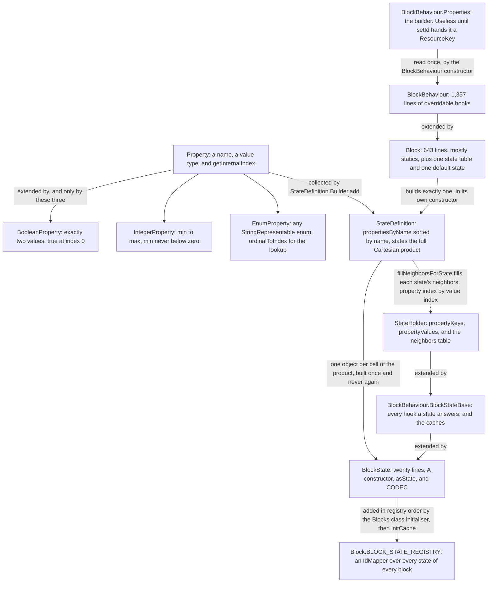
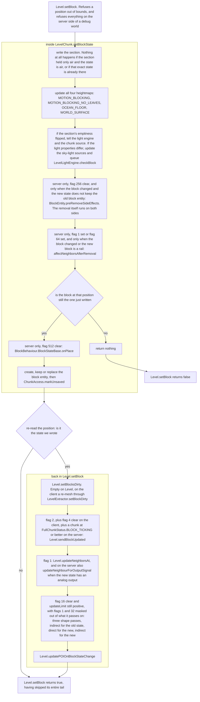

# Blocks and states

> Verified against **Minecraft 26.2** · Part V · A player right-clicks the top of a stone block holding oak stairs, and one of the stair's eighty pre-built states goes into the world.

You are standing on stone with a stack of oak stairs, and you right-click the
top of the block. A moment later a stair is up there, facing away from you,
sitting on the bottom half of its cube. Nothing was constructed to make that
happen. Oak stairs have four properties — *facing*, *half*, *shape*,
*waterlogged* — and all eighty combinations of them were built before any
world existed, in the class initialiser of `Blocks`, and numbered into one
flat table, `Block.BLOCK_STATE_REGISTRY`. What a chunk stores is an index
into that table. Both of the surprises on this page fall out of that single
decision. Choosing a property allocates nothing: `StateHolder.setValue`
reads one cell out of a table of neighbours computed at startup and hands
back a state that already existed. And the index is not always checked:
`Block.getId` answers **0** for a state its table has never seen, and
`Block.stateById` answers `Blocks.AIR`'s default state for a number it does
not know — so wherever the game reaches the table through that pair, a state
the two sides disagree about raises nothing at all. It quietly becomes air.

## The cast

| class | what it decides | thread |
|---|---|---|
| `Block` | one kind of thing: which properties it has, what its default state is, and — through several hundred statics — most of what any block does to the world | built at class-initialisation, read from every thread after |
| `BlockBehaviour` | every hook a block may override, from `BlockBehaviour.onPlace` to `BlockBehaviour.updateShape`. `Block` extends it and adds registration | as above |
| `BlockBehaviour.Properties` | hardness, sound, map colour, whether it ticks — and the `ResourceKey` without which no block can be built at all | read once, in the `BlockBehaviour` constructor |
| `StateDefinition` | the table: which properties this block has, in which order, and the full product of their values | built in the `Block` constructor |
| `Property` | one axis — a name, a value type, and where a value sits in that axis | immutable, shared between blocks |
| `StateHolder` | one state's property values, and the table that answers *what state am I if this property becomes that value* | filled once by `StateDefinition`, read-only after |
| `BlockBehaviour.BlockStateBase` | everything a state can answer without going to the block, and the caches that make collision and occlusion cheap | half-built in its constructor, finished by `BlockBehaviour.BlockStateBase.initCache` |
| `Block.BLOCK_STATE_REGISTRY` | the integer that a stored, sent or serialised state actually is | appended once per state, in the `Blocks` class initialiser |

## Twelve classes and one Cartesian product

### The kind, three classes deep

A *block* is a kind of thing — oak stairs, stone, water. A *block state* is
one exact configuration of that kind, and it is a block state, never a block,
that a chunk section stores, that a packet carries, that a model is chosen
for. The kind is spread over three classes. `BlockBehaviour` is the base and
holds the hooks; `Block` extends it and adds the registry holder, the state
table and the statics everything else in the game reaches for. Both are
constructed from a `BlockBehaviour.Properties`, a builder that must first be
given an identity: `BlockBehaviour.Properties.setId` supplies the
`ResourceKey`, the loot table and the translation key are derived from it,
and the `BlockBehaviour` constructor throws *Block id not set* without one.
So a block cannot be built from `BlockBehaviour.Properties.of` outside
`Blocks.register`, which takes the id from `BlockItemIds` or `BlockIds` and
hands it to the builder on the way past. None of that is data:
`BlockBehaviour.Properties.CODEC` is a unit codec, so `Block.CODEC` is a
constructor dispatch and hardness, sound and map colour never serialise.

### The table, sorted by name

Each `Block` constructor calls its own `Block.createBlockStateDefinition`,
collecting properties through `StateDefinition.Builder.add` — which rejects a
name outside lower-case, digits and underscore, a property with fewer than
two values, and a duplicate name — and then `StateDefinition.Builder.create`
builds every state the block will ever have. Zero properties gives one
singleton state, one property gives a row, and two or more gives the full
Cartesian product of every property's values, each cell constructed through
a `StateDefinition.Factory` which for blocks is the `BlockState` constructor.

**Eighty** — the states of oak stairs: four facings, two halves, five shapes,
two waterlogged values, every one of them a distinct object built before any
world existed.

`StateDefinition.propertiesByName` is a sorted map, so the axes are ordered
by property *name*, not by the order the block added them. For stairs that is
*facing, half, shape, waterlogged*. Two things follow. The order of the
global state ids follows it, which is why `BlockState.CODEC` and
`StateDefinition.propertiesCodec` — the form a state takes in a palette, a
structure file or a command — write properties alphabetically. And
`StateDefinition.any` is the first cell of the product, which the `Block`
constructor installs as the default state unless the block calls
`Block.registerDefaultState` itself. Since `BooleanProperty.VALUES` lists
*true* before *false*, a block that does not override its default gets *true*
for every boolean it has. That is why `StairBlock` sets
`StairBlock.WATERLOGGED` to false explicitly: the alternative is stairs that
are born full of water.

There are exactly three concrete kinds of `Property` and no
*DirectionProperty* — facing is an `EnumProperty` over `Direction`.
`BlockStateProperties` is the shared pool of **124** of them, and several
share a serialised name while being different objects:
`BlockStateProperties.FACING`, `BlockStateProperties.FACING_HOPPER` and
`BlockStateProperties.HORIZONTAL_FACING` are all *facing* on disk.

### The state, a twenty-line leaf

`StateHolder` is the generic state, shared with `FluidState`
([fluids](../world/fluids.md)). It holds its owner, two parallel arrays of
property keys and values, and `StateHolder.neighbors` — a two-dimensional
table, property index by value index, answering *what state am I if this
property becomes that value*. `StateHolder.setValue` walks the key array
comparing references to find the row, asks `Property.getInternalIndex` for
the column, and returns the object already sitting in that cell. It
allocates nothing and it never constructs. The table is installed once by
`StateHolder.initializeNeighbors`, and a second call throws. Because every
state is built once, `StateHolder.equals` is final and identity-based: two
states are the same only if they are the same object.

`BlockBehaviour.BlockStateBase` extends it and is the state-to-block hop —
`BlockBehaviour.BlockStateBase.getShape`,
`BlockBehaviour.BlockStateBase.canSurvive` and the rest each forward to the
owning block with the state as the first argument. It is also where the
caches live, and they arrive in two waves. Its constructor copies the flat
values out of the block's `BlockBehaviour.Properties`. Everything that has to
ask a *virtual* question — the fluid state, whether it random-ticks, the
occlusion shape and its six faces, sky-light propagation, light dampening,
and the `BlockBehaviour.BlockStateBase.Cache` of collision shape and sturdy
faces built for every block without a dynamic shape — is filled later, by
`BlockBehaviour.BlockStateBase.initCache`, because those questions may look
at other blocks and so cannot be answered until every block exists.

`BlockState` itself is **twenty lines**: a constructor, a `BlockState.asState`
that returns *this*, and `BlockState.CODEC`. It exists so the generic
plumbing has a concrete type to name. `BlockBehaviour.BlockStateBase` is the
class people mean when they say *block state*.

The `Blocks` class initialiser is that second wave and the only caller of
`BlockBehaviour.BlockStateBase.initCache`: it walks
`BuiltInRegistries.BLOCK`, adds each state to `Block.BLOCK_STATE_REGISTRY`
and finishes it. Note what makes the result safe to share between the server
thread, the client thread, the chunk workers and the meshing pool — it is
**not** immutability, because those cached fields are non-final and written
long after the constructor. It is that the writes happen inside a class
initialiser, and every thread that later reaches a `BlockState` reaches it
through `Blocks`.

## Four decisions, four lookups

`BlockItem.getPlacementState` asks the block for a state and refuses if it
cannot have one. The default `Block.getStateForPlacement` returns the block's
default state; `StairBlock` overrides it and makes four decisions, each of
them one `StateHolder.setValue` into the table above.

`StairBlock.FACING` is `UseOnContext.getHorizontalDirection`, which is
`Entity.getDirection` — the way the player is *facing*, so the tall side ends
up away from them. `StairBlock.HALF` is `Half.BOTTOM` when the clicked face
is the top, `Half.TOP` when it is the bottom, and otherwise decided by
whether the hit point is in the upper or lower half of the clicked block.
`StairBlock.WATERLOGGED` is whether the fluid already at the target position
is `Fluids.WATER`. Then `StairBlock.SHAPE` is computed by
`StairBlock.getStairsShape` from the *partly built* state: it looks at the
neighbour in the direction the stair faces, and a stair there of the same
half with a perpendicular facing gives `StairsShape.OUTER_LEFT` or
`StairsShape.OUTER_RIGHT`; failing that it looks at the neighbour in the
opposite direction for `StairsShape.INNER_LEFT` or
`StairsShape.INNER_RIGHT`; failing both, `StairsShape.STRAIGHT`. In each case
`StairBlock.canTakeShape` vetoes the corner if the stair on the far side is
already aligned with this one. The same routine runs again in
`StairBlock.updateShape` every time a horizontal neighbour changes, which is
how a straight stair turns into a corner when you build next to it.

Everything in front of that — the click, the reach check, the block-then-item
ordering, the packet and the ack — belongs to
[block interaction](block-interaction.md) and
[prediction and acks](../client/prediction-and-acks.md). One sentence of it
matters here: the client runs the identical `BlockItem.place` under a
prediction, so the write below happens twice, once on each side, from the
same code. What differs is entirely inside the write.

`BlockItem.placeBlock` calls `Level.setBlock` with flags **11**,
`Block.UPDATE_ALL_IMMEDIATE`.

## The two update channels

This is the shape the rest of Part V refers back to. A write is two
half-writes with a re-read between them: `LevelChunk.setBlockState` changes
the world and runs the side effects that belong to the *position*, then
`Level.setBlock`'s tail runs the side effects that belong to the
*neighbourhood* — and only if the state it reads back is the one it asked
for.

### Inside the chunk write

The section write, the four heightmaps and the light checks are the same on
both sides — that is [chunk anatomy](../world/chunk-anatomy.md)'s territory.
Three things after them are not.

`BlockEntity.preRemoveSideEffects` is the block entity's last word before it
is unregistered — the chest scattering its contents, say. It needs the
server, and it needs `Block.UPDATE_SKIP_BLOCK_ENTITY_SIDEEFFECTS` clear; the
removal that follows it happens either way, on both sides
([block entities](block-entities.md)).
`BlockBehaviour.BlockStateBase.affectNeighborsAfterRemoval` is how the
outgoing block tells its neighbours it is gone — a door dropping its other
half, a piston head taking its base. It is easy to put in the wrong place:
it runs **inside** the chunk write, before the new state is even confirmed,
not in `Level.setBlock`'s tail with the other neighbour work. It needs the
server, it needs `Block.UPDATE_NEIGHBORS` set *or* the moved-by-piston bit,
and it also needs the *block* to have changed — a write that only changes a
property does not fire it, unless the new block is a `BaseRailBlock`.

Then the chunk re-reads its own section. If a side effect has already
replaced what was just written, `LevelChunk.setBlockState` returns nothing at
all and `Level.setBlock` reports false. Otherwise
`BlockBehaviour.BlockStateBase.onPlace` runs — server-side, with
`Block.UPDATE_SKIP_ON_PLACE` clear — and the block entity is created, kept
or replaced. A block entity that disagrees with the new state is logged as
*mismatched* and thrown away.

### Back in Level.setBlock's tail

The first two steps of the tail are how the change becomes visible.
`Level.setBlocksDirty` is empty on `Level` itself; on the client it reaches
`LevelExtractor.setBlockDirty`, which re-meshes only if
`ModelManager.requiresRender` says the two states look different. The
broadcast that follows is gated on `Block.UPDATE_CLIENTS`, and then on
opposite conditions per side: the client also needs
`Block.UPDATE_INVISIBLE` clear, the server also needs the chunk to be at
`FullChunkStatus.BLOCK_TICKING` or better, which is why nothing generated
during worldgen is ever broadcast.

The last three are the two update channels proper, and the difference
between them is the fact the rest of this part rests on:

**Neighbour updates are server-only.** `Level.updateNeighborsAt` and
`Level.neighborChanged` are empty methods on `Level`, overridden only by
`ServerLevel`. Gated on `Block.UPDATE_NEIGHBORS`, the server hands the
position to its `CollectingNeighborUpdater`, which visits the six neighbours
in `NeighborUpdater.UPDATE_ORDER` — west, east, down, up, north, south —
calling each one's `BlockBehaviour.neighborChanged`. Beside it,
`Level.updateNeighbourForOutputSignal` reaches the comparators in the four
horizontal directions, directly or through one redstone conductor
([signal and dust](signal-and-dust.md)).

**Shape updates run on both sides.** `Level.neighborShapeChanged` is
implemented on `Level`, and both a `ServerLevel` and a `ClientLevel` own a
`CollectingNeighborUpdater`. Unless `Block.UPDATE_KNOWN_SHAPE` is set,
`Level.setBlock` runs three passes with a decremented limit and with
`Block.UPDATE_NEIGHBORS` and `Block.UPDATE_SUPPRESS_DROPS` masked out of the
flags it propagates: `BlockBehaviour.BlockStateBase.updateIndirectNeighbourShapes`
for the *old* state, then
`BlockBehaviour.BlockStateBase.updateNeighbourShapes` for the new, then the
indirect pass again for the new. The middle one is the familiar one: six
neighbours in `BlockBehaviour.UPDATE_SHAPE_ORDER` — west, east, north, south,
down, up, a *different* order from the neighbour channel — each asked for a
new state through `BlockBehaviour.BlockStateBase.updateShape` and then
handed to `Block.updateOrDestroy`. The indirect passes are the hook a block
uses to reach past its six neighbours. `Block.UPDATE_LIMIT`, 512, is the
budget that stops the cascade.

And there is the catch. `Block.updateOrDestroy` writes the new state on
either side — but when the new state is air its destroy branch is
server-gated, going through `Level.destroyBlock`. So a shape update that
turns a block into nothing deletes it on the server and does nothing at all
on the client, which then waits to be told.

### The flag word

The last argument to `Level.setBlock` is a bit set, tagged in signatures by
`Block.UpdateFlags`, an annotation that carries no values of its own. The
flowchart above names its bits by number; the ten bits, what reads each one
and the four named combinations are in
[block update flags](../../reference/block-update-flags.md). Placement's
**11** is `Block.UPDATE_ALL_IMMEDIATE`, and `Block.UPDATE_LIMIT` is also 512
without being a bit at all — it is the default recursion budget for the
shape cascade.

## Questions players ask

**Why did `Level.setBlock` say false when the block is right there?** It
returns true whenever the chunk accepted the write, even if the state was
changed again immediately afterwards and the whole tail was skipped. It
returns false in four cases, and only one of them is a real failure: a
position out of bounds, the server side of a debug world, a chunk write that
found nothing to do, or a side effect inside the chunk write that replaced
the block before the write could be confirmed. *Nothing to do* is the common
one, and it means writing the state that is already there — states being
interned, that is an identity comparison — or writing air into a section
that holds only air.

**Why does my property lookup throw when the property looks identical?**
Because states match properties by *identity* and properties match each other
by *value*. `StateHolder.setValue` compares `Property` references with `==`,
while `Property.equals` compares the value class and the name — refined by
`IntegerProperty` and `EnumProperty` to compare the value list too. So two
separately constructed properties can be equal to one another and still make
`StateHolder.setValue` throw *Cannot set property … as it does not exist*.
Use the `BlockStateProperties` constant, not a look-alike.

**Does an unknown block state really become air?** For `Block.getId` and
`Block.stateById`, yes, and that is the pair behind block-break particles,
the falling-block spawn packet and `EntityDataSerializers.OPTIONAL_BLOCK_STATE`.
It is not universal. `ClientboundBlockUpdatePacket.STREAM_CODEC` reads the
same table through `ByteBufCodecs.idMapper`, which uses `IdMap.byIdOrThrow`
and fails the connection instead, and
`ClientboundSectionBlocksUpdatePacket` decodes with `IdMapper.byId`, which
answers null. The tolerant lookup is a property of the two static methods,
not of the id.

## Where to look

`Blocks.register` · `BlockBehaviour.Properties.setId` ·
`StateDefinition.Builder.create` ·
`StateDefinition.StateCollection.fillNeighborsForState` ·
`StateHolder.setValue` · `StateHolder.neighbors` ·
`BlockBehaviour.BlockStateBase.initCache` · `Block.BLOCK_STATE_REGISTRY` ·
`StairBlock.getStateForPlacement` · `StairBlock.getStairsShape` ·
`BlockItem.placeBlock` · `LevelChunk.setBlockState` · `Level.setBlock` ·
`Block.updateOrDestroy` · `NeighborUpdater.executeShapeUpdate`

---

*Rules: names, never code · how the system works, not how the code reads ·
newest version only · every backticked name passes `tools/verify_names.py`.*
