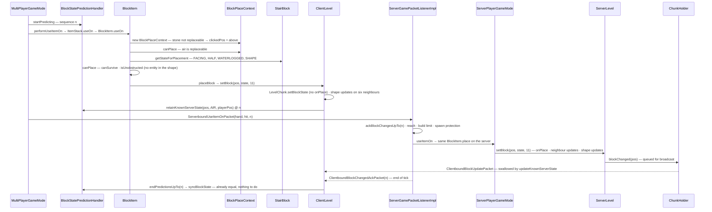

# Blocks and states

> Verified against **Minecraft 26.2** · Part V · A player right-clicks the top of a stone block holding oak stairs: how the stair decides which of its eighty states to become, and how that state gets into the world on both sides of the wire.

## Responsibility

A *block* is a kind of thing — oak stairs, stone, water. A *block state* is
one exact configuration of that kind — oak stairs facing north, bottom
half, straight, dry — and it is a block state, never a block, that a chunk
section stores, that a packet carries, that a model is chosen for. This
page is about the split between the two: which class owns what, why a
state is an immutable, interned object you look up rather than build, and
how the placement path (`BlockItem.place` → `Block.getStateForPlacement` →
`Level.setBlock`) turns a right-click into one of them.

The one sentence a player recognises: *stairs face away from you, go
upside-down if you click the top half of a side, and turn into corners
when they meet another stair.*

## The data it owns

- **`Block`** is the kind. It holds one `Block.stateDefinition` (protected,
  final), one `Block.defaultBlockState`, and an intrusive
  `Block.builtInRegistryHolder` into `BuiltInRegistries.BLOCK` (a
  `DefaultedRegistry` whose default is *air*). Most of what a block *does*
  is inherited from **`BlockBehaviour`**, its 1,357-line superclass, where
  the protected hooks live (`BlockBehaviour.updateShape`,
  `BlockBehaviour.onPlace`, `BlockBehaviour.neighborChanged`,
  `BlockBehaviour.canBeReplaced`, `BlockBehaviour.canSurvive`,
  `BlockBehaviour.getShape`, `BlockBehaviour.useItemOn`,
  `BlockBehaviour.useWithoutItem` …). `Block` itself is 643 lines, mostly
  statics.
- **`BlockBehaviour.Properties`** is the builder every block is constructed
  from: `BlockBehaviour.Properties.strength`, `BlockBehaviour.Properties.sound`,
  `BlockBehaviour.Properties.mapColor`, `BlockBehaviour.Properties.lightLevel`,
  `BlockBehaviour.Properties.noCollision` (which also clears
  *canOcclude*), `BlockBehaviour.Properties.replaceable`,
  `BlockBehaviour.Properties.pushReaction`,
  `BlockBehaviour.Properties.requiresCorrectToolForDrops`,
  `BlockBehaviour.Properties.offsetType`, `BlockBehaviour.Properties.randomTicks`
  and so on. It must carry an identity: `BlockBehaviour.Properties.setId`
  gives it the `ResourceKey`, and the loot table and translation key are
  `DependantName`s of that id, resolved by
  `BlockBehaviour.Properties.effectiveDrops` and
  `BlockBehaviour.Properties.effectiveDescriptionId` in the `BlockBehaviour`
  constructor — which throws *Block id not set* otherwise. So a block cannot
  be built from `BlockBehaviour.Properties.of` outside `Blocks.register`.
  There are two copy constructors, `BlockBehaviour.Properties.ofFullCopy`
  and the deprecated `BlockBehaviour.Properties.ofLegacyCopy`; neither
  copies the id.
- **`StateDefinition`** is the block's state table. `StateDefinition.propertiesByName`
  is an `ImmutableSortedMap` — **sorted by property name** — and
  `StateDefinition.states` is the full Cartesian product of every
  property's values, built once in the constructor; `StateDefinition.any`
  is the first entry. `StateDefinition.Builder.add` collects the
  properties (`StateDefinition.Builder.validateProperty` rejects a bad
  name — `StateDefinition.NAME_PATTERN` is lower-case, digits and
  underscore — a property with fewer than two values, or a duplicate) and
  `StateDefinition.Builder.create` builds every state through a
  `StateDefinition.Factory`, which for blocks is the `BlockState`
  constructor. `StateDefinition.propertiesCodec` is the `MapCodec` the
  chunk palette and structure files use: one field per property, absent
  fields falling back to the default state's value.
- **`Property`** is a named, typed axis: `Property.getPossibleValues`,
  `Property.getName`, `Property.getValue`, and `Property.getInternalIndex`,
  the index of a value in that axis. There are exactly **three**
  concrete kinds in 26.2: `BooleanProperty` (whose `BooleanProperty.VALUES`
  puts *true* first), `IntegerProperty` (`IntegerProperty.create` with a
  non-negative minimum; `IntegerProperty.values` is a fastutil list) and
  `EnumProperty` (over any `StringRepresentable` enum;
  `EnumProperty.ordinalToIndex` makes the index lookup constant time).
  There is no *DirectionProperty* — facing is an `EnumProperty` of
  `Direction`. `BlockStateProperties` is the shared pool of **124**
  constants (51 boolean, 32 integer, 41 enum); several share a serialised
  name — `BlockStateProperties.FACING`, `BlockStateProperties.FACING_HOPPER`
  and `BlockStateProperties.HORIZONTAL_FACING` are all *facing* on disk
  but distinct objects.
- **`StateHolder`** is the state itself, generic over owner and self so
  `Fluid`/`FluidState` share it ([fluids](../world/fluids.md)).
  It holds `StateHolder.owner`, two parallel arrays
  `StateHolder.propertyKeys` / `StateHolder.propertyValues`, and
  `StateHolder.neighbors`: a two-dimensional table, property index by
  value index, answering *what state am I if this property becomes that
  value*. `StateHolder.setValue` allocates nothing, but it is not a bare
  index either: `StateHolder.valueIndex` walks the key array comparing by
  reference to find the property's row, then `Property.getInternalIndex`
  gives the column. `StateHolder.trySetValue` tolerates a missing
  property, `StateHolder.cycle` steps to the next value. The table is
  installed once by `StateHolder.initializeNeighbors` (a second call
  throws) — from `StateDefinition.StateCollection.fillNeighborsForState`
  for a block with two or more properties, and directly from
  `StateDefinition.createSingletonState` or
  `StateDefinition.createSinglePropertyStates` otherwise.
  `StateHolder.equals` is **final and identity-based** (`StateHolder.hashCode`
  is identity-based too, but not final): two states are the same iff they
  are the same object.
- **`BlockBehaviour.BlockStateBase`** is where a block state's behaviour
  lives — it extends `StateHolder` and is the "state → block" hop:
  `BlockBehaviour.BlockStateBase.getShape`, `BlockBehaviour.BlockStateBase.updateShape`,
  `BlockBehaviour.BlockStateBase.onPlace`, `BlockBehaviour.BlockStateBase.canSurvive`,
  `BlockBehaviour.BlockStateBase.canBeReplaced`, `BlockBehaviour.BlockStateBase.useItemOn`,
  `BlockBehaviour.BlockStateBase.tick`, `BlockBehaviour.BlockStateBase.randomTick`,
  `BlockBehaviour.BlockStateBase.getDrops`, `BlockBehaviour.BlockStateBase.hasBlockEntity`
  (an `EntityBlock` check) and the rest each forward to the owning block
  with the state as first argument. It also *caches*, per state:
  values resolved in the constructor from the block's properties
  (`BlockBehaviour.BlockStateBase.lightEmission`, `BlockBehaviour.BlockStateBase.mapColor`,
  `BlockBehaviour.BlockStateBase.destroySpeed`, `BlockBehaviour.BlockStateBase.pushReaction`,
  `BlockBehaviour.BlockStateBase.isAir`, `BlockBehaviour.BlockStateBase.replaceable`,
  `BlockBehaviour.BlockStateBase.instrument` …), and values filled later by
  `BlockBehaviour.BlockStateBase.initCache`: `BlockBehaviour.BlockStateBase.fluidState`,
  `BlockBehaviour.BlockStateBase.isRandomlyTicking`,
  `BlockBehaviour.BlockStateBase.occlusionShape`, `BlockBehaviour.BlockStateBase.solidRender`,
  `BlockBehaviour.BlockStateBase.propagatesSkylightDown`,
  `BlockBehaviour.BlockStateBase.lightDampening`, `BlockBehaviour.BlockStateBase.legacySolid`
  and a `BlockBehaviour.BlockStateBase.Cache` (only for blocks without
  `Block.hasDynamicShape`) holding `BlockBehaviour.BlockStateBase.Cache.collisionShape`,
  `BlockBehaviour.BlockStateBase.Cache.largeCollisionShape`,
  `BlockBehaviour.BlockStateBase.Cache.faceSturdy` (six faces ×
  `SupportType`) and `BlockBehaviour.BlockStateBase.Cache.isCollisionShapeFullBlock`.
  Through `TypedInstance` it gets the *is* family — by block, tag, holder
  or key.
- **`BlockState`** is a **20-line** final leaf: a constructor,
  `BlockState.asState` returning itself, and `BlockState.CODEC` — built by
  `StateHolder.codec` as *Name* (the block, by registry name) plus an
  optional *Properties* map; a singleton-state block encodes with no
  *Properties* at all.
- **`Block.BLOCK_STATE_REGISTRY`** is an `IdMapper` of every state of every
  block, in registry order then table order; `Block.getId` and
  `Block.stateById` are the lookups. It is not a registry in the
  `Registries` sense — it is derived, and `ClientboundBlockUpdatePacket`
  sends a state as this id, which is why client and server must agree on
  every block's property set and order.
- **`Blocks`** registers ≈1,200 blocks through `Blocks.register` (ids from
  `BlockItemIds` and `BlockIds`), with helpers `Blocks.registerLegacyStair`,
  `Blocks.registerSlab`, `Blocks.registerWall`, and its static initialiser
  is the *second construction phase*: it walks `BuiltInRegistries.BLOCK`,
  adds every state to `Block.BLOCK_STATE_REGISTRY` and calls
  `BlockBehaviour.BlockStateBase.initCache` on each. That is the only
  caller; there is no *rebuildCache* in 26.2.
- **`Block.UpdateFlags`** is an empty type-use marker annotation — it tags
  the parameters that take a flag word and carries no values itself. The
  flag bits are plain constants beside it: `Block.UPDATE_NEIGHBORS` (1),
  `Block.UPDATE_CLIENTS` (2),
  `Block.UPDATE_INVISIBLE` (4), `Block.UPDATE_IMMEDIATE` (8),
  `Block.UPDATE_KNOWN_SHAPE` (16), `Block.UPDATE_SUPPRESS_DROPS` (32),
  `Block.UPDATE_MOVE_BY_PISTON` (64), `Block.UPDATE_SKIP_SHAPE_UPDATE_ON_WIRE`
  (128), `Block.UPDATE_SKIP_BLOCK_ENTITY_SIDEEFFECTS` (256),
  `Block.UPDATE_SKIP_ON_PLACE` (512); composites `Block.UPDATE_ALL` (3),
  `Block.UPDATE_ALL_IMMEDIATE` (11), `Block.UPDATE_NONE` (260) and
  `Block.UPDATE_SKIP_ALL_SIDEEFFECTS` (816). `Block.UPDATE_LIMIT` (512) is
  the recursion budget for cascaded shape updates.
- The serialisable form of a block *type* carries almost nothing:
  `BlockBehaviour.Properties.CODEC` is a unit codec, so `Block.CODEC`,
  `BlockBehaviour.simpleCodec` and the 265 entries `BlockTypes.bootstrap`
  puts in `BuiltInRegistries.BLOCK_TYPE` are a type dispatch, not a data
  format (`StairBlock.CODEC` adds only its *base_state*).

## When it runs

Block and state construction happens once, at class-initialisation, on
whichever thread touches `Blocks` first (the bootstrap, before any level
exists). Everything after that is reads from any thread — the chunk
workers, the meshing threads and the main threads all hold the same
`BlockState` references. Note what makes that safe: it is **not**
immutability. `BlockBehaviour.BlockStateBase`'s cached fields are
non-final and written by `BlockBehaviour.BlockStateBase.initCache` long
after the constructor; what publishes them safely to every other thread
is the happens-before edge of `Blocks`' class initialisation, since
`BlockBehaviour.BlockStateBase.initCache` runs inside it.

Placement runs on **both main threads**: the client predicts it in
`MultiPlayerGameMode.performUseItemOn` and the server executes it in
`ServerPlayerGameMode.useItemOn`, through the same `BlockItem.place`.
The differences are inside `Level.setBlock` and `LevelChunk.setBlockState`:
`BlockBehaviour.BlockStateBase.onPlace` and neighbour-*changed* updates are
server-only, shape updates run on both, and the client's write is
provisional until the server's ack.

## The trace: oak stairs on stone

1. **The click.** `MultiPlayerGameMode.useItemOn` runs
   `MultiPlayerGameMode.ensureHasSentCarriedItem` (a
   `ServerboundSetCarriedItemPacket` if the hotbar slot changed) and opens
   a prediction: `MultiPlayerGameMode.startPrediction` →
   `BlockStatePredictionHandler.startPredicting` bumps
   `BlockStatePredictionHandler.currentSequenceNr` to *n* and sets
   `BlockStatePredictionHandler.isPredicting`.
2. **Block first, item second.** `MultiPlayerGameMode.performUseItemOn`
   asks the stone: `BlockBehaviour.BlockStateBase.useItemOn` → the
   `BlockBehaviour.useItemOn` default, `InteractionResult.TRY_WITH_EMPTY_HAND`;
   then `BlockBehaviour.BlockStateBase.useWithoutItem` → `InteractionResult.PASS`.
   Not sneaking, stack non-empty, no `ItemCooldowns` → a `UseOnContext`
   (player, hand, hit) → `ItemStack.useOn` → `Item.useOn` → `BlockItem.useOn`.
   ([Block interaction](block-interaction.md) has this ordering in full.)
3. **Where does it go?** `BlockItem.useOn` wraps the context in a
   `BlockPlaceContext`. Its constructor decides the target once:
   `BlockPlaceContext.replaceClicked` is the stone's
   `BlockBehaviour.BlockStateBase.canBeReplaced` — the `BlockBehaviour.canBeReplaced`
   default is *replaceable and the held item is not this block's own
   item* — false for stone, so `BlockPlaceContext.getClickedPos` returns
   `BlockPlaceContext.relativePos`, the block above. (Click grass or snow
   and `BlockPlaceContext.replacingClickedOnBlock` is true and the target is
   the clicked block itself.)
4. **May it go there?** `BlockItem.place` checks `FeatureElement.isEnabled` against
   the feature set, then `BlockPlaceContext.canPlace` — the air above is
   replaceable — then the hook `BlockItem.updatePlacementContext`
   (identity for stairs; doors and tall plants re-target with
   `BlockPlaceContext.at`).
5. **Which state?** `BlockItem.getPlacementState` → `Block.getStateForPlacement`,
   which `StairBlock.getStateForPlacement` overrides. Four decisions:
   `StairBlock.FACING` = `UseOnContext.getHorizontalDirection`, which is
   `Entity.getDirection` — the way the player *faces*, so the high side is
   away from them; `StairBlock.HALF` = `Half.BOTTOM` for the top face,
   `Half.TOP` for the bottom face, otherwise by whether
   `UseOnContext.getClickLocation` is above the block's midpoint;
   `StairBlock.WATERLOGGED` = whether the fluid being replaced
   `TypedInstance.is` `Fluids.WATER`; `StairBlock.SHAPE` =
   `StairBlock.getStairsShape`, which looks at the block behind and the
   block in front — a stair of the same half with a perpendicular facing
   (and `StairBlock.canTakeShape` agreeing) makes `StairsShape.OUTER_LEFT`,
   `StairsShape.OUTER_RIGHT`, `StairsShape.INNER_LEFT` or
   `StairsShape.INNER_RIGHT`; else `StairsShape.STRAIGHT`. Each of those
   four writes is `StateHolder.setValue`: a table lookup returning one of
   the block's 80 pre-built states (4 facings × 2 halves × 5 shapes × 2).
6. **Will it fit?** `BlockItem.canPlace`: `BlockItem.mustSurvive` (true by
   default) → `BlockBehaviour.BlockStateBase.canSurvive` (stairs: always),
   then `CollisionGetter.isUnobstructed` with
   `CollisionContext.placementContext` — `StairBlock.getShape` picks the
   bottom-straight shape, and `EntityGetter.isUnobstructed` refuses if any
   entity's bounding box overlaps it. That is the whole of "you can't
   place a block inside yourself".
7. **The write.** `BlockItem.placeBlock` → `Level.setBlock` with flags
   **11** = `Block.UPDATE_ALL_IMMEDIATE`. On the client this is
   `ClientLevel.setBlock`, which sees the prediction in progress, lets
   `Level.setBlock` run, and then
   `BlockStatePredictionHandler.retainKnownServerState` remembers the
   *pre-prediction* state (air) and the player's position under sequence
   *n*. Inside `Level.setBlock`: `LevelChunk.setBlockState` writes the
   section, heightmaps and light check ([chunk anatomy](../world/chunk-anatomy.md))
   but calls `BlockBehaviour.BlockStateBase.onPlace` **only on the server**
   and only when `Block.UPDATE_SKIP_ON_PLACE` is clear; then
   `Level.setBlocksDirty` (client: `LevelExtractor.setBlockDirty`, a re-mesh);
   flag 2 → `Level.sendBlockUpdated` — which also needs
   `Block.UPDATE_INVISIBLE` clear on the client, and on the server needs
   the chunk to be at least `FullChunkStatus.BLOCK_TICKING`, which is why
   worldgen writes never broadcast — (client: `LevelExtractor.blockChanged`;
   server: below); flag 1 → `Level.updateNeighborsAt`, empty on the base
   level and overridden only by `ServerLevel`, plus
   `Level.updateNeighbourForOutputSignal` on the server if the new state
   has an analog output; flag 16 clear → with 1 and 32 masked off,
   **three** shape passes in order —
   `BlockBehaviour.BlockStateBase.updateIndirectNeighbourShapes` for the
   old state, `BlockBehaviour.BlockStateBase.updateNeighbourShapes` for the
   new, and `BlockBehaviour.BlockStateBase.updateIndirectNeighbourShapes`
   again for the new. The middle one is the familiar one: it walks
   `BlockBehaviour.UPDATE_SHAPE_ORDER` (west, east, north, south, down, up)
   calling `Level.neighborShapeChanged` → the level's
   `CollectingNeighborUpdater` → `NeighborUpdater.executeShapeUpdate` →
   each neighbour's `BlockBehaviour.BlockStateBase.updateShape` →
   `Block.updateOrDestroy`. An adjacent stair recomputes its own
   `StairBlock.SHAPE` here, in `StairBlock.updateShape`, on both sides. The
   indirect passes are the hook a block uses to reach past its six
   neighbours — how redstone dust reaches diagonal wires. Finally, and on
   every successful write, `Level.updatePOIOnBlockStateChange` (empty on
   the base level, real on `ServerLevel`).
8. **After the write.** `BlockItem.place` re-reads the position; if the
   block there is the one it placed it applies the item's
   `DataComponents.BLOCK_STATE` (`BlockItemStateProperties.apply`, which
   looks each name up in the `StateDefinition` and uses `StateHolder.setValue`
   on what it finds; a changed state is written back with a **second**
   `Level.setBlock`, flags 2) and, server-side,
   `DataComponents.BLOCK_ENTITY_DATA` (`BlockItem.updateCustomBlockEntityTag`,
   op-gated by `BlockEntityType.onlyOpCanSetNbt`), then
   `BlockItem.updateBlockEntityComponents`, then `Block.setPlacedBy`, then
   `CriteriaTriggers.PLACED_BLOCK` for a `ServerPlayer`. Outside that
   conditional — so they happen even if something replaced the block
   underneath — it plays `SoundType.getPlaceSound` at the *mean of the
   sound type's volume and 1.0* and 0.8 **times** the type's pitch (for
   oak stairs, `SoundType.WOOD`, that is full volume), raises
   `GameEvent.BLOCK_PLACE` ([game events](../world/game-events-and-vibrations.md))
   and `ItemStack.consume`s one — restored under `Player.hasInfiniteMaterials`.
   `InteractionResult.SUCCESS`. `MultiPlayerGameMode.startPrediction` sends
   `ServerboundUseItemOnPacket` with sequence *n* and closes the prediction.
9. **The server does it again.** `ServerGamePacketListenerImpl.handleUseItemOn`
   (re-posted to the server thread by `PacketUtils.ensureRunningOnSameThread`)
   first records the sequence with `ServerGamePacketListenerImpl.ackBlockChangesUpTo`,
   then checks `Player.isWithinBlockInteractionRange` (from
   `Attributes.BLOCK_INTERACTION_RANGE`, default 4.5), that the hit
   location is within the block, build height
   (`ServerPlayer.sendBuildLimitMessage`), `MinecraftServer.isUnderSpawnProtection`
   and `ServerLevel.mayInteract`, and hands off to `ServerPlayerGameMode.useItemOn`
   — the same block-then-item order as step 2, into the same `BlockItem.place`,
   steps 3–8 recomputed against the server's world.
10. **The server's write.** Same `Level.setBlock`, three differences.
    `LevelChunk.setBlockState` now calls `BlockBehaviour.BlockStateBase.onPlace`.
    `ServerLevel.sendBlockUpdated` → `ServerChunkCache.blockChanged` →
    `ChunkHolder.blockChanged` queues the position (nothing is sent yet),
    invalidates `ServerLevel.pathTypesByPosCache`, and if the collision
    shape changed asks the mobs in `ServerLevel.navigatingMobs` — not every
    mob in the level — whether `PathNavigation.shouldRecomputePath`.
    And `ServerLevel.updateNeighborsAt` fires six
    `BlockBehaviour.BlockStateBase.handleNeighborChanged`s, each forwarding
    to the block's own `BlockBehaviour.neighborChanged`, in
    `NeighborUpdater.UPDATE_ORDER` (west, east, down, up, north, south) —
    a different order from the shape pass — plus
    `Level.updateNeighbourForOutputSignal` if the new state
    `BlockBehaviour.BlockStateBase.hasAnalogOutputSignal`.
11. **Broadcast, then ack.** Once past the build-height check,
    `ServerGamePacketListenerImpl.handleUseItemOn` ends — whatever the
    interaction did — by sending the placer a
    `ClientboundBlockUpdatePacket` for the clicked block and one for the
    block on its clicked face, here the stone and the new stairs. Those
    two sends sit *inside* that branch, so a click refused earlier — out
    of reach, a hit location outside the block, above or below the build
    limit — sends nothing at all and leaves the client's prediction to be
    unwound by the ack alone. Later
    in the same tick the chunk cache drains `ChunkHolder.broadcastChanges`:
    one changed position becomes a `ClientboundBlockUpdatePacket`, several
    in one section a `ClientboundSectionBlocksUpdatePacket`, to every
    player tracking the chunk — including the placer, who thus hears about
    the stairs twice. After that, `ServerGamePacketListenerImpl.tick` sends
    at most one `ClientboundBlockChangedAckPacket` carrying the highest
    sequence seen this tick; the server ticks its levels before its
    connections, so the ack always trails the block updates.
12. **Reconciling.** `ClientPacketListener.handleBlockUpdate` →
    `ClientLevel.setServerVerifiedBlockState` with flags 19
    (`Block.UPDATE_ALL` | `Block.UPDATE_KNOWN_SHAPE`). The position has a
    pending prediction, so `BlockStatePredictionHandler.updateKnownServerState`
    replaces the remembered server truth (air → stairs) and **does not
    touch the world**. Then `ClientPacketListener.handleBlockChangedAck` →
    `ClientLevel.handleBlockChangedAck` → `BlockStatePredictionHandler.endPredictionsUpTo`
    → `ClientLevel.syncBlockState` for every entry at or below *n*: the
    remembered state equals what is there, so nothing is written. Had the
    server refused, the remembered truth would still be air,
    `ClientLevel.syncBlockState` would write it back, and if the player now
    stood inside it, `Entity.absSnapTo` the recorded position. Every
    *other* client just gets step 11's packet and writes it with flags 19 —
    re-mesh, no shape updates, no neighbour updates.

## Interfaces

- **Called by:** `BlockItem.place` (players, and dispensers through
  `DirectionalPlaceContext`), every `Level.setBlock` caller in the game —
  fluids, worldgen, pistons, commands; `StateHolder.setValue` from every
  `BlockBehaviour.BlockStateBase.updateShape`, `BlockBehaviour.neighborChanged`, `Block.getStateForPlacement` and codec
  decode.
- **Calls into:** `LevelChunk.setBlockState` ([chunk anatomy](../world/chunk-anatomy.md));
  the `CollectingNeighborUpdater` ([block interaction](block-interaction.md)
  and [redstone](redstone.md)); `Shapes` — `Shapes.block` and
  `Shapes.empty` are singletons compared by identity, and the two shape
  caches are on `Block`: `Block.SHAPE_FULL_BLOCK_CACHE` (is this shape a
  full cube) and the per-thread `Block.OCCLUSION_CACHE` keyed by
  `Block.ShapePairKey` (should this face render).
- **Crosses the network as:** `ServerboundUseItemOnPacket` (client →
  server; hand, hit, sequence); `ClientboundBlockUpdatePacket` /
  `ClientboundSectionBlocksUpdatePacket` (server → clients; the state as
  its `Block.BLOCK_STATE_REGISTRY` id); `ClientboundBlockChangedAckPacket`
  (server → the acting client; one per tick).
- **Data-driven by:** `BuiltInRegistries.BLOCK`, `BuiltInRegistries.BLOCK_TYPE`;
  `BlockState.CODEC` wherever a state is written down (palettes,
  structures, `/setblock`, `DataComponents.BLOCK_STATE`). On the client,
  `BlockStateModelLoader.loadBlockStates` reads *blockstates/\*.json*
  into a map from `BlockState` to model root, baked into a
  `BlockStateModelSet` — that is Part XI's business; there is no
  *BlockModelShaper* any more.

## Invariants and surprises

- **`BlockState` is twenty lines.** `BlockBehaviour.BlockStateBase` is
  the class people mean; `BlockBehaviour` holds the hooks; `Block` is
  registration and statics. `BlockState` exists so `BlockState.asState`
  can return the concrete type.
- **Setting a property never allocates.** `StateHolder.setValue` resolves
  a row by scanning the key array and a column by
  `Property.getInternalIndex`, then returns the pre-built state at that
  cell of `StateHolder.neighbors`; every state a block can have was built
  once in `StateDefinition` and is compared by identity
  (`StateHolder.equals` is final). Two blocks' states with identical
  values are never equal, by construction.
- **States match properties by identity; properties match each other by
  value.** `StateHolder.valueIndex` compares `Property` references with
  `==`, but `Property.equals` — refined by `EnumProperty` and
  `IntegerProperty` to compare the value list too — is value-based. So two
  separately constructed properties can be equal to one another and still
  make `StateHolder.setValue` throw *Cannot set property … as it does not
  exist*. Use the `BlockStateProperties` constant, not a look-alike.
- **Property order is alphabetical.** `StateDefinition.propertiesByName`
  is sorted, so the state table, `StateDefinition.any` and the global
  state ids follow property *names*, not the order in
  `Block.createBlockStateDefinition`. For stairs that is *facing, half,
  shape, waterlogged*. And because `BooleanProperty.VALUES` lists *true*
  first, a block that does not `Block.registerDefaultState` gets *true*
  for every boolean — which is why `StairBlock` sets
  `StairBlock.WATERLOGGED` false explicitly.
- **The client places blocks for real.** `MultiPlayerGameMode.performUseItemOn`
  runs the identical `BlockItem.place`, including shape updates on the
  neighbours. What it does not run is everything the write path gates on
  the side: `BlockBehaviour.BlockStateBase.onPlace`,
  `ServerLevel.updateNeighborsAt`, `Level.updateNeighbourForOutputSignal`,
  `BlockEntity.preRemoveSideEffects`,
  `BlockBehaviour.BlockStateBase.affectNeighborsAfterRemoval`,
  `BlockItem.updateCustomBlockEntityTag`, and the destroy half of
  `Block.updateOrDestroy` — a shape update that returns air deletes the
  block on the server and does nothing on the client. The server's own
  `ClientboundBlockUpdatePacket` for that position is *swallowed* by
  `BlockStatePredictionHandler.updateKnownServerState` until the ack
  lands; server-authoritative writes on the client always carry
  `Block.UPDATE_KNOWN_SHAPE`.
- **Two neighbour orders.** Shape updates walk
  `BlockBehaviour.UPDATE_SHAPE_ORDER` (W E N S D U); neighbour-changed
  updates walk `NeighborUpdater.UPDATE_ORDER` (W E D U N S). And
  `Level.setBlock` masks `Block.UPDATE_NEIGHBORS` and
  `Block.UPDATE_SUPPRESS_DROPS` off before the shape pass, so a cascade
  through `Block.updateOrDestroy` never fires neighbour-changed updates of
  its own; `Block.UPDATE_LIMIT` bounds its depth.
- **Block codecs carry no data.** `BlockBehaviour.Properties.CODEC` is a
  unit codec; destroy time, sounds and colours never serialise. The
  *block_type* registry dispatches constructors, nothing more.
- **`BlockBehaviour.BlockStateBase.initCache` is a second construction phase.** `BlockBehaviour.BlockStateBase.Cache`
  is computed in the `Blocks` static initialiser, after every block
  exists, because the virtual methods it calls may look at other blocks;
  before it runs the two-argument `BlockBehaviour.BlockStateBase.getCollisionShape`
  falls back to the virtual path. Its constructor throws at startup for a
  block with a collision shape and an offset function but no
  `BlockBehaviour.Properties.dynamicShape`.
- **`Level.setBlock` says true when it did not do what you asked, and
  false when there was nothing to do.** It returns true whenever
  `LevelChunk.setBlockState` accepted the write — even if
  `BlockBehaviour.BlockStateBase.onPlace` or a block entity immediately
  changed the state again; the post-write logic only runs if the state
  read back is the one written. It returns **false** when
  `LevelChunk.setBlockState` returns null, and the commonest reason for
  that is writing the state that is already there — states being interned,
  that is an identity comparison, and it is the usual explanation for a
  `Level.setBlock` that "failed" without anything being wrong. Writing air
  into an already-empty section is the other. And `Level.setBlock` refuses
  everything on the **server side** of a debug world; a `ClientLevel` in
  one writes normally.
- **A block state id that the client does not recognise becomes air.**
  `Block.getId` answers 0 for an unregistered state and `Block.stateById`
  answers `Blocks.AIR` for an unknown id — so a client and server that
  disagree about a block's property set do not throw, they quietly
  disagree about the world.
- **Oak stairs are a legacy copy of oak planks.** `Blocks.registerLegacyStair`
  uses `BlockBehaviour.Properties.ofLegacyCopy`, which is
  `BlockBehaviour.Properties.ofFullCopy` minus eight things:
  `BlockBehaviour.Properties.jumpFactor`,
  `BlockBehaviour.Properties.isRedstoneConductor`,
  `BlockBehaviour.Properties.isValidSpawn`,
  `BlockBehaviour.Properties.postProcess`,
  `BlockBehaviour.Properties.isSuffocating`,
  `BlockBehaviour.Properties.isViewBlocking`, and — the two that matter
  most — the loot table and the description id, which therefore fall back
  to the `DependantName` defaults derived from the *stair's* own id rather
  than the plank's. Forty-seven stairs take this path; only six use
  `Blocks.registerStair`.
- **`RenderShape` has two values**, `RenderShape.INVISIBLE` and
  `RenderShape.MODEL`; the animated-block-entity value is gone.

## Where to look

`BlockBehaviour` · `BlockBehaviour.Properties.setId` · `BlockBehaviour.BlockStateBase.initCache` ·
`BlockBehaviour.BlockStateBase.Cache` · `StateHolder.setValue` · `StateHolder.neighbors` ·
`StateDefinition.Builder.create` · `StateDefinition.StateCollection.fillNeighborsForState` ·
`StateDefinition.propertiesCodec` · `Property.getInternalIndex` · `BlockStateProperties` ·
`BlockState.CODEC` · `Block.BLOCK_STATE_REGISTRY` · `Blocks.register` ·
`Block.getStateForPlacement` · `StairBlock.getStateForPlacement` · `StairBlock.getStairsShape` ·
`BlockPlaceContext` · `BlockItem.place` · `BlockItem.canPlace` · `Level.setBlock` ·
`BlockBehaviour.BlockStateBase.updateNeighbourShapes` · `MultiPlayerGameMode.performUseItemOn` ·
`BlockStatePredictionHandler` · `ClientLevel.syncBlockState` ·
`ServerGamePacketListenerImpl.handleUseItemOn`

---

*Rules: names, never code · how the system works, not how the code reads ·
newest version only · every backticked name passes `tools/verify_names.py`.*
