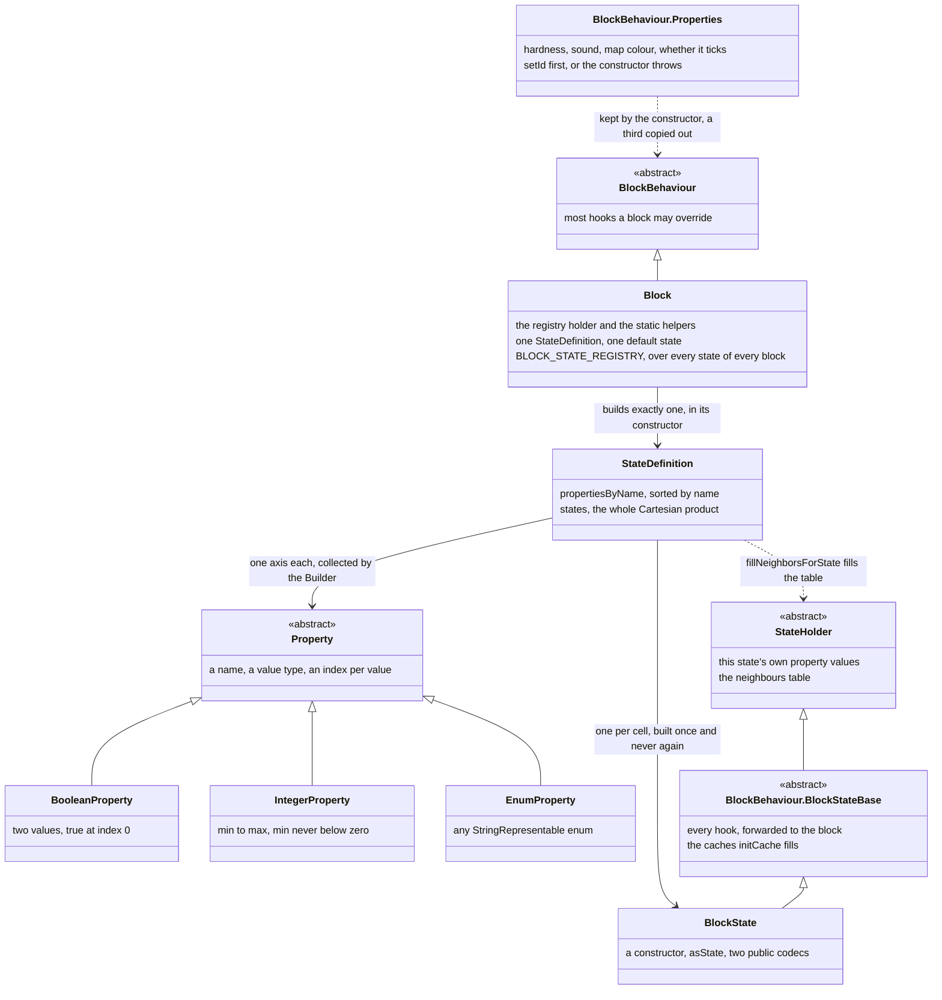
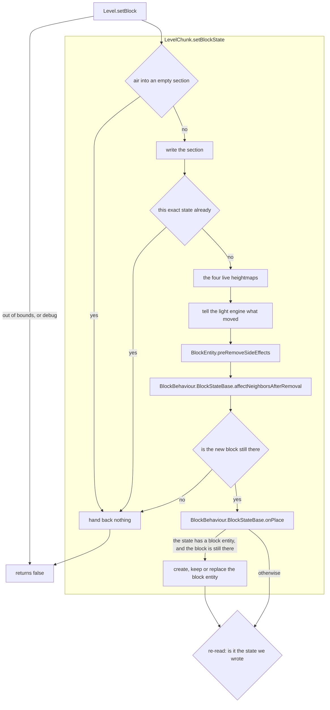
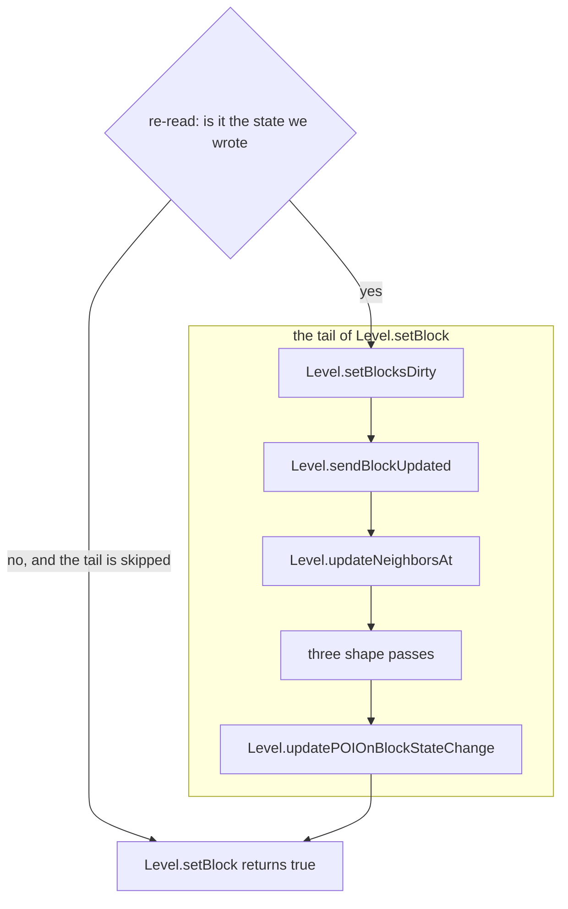

# Blocks and states

> Verified against **Minecraft 26.3** · Part V · A player right-clicks the top of a stone block holding oak stairs: one of the stair's eighty pre-built states is chosen, and then written — and that write, drawn in two figures, is what the rest of this part points back at.

You are standing on stone with a stack of oak stairs, and you right-click the
top of the block. A moment later a stair is up there, facing away from you,
sitting on the bottom half of its cube. Nothing was constructed to make that
happen. Oak stairs have four properties — *facing*, *half*, *shape*,
*waterlogged* — and all eighty combinations of them were built before any
world existed, in the class initialiser of `Blocks`, and numbered into one
flat table, `Block.BLOCK_STATE_REGISTRY`. What a chunk stores points into that
table: each section keeps a small palette of those very states, and uses the
table's own numbers once it holds more than 256 different ones. Both of the surprises about *choosing* a state fall out of
that single decision. Choosing a property allocates nothing:
`StateHolder.setValue` reads one cell out of a table of neighbours computed at
startup and hands back a state that already existed. And the table's numbers are
not always checked: `Block.getId` answers **0** for a state its table has never
seen, and `Block.stateById` answers `Blocks.AIR`'s default state for a number
it does not know — so wherever the game reaches the table through that pair, a
state the two sides disagree about raises nothing at all. It quietly becomes
air.

Then the state has to go in, and that is the page's second half and its wider
job: **the write is where a block state stops being a value and becomes an
event, and the two channels it can leave by are not the same channel on both
sides of the game.** Six other lectures in this part are applications of that
write, so it is drawn here in full.

## The cast

| class | what it decides | thread |
|---|---|---|
| `Block` | one kind of thing: which properties it has, what its default state is, and — through its static helpers — the id lookups, the drops and the shape-update helpers the rest of the game calls | built at class-initialisation, read from every thread after |
| `BlockBehaviour` | most of the hooks a block may override, from `BlockBehaviour.onPlace` to `BlockBehaviour.updateShape`. `Block` extends it and adds registration and hooks of its own, `Block.getStateForPlacement` among them | as above |
| `BlockBehaviour.Properties` | hardness, sound, map colour, whether it ticks — and the `ResourceKey` without which no block can be built at all | kept by the `BlockBehaviour` constructor, which copies about a third of its values out; each state copies others, hardness and map colour among them |
| `StateDefinition` | the table: which properties this block has, in which order, and the full product of their values | built in the `Block` constructor |
| `Property` | one axis — a name, a value type, and where a value sits in that axis | immutable, shared between blocks |
| `StateHolder` | one state's property values, and the table that answers *what state am I if this property becomes that value* | filled once by `StateDefinition`, read-only after |
| `BlockBehaviour.BlockStateBase` | every hook asked of a state and forwarded to its block, and the caches that make collision and occlusion cheap | half-built in its constructor, finished by `BlockBehaviour.BlockStateBase.initCache` |
| `Block.BLOCK_STATE_REGISTRY` | the integer a state is on the wire and in a section's global palette — never on disk, where a state is its name and its properties | appended once per state, in the `Blocks` class initialiser |

## Eleven classes and one Cartesian product

```mermaid
classDiagram
    class BlockBehaviour.Properties {
        hardness, sound, map colour, whether it ticks
        setId first, or the constructor throws
    }
    class BlockBehaviour {
        <<abstract>>
        most hooks a block may override
    }
    class Block {
        the registry holder and the static helpers
        one StateDefinition, one default state
        BLOCK_STATE_REGISTRY, over every state of every block
    }
    class Property {
        <<abstract>>
        a name, a value type, an index per value
    }
    class BooleanProperty {
        two values, true at index 0
    }
    class IntegerProperty {
        min to max, min never below zero
    }
    class EnumProperty {
        any StringRepresentable enum
    }
    class StateDefinition {
        propertiesByName, sorted by name
        states, the whole Cartesian product
    }
    class StateHolder {
        <<abstract>>
        this state's own property values
        the neighbours table
    }
    class BlockBehaviour.BlockStateBase {
        <<abstract>>
        every hook, forwarded to the block
        the caches initCache fills
    }
    class BlockState {
        a constructor, asState, two public codecs
    }
    BlockBehaviour.Properties ..> BlockBehaviour : kept by the constructor, a third copied out
    BlockBehaviour <|-- Block
    Property <|-- BooleanProperty
    Property <|-- IntegerProperty
    Property <|-- EnumProperty
    Block --> StateDefinition : builds exactly one, in its constructor
    StateDefinition --> Property : one axis each, collected by the Builder
    StateDefinition --> BlockState : one per cell, built once and never again
    StateHolder <|-- BlockBehaviour.BlockStateBase
    BlockBehaviour.BlockStateBase <|-- BlockState
    StateDefinition ..> StateHolder : fillNeighborsForState fills the table
```

*The eleven classes a block state is made of, and the two hierarchies that
meet in it: a kind three classes deep down the left and a state three classes
deep down the right. `StateDefinition` joins them, building one `BlockState`
per cell of the product and filling each state's table of neighbours.*

Two things in that picture are the section's: `Property` is extended by those
three classes and by nothing else, and `BlockState` inherits only down the
state side, though its parent class is nested inside `BlockBehaviour`. The rest of this section is what the
product is and how big it gets.

### The kind, three classes deep

A *block* is a kind of thing — oak stairs, stone, water. A *block state* is
one exact configuration of that kind, and it is a block state, never a block,
that a chunk section stores, that a block update carries, that a model is chosen
for. The kind is spread over three classes, and the third is the one a reader
does not expect. `BlockBehaviour` is the base and holds most of the hooks;
`Block` extends it and adds the registry holder, the state table, hooks of its
own and the statics everything else in the game reaches for. The third is
`BlockBehaviour.Properties`, which both are constructed from — a builder that
must first be given an identity: `BlockBehaviour.Properties.setId` supplies the
`ResourceKey`, the loot table and the translation key are derived from it,
and the `BlockBehaviour` constructor throws *Block id not set* without one.
So every block the game builds goes through `Blocks.register`, which takes the
id from `BlockItemIds` or `BlockIds` and hands it to the builder on the way
past. None of that is data: a block has
no codec at all, so hardness, sound and map colour never serialise.

### The table, sorted by name

Each `Block` constructor calls its own `Block.createBlockStateDefinition`,
collecting properties through `StateDefinition.Builder.add` — which rejects a
name outside lower-case, digits and underscore, a *value* name that breaks the
same pattern, a property with fewer than two values, and a duplicate name — and
then `StateDefinition.Builder.create`
builds every state the block will ever have. Zero properties gives one
singleton state, one property gives a row, and two or more gives the full
Cartesian product of every property's values, each cell constructed through
a `StateDefinition.Factory` which for blocks is the `BlockState` constructor.

**Eighty states** of oak stairs: four facings, two halves, five shapes,
two waterlogged values, every one of them a distinct object built before any
world existed.

`StateDefinition.propertiesByName` is a sorted map, so the axes are ordered
by property *name*, not by the order the block added them — for stairs the two
orders happen to coincide, at *facing, half, shape, waterlogged*. Three things
follow. The order of the global state ids follows it, because the product is
built by walking that map. And so does the field order of `BlockState.CODEC`
and `StateDefinition.propertiesCodec` — which is not the same as saying a
state is written alphabetically on disk: NBT is a hash map there, and the
alphabetical forms are text: the *command* syntax `BlockStateParser` writes and
the one `StateHolder.toString` prints, neither of which goes near the codec, and
any SNBT print, which sorts every compound's keys. And
`StateDefinition.any` is the first cell of the product, which the `Block`
constructor installs as the default state unless the block calls
`Block.registerDefaultState` itself. Since `BooleanProperty.VALUES` lists
*true* before *false*, a block that does not override its default gets *true*
for every boolean it has. That is why `StairBlock` sets
`StairBlock.WATERLOGGED` to false explicitly: the alternative is stairs that
are born full of water.

There are exactly three concrete kinds of `Property` and no
*DirectionProperty* — facing is an `EnumProperty` over `Direction`
([naming drift](../../reference/naming-drift.md)).
`BlockStateProperties` is the shared pool of **124** of them, and several
share a serialised name while being different objects:
`BlockStateProperties.FACING`, `BlockStateProperties.FACING_HOPPER` and
`BlockStateProperties.HORIZONTAL_FACING` are all *facing* on disk.

That pool, the four property classes and the twenty-four `StringRepresentable`
enums of its own that `EnumProperty`s range over — `ChestType`, `NoteBlockInstrument`,
`StairsShape` and the rest — are nearly the whole of the `state/properties`
sub-package: no behaviour, just the axes and their values. The rest is two
records that describe a family of blocks, `BlockSetType` and `WoodType`, and
`RotationSegment`'s arithmetic for sixteen-way rotations.
Two classes beside it read a state rather than being part of one, and are
worth a name because their scenarios are elsewhere: `BlockPattern` with
`BlockPatternBuilder` matches a three-dimensional arrangement of
`BlockInWorld`, which is how the game recognises a built wither, and
`BlockStatePredicate` is a `StateDefinition` turned into a test.

### The state, a leaf

`StateHolder` is the generic state, shared with `FluidState`
([fluids](../world/fluids.md#two-registry-objects-one-substance)). It holds its owner, two parallel arrays of
property keys and values, and `StateHolder.neighbors` — a two-dimensional
table, property index by value index, answering *what state am I if this
property becomes that value*. `StateHolder.setValue` walks the key array
comparing references to find the row, asks `Property.getInternalIndex` for
the column, and returns the object already sitting in that cell. It
allocates nothing and it never constructs. The table is installed once by
`StateHolder.initializeNeighbors`, and a second call throws. Because every
state is built once, `StateHolder.equals` is final and identity-based: two
states are the same only if they are the same object.

That reference comparison is why a property lookup can throw on a property
that looks right. States match their properties by *identity* and properties
match each other by *value*: `Property.equals` compares the value class and
the name, refined by `IntegerProperty` and `EnumProperty` to compare the value
list too. So two separately constructed properties can be equal to one another
and still make `StateHolder.setValue` throw *Cannot set property … as it does
not exist*. The constant in `BlockStateProperties` is the object the table was
built with; a look-alike is not.

`BlockBehaviour.BlockStateBase` extends it and is the state-to-block hop —
`BlockBehaviour.BlockStateBase.getShape`,
`BlockBehaviour.BlockStateBase.canSurvive` and the rest each forward to the
owning block with the state as the first argument. It is also where the
caches live, and they arrive in two waves. Its constructor copies the flat
values out of the block's `BlockBehaviour.Properties`, and asks the block one
question, `BlockBehaviour.useShapeForLightOcclusion`. Everything else that has to
ask a *virtual* question — the fluid state, whether it random-ticks, the
occlusion shape and its six faces, sky-light propagation, light dampening,
and the `BlockBehaviour.BlockStateBase.Cache` of collision shape and sturdy
faces built for every block without a dynamic shape — is filled later, by
`BlockBehaviour.BlockStateBase.initCache`, because those questions may look
at other blocks and so cannot be answered until every block exists.

`BlockState` itself is almost empty: a constructor, a
`BlockState.asState` that returns *this*, and two public codecs —
`BlockState.FULL_CODEC`, and `BlockState.CODEC`, which writes a default state
as the bare block id. It exists so the generic
plumbing has a concrete type to name. `BlockBehaviour.BlockStateBase` is the
class people mean when they say *block state*.

The `Blocks` class initialiser is that second wave and the only caller of
`BlockBehaviour.BlockStateBase.initCache`: it walks
`BuiltInRegistries.BLOCK`, adds each state to `Block.BLOCK_STATE_REGISTRY`
and finishes it. Note what makes the result safe to share between the Server
thread, the Render thread, the chunk workers and the meshing pool — it is
**not** immutability, because those cached fields are non-final and written
long after the constructor. It is that the writes happen inside a class
initialiser, and every thread that later reaches a `BlockState` reaches it
through `Blocks`.

### The id that answers air

That registry is where the opening's second surprise lives, and it is worth
being exact about how far it goes, because the tolerance is a property of two
static methods and not of the id. `Block.getId` answers **0** for a state the
table has never seen and `Block.stateById` answers `Blocks.AIR`'s default
state for a number it does not know, so a disagreement between the two sides
raises nothing and quietly becomes air. That pair is behind block-break
particles, the falling-block spawn packet and
`EntityDataSerializers.OPTIONAL_BLOCK_STATE`. The single-block update is
stricter in both directions: `ClientboundBlockUpdatePacket.STREAM_CODEC` reads
and writes the same table through `ByteBufCodecs.idMapper`, which uses
`IdMap.byIdOrThrow` and `IdMap.getIdOrThrow` and fails the connection instead. The section update is
not: `ClientboundSectionBlocksUpdatePacket` writes through the tolerant
`Block.getId` and decodes with `IdMapper.byId`, which answers null.

## Four decisions, four lookups

`BlockItem.getPlacementState` asks the block for a state and refuses if it
cannot have one. The default `Block.getStateForPlacement` returns the block's
default state; `StairBlock` overrides it and makes four decisions, each of
them one `StateHolder.setValue` into the table above.

`StairBlock.FACING` is `UseOnContext.getHorizontalDirection`, which is
`Entity.getDirection` — the way the player is *facing*, so the tall side ends
up away from them. `StairBlock.HALF` is `Half.BOTTOM` when the clicked face
is the top, `Half.TOP` when it is the bottom, and otherwise decided by
whether the hit point is in the upper or lower half of the clicked block.
`StairBlock.WATERLOGGED` is whether the fluid already at the target position
is `Fluids.WATER`. Then `StairBlock.SHAPE` is computed by
`StairBlock.getStairsShape` from the *partly built* state: it looks at the
neighbour in the direction the stair faces, and a stair there of the same
half with a perpendicular facing gives `StairsShape.OUTER_LEFT` or
`StairsShape.OUTER_RIGHT`; failing that it looks at the neighbour in the
opposite direction for `StairsShape.INNER_LEFT` or
`StairsShape.INNER_RIGHT`; failing both, `StairsShape.STRAIGHT`. In each case
`StairBlock.canTakeShape` vetoes the corner if the stair on the far side is
already aligned with this one. The same routine runs again in
`StairBlock.updateShape` every time a horizontal neighbour changes, which is
how a straight stair turns into a corner when you build next to it.

Everything in front of that — the click, the reach check, the block-then-item
ordering, the packet and the ack — belongs to
[block interaction](block-interaction.md#block-then-empty-hand-then-item) and
[prediction and acks](../client/prediction-and-acks.md#two-state-machines-running-against-each-other). One sentence of it
matters here: the client runs the identical `BlockItem.place` under a
prediction, so the write below happens twice, once on each side, from the
same code. Almost everything that differs is inside the write; what
`BlockItem.place` itself does differently afterwards is to skip the
block-entity tag and the advancement trigger on the client, and the state that
lands is not affected by either.

`BlockItem.placeBlock` calls `Level.setBlock` with flags **11**,
`Block.UPDATE_ALL_IMMEDIATE`.

## The two update channels

This is the shape the rest of Part V refers back to. A write is two
half-writes with a re-read between them: `LevelChunk.setBlockState` changes
the world and runs the side effects that belong to the *position* (and one
that reaches its neighbours, below), then
`Level.setBlock`'s tail runs the side effects that belong to the
*neighbourhood* — and only if the state it reads back is the one it asked
for.

A write reads its flag word by bit, so here are the eight bits it gates on
before you meet them: **1** is `Block.UPDATE_NEIGHBORS`, **2**
`Block.UPDATE_CLIENTS`, **4** `Block.UPDATE_INVISIBLE`, **16**
`Block.UPDATE_KNOWN_SHAPE`, **32** `Block.UPDATE_SUPPRESS_DROPS`, **64**
`Block.UPDATE_MOVE_BY_PISTON`, **256**
`Block.UPDATE_SKIP_BLOCK_ENTITY_SIDEEFFECTS` and **512**
`Block.UPDATE_SKIP_ON_PLACE`. Placement's **11** is therefore *neighbours,
clients and immediate* — the combination `Block.UPDATE_ALL_IMMEDIATE` — so the
stair's write passes every flag test below, and the steps it skips, it skips
for other reasons: there is no block entity to remove or make, and a stair has
no analog output. The figures are the order; the table under them is what
each step waits for.

```mermaid
flowchart TD
    IN["Level.setBlock"]
    IN -- "out of bounds, or debug" --> FALSE["returns false"]
    IN --> EMPTY

    subgraph CHUNK["LevelChunk.setBlockState"]
        EMPTY{"air into an empty section"}
        SEC["write the section"]
        NOOP{"this exact state already"}
        HM["the four live heightmaps"]
        LIGHT["tell the light engine what moved"]
        PRE["BlockEntity.preRemoveSideEffects"]:::server
        AFT["BlockBehaviour.BlockStateBase.affectNeighborsAfterRemoval"]:::server
        GUARD{"is the new block still there"}
        ONP["BlockBehaviour.BlockStateBase.onPlace"]:::server
        BE["create, keep or replace the block entity"]
        NOTHING["hand back nothing"]
        EMPTY -- "yes" --> NOTHING
        EMPTY -- "no" --> SEC --> NOOP
        NOOP -- "yes" --> NOTHING
        NOOP -- "no" --> HM
        HM --> LIGHT --> PRE --> AFT --> GUARD
        GUARD -- "no" --> NOTHING
        GUARD -- "yes" --> ONP
        ONP -- "the state has a block entity, and the block is still there" --> BE
    end

    NOTHING --> FALSE
    BE --> READ{"re-read: is it the state we wrote"}
    ONP -- "otherwise" --> READ
```

*The first half-write: what `LevelChunk.setBlockState` does belongs to the
position, bar the outgoing block's word to its neighbours, and it has three ways
out that write nothing further — the two no-ops at the top and the guard on the
block, which all land in the same dead end. The three steps drawn in the server
colour are the server's alone.*

The re-read at the foot is the joint the whole section turns on. Only if the
state that comes back is the one that went in does the second half run, and
that second half is where most of a write's reach past the position lives.

```mermaid
flowchart TD
    READ{"re-read: is it the state we wrote"}
    READ -- "no, and the tail is skipped" --> TRUE["Level.setBlock returns true"]
    READ -- "yes" --> DIRTY

    subgraph TAIL["the tail of Level.setBlock"]
                DIRTY["Level.setBlocksDirty"]:::client

        SEND["Level.sendBlockUpdated"]
        NB["Level.updateNeighborsAt"]:::server
        SHAPE["three shape passes"]
        POI["Level.updatePOIOnBlockStateChange"]:::server
        DIRTY --> SEND --> NB --> SHAPE --> POI
    end

    POI --> TRUE
```

*The second half-write, which with the first is what the part's other six
lectures apply. Both edges out of the diamond return true — a
write that fails its re-read skips the whole tail and still says it
succeeded.*

The figures are the order and the table is the gate: every step in them runs
unconditionally unless a row here says otherwise, and the flag numbers are the
ones the lead-in paired with their names.

| step | side | flags | also needs |
|---|---|---|---|
| write the section | both | — | — |
| the four live heightmaps | both | — | the two worldgen heightmaps are never touched |
| tell the light engine what moved | both | — | the section's emptiness flipped (`LevelLightEngine.updateSectionStatus`), or the light properties differ (`LevelLightEngine.checkBlock` is queued) |
| `BlockEntity.preRemoveSideEffects` | server | 256 clear | the *block* changed, and the new state does not keep the old entity. The removal after it runs on both sides |
| `BlockBehaviour.BlockStateBase.affectNeighborsAfterRemoval` | server | 1 set, or 64 set | the block changed, or the new block is a `BaseRailBlock` |
| `BlockBehaviour.BlockStateBase.onPlace` | server | 512 clear | — |
| create, keep or replace the block entity | both | — | the new state has a block entity, and the block is still there after `BlockBehaviour.BlockStateBase.onPlace`; then, either way, `ChunkAccess.markUnsaved` |
| `Level.setBlocksDirty` | client | — | Empty on `Level`; the client re-meshes through `LevelExtractor.setBlockDirty` |
| `Level.sendBlockUpdated` | both | 2 set, and 4 clear on the client | on the server, a chunk at `FullChunkStatus.BLOCK_TICKING` or better |
| `Level.updateNeighborsAt` | server | 1 set | empty on `Level`, overridden on `ServerLevel` |
| `Level.updateNeighbourForOutputSignal` | server | 1 set | the new state has an analog output |
| three shape passes | both | 16 clear, with 1 and 32 masked out of what they pass on | the update limit, which starts at `Block.UPDATE_LIMIT`, still positive. Indirect for the old state, direct for the new, indirect for the new |
| `Level.updatePOIOnBlockStateChange` | server | — | empty on `Level`, overridden on `ServerLevel` |

### Inside the chunk write

The section write, the four heightmaps and the light checks are the same on
both sides, and belong to [chunk anatomy](../world/chunk-anatomy.md#what-placing-a-block-actually-does).
Three things after them are not.

`BlockEntity.preRemoveSideEffects` is the block entity's last word before it
is unregistered — the chest scattering its contents, say. It needs the
server, and it needs `Block.UPDATE_SKIP_BLOCK_ENTITY_SIDEEFFECTS` clear; the
removal that follows it happens either way, on both sides
([block entities](block-entities.md#create-keep-replace-remove)).
`BlockBehaviour.BlockStateBase.affectNeighborsAfterRemoval` is how the
outgoing block tells its neighbours it is gone — a piston head taking its base,
a broken lever telling the block it powered. It is *not* how a door drops its
other half:
`DoorBlock` does not override it, and the top half goes down the shape channel
instead ([block interaction](block-interaction.md#the-shape-channel-which-both-sides-run)). It is easy to put in the wrong place:
it runs **inside** the chunk write, before the new state is even confirmed,
not in `Level.setBlock`'s tail with the other neighbour work. It needs the
server, it needs `Block.UPDATE_NEIGHBORS` set *or* the moved-by-piston bit,
and it also needs the *block* to have changed — a write that only changes a
property does not fire it, unless the new block is a `BaseRailBlock`. Rails are
the exception because a rail carries its own geometry in a property: changing
just the shape leaves the block the same and still moves the track, and
`BaseRailBlock.affectNeighborsAfterRemoval` is what tells the positions that
geometry reaches — above it when the old shape was a slope, and its own and the
one below for the rail kinds that never curve (powered, activator and detector
rails).

Then the chunk re-reads its own section. If a side effect has already
replaced the block just written with another, `LevelChunk.setBlockState`
returns nothing at all and `Level.setBlock` reports false. Otherwise
`BlockBehaviour.BlockStateBase.onPlace` runs — server-side, with
`Block.UPDATE_SKIP_ON_PLACE` clear — and then, if the new state has a block
entity and `BlockBehaviour.BlockStateBase.onPlace` has not replaced the block,
the block entity is created, kept or replaced. A block entity that disagrees
with the new state is logged as *mismatched* and thrown away.

Note that the diamond on the block and the re-read after it are not the same
test asked twice. The one inside the chunk write asks whether the *block* just
written is still there and answers false when it is not; the one back in
`Level.setBlock` asks the stricter question, whether the very *state* is, and
answers **true** anyway — it has a write to report, and what it skips is the
whole tail. So *false* means the chunk had nothing to change or a side effect
of the removal replaced the block, and *true* with nothing visible happening
means something later, `BlockBehaviour.BlockStateBase.onPlace` included,
changed the state or even the block first. Those three statements are the only ones that return
false: a position out of bounds, the server side of a debug world, and the
chunk write coming back with nothing.

### Back in Level.setBlock's tail

The first two steps of the tail are how the change becomes visible.
`Level.setBlocksDirty` is empty on `Level` itself; on the client it reaches
`LevelExtractor.setBlockDirty`, which re-meshes only if
`ModelManager.requiresRender` says the two states look different. The
broadcast that follows is gated on `Block.UPDATE_CLIENTS`, and then on
opposite conditions per side: the client also needs
`Block.UPDATE_INVISIBLE` clear, the server also needs the chunk to be at
`FullChunkStatus.BLOCK_TICKING` or better, so a write into a chunk that is
loaded but not yet simulating tells nobody. Worldgen is silent for a different
reason again: it never reaches `Level.setBlock` at all, writing through
`WorldGenRegion` instead.

The next two are the two update channels proper, and the difference
between them is the fact the rest of this part rests on. (The fifth and last
step of the tail is neither: `Level.updatePOIOnBlockStateChange`, which keeps
the village's index of interesting blocks in step with the world and belongs to
[points of interest](../world/points-of-interest.md#a-record-appears-when-a-block-changes-sometimes-a-task-late).)

**Neighbour updates are server-only.** `Level.updateNeighborsAt` and
`Level.neighborChanged` are empty methods on `Level`, overridden only by
`ServerLevel`. Gated on `Block.UPDATE_NEIGHBORS`, the server hands the
position to its `NeighborUpdater` — a `CollectingNeighborUpdater` on every
real level, the alternative `InstantNeighborUpdater` being used by nothing
the game ships — which visits the six neighbours
in `NeighborUpdater.UPDATE_ORDER` (west, east, down, up, north, south),
calling each one's `BlockBehaviour.neighborChanged`. Beside it,
`Level.updateNeighbourForOutputSignal` reaches the comparators in the four
horizontal directions, directly or through one redstone conductor
([diodes and the
observer](diodes-and-observers.md#one-int-and-the-fan-out-that-exists-to-deliver-it)).

**Shape updates run on both sides.** `Level.neighborShapeChanged` is
implemented on `Level`, and both a `ServerLevel` and a `ClientLevel` own a
`CollectingNeighborUpdater`. Unless `Block.UPDATE_KNOWN_SHAPE` is set,
`Level.setBlock` runs three passes with a decremented limit and with
`Block.UPDATE_NEIGHBORS` and `Block.UPDATE_SUPPRESS_DROPS` masked out of the
flags it propagates: `BlockBehaviour.BlockStateBase.updateIndirectNeighbourShapes`
for the *old* state, then
`BlockBehaviour.BlockStateBase.updateNeighbourShapes` for the new, then the
indirect pass again for the new. The middle one is the familiar one: six
neighbours in `BlockBehaviour.UPDATE_SHAPE_ORDER` — west, east, north, south,
down, up, a *different* order from the neighbour channel — each asked for a
new state through `BlockBehaviour.BlockStateBase.updateShape` and then
handed to `Block.updateOrDestroy`. The indirect passes are the hook a block
uses to reach past its six neighbours. `Block.UPDATE_LIMIT`, 512, is the
budget that stops *this* cascade — a recursion depth, and not the far larger
per-request budget over the neighbour channel ([block
interaction](block-interaction.md#the-updater-underneath-a-stack-drained-depth-first)).

And there is the catch. `Block.updateOrDestroy` writes the new state on
either side — but when the new state is air its destroy branch is
server-gated, going through `Level.destroyBlock`, which writes with flags 3
and posts `GameEvent.BLOCK_DESTROY`. So a shape update that turns a block into
nothing deletes it on the server, with a neighbour fan-out of its own, and
does nothing at all on the client, which then waits to be told.

### The flag word

Those eight bits are not the whole word. There are ten, and what each is
called, what reads it and how the four named combinations decompose are the
catalogue's: [block update flags](../../reference/block-update-flags.md). One
number on this page is not a bit at all — `Block.UPDATE_LIMIT` is 512 like
`Block.UPDATE_SKIP_ON_PLACE` and means something entirely different.

## Where to look

Follow the trace: `Blocks.register` and
`BlockBehaviour.Properties.setId` build a block,
`StateDefinition.Builder.create` builds its table and
`StateDefinition.StateCollection.fillNeighborsForState` fills the cells
`StateHolder.setValue` will later read. `Block.BLOCK_STATE_REGISTRY` is where
the numbers come from and
`BlockBehaviour.BlockStateBase.initCache` is what finishes each state. Then
`StairBlock.getStateForPlacement` chooses one, `BlockItem.placeBlock` writes
it, and `LevelChunk.setBlockState` and `Level.setBlock` are the two halves of
the write. `Block.updateOrDestroy` is the end of a shape update, and
`NeighborUpdater.executeShapeUpdate` — not named above — is where the updater
hands a queued one to the block.

---

*Rules: names, never code · how the system works, not how the code reads ·
newest version only · every backticked name passes `tools/verify_names.py`.*
