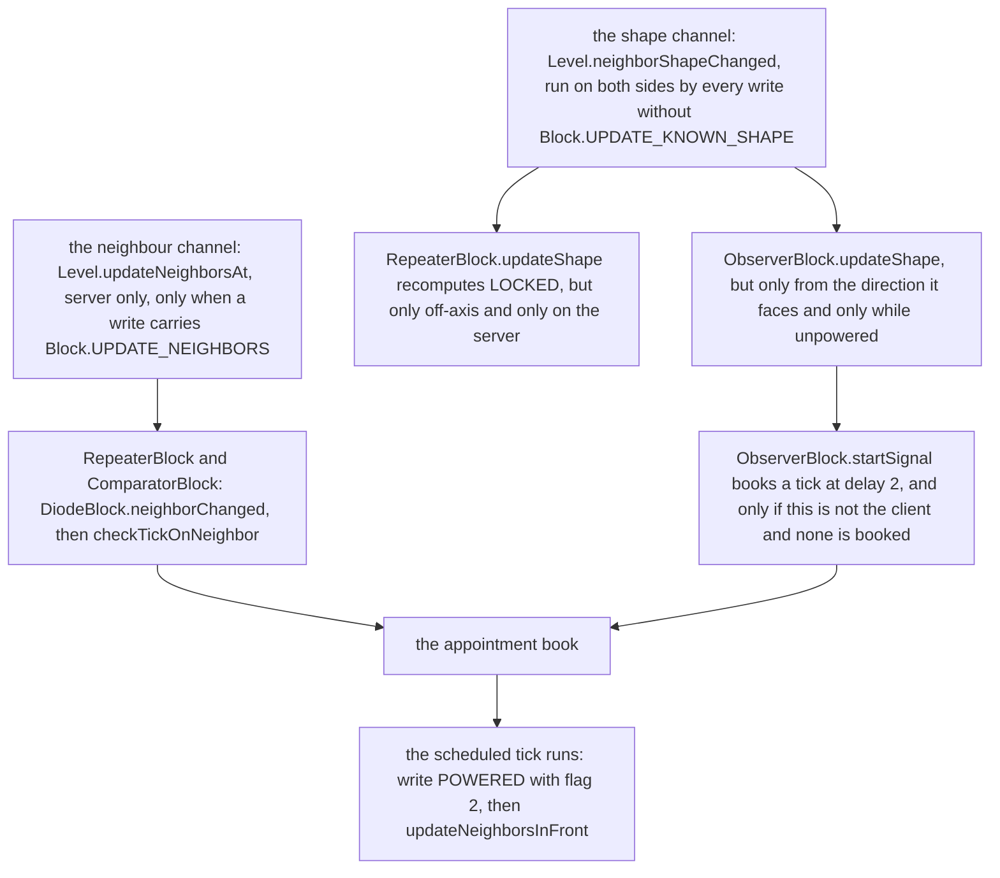

# Diodes and the observer

> Verified against **Minecraft 26.2** · Part V · A repeater, a comparator and an observer in one circuit — three blocks that learn about the world three different ways, and one of them is not listening to redstone at all.

Put a repeater, a comparator and an observer side by side and they look like
variations on one idea: small flat blocks that take a signal in one side and
push one out the other. Two of them genuinely are — `RepeaterBlock` and
`ComparatorBlock` are both `DiodeBlock`s and share their output machinery
exactly. The observer is not a diode at all, and the way it finds out that
something changed is the page's hook: **`ObserverBlock` fires from
`ObserverBlock.updateShape` — a *shape* update — so the one block whose entire
job is noticing change is not on the channel that carries change
notifications.** That is not a curiosity. It is why an observer sees a door
opened by hand, an event that writes with `Block.UPDATE_NEIGHBORS` clear and
therefore fires no neighbour update anywhere in the world. And the repeater
quietly uses the same trick for its lock.

## The cast

| class | what it decides | thread |
|---|---|---|
| `DiodeBlock` | everything the repeater and the comparator share: what counts as input, what counts as a side input, and how output leaves | Server |
| `RepeaterBlock` | a delay in two-tick units, and whether it is locked | Server |
| `ComparatorBlock` | one arithmetic operation, and how far in front of itself it can see | Server |
| `ComparatorBlockEntity` | one integer — the only redstone state in the game that a block state cannot hold | Server |
| `ObserverBlock` | that a neighbour's *state* changed, on a channel the other two do not use for input | Server |
| `Level` | that any write of a state with an analog output pokes the comparators around it | Server |

## Three blocks, three columns

The three differ in exactly three places, and agree everywhere else.

| | `RepeaterBlock` | `ComparatorBlock` | `ObserverBlock` |
|---|---|---|---|
| **what it reads from the front** | `DiodeBlock.getInputSignal` — the signal at the block it faces, and if that is under 15, the raw `RedStoneWireBlock.POWER` of a wire there | the same, then overridden: an analog output if the block in front has one, else one block further through a conductor | nothing. It reads no signal at all |
| **what it reads from the sides** | `DiodeBlock.getAlternateSignal`, restricted to other diodes (`DiodeBlock.sideInputDiodesOnly` is true), and used only to lock | the same, unrestricted, and used as the second operand | nothing |
| **how it books its turn** | `DiodeBlock.checkTickOnNeighbor` unchanged: `RepeaterBlock.DELAY` doubled, at one of three priorities | overrides it entirely: always a delay of 2, at `TickPriority.HIGH` or `TickPriority.NORMAL` | `ObserverBlock.startSignal` from a shape update: delay 2, no priority, and only if one is not already booked |
| **what it stores** | everything, in the block state | one int in a `ComparatorBlockEntity` | everything, in the block state |
| **how it outputs** | `DiodeBlock.updateNeighborsInFront` | the same | `ObserverBlock.updateNeighborsInFront`, an independent copy of the same two calls |

## A diode never writes into its target

The output half is the least-known part of all three blocks, and it is shared.
A diode declares itself a source unconditionally
(`DiodeBlock.isSignalSource`), answers `DiodeBlock.ownSignal` with
`DiodeBlock.getOutputSignal` when `DiodeBlock.POWERED` and zero otherwise, and
restricts `DiodeBlock.getSignal` to the one direction it faces — so a repeater
offers its 15 to precisely one neighbour, and `DiodeBlock.getDirectSignal`
hands out the same value, which is what makes a diode able to strongly power
the block in front of it.

A diode's `HorizontalDirectionalBlock.FACING` points at the **input**. `Block.getStateForPlacement`
takes the player's horizontal direction and reverses it, so the output is at
`FACING.getOpposite()`, and that is the position
`DiodeBlock.updateNeighborsInFront` acts on. It does two things there: a
direct `Level.neighborChanged` on the output block, and a
`Level.updateNeighborsAtExceptFromFacing` around that same block, skipping the
direction that points back at the diode. **It never writes a state into the
target.** It notifies, and lets the target read back through
`SignalGetter.getSignal` — which is why a repeater feeding a repeater works
without either of them knowing what the other is.

The signal leaves by an unexpected door. `DiodeBlock.tick` writes
`DiodeBlock.POWERED` with `Block.UPDATE_CLIENTS` alone — flags 2, no
neighbour bit — so `Level.setBlock`'s own fan-out never runs. What actually
propagates the change is `DiodeBlock.onPlace`, which
`LevelChunk.setBlockState` runs on the server for any write without
`Block.UPDATE_SKIP_ON_PLACE`, and which calls
`DiodeBlock.updateNeighborsInFront`
([blocks and states](blocks-and-states.md#the-two-update-channels)).

## What each one can see

`DiodeBlock.getInputSignal` reads the block it faces and then, if that gave
less than 15, takes the maximum with the raw `RedStoneWireBlock.POWER` of a
wire sitting there — the special case that lets a diode read a wire whose
connection state does not point at it.

`DiodeBlock.getAlternateSignal` reads the two horizontals perpendicular to the
facing through `SignalGetter.getControlInputSignal`, and
`DiodeBlock.sideInputDiodesOnly` decides what counts. For a repeater it is
true, so only another diode can reach a repeater's side, and the value is used
solely by `RepeaterBlock.isLocked`. For a comparator it is false, so a
redstone block reads as 15, a wire reads as its power, and any signal source
reads as its strong output — and the value is the comparator's second operand.

`ComparatorBlock.getInputSignal` is where comparators earn their reputation.
If the block in front has an analog output, that value replaces the redstone
reading outright. Otherwise, if the reading is under 15 and the block in front
is a redstone conductor, the comparator looks **one block further** and takes
the best of two things there: the analog output of whatever block is at that
position, and the reading of an `ItemFrame` — but only one facing the right
way, and only if there is **exactly one** in that block's space. Two item
frames in the same block and the comparator sees neither.

A container's analog output is
`AbstractContainerMenu.getRedstoneSignalFromContainer`: every slot's count
divided by *that stack's own* maximum size, summed, divided by the number of
slots, and mapped onto 0–15. Stack size is per item, so a chest of shulker
boxes and a chest of cobblestone at the same item count read very differently.

## Booking a turn, and why a repeater turns off first

All three block-and-schedule rather than acting immediately; the queue itself,
its dedup rule and the drain are [scheduled
ticks](../world/scheduled-ticks.md), which traces a repeater in full. What
belongs here is *which priority each one asks for*, because that is where the
two diodes stop agreeing.

`DiodeBlock.checkTickOnNeighbor` books only when the current
`DiodeBlock.POWERED` disagrees with the current input, and only when
`LevelTickAccess.willTickThisTick` says nothing is already about to run there.
It picks `TickPriority.EXTREMELY_HIGH` when `DiodeBlock.shouldPrioritize`
holds — when the block it outputs into is itself a diode that is not pointing
straight back — `TickPriority.VERY_HIGH` when the diode is currently on, and
`TickPriority.HIGH` otherwise. So a diode's turn-off beats another's turn-on
due on the same tick, and a diode feeding a diode beats both. The only
`TickPriority.NORMAL` booking a repeater makes is `DiodeBlock.setPlacedBy`, at
delay 1, when you place one into an already-powered spot.

`ComparatorBlock.checkTickOnNeighbor` throws all of that away. It never
consults the lock, its delay is a flat 2 whatever the state says, and it
chooses between `TickPriority.HIGH` and `TickPriority.NORMAL` alone — the two
urgent priorities a repeater relies on are not available to it. It also books
on a second condition the repeater does not have: not only when the powered
flag disagrees with the input, but whenever the *computed output value*
differs from the int currently in the block entity.

`DiodeBlock.tick` is what pulse extension is made of. Finding itself off, it
turns on regardless of whether the input is still there — and then, if the
input has already gone, books its own turn-off one delay later at
`TickPriority.VERY_HIGH`. A pulse shorter than the delay is not swallowed; it
is stretched to the delay.

## The channel the observer listens on

An observer watches for `ObserverBlock.updateShape` arriving from the one
direction it faces, while `ObserverBlock.POWERED` is false, and books a
two-tick appointment. Two ticks later `ObserverBlock.tick` writes the powered
state with flags 2, schedules its own turn-off two ticks after that, and
pulses through `ObserverBlock.updateNeighborsInFront`. The shape channel is
the right one for the job because it carries *your neighbour's state changed*
regardless of whether the neighbour told anybody: a door opened by hand writes
with flags 10 and issues no neighbour update at all, and the observer still
sees it ([block interaction](block-interaction.md)).

`RepeaterBlock.LOCKED` works the same way, and it is the only diode property
that is not computed from a redstone reading at tick time.
`RepeaterBlock.updateShape` recomputes it whenever an **off-axis** neighbour
changes — the two sides — so locking follows a neighbouring repeater's state
without either block scheduling anything.

The tempting conclusion is that both blocks chose the shape channel because it
is the half of the update machinery a client also runs. That is not what the
code does: **both hooks refuse to act on the client.**
`RepeaterBlock.updateShape` recomputes the lock only when the level is not
client-side, and `ObserverBlock.startSignal` returns immediately on a
`ClientLevel`. Nor would it help if they did — a client keeps no appointment
book at all, so a scheduled tick could never fire there. Everything a client
knows about any of these three blocks arrives as a block update.

## One int, and the fan-out that exists to deliver it

The comparator is the only redstone block with a block entity, and it has one
for a single reason: `ComparatorBlock.calculateOutputSignal` can produce a
number that the block state has nowhere to keep. `DiodeBlock.POWERED` is
one bit, and a comparator's output is 0–15.
`ComparatorBlockEntity.getOutputSignal` is that number, written by
`ComparatorBlock.refreshOutputState` — which also flips the powered bit when
it needs to, and then calls `DiodeBlock.updateNeighborsInFront` whether or not
anything changed, whenever the mode is `ComparatorMode.COMPARE`.

The other half of making comparators work is `Level.updateNeighbourForOutputSignal`,
called from the tail of every `Level.setBlock` whose new state has an analog
output. It walks the four horizontals and notifies any `Blocks.COMPARATOR` it
finds, and — where the neighbour is a redstone conductor — reaches one further
and notifies a comparator there too, mirroring the comparator's own reach in
the opposite direction. So every write to a container in the world carries a
second, comparator-only fan-out on top of the ordinary neighbour channel, and
that is what makes a comparator notice an item entering a chest that nothing
else in redstone would have reported.

## Questions players ask

**Why does an observer fire when I open a door next to it, when doors do not
power anything?** Because the observer is not looking for power. It watches
the shape channel, which every ordinary write runs on both sides, and a door
opening is an ordinary write — flags 10, no neighbour updates, three shape
passes.

**Why did my repeater stay on after the input dropped?** Because
`DiodeBlock.tick` turns a repeater on whether or not the input is still there,
and books the turn-off one delay later. That is the mechanism behind pulse
extension, and it is two entries in the scheduled-tick queue rather than any
kind of memory.

**Why can I lock a repeater with another repeater but not with a lever?**
`DiodeBlock.getAlternateSignal` goes through
`SignalGetter.getControlInputSignal` with `DiodeBlock.sideInputDiodesOnly`
true for a repeater, and that flag makes the call answer zero for anything
that is not a `DiodeBlock`.

**Why does my comparator ignore the item frame?** Because
`ComparatorBlock.getInputSignal` accepts an item frame only when it finds
exactly one in that block's space facing the same way the comparator does. A
second frame in the same block makes the count two, and the method returns
nothing rather than choosing.

## Where to look

`DiodeBlock.isSignalSource` · `DiodeBlock.ownSignal` ·
`DiodeBlock.getDirectSignal` · `DiodeBlock.getInputSignal` ·
`DiodeBlock.getAlternateSignal` · `DiodeBlock.sideInputDiodesOnly` ·
`DiodeBlock.checkTickOnNeighbor` · `DiodeBlock.shouldPrioritize` ·
`DiodeBlock.tick` · `DiodeBlock.updateNeighborsInFront` ·
`DiodeBlock.onPlace` · `RepeaterBlock.getDelay` · `RepeaterBlock.isLocked` ·
`RepeaterBlock.updateShape` · `ComparatorBlock.checkTickOnNeighbor` ·
`ComparatorBlock.calculateOutputSignal` · `ComparatorBlock.getInputSignal` ·
`ComparatorBlock.refreshOutputState` · `ComparatorBlockEntity.getOutputSignal` ·
`AbstractContainerMenu.getRedstoneSignalFromContainer` ·
`Level.updateNeighbourForOutputSignal` · `ObserverBlock.updateShape` ·
`ObserverBlock.startSignal` · `ObserverBlock.tick`

---

*Rules: names, never code · how the system works, not how the code reads ·
newest version only · every backticked name passes `tools/verify_names.py`.*
