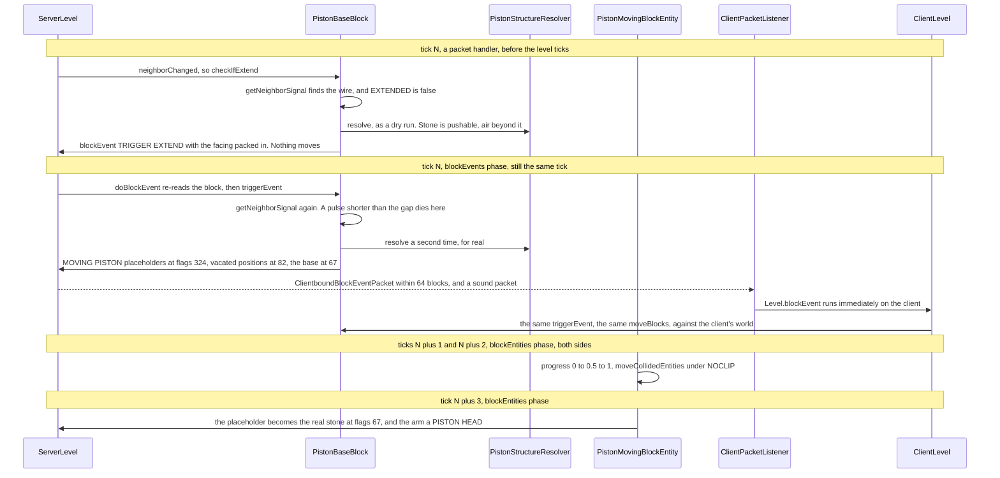

# Pistons and block events

> Verified against **Minecraft 26.2** · Part V · A powered piston pushes one stone block, and the client is never told where the moving blocks are.

A piston is the only block in the game that cannot act when it is asked. Every
other block in Part V answers a neighbour update by writing a state there and
then; `PistonBaseBlock.checkIfExtend` writes nothing at all. It appends a
five-value record to a set on the level and returns, and the push happens
later, in a phase of the level tick named for exactly this. What comes out the
other side is stranger still: **the moving blocks are never sent to anyone.**
The placeholders the server writes carry `Block.UPDATE_CLIENTS` deliberately
clear, so no block update for them is ever generated, and the copy on your
screen exists only because your client re-ran `PistonBaseBlock.moveBlocks`
itself against its own world, off a single `ClientboundBlockEventPacket`. It
is not a prediction that gets confirmed. No correcting packet ever follows,
and if that one packet is lost you watch nothing move.

## The cast

| class | what it decides | thread |
|---|---|---|
| `BlockEventData` | the record itself: a position, a block, and two ints | a record, no thread |
| `ServerLevel` | that a block event is *queued* rather than run, and the one phase per tick in which the queue drains | Server |
| `Level` | that on any other level — which in practice means `ClientLevel` — a block event runs **immediately** | Render |
| `PistonBaseBlock` | whether to extend, which of three events to raise, and — at the drain, having re-checked — what actually moves | Server, then the client's copy |
| `PistonStructureResolver` | the set of blocks that move and the set that is destroyed, or a flat refusal | either side, allocated per attempt |
| `MovingPistonBlock` | the placeholder state that occupies a position during the motion | either side |
| `PistonMovingBlockEntity` | the two ticks of motion, the entities shoved along, and what is left behind at the end | both sides, in the block-entity phase |
| `PistonHeadBlock` | the arm once the motion is over, and forwarding neighbour updates back to the base | Server |

## The queue, and which tick it drains in

`Level.blockEvent` runs `BlockBehaviour.BlockStateBase.triggerEvent` on the
spot. `ServerLevel.blockEvent` overrides it to add a `BlockEventData` to
`ServerLevel.blockEvents` and return. That single override is the whole
mechanism, and it is the reason the two sides of a piston behave so
differently: the server always defers, the client never does.

The drain is `ServerLevel.runBlockEvents`, in the *blockEvents* section of
`ServerLevel.tick`, after *tickPending* and *chunkSource* and before
*entities* ([the level tick](../server/server-level-tick.md)). It is worth
being exact about what that timing means, because "a block event is a tick
late" is only sometimes true:

- **Queued by a packet handler — the same tick.**
  `MinecraftServer.processPacketsAndTick` drains the queued packets and *then*
  calls `MinecraftServer.tickServer` in the same lap, so a lever a player
  flipped is handled before the level ticks at all, and the event it raised is
  drained in that same level tick.
- **Queued by a scheduled tick — the same tick.** *tickPending* runs before
  *blockEvents*, so a repeater firing into a piston is also drained
  immediately ([scheduled ticks](../world/scheduled-ticks.md)).
- **Queued by another block event — the same tick.**
  `ServerLevel.runBlockEvents` drains until the set is empty, so an event
  raised while the drain is running is taken by the same drain.
- **Queued by an entity or a block entity — the next tick.** Those phases run
  after *blockEvents*, so anything they raise waits a full lap. A
  `PistonMovingBlockEntity` finishing its motion is in this group.
- **In a chunk that is not block-ticking — parked.** Such an event goes to
  `ServerLevel.blockEventsToReschedule` and is re-added *after* the loop, so
  it is retried next tick rather than dropped.

`ServerLevel.blockEvents` is a linked hash **set**, so two identical events
raised in one tick collapse into one. And `ServerLevel.doBlockEvent` re-reads
the position and runs the event only if the block there is still the block the
event named — the same promise a scheduled tick makes. When
`BlockBehaviour.BlockStateBase.triggerEvent` returns true, and only then, a
`ClientboundBlockEventPacket` goes to every player within 64 blocks.

The piston is the mechanism's most demanding customer but not its only one.
Four blocks raise events directly — `PistonBaseBlock`, `NoteBlock`,
`PotentSulfurBlock` and, through its block entity, `ComparatorBlock` — and
`BaseEntityBlock.triggerEvent` forwards to any block entity that wants one,
which is how a chest lid, an ender chest, a shulker box, a bell, a decorated
pot, a spawner and an end gateway all get animated on clients that own no
copy of their state.

## One push, tick by tick

## How a piston decides, and the line that cannot fire

`PistonBaseBlock.getNeighborSignal` is the whole of quasi-connectivity, and it
is about ten lines. It asks `SignalGetter.hasSignal` at all six neighbours
except the one it faces; then, if none of those answered, it repeats the same
question for five of the neighbours of the position **directly above** the
piston, skipping `Direction.DOWN` because that would only read the piston
again. That upward reach is implemented nowhere else in the game, which is why
quasi-connectivity is a piston quirk rather than a redstone rule. What signal
means, and how the wire beside the piston comes to be connected to it at all,
is [signal and dust](signal-and-dust.md).

Between the two loops sits a third question — `SignalGetter.hasSignal` at the
piston's *own* position, looking down — and it can never return true.
`SignalGetter.getSignal` consults the strong power pushed into a position only
when the block there is a redstone conductor, and `Blocks.pistonProperties`
declares a piston never to be one; `PistonBaseBlock` overrides no signal
method of its own, so its weak answer is zero. Strong power reaches a piston
the ordinary way, through its conducting neighbours, in the first loop. The
middle call is dead.

`PistonBaseBlock.checkIfExtend` turns the answer into one of three events.
Powered and not extended raises `PistonBaseBlock.TRIGGER_EXTEND` — but only if
a dry-run `PistonStructureResolver.resolve` succeeds first, so a piston with
an immovable wall in front of it queues nothing at all. Unpowered and extended
raises `PistonBaseBlock.TRIGGER_CONTRACT`, or
`PistonBaseBlock.TRIGGER_DROP` when the extension it would retract is still in
flight: the block two ahead is still a `Blocks.MOVING_PISTON` that is
extending, and either its progress is under half, or it was ticked this very
game tick, or `ServerLevel.isHandlingTick` says the level is still inside the
window that closes when the block-event drain ends.

## What moves, and what is simply gone

`PistonStructureResolver` runs twice per push — once as
`PistonBaseBlock.checkIfExtend`'s dry
run, once for real inside `PistonBaseBlock.moveBlocks` — and produces two
lists, `PistonStructureResolver.toPush` and `PistonStructureResolver.toDestroy`.
`PistonStructureResolver.addBlockLine` walks forward from the piston until it
runs out of blocks, bounded by `PistonStructureResolver.MAX_PUSH_DEPTH`, 12;
`PistonStructureResolver.addBranchingBlocks` follows slime and honey sideways,
with `PistonStructureResolver.canStickToEachOther` refusing the one pairing
everybody tests first — slime against honey does not stick.

`PistonBaseBlock.isPushable` is the per-block veto and it is a longer list
than folklore suggests: outside the build height or the world border, obsidian
and its three relatives, a block whose destroy speed is −1, a `PushReaction`
of `PushReaction.BLOCK`, a `PushReaction.DESTROY` where the caller did not
allow destruction, a `PushReaction.PUSH_ONLY` being moved the wrong way, an
already-extended piston, and — the clause that explains the most —
**anything with a block entity**. A chest cannot be pushed because
`PistonMovingBlockEntity` has nowhere to keep one.

## The write nobody is told about

`PistonBaseBlock.moveBlocks` writes four kinds of position, and their flag
words are the page's hook made concrete. Which bit does what is
[blocks and states](blocks-and-states.md#the-two-update-channels).

| what | flags | the bits that matter |
|---|---:|---|
| each moving block's destination, and the arm | 324 | `Block.UPDATE_SKIP_BLOCK_ENTITY_SIDEEFFECTS`, `Block.UPDATE_MOVE_BY_PISTON`, `Block.UPDATE_INVISIBLE` — and **no** `Block.UPDATE_CLIENTS` |
| each vacated position, set to air | 82 | `Block.UPDATE_MOVE_BY_PISTON`, `Block.UPDATE_KNOWN_SHAPE`, `Block.UPDATE_CLIENTS` — this one *is* sent |
| the piston base, now extended | 67 | `Block.UPDATE_MOVE_BY_PISTON`, `Block.UPDATE_CLIENTS`, `Block.UPDATE_NEIGHBORS` |
| a destroyed block, set to air | 18 | `Block.UPDATE_KNOWN_SHAPE`, `Block.UPDATE_CLIENTS` |

So a client is told that the source position went empty and that the base is
extended, and is told **nothing** about the two positions now holding
placeholders. Each placeholder's `PistonMovingBlockEntity` is injected by hand
with `Level.setBlockEntity` — `MovingPistonBlock.newBlockEntity` returns null,
because a moving piston is never created by the ordinary block-entity path —
and carries the real block as `PistonMovingBlockEntity.movedState`.

`ClientPacketListener.handleBlockEvent` hands the packet to the base
`Level.blockEvent`, which runs `PistonBaseBlock.triggerEvent` immediately
against the `ClientLevel`: the same resolver, the same placeholders, the same
injected block entities. The one thing the client does not do is play the
sound. `PistonBaseBlock.moveBlocks` passes a null *except* entity, and
`ClientLevel.playSeededSound` plays a sound only when *except* is the local
player — so the piston you hear is the server's `ClientboundSoundPacket`,
arriving beside the event. The particles of a crushed block are the mirror
image: the level event that spawns them is raised inside
`PistonBaseBlock.moveBlocks` on the **client** side only.

## Two ticks of motion, and two ways to end

`PistonMovingBlockEntity.tick` runs in the block-entity phase on both sides
and does one thing per tick: add 0.5 to `PistonMovingBlockEntity.progress`,
after shoving whatever is in the swept slab with
`PistonMovingBlockEntity.moveCollidedEntities` and dragging honey-stuck
entities with `PistonMovingBlockEntity.moveStuckEntities`. The
`PistonMovingBlockEntity.NOCLIP` thread-local is set for the duration so that
a pushed entity may pass through the very block pushing it.
`PistonMovingBlockEntity.TICKS_TO_EXTEND` is declared as 2 and never read —
the 0.5 is a literal.

The tick *after* progress reaches 1 is the landing. The entity is removed, and
`Block.updateFromNeighbourShapes` re-fits the moved state to its new
surroundings before it is written at flags 67, with a waterlogged property
cleared if it survived the trip. The client holds five extra
`PistonMovingBlockEntity.deathTicks` before doing the same, which is why the
visual arrival lags the server's slightly — and why it does not matter, since
the server's own write is broadcast anyway.

`PistonMovingBlockEntity.finalTick` is a **different** operation, not an
early-exit form of that one, and the difference is what makes an interrupted
extension clean up after itself. It writes at flags 3 rather than 67, and for
the entity carrying the arm — the one with
`PistonMovingBlockEntity.isSourcePiston` — it writes **air** instead of the
moved state, so a retraction that catches its own extension in flight leaves
nothing behind. It is reached from
`PistonMovingBlockEntity.preRemoveSideEffects`, and directly from
`PistonBaseBlock.triggerEvent`'s contract branch.

## Questions players ask

**Is a piston really a tick late?** The queue is not a fixed delay — it is a
wait for one named phase. A lever flipped by a player and a repeater firing
both land in the same tick the piston was told about, because packets and
scheduled ticks are both handled before the *blockEvents* phase. What you see
as the piston's delay is the two ticks of motion afterwards, plus a third for
the landing.

**Why did my one-tick pulse move nothing at all?** Because
`PistonBaseBlock.triggerEvent` asks `PistonBaseBlock.getNeighborSignal` again
at the drain, and a piston no longer powered simply returns false. The event
is consumed, no blocks move, and no `ClientboundBlockEventPacket` is sent, so
nobody sees anything happen either.

**Why does a piston push a block that is powering it?** Because the two
questions are asked of different positions.
`PistonBaseBlock.getNeighborSignal` deliberately skips the direction the
piston faces when looking for power, so the block in front never counts as a
source — and then reaches up a block, which is the only place in the game
anything does.

**Can a piston push a chest?** No, and the reason is one clause in
`PistonBaseBlock.isPushable`: anything with a block entity is refused.
`PistonMovingBlockEntity` has a field for the moved *state* and none for a
moved block entity, so there is nowhere to put a chest's contents for the two
ticks of the journey.

**Why did the blocks stay put on my screen when everyone else saw them
move?** Because the placeholders are not synchronised. Your client built its
copy by re-running the push from one `ClientboundBlockEventPacket`, and that
packet is sent once, to players within 64 blocks, only if the server's own
`BlockBehaviour.BlockStateBase.triggerEvent` returned true. Nothing checks
afterwards that the two worlds agree.

## Where to look

`Level.blockEvent` · `ServerLevel.blockEvent` · `ServerLevel.runBlockEvents` ·
`ServerLevel.doBlockEvent` · `BlockEventData` ·
`BlockBehaviour.BlockStateBase.triggerEvent` · `BaseEntityBlock.triggerEvent` ·
`PistonBaseBlock.checkIfExtend` · `PistonBaseBlock.getNeighborSignal` ·
`PistonBaseBlock.triggerEvent` · `PistonBaseBlock.moveBlocks` ·
`PistonBaseBlock.isPushable` · `PistonStructureResolver.resolve` ·
`PistonStructureResolver.addBlockLine` ·
`PistonStructureResolver.addBranchingBlocks` ·
`MovingPistonBlock.newMovingBlockEntity` · `PistonMovingBlockEntity.tick` ·
`PistonMovingBlockEntity.finalTick` ·
`PistonMovingBlockEntity.moveCollidedEntities` ·
`ClientPacketListener.handleBlockEvent`

---

*Rules: names, never code · how the system works, not how the code reads ·
newest version only · every backticked name passes `tools/verify_names.py`.*
