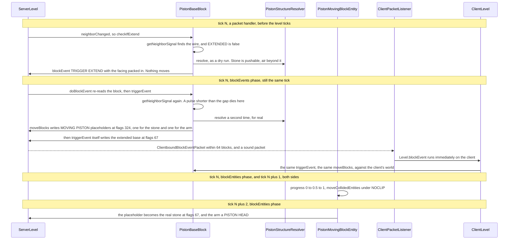

# Pistons and block events

> Verified against **Minecraft 26.2** · Part V · A powered piston pushes one stone block, and the client is never told where the moving blocks are.

A piston cannot act when it is asked. A repeater told about a change books a
turn in the appointment book and a wire recomputes itself on the spot;
`PistonBaseBlock.checkIfExtend` does neither. It appends a four-value record
to a set on the level and returns, and the push happens later, in a phase of
the level tick named for exactly this. What comes out the other side is
stranger still: **no block update is ever sent for the moving blocks.** The
placeholders the server writes carry `Block.UPDATE_CLIENTS` deliberately
clear, so nothing incremental is generated for them, and the copy on your
screen exists only because your client re-ran `PistonBaseBlock.moveBlocks`
itself against its own world, off a single `ClientboundBlockEventPacket`. It
is not a prediction that gets confirmed. Nothing checks that the two
animations agree; if that one packet is lost you watch nothing move, and only
the landing write puts the block where everyone else already sees it.

## The cast

| class | what it decides | thread |
|---|---|---|
| `BlockEventData` | the record itself: a position, a block, and two ints | a record, no thread |
| `ServerLevel` | that a block event is *queued* rather than run, and the one phase per tick in which the queue drains | Server |
| `Level` | that on any other level — which in practice means `ClientLevel` — a block event runs **immediately** | Render |
| `PistonBaseBlock` | whether to extend, which of three events to raise, and — at the drain, having re-checked — what actually moves | Server, then the client's copy |
| `PistonStructureResolver` | the set of blocks that move and the set that is destroyed, or a flat refusal | either side, allocated per attempt |
| `MovingPistonBlock` | the placeholder state that occupies a position during the motion | either side |
| `PistonMovingBlockEntity` | the two ticks of motion, the entities shoved along, and what is left behind at the end | both sides, in the block-entity phase |
| `PistonHeadBlock` | the arm once the motion is over, and forwarding neighbour updates back to the base | Server |

## The queue, and which tick it drains in

`Level.blockEvent` runs `BlockBehaviour.BlockStateBase.triggerEvent` on the
spot. `ServerLevel.blockEvent` overrides it to add a `BlockEventData` to
`ServerLevel.blockEvents` and return. That single override is the whole
mechanism, and it is the reason the two sides of a piston behave so
differently: the server always defers, the client never does.

The drain is `ServerLevel.runBlockEvents`, in the *blockEvents* section of
`ServerLevel.tick`, after *tickPending* and *chunkSource* and before
*entities* ([the level tick](../server/server-level-tick.md#the-whole-tick-and-its-three-gates)). It is worth
being exact about what that timing means, because "a block event is a tick
late" is only sometimes true:

- **Queued by a packet handler — the same tick.**
  `MinecraftServer.processPacketsAndTick` drains the queued packets and *then*
  calls `MinecraftServer.tickServer` in the same lap ([the server
  tick](../server/server-tick.md#every-packet-since-last-time-in-one-drain)), so a lever a player flipped is handled
  before the level ticks at all, and the event it raised is drained in that
  same level tick.
- **Queued by a scheduled tick — the same tick.** *tickPending* runs before
  *blockEvents*, so a repeater firing into a piston is also drained
  immediately ([scheduled ticks](../world/scheduled-ticks.md#what-one-drain-actually-does)).
- **Queued by another block event — the same tick.**
  `ServerLevel.runBlockEvents` drains until the set is empty, so an event
  raised while the drain is running is taken by the same drain.
- **Queued by an entity or a block entity — the next tick.** Those phases run
  after *blockEvents*, so anything they raise waits a full lap. A landing
  `PistonMovingBlockEntity` is one step short of this group: it raises no event
  itself, but its `Level.neighborChanged` can reach a neighbouring piston,
  whose `PistonBaseBlock.checkIfExtend` then queues one for next tick.
- **In a chunk that is not block-ticking — parked.** Such an event goes to
  `ServerLevel.blockEventsToReschedule` and is re-added *after* the loop, so
  it is retried next tick rather than dropped.

`ServerLevel.blockEvents` is a linked hash **set**, so two identical events
raised in one tick collapse into one. And `ServerLevel.doBlockEvent` re-reads
the position and runs the event only if the block there is still the block the
event named — the same promise a scheduled tick makes. When
`BlockBehaviour.BlockStateBase.triggerEvent` returns true, and only then, a
`ClientboundBlockEventPacket` goes to every player within 64 blocks.

### Who else uses the channel

The piston is the mechanism's most demanding customer but not its only one.
Three blocks raise events directly — `PistonBaseBlock`, `NoteBlock` and
`PotentSulfurBlock`, the geyser, whose event carries no data at all and exists
only to stamp the same eruption start time onto both sides' block entities — and
seven block entities raise their own, reaching
themselves back through `BaseEntityBlock.triggerEvent`: `ChestBlockEntity`,
`EnderChestBlockEntity`, `ShulkerBoxBlockEntity`, `BellBlockEntity`,
`DecoratedPotBlockEntity`, `SpawnerBlockEntity` and `TheEndGatewayBlockEntity`
— a chest lid, an ender chest, a shulker box, a bell, a decorated pot, a
spawner and an end gateway, all animated on clients that own no copy of their
state. The other forty-odd block entities in the game raise none, which is
why a block event is a small channel rather than a general one.
`ComparatorBlock` is the odd one out and worth a moment: it overrides
`BlockBehaviour.BlockStateBase.triggerEvent` to forward to its block entity,
but `ComparatorBlockEntity` overrides nothing and nothing anywhere raises a
comparator event, so the override is dead in both directions.

## One push, tick by tick

Four flag words go past in the next twenty lines, and they are worth having in
hand: **324** is *skip the block entity's side effects, moved by piston,
invisible*; **276** swaps the piston bit for *known shape*; **67** is *moved by
piston, clients, neighbours*; and **3** is the ordinary *neighbours and
clients*. Only 67 and 3 tell a client anything. The table in [the write nobody
is told about](#the-write-nobody-is-told-about) has them row by row, and the
bit names are the catalogue's ([block update
flags](../../reference/block-update-flags.md)).

## How a piston decides, and the line that cannot fire

### Quasi-connectivity is two loops, not a rule

`PistonBaseBlock.getNeighborSignal` is the whole of quasi-connectivity, and it
is one short method. It asks `SignalGetter.hasSignal` at all six neighbours
except the one it faces; then, if none of those answered, it repeats the same
question for five of the neighbours of the position **directly above** the
piston, skipping `Direction.DOWN` because that would only read the piston
again. The piston is not the only block that reaches up like this, but the
family is tiny and each member spells the reach out for itself:
`DispenserBlock.neighborChanged` asks `SignalGetter.hasNeighborSignal` at its
own position *or* at the one above it, and
`DoorBlock.getStateForPlacement` asks the same pair when a door is placed.
`DropperBlock` has the behaviour too, by extending `DispenserBlock` and
overriding nothing — so **three blocks reach up and only two write it down**,
and no other block in the game does either. That is why
quasi-connectivity is a short list of block-by-block quirks rather than a
redstone rule. What signal means, and how the wire beside the piston comes to
be connected to it at all, is [signal and dust](signal-and-dust.md#dust-and-how-far-it-reaches).

### The call between the loops is dead

Between those two loops sits a third question — `SignalGetter.hasSignal` at the
piston's *own* position, looking down — and it can never return true. A
position answers with strong power only if the block standing there is a
redstone conductor ([signal and
dust](signal-and-dust.md#what-a-block-answers-when-it-is-asked-for-power)), and
`Blocks.pistonProperties` declares a piston never to be one; `PistonBaseBlock`
overrides no signal method of its own either, so its weak answer is zero as
well. Strong power reaches a piston the ordinary way, through its conducting
neighbours, in the first loop. The middle call is dead.

### Three events, and what the third one declines to do

`PistonBaseBlock.checkIfExtend` turns the answer into one of three events.
Powered and not extended raises `PistonBaseBlock.TRIGGER_EXTEND` — but only if
a dry-run `PistonStructureResolver.resolve` succeeds first, so a piston with
an immovable wall in front of it queues nothing at all. Unpowered and extended
raises `PistonBaseBlock.TRIGGER_CONTRACT`, or
`PistonBaseBlock.TRIGGER_DROP` when the extension it would retract is still in
flight: the block two ahead is still a `Blocks.MOVING_PISTON` facing the same
way and extending, and either its progress is under half, or it was ticked this very
game tick, or `ServerLevel.isHandlingTick` says the level is still inside the
window that opens at the top of the tick and closes when this drain ends ([the
level
tick](../server/server-level-tick.md#block-events-close-the-handlingtick-window)).

The two retraction events run the same branch of
`PistonBaseBlock.triggerEvent`, and they differ in exactly one thing: a sticky
piston contracting normally may drag the block two ahead back with it, and a
**drop** may not — the pull is guarded on the event being
`PistonBaseBlock.TRIGGER_CONTRACT`. So a sticky piston whose extension is
caught in flight retracts its arm and leaves the block it was carrying where it
stands. That is the whole of the difference, and it is the thing players
discover by accident.

## What moves, and what is simply gone

`PistonStructureResolver` runs twice per push — once as
`PistonBaseBlock.checkIfExtend`'s dry
run, once for real inside `PistonBaseBlock.moveBlocks` — and produces two
lists, `PistonStructureResolver.toPush` and `PistonStructureResolver.toDestroy`.
`PistonStructureResolver.addBlockLine` walks forward from the piston until it
runs out of blocks — and backwards along the same axis while the block behind
is sticky — refusing the whole push, not merely stopping, when it meets
something unpushable or runs past twelve. Twelve is a literal at each of the
three tests; `PistonStructureResolver.MAX_PUSH_DEPTH` holds it and is read
nowhere.
`PistonStructureResolver.addBranchingBlocks` follows slime and honey sideways,
with `PistonStructureResolver.canStickToEachOther` refusing the one pairing
everybody tests first — slime against honey does not stick.

`PistonBaseBlock.isPushable` is the per-block veto and it is a longer list
than folklore suggests: outside the build height or the world border, obsidian
and its three relatives, a block whose destroy speed is −1, a `PushReaction`
of `PushReaction.BLOCK`, a `PushReaction.DESTROY` where the caller did not
allow destruction, a `PushReaction.PUSH_ONLY` being moved the wrong way, an
already-extended piston, and — the clause that explains the most —
**anything with a block entity**. A push straight down at the bottom of the
world or straight up at the top is refused too, and a piston itself skips the
destroy-speed and push-reaction tests entirely. A chest cannot be pushed
because it has a block entity; that `PistonMovingBlockEntity` has nowhere to
keep one is the reading of the code that makes sense of the clause, not
something the code says.

## The write nobody is told about

A push writes five kinds of position, and their flag words are the page's hook
made concrete. Four are `PistonBaseBlock.moveBlocks`'s; the fifth is written by
`PistonBaseBlock.triggerEvent` after the other four. Which bit does
what is [blocks and states](blocks-and-states.md#the-two-update-channels).

| what | written by | flags | the bits that matter |
|---|---|---:|---|
| each moving block's destination, and the arm | `PistonBaseBlock.moveBlocks` | 324 | `Block.UPDATE_SKIP_BLOCK_ENTITY_SIDEEFFECTS`, `Block.UPDATE_MOVE_BY_PISTON`, `Block.UPDATE_INVISIBLE` — and **no** `Block.UPDATE_CLIENTS` |
| an old arm cleared on a retraction | `PistonBaseBlock.moveBlocks` | 276 | the same three bits again, with `Block.UPDATE_KNOWN_SHAPE` in place of the piston bit — also **not** sent |
| a vacated position, set to air | `PistonBaseBlock.moveBlocks` | 82 | `Block.UPDATE_MOVE_BY_PISTON`, `Block.UPDATE_KNOWN_SHAPE`, `Block.UPDATE_CLIENTS` — this one *is* sent |
| a destroyed block, set to air | `PistonBaseBlock.moveBlocks` | 18 | `Block.UPDATE_KNOWN_SHAPE`, `Block.UPDATE_CLIENTS` |
| the piston base, now extended | `PistonBaseBlock.triggerEvent` | 67 | `Block.UPDATE_MOVE_BY_PISTON`, `Block.UPDATE_CLIENTS`, `Block.UPDATE_NEIGHBORS` |

In this page's trace nothing is written at 82 at all — every origin down a
straight push is somebody else's destination, so the vacated set empties — and
the reader should take the table's point from the two rows that do fire here:
the client is told that the base is extended, and **nothing** about the two
positions now holding placeholders. Each placeholder's
`PistonMovingBlockEntity` is injected by hand, built by the static
`MovingPistonBlock.newMovingBlockEntity` and installed with
`Level.setBlockEntity` —
`MovingPistonBlock.newBlockEntity`, the ordinary factory, returns null, because a moving piston is
never created by the ordinary block-entity path ([block
entities](block-entities.md#create-keep-replace-remove)) — and carries the real
block as `PistonMovingBlockEntity.movedState`. That state is also the one thing
about a push that *does* travel as data: `PistonMovingBlockEntity` overrides
`BlockEntity.getUpdateTag`, so a player who loads the chunk mid-push receives
the placeholder and its cargo in the chunk packet rather than as an update.

`ClientPacketListener.handleBlockEvent` hands the packet to the base
`Level.blockEvent`, which runs `PistonBaseBlock.triggerEvent` immediately
against the `ClientLevel`: the same resolver, the same placeholders, the same
injected block entities. What the client's copy does not do is the
server's-side-only work — no drops for a crushed block, no game event, no
`BlockBehaviour.BlockStateBase.affectNeighborsAfterRemoval` — and, most
audibly, no sound. `PistonBaseBlock.triggerEvent` passes a **null** *except*
entity, so nobody is excluded and there is no local prediction to hear: the
piston you hear is the server's `ClientboundSoundPacket`, arriving beside the
event ([what makes a sound](../client/what-makes-a-sound.md#who-hears-it)). The particles of a crushed
block are the mirror image: the level event that spawns them is raised inside
`PistonBaseBlock.moveBlocks` on the **client** side only, and only for a block
outside `BlockTags.FIRE`.

## Two ticks of motion, and two ways to end

`PistonMovingBlockEntity.tick` runs in the block-entity phase on both sides
and does one thing per tick: add 0.5 to `PistonMovingBlockEntity.progress`,
after shoving whatever is in the swept slab — `PistonMath` is the class that
computes it — with `PistonMovingBlockEntity.moveCollidedEntities` and dragging honey-stuck
entities with `PistonMovingBlockEntity.moveStuckEntities`. The
`PistonMovingBlockEntity.NOCLIP` thread-local is set around each entity's own
move — and holds the push `Direction` rather than a flag — so that a pushed
entity may pass through the very block pushing it.
`PistonMovingBlockEntity.TICKS_TO_EXTEND` is declared as 2, and the 0.5 is
written as a literal — no reader of the constant survives the decompile.

Note where those two ticks start. The placeholders are written during the
*blockEvents* phase, and a ticker goes straight into the level's flat list — so
the *blockEntities* phase, later in the very same tick, already walks it. The
motion's first tick is the tick the piston was told about, not the one after,
which is why a piston is not "a tick late" so much as three ticks long.

The tick *after* progress reaches 1 is the landing. The entity is removed, and
`Block.updateFromNeighbourShapes` re-fits the moved state to its new
surroundings before it is written at flags 67, with a waterlogged property
cleared if it survived the trip. The arm's position becomes a real
`PistonHeadBlock`, and that block earns its place in the cast by being the one
piece of the assembly that talks *backwards*:
`PistonHeadBlock.neighborChanged` forwards every update it receives to the base
behind it, so power arriving at the head reaches the piston that owns it, and
`PistonHeadBlock.affectNeighborsAfterRemoval` destroys that base when the head
is broken, which is why an arm cannot be mined off a piston and left behind.
The client holds five extra
`PistonMovingBlockEntity.deathTicks` before writing the landing, which is why the
visual arrival lags the server's slightly — and why it does not matter, since
the server's own write is broadcast anyway.

### The other way to end

`PistonMovingBlockEntity.finalTick` is a **different** operation, not an
early-exit form of that one, and the difference is what makes an interrupted
extension clean up after itself. It writes at flags 3 — plain neighbours and
clients, without the moved-by-piston bit the ordinary landing carries — and for
the entity carrying the arm — the one with
`PistonMovingBlockEntity.isSourcePiston` — it writes **air** instead of the
moved state, so a retraction that catches its own extension in flight leaves
nothing behind. That flag is set both on the arm's placeholder and on the one a
contracting piston writes at its own position. It is reached from
`PistonMovingBlockEntity.preRemoveSideEffects`, and directly from
`PistonBaseBlock.triggerEvent`'s contract branch.

## Questions players ask

**Why did my one-tick pulse move nothing at all?** Because
`PistonBaseBlock.triggerEvent` asks `PistonBaseBlock.getNeighborSignal` again
at the drain, and a piston no longer powered simply returns false. The event
is consumed, no blocks move, and no `ClientboundBlockEventPacket` is sent, so
nobody sees anything happen either.

**Why does a piston push a block that is powering it?** Because the two
questions are asked of different positions.
`PistonBaseBlock.getNeighborSignal` deliberately skips the direction the
piston faces when looking for power, so the block in front never counts as a
source — and then goes looking one block higher, where a redstone build would
not think to check.

## Where to look

The channel first: `Level.blockEvent` against `ServerLevel.blockEvent` is the
one override the page turns on, `ServerLevel.runBlockEvents` and
`ServerLevel.doBlockEvent` are the drain, and
`BlockBehaviour.BlockStateBase.triggerEvent` is what a block is finally asked.
Then the piston: `PistonBaseBlock.checkIfExtend` decides,
`PistonBaseBlock.getNeighborSignal` is quasi-connectivity,
`PistonBaseBlock.triggerEvent` runs at the drain and
`PistonBaseBlock.moveBlocks` does the writing.
`PistonStructureResolver.resolve` with `PistonStructureResolver.addBlockLine`
is what moves and `PistonBaseBlock.isPushable` what does not. The motion is
`PistonMovingBlockEntity.tick` and its two endings,
`PistonMovingBlockEntity.finalTick` being the interesting one.
`ClientPacketListener.handleBlockEvent` is the client's entire share.
`BaseEntityBlock.triggerEvent` and
`PistonMovingBlockEntity.moveCollidedEntities` are doors this page only points
at: the seven block entities that animate themselves, and what a push does to
whatever is standing in the way.

---

*Rules: names, never code · how the system works, not how the code reads ·
newest version only · every backticked name passes `tools/verify_names.py`.*
