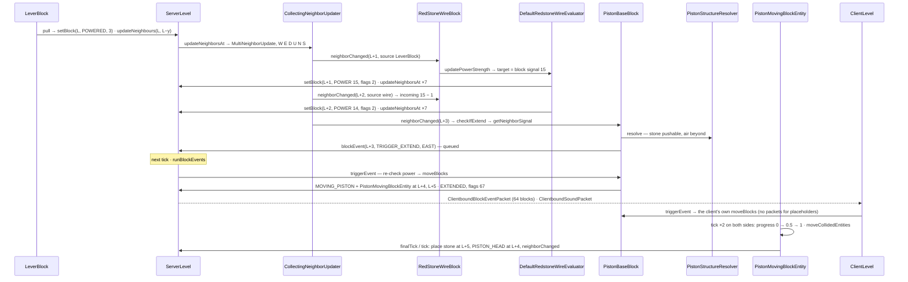

# Redstone

> Verified against **Minecraft 26.2** · Part V · A floor lever, two dust, a piston and one stone: power as a per-state integer, the neighbour-update cascade that carries it, the block-event queue that delays the piston by a tick, and the client that animates the push on its own.

## Responsibility

Redstone is not a system with a scheduler; it is what happens when blocks
answer two questions about their neighbours — *how much signal do you
give me?* and *did something near you change?* — through the same
`BlockBehaviour.neighborChanged` fan-out every block update uses. Dust is the one block
that turns those answers into a network computation, and it comes in two
implementations selected by a feature flag. Pistons add the third
mechanism: a queue of *block events* drained once a tick, and a moving
block entity that both sides tick. The diodes add a fourth — the
scheduled tick — and the observer, the block whose whole job is noticing
changes, turns out to listen on the *shape*-update channel instead.

The one sentence a player recognises: *signal fades by one per dust, a
piston takes a moment and can be powered by the block above it, and
opening a door by hand doesn't trip the redstone next to it.*

## The data it owns

- **Signal** is an int 0–15 (`Redstone.SIGNAL_MIN`, `Redstone.SIGNAL_MAX`,
  `Redstone.SIGNAL_NONE`). A block state answers three questions:
  `BlockBehaviour.BlockStateBase.isSignalSource`,
  `BlockBehaviour.BlockStateBase.getSignal` (weak, per face; defaults to
  `BlockBehaviour.ownSignal`) and `BlockBehaviour.BlockStateBase.getDirectSignal`
  (strong — into a conductor). Conduction is
  `BlockBehaviour.BlockStateBase.isRedstoneConductor`, from
  `BlockBehaviour.Properties.isRedstoneConductor`, which defaults to
  *is the collision shape a full block*. The level reads them through
  `SignalGetter`: `SignalGetter.getDirectSignalTo` (strong power *into* a
  position — how a block becomes strongly powered), `SignalGetter.getSignal`
  (the block's own weak signal, and for a conductor the **maximum** of
  that and the strong power into it — not one or the other),
  `SignalGetter.hasSignal`, `SignalGetter.hasNeighborSignal`,
  `SignalGetter.getBestNeighborSignal`, and `SignalGetter.getControlInputSignal`
  for repeater and comparator sides. The neighbour scans walk
  `SignalGetter.DIRECTIONS` — plain `Direction` order, down, up, north,
  south, west, east — and stop early on a 15. That is a **third** direction
  order, and it is the one that decides what a block reads, as against the
  two that decide what gets notified.
- **The neighbour updater** is `CollectingNeighborUpdater` on every
  `Level` ([block interaction](block-interaction.md) describes its stack,
  the depth-first drain and the *max-chained-neighbor-updates* cap). What
  matters here: `NeighborUpdater.UPDATE_ORDER` is west, east, down, up,
  north, south; a `CollectingNeighborUpdater.MultiNeighborUpdate` issues
  one direction per step, so a neighbour's whole cascade runs before the
  next direction is even dispatched; and `Level.updateNeighborsAt` /
  `Level.neighborChanged` are **empty on `Level`** — only `ServerLevel`
  routes them, so the client never runs a neighbour update.
- **`Orientation`** is the experimental locality context: one of 48
  precomputed instances (`Orientation.ORIENTATIONS`) of an up, a front and
  an `Orientation.SideBias`, with `Orientation.getDirections` (back,
  front, side, other side, down, up) as the oriented replacement for the
  fixed order, and `Orientation.withFront` / `Orientation.withUp` links.
  `ExperimentalRedstoneUtils.initialOrientation` returns **null unless
  `FeatureFlags.REDSTONE_EXPERIMENTS` is enabled**, otherwise a random
  orientation with `Orientation.SideBias.LEFT`; `BlockBehaviour.neighborChanged`
  carries a nullable one, and `BlockBehaviour.affectNeighborsAfterRemoval`
  does not.
- **Dust** — `RedStoneWireBlock` — has `RedStoneWireBlock.POWER`
  (`BlockStateProperties.POWER`) and four `RedstoneSide` properties
  (`RedStoneWireBlock.NORTH` …; `RedstoneSide.UP`, `RedstoneSide.SIDE`,
  `RedstoneSide.NONE`), a `RedStoneWireBlock.crossState`, sixteen
  `RedStoneWireBlock.COLORS`, and two pieces of state that are not on the
  block state at all: `RedStoneWireBlock.evaluator`, always a
  `DefaultRedstoneWireEvaluator`, and `RedStoneWireBlock.shouldSignal`, a
  mutable boolean on the block singleton flipped false around
  `RedStoneWireBlock.getBlockSignal` so that dust does not count as a
  source while block power is computed.
- **The evaluators** share `RedstoneWireEvaluator`, whose
  `RedstoneWireEvaluator.getIncomingWireSignal` is where *minus one per
  block* lives (the best of the four side wires, the wire on top of a
  conducting neighbour if nothing conducts above this one, the wire
  below a non-conducting neighbour — less one). `DefaultRedstoneWireEvaluator.calculateTargetStrength`
  takes block power if it is 15, else the max with incoming wire power.
  `ExperimentalRedstoneWireEvaluator` is a fresh, stateful instance per
  call: `ExperimentalRedstoneWireEvaluator.wiresToTurnOff`,
  `ExperimentalRedstoneWireEvaluator.wiresToTurnOn`, and
  `ExperimentalRedstoneWireEvaluator.updatedWires`, an insertion-ordered
  map of position to packed orientation-and-power.
- **The lever** — `LeverBlock` — has `LeverBlock.POWERED`, and from
  `FaceAttachedHorizontalDirectionalBlock` the `AttachFace` and facing;
  `LeverBlock.ownSignal` is 15 in every direction when powered, and
  `LeverBlock.getDirectSignal` is 15 only into the block it hangs on
  (`FaceAttachedHorizontalDirectionalBlock.getConnectedDirection`).
- **The piston** — `PistonBaseBlock` (`Blocks.PISTON`, `Blocks.STICKY_PISTON`;
  `PistonBaseBlock.isSticky` is a field) — has `PistonBaseBlock.EXTENDED`
  and a facing; three block-event ids, `PistonBaseBlock.TRIGGER_EXTEND`,
  `PistonBaseBlock.TRIGGER_CONTRACT`, `PistonBaseBlock.TRIGGER_DROP`;
  `Blocks.pistonProperties` declares it a non-conductor with
  `PushReaction.BLOCK`. `PistonStructureResolver` computes what moves:
  `PistonStructureResolver.toPush`, `PistonStructureResolver.toDestroy`,
  `PistonStructureResolver.MAX_PUSH_DEPTH` (12). `MovingPistonBlock`
  (`Blocks.MOVING_PISTON`) is the placeholder during motion, and
  `PistonMovingBlockEntity` (`BlockEntityTypes.PISTON`) the moving state:
  `PistonMovingBlockEntity.movedState`, `PistonMovingBlockEntity.progress`
  / `PistonMovingBlockEntity.progressO`, `PistonMovingBlockEntity.extending`,
  `PistonMovingBlockEntity.isSourcePiston`, `PistonMovingBlockEntity.lastTicked`,
  `PistonMovingBlockEntity.deathTicks`, and the `PistonMovingBlockEntity.NOCLIP`
  thread-local that lets pushed entities pass through the block pushing
  them. There is no field for a moved block entity — `PistonBaseBlock.isPushable`
  refuses anything with one. `PistonHeadBlock` is the real head afterwards.
  `PushReaction` per block (`PushReaction.NORMAL`, `PushReaction.DESTROY`,
  `PushReaction.BLOCK`, `PushReaction.IGNORE`, `PushReaction.PUSH_ONLY`)
  comes from `BlockBehaviour.Properties.pushReaction`.
- **The block-event queue** on `ServerLevel`: `ServerLevel.blockEvents`,
  a linked hash *set* of `BlockEventData` (position, block, two ints —
  duplicates collapse), and `ServerLevel.blockEventsToReschedule` for
  events in chunks that cannot tick yet.

## When it runs

**Server main thread**, inside whatever `Level.setBlock` started the
cascade — a packet handler, a scheduled tick, another block's update —
synchronously through `CollectingNeighborUpdater.runUpdates`. Pistons
break the synchrony: `PistonBaseBlock.checkIfExtend` only enqueues, and
`ServerLevel.runBlockEvents` drains the queue under the *blockEvents*
section of `ServerLevel.tick`, after scheduled ticks and the chunk
source tick, before entities ([the level tick](../server/server-level-tick.md)).
`ServerLevel.handlingTick` is true from the start of the tick through
that drain; `ServerLevel.isHandlingTick` feeds the drop decision. Moving
pistons then tick as block entities on **both** sides
(`MovingPistonBlock.getTicker`; [block entities](block-entities.md)).
Repeaters and comparators are both scheduled ticks, but they do not share
the scheduling rule. The **repeater** uses `DiodeBlock.checkTickOnNeighbor`
as written on the base class: `ScheduledTickAccess.scheduleTick` at
`TickPriority.HIGH`, `TickPriority.VERY_HIGH` when turning off and
`TickPriority.EXTREMELY_HIGH` when facing another diode — the reason a
repeater turns off before it turns on
([block ticks and fluids](../world/block-ticks-and-fluids.md)). The
**comparator** overrides `ComparatorBlock.checkTickOnNeighbor` entirely:
a fixed two-tick delay at `TickPriority.HIGH` or `TickPriority.NORMAL`,
never the two urgent priorities. It overrides `ComparatorBlock.tick` too.

## The trace: a lever powers a piston

Lever on the floor at L; dust at L+1 and L+2 to the east; piston at L+3
facing east; stone at L+4; air beyond. Default evaluator.

1. **The pull.** `ServerPlayerGameMode.useItemOn` →
   `BlockBehaviour.BlockStateBase.useWithoutItem` → `LeverBlock.useWithoutItem`
   → `LeverBlock.pull` (the client's copy only spawns a dust particle —
   no predicted state). `Level.setBlock` of `LeverBlock.POWERED` with
   `Block.UPDATE_ALL`: flag 1 already fires `ServerLevel.updateNeighborsAt`
   on L; then `LeverBlock.updateNeighbours` does it again for L and for
   the block the lever stands on, which is now strongly powered through
   `SignalGetter.getDirectSignalTo`; `LeverBlock.playSound` (`SoundEvents.LEVER_CLICK`)
   and `GameEvent.BLOCK_ACTIVATE`.
2. **The fan-out.** `ServerLevel.updateNeighborsAt` computes an
   `ExperimentalRedstoneUtils.initialOrientation` (null here) and hands
   `CollectingNeighborUpdater.updateNeighborsAtExceptFromFacing` a
   `CollectingNeighborUpdater.MultiNeighborUpdate`. Nothing is running,
   so `CollectingNeighborUpdater.addAndRun` starts the drain: west (air),
   then east — `NeighborUpdater.executeUpdate` →
   `BlockBehaviour.BlockStateBase.handleNeighborChanged` →
   `RedStoneWireBlock.neighborChanged` at L+1.
3. **Dust computes.** `RedStoneWireBlock.canSurvive` holds →
   `RedStoneWireBlock.updatePowerStrength`, which picks the evaluator by
   `RedStoneWireBlock.useExperimentalEvaluator` (`LevelReader.enabledFeatures`)
   → `DefaultRedstoneWireEvaluator.updatePowerStrength`.
   `DefaultRedstoneWireEvaluator.calculateTargetStrength`:
   `RedStoneWireBlock.getBlockSignal` clears `RedStoneWireBlock.shouldSignal`,
   asks `SignalGetter.getBestNeighborSignal`, and the lever — not a
   conductor, so its own `LeverBlock.ownSignal` — gives 15. Target 15.
4. **Dust writes with flag 2.** `Level.setBlock` of `RedStoneWireBlock.POWER`
   15 with `Block.UPDATE_CLIENTS` only — no neighbour updates from the
   write itself (shape updates still run). Then the evaluator hand-issues
   `Level.updateNeighborsAt` for L+1 *and its six neighbours*: seven
   `CollectingNeighborUpdater.MultiNeighborUpdate`s, forty-two neighbour updates, landing in
   `CollectingNeighborUpdater.addedThisLayer` and pushed ahead of the
   lever's remaining directions — depth-first.
5. **The second dust.** Those seven positions come out of a hash set, so
   which one is dispatched first is not fixed by any rule in the code —
   but the one that reaches L+2 carries the wire as source, and the
   default evaluator does not skip wire-sourced updates.
   Block signal 0; `RedstoneWireEvaluator.getIncomingWireSignal` sees 15
   next door → 14. Another flag-2 write, another forty-two updates.
6. **The piston hears.** East of L+2: `PistonBaseBlock.neighborChanged` →
   `PistonBaseBlock.checkIfExtend` → `PistonBaseBlock.getNeighborSignal`
   for the five non-facing sides — west is `SignalGetter.hasSignal` on
   L+2 → `RedStoneWireBlock.getSignal`: power 14, and the wire's east
   side must be connected. It is, by `RedStoneWireBlock.getConnectionState`'s
   line-completion rule: the piston is neither a source nor (by
   `Blocks.pistonProperties`) a conductor, so neither real rule in
   `RedStoneWireBlock.shouldConnectTo` fires, but a wire with one
   connection points straight through. Powered.
7. **Can it push?** Not `PistonBaseBlock.EXTENDED` →
   `PistonStructureResolver.resolve`: `PistonBaseBlock.isPushable` on the
   stone — `PushReaction.NORMAL` (or `PushReaction.PUSH_ONLY` in the
   pushing direction), hardness not −1, no block entity, not obsidian,
   crying obsidian, a respawn anchor or reinforced deepslate, not an
   already-extended piston, inside the border, and not pushing down
   through the world floor or up through its ceiling — then
   `PistonStructureResolver.addBlockLine`
   walks east until air; `PistonStructureResolver.addBranchingBlocks`
   for slime and honey (`PistonStructureResolver.isSticky`,
   `PistonStructureResolver.canStickToEachOther`). One block to push.
   `Level.blockEvent` → `ServerLevel.blockEvent` appends a `BlockEventData`
   with `PistonBaseBlock.TRIGGER_EXTEND` and the facing. **Nothing moves.**
   The drain finishes the remaining dozens of no-op updates and
   `CollectingNeighborUpdater.runUpdates` resets its count.
8. **Next tick.** `ServerChunkCache.tick` → `ChunkHolder.broadcastChanges`
   has already sent the lever and dust as `ClientboundBlockUpdatePacket`s
   or one `ClientboundSectionBlocksUpdatePacket`. `ServerLevel.runBlockEvents`
   → `ServerLevel.doBlockEvent` (still a piston there?) →
   `BlockBehaviour.BlockStateBase.triggerEvent` → `PistonBaseBlock.triggerEvent`,
   which **re-checks** `PistonBaseBlock.getNeighborSignal` — a pulse
   shorter than the gap is dropped here, no packet — then
   `PistonBaseBlock.moveBlocks`.
9. **The move.** A second `PistonStructureResolver.resolve`; destroyed
   blocks (`PushReaction.DESTROY`) drop with `Block.dropResources` and
   `GameEvent.BLOCK_DESTROY`; each pushed block's destination gets
   `Blocks.MOVING_PISTON` with flags 324 (`Block.UPDATE_SKIP_BLOCK_ENTITY_SIDEEFFECTS`
   | `Block.UPDATE_MOVE_BY_PISTON` | `Block.UPDATE_INVISIBLE`) and a
   `Level.setBlockEntity` of `MovingPistonBlock.newMovingBlockEntity` —
   `MovingPistonBlock.newBlockEntity` itself returns null; the entity is
   always injected — carrying the stone as `PistonMovingBlockEntity.movedState`;
   the arm position gets one carrying a `Blocks.PISTON_HEAD` state with
   `PistonMovingBlockEntity.isSourcePiston`; vacated positions become
   air with flags 82; then `Level.updateNeighborsAt` with an orientation
   for every touched position. Back in `PistonBaseBlock.triggerEvent`:
   `PistonBaseBlock.EXTENDED` true with flags 67 — bit 64 is *moved by
   piston*, and it is read by `LevelChunk.setBlockState` for the block
   being written, not passed on to the neighbours it notifies —
   `SoundEvents.PISTON_EXTEND`, `GameEvent.BLOCK_ACTIVATE`,
   return true → `ServerLevel.runBlockEvents` broadcasts a
   `ClientboundBlockEventPacket` to players within 64 blocks.
10. **The client simulates.** `ClientPacketListener.handleBlockEvent` →
    the base `Level.blockEvent`, which is *immediate* on the client →
    the same `PistonBaseBlock.triggerEvent` → `PistonBaseBlock.moveBlocks`
    against the client's world: identical placeholders, identical
    `PistonMovingBlockEntity`s. And that re-simulation is the *only* way
    the client gets them — the placeholders are written with flags 324,
    which does not include `Block.UPDATE_CLIENTS`, so no block update for
    them is ever sent. (The vacated positions, at flags 82, and the base
    at 67 are sent.) Nor does the client play the sound itself:
    `PistonBaseBlock.moveBlocks` passes a null *except* entity, and
    `ClientLevel.playSeededSound` plays only when *except* is the local
    player — the piston the player hears is the server's
    `ClientboundSoundPacket` from step 9. `PistonHeadRenderer` draws
    `PistonMovingBlockEntity.movedState` offset by
    `PistonMovingBlockEntity.getXOff` (Part X).
11. **Two ticks of motion.** `Level.tickBlockEntities` on both sides →
    `PistonMovingBlockEntity.tick`: `PistonMovingBlockEntity.progressO`
    0 → `PistonMovingBlockEntity.progress` 0.5 (the literal;
    `PistonMovingBlockEntity.TICKS_TO_EXTEND` is declared and unused),
    `PistonMovingBlockEntity.moveCollidedEntities` shoves anything in the
    slab `PistonMath.getMovementArea` sweeps, honouring
    `Entity.getPistonPushReaction`, with `PistonMovingBlockEntity.NOCLIP`
    set so the entity can move through the pusher;
    `PistonMovingBlockEntity.moveStuckEntities` for honey. Then 0.5 → 1.
12. **Landing.** The tick after: progress at 1 → the server removes the
    entity and at L+5 runs `Block.updateFromNeighbourShapes` on the stone
    (six `BlockBehaviour.BlockStateBase.updateShape`s in `BlockBehaviour.UPDATE_SHAPE_ORDER`) →
    `Level.setBlock` with flags 67 and `Level.neighborChanged` with an
    orientation; the head entity places the real `Blocks.PISTON_HEAD` the
    same way. `PistonMovingBlockEntity.finalTick` is a *different*
    operation, not an early-exit form of this one: it writes with flags 3,
    and for the head entity — the one with
    `PistonMovingBlockEntity.isSourcePiston` — it writes **air**, which is
    what makes an interrupted extension leave nothing behind. It is
    reached from `PistonMovingBlockEntity.preRemoveSideEffects`. The client
    holds five extra `PistonMovingBlockEntity.deathTicks` before doing
    likewise; the real block updates arrive regardless.
13. **Off again.** The lever's second pull runs 1–7 with dust dropping to
    0 through the same cascade; `PistonBaseBlock.checkIfExtend` chooses
    `PistonBaseBlock.TRIGGER_CONTRACT`, or `PistonBaseBlock.TRIGGER_DROP`
    if the extension is still in flight (`PistonMovingBlockEntity.getLastTicked`
    equals `Level.getGameTime`, or progress under a half, or
    `ServerLevel.isHandlingTick`). `PistonBaseBlock.triggerEvent` then
    replaces the *base* with a moving placeholder carrying the base state
    while the head is removed; a sticky piston pulls the stone back if
    `PistonBaseBlock.isPushable` agrees. `PistonHeadBlock.neighborChanged`
    forwards updates reaching the head to the base with
    `ExperimentalRedstoneUtils.withFront`.

**With `FeatureFlags.REDSTONE_EXPERIMENTS`** steps 3–5 collapse into one
`ExperimentalRedstoneWireEvaluator.updatePowerStrength`:
`ExperimentalRedstoneWireEvaluator.calculateCurrentChanges` walks the
whole connected network first — phase one drains
`ExperimentalRedstoneWireEvaluator.wiresToTurnOff` (a wire whose power
should drop goes to zero in the working map and, if it has block power,
is re-queued), phase two drains `ExperimentalRedstoneWireEvaluator.wiresToTurnOn`
raising values, each wire reached with an orientation via
`ExperimentalRedstoneWireEvaluator.propagateChangeToNeighbors` and
`ExperimentalRedstoneWireEvaluator.enqueueNeighborWire` — then writes
only the wires that changed (flag 2 plus
`Block.UPDATE_SKIP_SHAPE_UPDATE_ON_WIRE`, which
`NeighborUpdater.executeShapeUpdate` honours by skipping a shape update
whose **target** is dust, whatever the source; the initial wire is
withheld the bit when `ExperimentalRedstoneWireEvaluator.updatePowerStrength`
is asked to shape-update the wires around the initial position), and
`ExperimentalRedstoneWireEvaluator.causeNeighborUpdates`
issues a `Level.neighborChanged` per connected side per changed wire in
`Orientation.getDirections` order — and, where that side is a conductor,
five more at that conductor's own sides, which is how the experimental
evaluator carries strong power. `RedStoneWireBlock.neighborChanged`
ignores wire-sourced updates in this mode, closing the recursion.

## The diodes, and the one block that is not on this channel

Dust and pistons are the two mechanisms the trace needs. Three more
blocks carry most real circuits, and they are worth naming because each
uses the machinery above in a different way.

**How a diode outputs at all.** `DiodeBlock` is the shared parent of the
repeater and the comparator. It declares itself a source
(`DiodeBlock.isSignalSource`), answers `DiodeBlock.ownSignal` with
`DiodeBlock.getOutputSignal` when `DiodeBlock.POWERED` and zero
otherwise, and restricts `DiodeBlock.getDirectSignal` to its facing — so
a diode strongly powers only the block in front. Reading is
`DiodeBlock.getInputSignal`, which takes `SignalGetter.getSignal` from
the block in front and, if that is under 15, takes the maximum with the
raw `RedStoneWireBlock.POWER` of a wire there; the sides are
`DiodeBlock.getAlternateSignal`, the two horizontals through
`SignalGetter.getControlInputSignal` with `DiodeBlock.sideInputDiodesOnly`
deciding whether anything but another diode counts. Output is
`DiodeBlock.updateNeighborsInFront`: a `Level.neighborChanged` at the
block *behind* the output face plus a
`Level.updateNeighborsAtExceptFromFacing` around it — a diode never
writes into its target, it notifies and lets the target read back.

**The repeater** adds `RepeaterBlock.DELAY` (1–4, `RepeaterBlock.getDelay`
doubles it to two-tick units) and `RepeaterBlock.LOCKED`, which
`RepeaterBlock.isLocked` derives from `DiodeBlock.getAlternateSignal`
being non-zero and `RepeaterBlock.updateShape` recomputes whenever an
**off-axis** neighbour changes — locking is a shape update, which is why
it survives on a client that never runs neighbour updates.

**The comparator** is the only redstone block with a block entity, and
it has one for a single reason: `ComparatorBlockEntity` stores one int,
`ComparatorBlockEntity.getOutputSignal`, because a comparator's output
is not derivable from its block state.
`ComparatorBlock.calculateOutputSignal` compares the front input against
`DiodeBlock.getAlternateSignal` and either passes it through
(`ComparatorMode.COMPARE`) or subtracts (`ComparatorMode.SUBTRACT`);
`ComparatorBlock.refreshOutputState` writes the result into the entity.
Its `ComparatorBlock.getInputSignal` is what makes comparators useful:
it reads `BlockBehaviour.BlockStateBase.getAnalogOutputSignal` from the
block in front, and if that block is a plain conductor it reaches **one
block further** — where it will also accept the reading of a single
`ItemFrame` facing the right way, and only a single one. A container's
analog output is `AbstractContainerMenu.getRedstoneSignalFromContainer`,
fullness summed as a fraction of each stack's own maximum. And because
`Level.setBlock` calls `Level.updateNeighbourForOutputSignal` for any
state with an analog output, every comparator-readable block gets a
second, comparator-only fan-out on top of the ordinary one.

**The observer is not on this channel at all.** `ObserverBlock` fires
from `ObserverBlock.updateShape` — a *shape* update — when the neighbour
it faces changes, calling `ObserverBlock.startSignal` to book a two-tick
scheduled tick if one is not already booked and if this is not the
client. `ObserverBlock.tick` then flips `ObserverBlock.POWERED` on with
flags 2, schedules itself two ticks later to flip back off, and pulses
through `ObserverBlock.updateNeighborsInFront`. So the one block whose
whole purpose is noticing changes listens on the channel that carries
*shape* updates, not the neighbour-update channel every other block on
this page uses.

## Interfaces

- **Called by:** every `Level.setBlock` with `Block.UPDATE_NEIGHBORS`,
  through `ServerLevel.updateNeighborsAt`; `LevelChunk.setBlockState` via
  `BlockBehaviour.BlockStateBase.onPlace` and
  `BlockBehaviour.BlockStateBase.affectNeighborsAfterRemoval`
  (`RedStoneWireBlock.onPlace`, `RedStoneWireBlock.affectNeighborsAfterRemoval`,
  `LeverBlock.affectNeighborsAfterRemoval`); `ServerLevel.tick` for
  `ServerLevel.runBlockEvents`; `Level.tickBlockEntities` for the moving
  piston; scheduled ticks for `DiodeBlock.tick`, `ComparatorBlock.tick`
  and `ObserverBlock.tick`; `Level.updateNeighbourForOutputSignal` from
  every `Level.setBlock` whose state has an analog output.
- **Calls into:** `Level.setBlock`; `Level.blockEvent`; `Level.setBlockEntity`;
  `Block.dropResources` for crushed blocks; `Entity.move` with
  `MoverType.PISTON`; `GameEventDispatcher`; with a subscriber,
  `ServerLevel.debugSynchronizers` for `DebugSubscriptions.NEIGHBOR_UPDATES`
  and `DebugSubscriptions.REDSTONE_WIRE_ORIENTATIONS`.
- **Crosses the network as:** `ClientboundBlockUpdatePacket` /
  `ClientboundSectionBlocksUpdatePacket` for every state change, batched
  by `ChunkHolder.broadcastChanges` in the *next* chunk-source tick;
  `ClientboundBlockEventPacket` (pos, block, two ints) only when
  `BlockBehaviour.BlockStateBase.triggerEvent` returned true — this, not the block updates, is what
  animates the client; `ClientboundSoundPacket` for the lever and piston.
  No block-entity data packet: `PistonMovingBlockEntity` overrides
  `BlockEntity.getUpdateTag` for chunks sent mid-move but not the packet.
- **Data-driven by:** the *redstone_experiments* built-in data pack
  (`FeatureFlags.REDSTONE_EXPERIMENTS`) — `GameTestServer.ENABLED_FEATURES`
  subtracts it, so game tests run the default evaluator; the
  *max-chained-neighbor-updates* server property; per-block
  `BlockBehaviour.Properties.pushReaction` and `BlockBehaviour.Properties.isRedstoneConductor`;
  `BlockStateProperties.POWER`, `BlockStateProperties.POWERED`,
  `BlockStateProperties.EXTENDED`, `BlockStateProperties.PISTON_TYPE`,
  `BlockStateProperties.SHORT`. No block tags: `RedStoneWireBlock.shouldConnectTo`
  special-cases `Blocks.REPEATER` (along `HorizontalDirectionalBlock.FACING`) and
  `Blocks.OBSERVER` (its `DirectionalBlock.FACING`) and otherwise asks
  `BlockBehaviour.isSignalSource`.

## Invariants and surprises

- **Quasi-connectivity is a few lines in `PistonBaseBlock.getNeighborSignal`**:
  after the five sides (every direction but the one it faces) it repeats
  `SignalGetter.hasSignal` for five of the neighbours of the position
  *above* — skipping `Direction.DOWN`, which would only read the piston
  again. Nothing else in the game implements it. Between the two loops
  there is also a `SignalGetter.hasSignal` downward on the piston's own
  position, and it is **dead code**: `SignalGetter.getSignal` only
  consults strong power for a conductor, and `Blocks.pistonProperties`
  declares a piston a non-conductor, so that call can never return true.
  Strong power reaches a piston through its conducting neighbours, in the
  first loop.
- **The evaluator is chosen per call, not per block.** `RedStoneWireBlock.evaluator`
  is always the default; `RedStoneWireBlock.updatePowerStrength` news an
  `ExperimentalRedstoneWireEvaluator` every time the flag is on. The gate
  is a feature flag; the chain limit is a server property; there is no
  game rule for either.
- **Dust writes itself with flag 2 and fans out by hand** — seven
  `Level.updateNeighborsAt` calls, forty-two updates, per changed wire in
  default mode. That is the cascade of intermediate values a long line
  shows when it turns off.
- **The block-event queue is a tick behind and is a set.** Duplicate
  requests collapse in `ServerLevel.blockEvents`; `PistonBaseBlock.triggerEvent`
  re-checks power, so a sub-tick pulse moves nothing and sends nothing.
  `ServerLevel.isHandlingTick` and `PistonMovingBlockEntity.getLastTicked`
  exist to decide `PistonBaseBlock.TRIGGER_DROP`.
- **The client simulates the piston itself** from `ClientboundBlockEventPacket`,
  building its own `PistonMovingBlockEntity`s and ticking them; the base
  `Level.blockEvent` runs `BlockBehaviour.BlockStateBase.triggerEvent` immediately and only `ServerLevel`
  overrides it to queue. It is not a prediction that gets confirmed: the
  moving placeholders are written with `Block.UPDATE_CLIENTS` **clear**,
  so no packet for them is ever sent and the client's copy is the only
  copy it will get. If the block event does not arrive, the client sees
  nothing move.
- **Neighbour updates never run on the client**; the client's
  `CollectingNeighborUpdater` only serves shape updates. `InstantNeighborUpdater`
  has no vanilla caller.
- **Dust points into a piston without either real connection rule
  firing** — a piston is neither a source nor, by `Blocks.pistonProperties`,
  a conductor, so `RedStoneWireBlock.shouldConnectTo` says no. It still
  connects, by one of three fallbacks in
  `RedStoneWireBlock.getConnectingSide`: the line-completion rule (a wire
  with one connection points straight through), a wire *below* the piston
  (a non-conductor does not block the step down), or a wire *on top* of
  it (its top face is sturdy). Only if none of those hold is the side
  `RedstoneSide.NONE`.
- **Block entities cannot be pushed** (`PistonBaseBlock.isPushable`),
  which is why `PistonMovingBlockEntity` has no slot for one.
- **Redstone torches burn out by history, not by state:**
  `RedstoneTorchBlock.RECENT_TOGGLES` is a weak map from level to toggle
  list; `RedstoneTorchBlock.isToggledTooFrequently` prunes entries older
  than 60 ticks and burns out at the **eighth** recorded toggle, not the
  ninth. (`RedstoneTorchBlock.MAX_RECENT_TOGGLES` and
  `RedstoneTorchBlock.RECENT_TOGGLE_TIMER` hold 8 and 60, but the method
  uses the literals.)
- **`RedStoneWireBlock.shouldSignal` is mutable state on a singleton**,
  toggled around a read on the server thread. It works because the
  server thread is the only writer.

## Where to look

`SignalGetter.getSignal` · `SignalGetter.getDirectSignalTo` · `SignalGetter.getBestNeighborSignal` ·
`BlockBehaviour.getSignal` · `BlockBehaviour.getDirectSignal` · `BlockBehaviour.neighborChanged` ·
`ServerLevel.updateNeighborsAt` · `NeighborUpdater.UPDATE_ORDER` ·
`CollectingNeighborUpdater.MultiNeighborUpdate` · `Orientation.getDirections` ·
`ExperimentalRedstoneUtils.initialOrientation` · `RedStoneWireBlock.neighborChanged` ·
`RedStoneWireBlock.updatePowerStrength` · `RedStoneWireBlock.getConnectionState` ·
`RedStoneWireBlock.getBlockSignal` · `RedstoneWireEvaluator.getIncomingWireSignal` ·
`DefaultRedstoneWireEvaluator.updatePowerStrength` ·
`ExperimentalRedstoneWireEvaluator.calculateCurrentChanges` ·
`ExperimentalRedstoneWireEvaluator.causeNeighborUpdates` · `LeverBlock.pull` ·
`LeverBlock.updateNeighbours` · `PistonBaseBlock.checkIfExtend` ·
`PistonBaseBlock.getNeighborSignal` · `PistonBaseBlock.triggerEvent` ·
`PistonBaseBlock.moveBlocks` · `PistonBaseBlock.isPushable` · `PistonStructureResolver.resolve` ·
`ServerLevel.blockEvent` · `ServerLevel.runBlockEvents` · `PistonMovingBlockEntity.tick` ·
`PistonMovingBlockEntity.finalTick` · `PistonMovingBlockEntity.moveCollidedEntities` ·
`DiodeBlock.checkTickOnNeighbor` · `DiodeBlock.getInputSignal` ·
`DiodeBlock.getAlternateSignal` · `DiodeBlock.updateNeighborsInFront` ·
`RepeaterBlock.isLocked` · `ComparatorBlock.checkTickOnNeighbor` ·
`ComparatorBlock.calculateOutputSignal` · `ComparatorBlock.getInputSignal` ·
`ComparatorBlockEntity.getOutputSignal` ·
`AbstractContainerMenu.getRedstoneSignalFromContainer` ·
`Level.updateNeighbourForOutputSignal` · `ObserverBlock.updateShape` ·
`ObserverBlock.startSignal`

---

*Rules: names, never code · how the system works, not how the code reads ·
newest version only · every backticked name passes `tools/verify_names.py`.*
