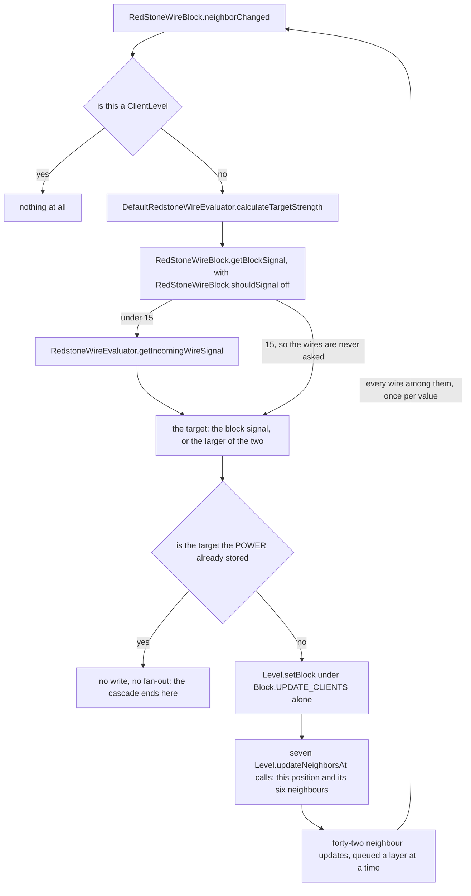
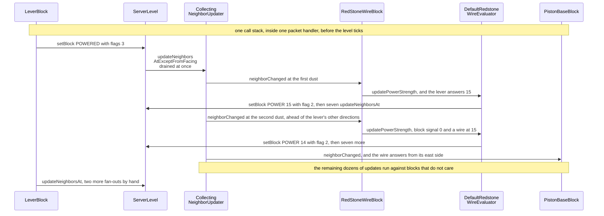

# Signal and dust

> Verified against **Minecraft 26.2** · Part V · A lever on the floor is flipped on and then off again, and two redstone dust to the east of it go to 15 and 14 — and then count their way back down.

You flip a lever, and the dust beside it turns bright. Flip it back and the
line goes dark — in one tick, but not in one pass. Each wire recomputes its
own strength from scratch, writes it, and then hand-issues seven
`Level.updateNeighborsAt` calls: its own position and all six neighbours. Each
of those seven visits six neighbours of its own, so **one wire whose power
changed costs forty-two neighbour updates**
(`DefaultRedstoneWireEvaluator.updatePowerStrength`). And because the recursion
stops on *value* rather than on distance, the wire at the far
end is reached once for every intermediate value the near end passes through
on the way down. That staircase is the whole cost of redstone, and **nobody
has ever seen it**: the cascade finishes inside one packet handler, and the
packet a client is sent is built later in the same tick from whatever the
position holds by then. The game ships a second implementation of exactly this
computation, behind a feature flag, which walks the whole connected network in
two ordered phases and does not produce the staircase at all.

## The cast

| class | what it decides | thread |
|---|---|---|
| `SignalGetter` | every question about power: what a position emits, what reaches it, and the direction order the answers are gathered in | a `Level` interface, either side |
| `BlockBehaviour.BlockStateBase` | the three answers this trace asks a state for — is it a source, what is its weak signal per face, what is its strong signal. The analog pair beside them is the comparator's | either side |
| `LeverBlock` | the trace's source: 15 in every direction, and 15 *strongly* into one block only | server — the client's copy writes nothing |
| `RedStoneWireBlock` | which sides a wire connects to, what it emits through them, and the mutable flag that stops it counting itself | server |
| `RedstoneWireEvaluator` | *minus one per block*: what the neighbouring wires are worth to this one | server |
| `DefaultRedstoneWireEvaluator` | one wire at a time, recursively, with the fan-out issued by hand | server |
| `ExperimentalRedstoneWireEvaluator` | the whole network at once, off in two phases and on in one, allocated fresh per call | server |
| `Orientation` | in the experimental mode only, where an update *came from*, so the fan-out can be ordered relative to it | server |

## What one neighbour update to a wire costs

Redstone has no scheduler and no graph. It is what happens when blocks answer
two questions about their neighbours — *how much signal do you give me* and
*did something near you change* — through the same `BlockBehaviour.neighborChanged`
fan-out every *neighbour* update uses. This is the whole of the default
implementation, from one update arriving to the next batch leaving.

*One neighbour update to one wire, and the loop at the bottom is the page:
forty-two updates leave, some of them land on wires, and each of those
re-enters at the top. The cascade ends only where a recomputed target equals
the `RedStoneWireBlock.POWER` already stored, which is a test on the value and not on the
distance.*

The first branch is belt and braces. `RedStoneWireBlock.neighborChanged` opens
with a not-client test, and it would never be reached on a `ClientLevel`
anyway: `Level.updateNeighborsAt` and `Level.neighborChanged` are empty methods
there, so nothing on the client ever dispatches a neighbour update to a block
at all ([blocks and states](blocks-and-states.md#the-two-update-channels)).

The two facts that make the staircase are both in that figure. The write uses
`Block.UPDATE_CLIENTS` **alone** — flag 2, the broadcast bit and nothing else
([block update flags](../../reference/block-update-flags.md)) — so the fan-out is not the one
`Level.setBlock` would have done — it is issued afterwards, by hand, over
seven positions rather than one. And the recursion terminates on *value*, not
on distance: a wire whose recomputed strength equals what it already holds
writes nothing and tells nobody. A line going dark therefore re-enters every
wire once per step of the descent, and each visit is the last one only when
the value has stopped moving. None of those intermediate writes is ever sent: `Level.sendBlockUpdated`
records the position and nothing else, and the once-a-tick flush reads the
level back to build the packet ([what the client is
told](../networking/what-the-client-is-told.md#block-changes-one-flush-a-tick-two-audiences)).

## What a block answers when it is asked for power

Three questions, all on `BlockBehaviour.BlockStateBase`, all answered by the
block. `BlockBehaviour.BlockStateBase.isSignalSource` is whether the block
emits at all. `BlockBehaviour.BlockStateBase.getSignal` is the **weak** signal
it offers to a given face. `BlockBehaviour.BlockStateBase.getDirectSignal` is
the **strong** one, and the difference between them is entirely a matter of
who is allowed to pass it on. Conduction is
`BlockBehaviour.BlockStateBase.isRedstoneConductor`, from
`BlockBehaviour.Properties.isRedstoneConductor`, which defaults to *is this
state's collision shape a full block*.

`SignalGetter` is where the two meet, and the join is easy to get backwards.
`SignalGetter.getSignal` reads the block's own weak signal and then, **only
if that block is a redstone conductor**, takes the larger of it and
`SignalGetter.getDirectSignalTo` — the strongest signal being pushed into that
position from any of its six neighbours. It is a maximum, not a choice between
two modes: a powered conductor offers the greater of what it emits itself and
what is being forced into it. That single line is what "strongly powered"
means, and it is why a block with a lever on it powers the dust beside it. A
block a wire merely points into is strongly powered too — that is what a
piston beside a line reads — but no *other dust* can see it, for a reason that
has nothing to do with this line and everything to do with
`RedStoneWireBlock.shouldSignal`, below.

The lever shows both halves at once. `LeverBlock.ownSignal` is 15 in every
direction when powered — that is the weak signal, and it is what the dust next
to the lever reads. `LeverBlock.getDirectSignal` is 15 only into the one block
the lever is attached to. So the block behind a lever becomes a source in its
own right, and everything touching *that* block sees 15 too.

Every other source in the game answers the same three questions and differs
only in what it answers and when it changes its mind: `ButtonBlock` books a
scheduled tick to turn itself off, `BasePressurePlateBlock` and its two
subclasses re-read what is standing on them, `DetectorRailBlock` and
`TripWireHookBlock` watch for entities, `DaylightDetectorBlock` reads the sky,
and `RedstoneTorchBlock` and `RedstoneWallTorchBlock` invert whatever they are
attached to. None of them needs a section of its own, because the contract
above is the whole of what a circuit sees.

One of them keeps state the contract cannot see, and it is the reason a
fast clock burns out. `RedstoneTorchBlock.RECENT_TOGGLES` is a weak map from
level to a list of toggles; `RedstoneTorchBlock.tick` prunes anything older than
60 ticks off the front of it, and `RedstoneTorchBlock.isToggledTooFrequently`
burns the torch out on the **eighth** surviving entry for that position. Every
number in that mechanism is a literal: `RedstoneTorchBlock.MAX_RECENT_TOGGLES`,
`RedstoneTorchBlock.RECENT_TOGGLE_TIMER` and `RedstoneTorchBlock.RESTART_DELAY`
hold 8, 60 and 160, and nothing in the corpus reads any of the three.

### Three direction orders, and only one of them is about reading

Three fixed direction orders run through this page and they are not
interchangeable. Two decide who gets **told** something; the third decides
what a block **reads**, and it is the one this page uses.

| array | order | what it governs |
|---|---|---|
| `SignalGetter.DIRECTIONS` | down, up, north, south, west, east | what a block reads. Only `SignalGetter.getBestNeighborSignal` walks the array; `SignalGetter.getDirectSignalTo` and `SignalGetter.hasNeighborSignal` are written out by hand in the same order |
| `NeighborUpdater.UPDATE_ORDER` | west, east, down, up, north, south | which neighbour is told first about a change, on the neighbour channel |
| `BlockBehaviour.UPDATE_SHAPE_ORDER` | west, east, north, south, down, up | which neighbour is asked first to re-fit, on the shape channel |

Only the first row is walked as an array at all, and the three *reading*
methods in it stop early, not on the same thing: the two that return a number —
`SignalGetter.getBestNeighborSignal` and `SignalGetter.getDirectSignalTo` —
stop at a 15, while `SignalGetter.hasNeighborSignal`, which returns a boolean,
stops at the first answer above zero. That is not a micro-optimisation with no
consequences: a position saturated from one side never reads the others at all.
The other two rows are orders in which something is *told*, and a fan-out
never stops early. `SignalGetter.DIRECTIONS` is plain `Direction` order, which
is the only reason its first entry is *down*.

## Dust, and how far it reaches

`RedStoneWireBlock.POWER` is the number, 0 to 15. Four `RedstoneSide`
properties — one per horizontal, each *NONE*, *SIDE* or *UP* — record how the
wire is drawn and, more
importantly, which sides it will actually talk through. What a wire is worth
to its neighbours is `RedstoneWireEvaluator.getIncomingWireSignal`, and the
*minus one per block* everyone knows lives in its last line: it takes the best
of the wires it can see and subtracts one, floored at zero. That subtraction is
the whole of the reach: a wire fed at 15 is at 1 fifteen blocks later and at 0
on the sixteenth, which is a dark block rather than a shorter line. The wires it can
see are the four beside it, plus the wire on top of a conducting neighbour
when nothing conducts above this position, plus the wire below a
non-conducting neighbour — which is the *power* half of "dust climbs a block
and falls down one". The drawing half is `RedStoneWireBlock.getConnectingSide`
below, which asks `BlockBehaviour.BlockStateBase.isFaceSturdy` where this one asks
about conduction.

Two asymmetries follow from `RedStoneWireBlock.getSignal` and are worth
stating plainly, because they are the two questions every redstone build
eventually asks. A wire returns **zero** when the direction asked about is
`Direction.DOWN` — so dust never powers the block above it. It returns its
full power without any connection test when the direction is `Direction.UP` —
so dust always powers the block below it. In every other direction it answers
only if its connection on the opposite side is made.

Connection itself is two rules and a completion pass.
`RedStoneWireBlock.shouldConnectTo` is the real one: another wire always, a
`Blocks.REPEATER` along its own axis, a `Blocks.OBSERVER` only from its facing
side, and otherwise any block that says it is a signal source — that last
clause only when a direction is supplied, which the vertical rules do not do,
so up and down connect to wire and to nothing else.
`RedStoneWireBlock.getConnectingSide` adds the vertical cases — up over a
face-sturdy neighbour, down past a non-conducting one. And then
`RedStoneWireBlock.getConnectionState` runs a completion pass that produces
most of the confusion: **if a wire has no north or south connection, west and
east are set anyway**, and the same the other way round. That is why a lone
dust is drawn as a cross, and why a wire fed from the west appears to point
firmly into whatever is on its east — a piston, say — which satisfies neither
real rule. The piston is not a source and, by `Blocks.pistonProperties`, not a
conductor. It gets powered anyway, because the wire's east side is *SIDE* by
completion and `RedStoneWireBlock.getSignal` asks about the side, not about
the neighbour.

`RedStoneWireBlock.shouldSignal` is the oddest thing on the page: a mutable
boolean on the block singleton, flipped false for the duration of
`RedStoneWireBlock.getBlockSignal` so that a wire does not count itself or its
neighbouring wires as sources while it works out its *block* power. It works
because the server thread is the only writer and never re-enters the method.
It is also the answer to the question left open above: a block a wire merely
points into *is* strongly powered, and no other dust can see that, because
while any wire is asking what its block power is, every wire in the world
temporarily answers that it is not a source at all.

## The lever, two dust, and a powered piston

*The same cascade in time, and the thing to watch is the order: the second
dust's whole turn — its recompute, its write and its seven fan-outs — finishes
before the lever has issued its own remaining directions. That is the queue
being drained depth-first, inside one call stack, with no tick anywhere in it.*

The lever is the place in this trace where the client does not even try.
`LeverBlock.useWithoutItem` writes no state on a `ClientLevel` — it spawns a
particle, and only when the lever is going *on* — so unlike a door, a lever is
not predicted, and the client's dust changes colour only when the block
updates arrive. The dust and the piston do nothing on the client either, but
for the ordinary reason: nothing ever calls their
`BlockBehaviour.neighborChanged` there. The sound
follows the same split for a different reason: `LeverBlock.pull` is handed a
null player, so nobody is excluded and the clicker hears the server's
`ClientboundSoundPacket` like everyone else. Compare
[block interaction](block-interaction.md#the-door-writes-ten), where the door passes the clicker
as *except* and they hear their own prediction instead.

Two details in the diagram are worth naming. The lever's `Level.setBlock`
uses flags 3, so `Block.UPDATE_NEIGHBORS` fans out once *before*
`LeverBlock.updateNeighbours` fans out twice more, at the lever's own position
and at the block it stands on — and because nothing was running when the first
one was queued, it drains the entire dust cascade before the other two are
even issued. And the ordering of the seven positions a wire updates is
fixed by no array: they come out of a hash set. The depth-first drain of
`CollectingNeighborUpdater` is [block interaction](block-interaction.md#the-updater-underneath-a-stack-drained-depth-first)'s
subject, and it is what puts the second dust's whole cascade ahead of the
lever's remaining directions.

Placing and breaking a wire take a wider path again:
`RedStoneWireBlock.onPlace` and
`RedStoneWireBlock.affectNeighborsAfterRemoval` both call
`RedStoneWireBlock.updateNeighborsOfNeighboringWires`, which walks the four
horizontals and then the diagonals — reaching over a conducting neighbour and
under a non-conducting one — and calls
`RedStoneWireBlock.checkCornerChangeAt` on each. That is another seven
`Level.updateNeighborsAt` per wire found. Which write does what is
[blocks and states](blocks-and-states.md#the-two-update-channels).

## The second implementation

`FeatureFlags.REDSTONE_EXPERIMENTS` is a feature flag ([identifiers and
registries](../foundations/identifiers-and-registries.md#feature-flags-the-same-registry-narrowed)),
turned on by a built-in data pack whose entire content is the line that enables
it ([the resource system](../foundations/resource-system.md#discover-the-repository-and-its-packs)), and
`RedStoneWireBlock.useExperimentalEvaluator` asks the level for it on **every
call** — `RedStoneWireBlock.evaluator` is always the default one, and an
`ExperimentalRedstoneWireEvaluator` is a fresh object per update, because it
carries working state. What changes is not speed but semantics.

Run the same lever back the other way — off, so the line has to go dark, which
is where the default evaluator does its counting down — and follow the two dust
through
`ExperimentalRedstoneWireEvaluator.calculateCurrentChanges` instead. **Nothing
is written until the whole connected network has been computed.** Phase one
drains `ExperimentalRedstoneWireEvaluator.wiresToTurnOff`, and this is the
phase that kills the staircase: a wire whose recomputed power is lower than
what it holds goes to **zero** in a working map rather than to its new value,
so the near dust does not pass 14, 13, 12 down the line on the way to nothing —
it goes straight to nothing, and so does the far one, and each is re-queued for
the second phase only if it has block power of its own. Phase two drains
`ExperimentalRedstoneWireEvaluator.wiresToTurnOn` and raises each survivor to
its true value once. Both phases spread through
`ExperimentalRedstoneWireEvaluator.propagateChangeToNeighbors` and
`ExperimentalRedstoneWireEvaluator.enqueueNeighborWire`, recording every wire
they reach in `ExperimentalRedstoneWireEvaluator.updatedWires`, an
insertion-ordered map of position to a packed orientation and power — which is
the working state that makes the evaluator a fresh object per call. The write
pass at the end drops any entry whose stored power already matches, so what
reaches the world is exactly the wires that really changed — each with
`Block.UPDATE_CLIENTS` and, for every wire the pass touches,
`Block.UPDATE_SKIP_SHAPE_UPDATE_ON_WIRE`, the bit that makes
`NeighborUpdater.executeShapeUpdate` skip any shape update whose **target** is
dust. (The one wire exempted from that bit is the one an evaluation started
from, and then only when the caller was `RedStoneWireBlock.onPlace`, which
wants the shape updates around a newly placed wire.)

**The fan-out is the second difference, and it is what the seven positions
become.** `ExperimentalRedstoneWireEvaluator.causeNeighborUpdates` issues one
`Level.neighborChanged` per *connected* side per changed wire — the four
horizontals the wire's own state records, plus `Direction.DOWN`
unconditionally and `Direction.UP` never — in
`Orientation.getDirections` order, which is derived from where the update
came from rather than from a fixed array, and then five more at any side that
is a redstone conductor. So the piston east of our two dust is still told, and
told once, without the seven-position scattergun. The recursion closes because
`RedStoneWireBlock.neighborChanged` ignores wire-sourced updates entirely in
this mode; the default evaluator does not, which is what opens it.

> **For a 1.21-era reader.** `BlockBehaviour.neighborChanged` now takes a
> nullable `Orientation` rather than a source `BlockPos` — which is what lets
> the experimental evaluator order a fan-out relative to where the update came
> from — and `BlockBehaviour.affectNeighborsAfterRemoval`, which replaced the
> old removal hook, does not take one at all.

## Where to look

The three questions a block answers are `SignalGetter.getSignal`,
`SignalGetter.getDirectSignalTo` and
`BlockBehaviour.BlockStateBase.isRedstoneConductor`, and
`SignalGetter.getBestNeighborSignal` over `SignalGetter.DIRECTIONS` is how a
position is read. The trace starts at `LeverBlock.pull` with
`LeverBlock.updateNeighbours`, enters the wire at
`RedStoneWireBlock.neighborChanged`, and the number is decided by
`RedStoneWireBlock.getBlockSignal` against
`RedstoneWireEvaluator.getIncomingWireSignal`, with
`DefaultRedstoneWireEvaluator.updatePowerStrength` doing the write and the
fan-out. For the drawing rules read `RedStoneWireBlock.getConnectionState` and
`RedStoneWireBlock.shouldConnectTo`; for what leaves a wire,
`RedStoneWireBlock.getSignal`. The second implementation is
`ExperimentalRedstoneWireEvaluator.calculateCurrentChanges` and
`ExperimentalRedstoneWireEvaluator.causeNeighborUpdates`.
`SignalGetter.getControlInputSignal` is not named above and is the door into
what a diode reads from its sides.

---

*Rules: names, never code · how the system works, not how the code reads ·
newest version only · every backticked name passes `tools/verify_names.py`.*
