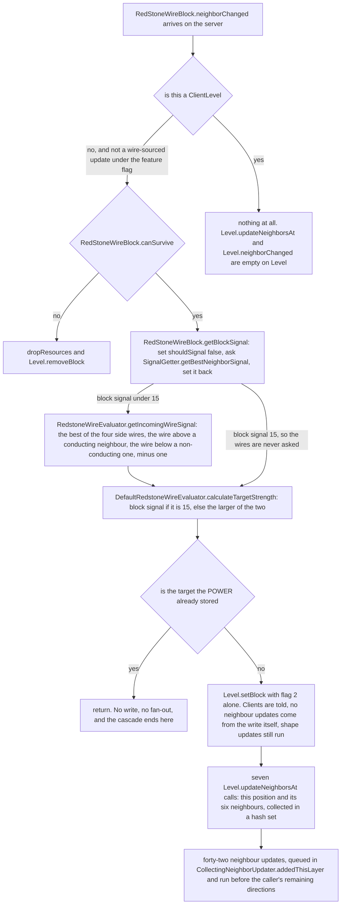
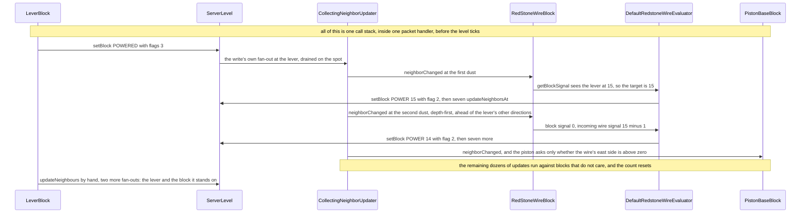

# Signal and dust

> Verified against **Minecraft 26.2** · Part V · A lever on the floor is flipped, and two redstone dust to the east of it go to 15 and 14.

You flip a lever, and the dust beside it turns bright. Flip it back and the
line goes dark — in one tick, but not in one pass. Each wire recomputes its
own strength from scratch, writes it, and then **hand-issues seven
`Level.updateNeighborsAt` calls — its own position and all six neighbours —
which is forty-two neighbour updates for one wire that changed**; and because
the recursion stops on *value* rather than on distance, the wire at the far
end is reached once for every intermediate value the near end passes through
on the way down. That staircase is the whole cost of redstone, and **nobody
has ever seen it**: the cascade finishes inside one packet handler, and the
packet a client is sent is built later in the same tick from whatever the
position holds by then. The game ships a second implementation of exactly this
computation, behind a feature flag, which walks the whole connected network in
two ordered phases and does not produce the staircase at all.

**Forty-two** — neighbour updates issued by one wire whose power changed
(`DefaultRedstoneWireEvaluator.updatePowerStrength`).

## The cast

| class | what it decides | thread |
|---|---|---|
| `SignalGetter` | every question about power: what a position emits, what reaches it, and the direction order the answers are gathered in | a `Level` interface, either side |
| `BlockBehaviour.BlockStateBase` | the three answers a state gives — is it a source, what is its weak signal per face, what is its strong signal | either side |
| `LeverBlock` | the trace's source: 15 in every direction, and 15 *strongly* into one block only | server — the client's copy writes nothing |
| `RedStoneWireBlock` | which sides a wire connects to, what it emits through them, and the mutable flag that stops it counting itself | server |
| `RedstoneWireEvaluator` | *minus one per block*: what the neighbouring wires are worth to this one | server |
| `DefaultRedstoneWireEvaluator` | one wire at a time, recursively, with the fan-out issued by hand | server |
| `ExperimentalRedstoneWireEvaluator` | the whole network at once, off in two phases and on in one, allocated fresh per call | server |
| `Orientation` | in the experimental mode only, where an update *came from*, so the fan-out can be ordered relative to it | server |

## What one neighbour update to a wire costs

Redstone has no scheduler and no graph. It is what happens when blocks answer
two questions about their neighbours — *how much signal do you give me* and
*did something near you change* — through the same `BlockBehaviour.neighborChanged`
fan-out every *neighbour* update uses. This is the whole of the default
implementation, from one update arriving to the next batch leaving.

The two facts that make the staircase are both in that figure. The write uses
`Block.UPDATE_CLIENTS` **alone**, so the fan-out is not the one
`Level.setBlock` would have done — it is issued afterwards, by hand, over
seven positions rather than one. And the recursion terminates on *value*, not
on distance: a wire whose recomputed strength equals what it already holds
writes nothing and tells nobody. A line going dark therefore re-enters every
wire once per step of the descent, and each visit is the last one only when
the value has stopped moving. None of those intermediate writes is ever sent.
`Level.sendBlockUpdated` only records the position in a set on the
`ChunkHolder`, and `ChunkHolder.broadcastChanges` builds the packet once per
tick by reading the level again — so a position written five times in a tick
is broadcast once, with the value it ended on.

## What a block answers when it is asked for power

Three questions, all on `BlockBehaviour.BlockStateBase`, all answered by the
block. `BlockBehaviour.BlockStateBase.isSignalSource` is whether the block
emits at all. `BlockBehaviour.BlockStateBase.getSignal` is the **weak** signal
it offers to a given face. `BlockBehaviour.BlockStateBase.getDirectSignal` is
the **strong** one, and the difference between them is entirely a matter of
who is allowed to pass it on. Conduction is
`BlockBehaviour.BlockStateBase.isRedstoneConductor`, from
`BlockBehaviour.Properties.isRedstoneConductor`, which defaults to *is this
state's collision shape a full block*.

`SignalGetter` is where the two meet, and the join is easy to get backwards.
`SignalGetter.getSignal` reads the block's own weak signal and then, **only
if that block is a redstone conductor**, takes the larger of it and
`SignalGetter.getDirectSignalTo` — the strongest signal being pushed into that
position from any of its six neighbours. It is a maximum, not a choice between
two modes: a powered conductor offers the greater of what it emits itself and
what is being forced into it. That single line is what "strongly powered"
means, and it is why a block with a lever on it powers the dust beside it. A
block a wire merely points into is strongly powered too — that is what a
piston beside a line reads — but no *other dust* can see it, for a reason that
has nothing to do with this line and everything to do with
`RedStoneWireBlock.shouldSignal`, below.

The lever shows both halves at once. `LeverBlock.ownSignal` is 15 in every
direction when powered — that is the weak signal, and it is what the dust next
to the lever reads. `LeverBlock.getDirectSignal` is 15 only into the one block
the lever is attached to. So the block behind a lever becomes a source in its
own right, and everything touching *that* block sees 15 too.

### Three direction orders, and only one of them is about reading

Three fixed direction orders run through this page and they are not
interchangeable. Two decide who gets **told** something; the third decides
what a block **reads**, and it is the one this page uses.

| array | order | what it governs |
|---|---|---|
| `SignalGetter.DIRECTIONS` | down, up, north, south, west, east | what a block reads. Only `SignalGetter.getBestNeighborSignal` walks the array; `SignalGetter.getDirectSignalTo` and `SignalGetter.hasNeighborSignal` are written out by hand in the same order |
| `NeighborUpdater.UPDATE_ORDER` | west, east, down, up, north, south | which neighbour is told first about a change, on the neighbour channel |
| `BlockBehaviour.UPDATE_SHAPE_ORDER` | west, east, north, south, down, up | which neighbour is asked first to re-fit, on the shape channel |

All three stop early, and not on the same thing: the two that return a number
stop at a 15, while `SignalGetter.hasNeighborSignal` — which returns a boolean
— stops at the first answer above zero. That is not a micro-optimisation with
no consequences: a position saturated from one side never reads the others at
all. `SignalGetter.DIRECTIONS` is plain `Direction` order, which is the only
reason its first entry is *down*.

## Dust, and how far it reaches

`RedStoneWireBlock.POWER` is the number, 0 to 15. Four `RedstoneSide`
properties — one per horizontal — record how the wire is drawn and, more
importantly, which sides it will actually talk through. What a wire is worth
to its neighbours is `RedstoneWireEvaluator.getIncomingWireSignal`, and the
*minus one per block* everyone knows lives in its last line: it takes the best
of the wires it can see and subtracts one, floored at zero. The wires it can
see are the four beside it, plus the wire on top of a conducting neighbour
when nothing conducts above this position, plus the wire below a
non-conducting neighbour — which is the *power* half of "dust climbs a block
and falls down one". The drawing half is `RedStoneWireBlock.getConnectingSide`
below, which asks `BlockBehaviour.BlockStateBase.isFaceSturdy` where this one asks
about conduction.

Two asymmetries follow from `RedStoneWireBlock.getSignal` and are worth
stating plainly, because they are the two questions every redstone build
eventually asks. A wire returns **zero** when the direction asked about is
`Direction.DOWN` — so dust never powers the block above it. It returns its
full power without any connection test when the direction is `Direction.UP` —
so dust always powers the block below it. In every other direction it answers
only if its connection on the opposite side is made.

Connection itself is two rules and a completion pass.
`RedStoneWireBlock.shouldConnectTo` is the real one: another wire always, a
`Blocks.REPEATER` along its own axis, a `Blocks.OBSERVER` only from its facing
side, and otherwise any block that says it is a signal source — that last
clause only when a direction is supplied, which the vertical rules do not do,
so up and down connect to wire and to nothing else.
`RedStoneWireBlock.getConnectingSide` adds the vertical cases — up over a
face-sturdy neighbour, down past a non-conducting one. And then
`RedStoneWireBlock.getConnectionState` runs a completion pass that produces
most of the confusion: **if a wire has no north or south connection, west and
east are set anyway**, and the same the other way round. That is why a lone
dust is drawn as a cross, and why a wire fed from the west appears to point
firmly into whatever is on its east — a piston, say — which satisfies neither
real rule. The piston is not a source and, by `Blocks.pistonProperties`, not a
conductor. It gets powered anyway, because the wire's east side is *SIDE* by
completion and `RedStoneWireBlock.getSignal` asks about the side, not about
the neighbour.

> **For a 1.21-era reader.** `BlockBehaviour.neighborChanged` now takes a
> nullable `Orientation` rather than a source `BlockPos`, and
> `BlockBehaviour.affectNeighborsAfterRemoval` — which replaced the old
> removal hook — does not take one at all.

`RedStoneWireBlock.shouldSignal` is the oddest thing on the page: a mutable
boolean on the block singleton, flipped false for the duration of
`RedStoneWireBlock.getBlockSignal` so that a wire does not count itself or its
neighbouring wires as sources while it works out its *block* power. It works
because the server thread is the only writer and never re-enters the method.

## The lever, two dust, and a powered piston

The lever is the place in this trace where the client does not even try.
`LeverBlock.useWithoutItem` writes no state on a `ClientLevel` — it spawns a
particle, and only when the lever is going *on* — so unlike a door, a lever is
not predicted, and the client's dust changes colour only when the block
updates arrive. The dust and the piston do nothing on the client either, but
for the ordinary reason: nothing ever calls their
`BlockBehaviour.neighborChanged` there. The sound
follows the same split for a different reason: `LeverBlock.pull` is handed a
null player, so nobody is excluded and the clicker hears the server's
`ClientboundSoundPacket` like everyone else. Compare
[block interaction](block-interaction.md), where the door passes the clicker
as *except* and they hear their own prediction instead.

Two details in the diagram are worth naming. The lever's `Level.setBlock`
uses flags 3, so `Block.UPDATE_NEIGHBORS` fans out once *before*
`LeverBlock.updateNeighbours` fans out twice more, at the lever's own position
and at the block it stands on — and because nothing was running when the first
one was queued, it drains the entire dust cascade before the other two are
even issued. And the ordering of the seven positions a wire updates is
fixed by no array: they come out of a hash set. The depth-first drain of
`CollectingNeighborUpdater` is [block interaction](block-interaction.md)'s
subject, and it is what puts the second dust's whole cascade ahead of the
lever's remaining directions.

Placing and breaking a wire take a wider path again:
`RedStoneWireBlock.onPlace` and
`RedStoneWireBlock.affectNeighborsAfterRemoval` both call
`RedStoneWireBlock.updateNeighborsOfNeighboringWires`, which walks the four
horizontals and then the diagonals — reaching over a conducting neighbour and
under a non-conducting one — and calls
`RedStoneWireBlock.checkCornerChangeAt` on each. That is another seven
`Level.updateNeighborsAt` per wire found. Which write does what is
[blocks and states](blocks-and-states.md#the-two-update-channels).

## The second implementation

`FeatureFlags.REDSTONE_EXPERIMENTS` is a feature flag, turned on by a built-in
data pack whose entire content is the line that enables it, and
`RedStoneWireBlock.useExperimentalEvaluator` asks the level for it on **every
call** — `RedStoneWireBlock.evaluator` is always the default one, and an
`ExperimentalRedstoneWireEvaluator` is a fresh object per update, because it
carries working state. What changes is not speed but semantics.

`ExperimentalRedstoneWireEvaluator.calculateCurrentChanges` computes the whole
connected network before writing anything. Phase one drains
`ExperimentalRedstoneWireEvaluator.wiresToTurnOff`: a wire whose recomputed
power is lower than its stored value goes to **zero** in the working map
rather than to its new value, and is re-queued into the turn-on deque if it
has block power of its own. Phase two drains
`ExperimentalRedstoneWireEvaluator.wiresToTurnOn`, raising each to its true
value. Both phases spread through
`ExperimentalRedstoneWireEvaluator.propagateChangeToNeighbors` and
`ExperimentalRedstoneWireEvaluator.enqueueNeighborWire`, and every wire they
reach is recorded in `ExperimentalRedstoneWireEvaluator.updatedWires`, an
insertion-ordered map of position to a packed orientation and power. Only then
are the states written — the write pass drops any entry whose stored power
already matches, so what survives it is the wires that really changed — with
`Block.UPDATE_CLIENTS` and, for every wire but sometimes the first,
`Block.UPDATE_SKIP_SHAPE_UPDATE_ON_WIRE`, which
`NeighborUpdater.executeShapeUpdate` honours by skipping any shape update
whose **target** is dust, whatever the source.

The fan-out is the other half of the difference.
`ExperimentalRedstoneWireEvaluator.causeNeighborUpdates` issues one
`Level.neighborChanged` per *connected* side per changed wire — connected
meaning the four horizontals the wire's own state records, plus `Direction.DOWN`
unconditionally and `Direction.UP` never — in
`Orientation.getDirections` order — an order derived from where the update
came from rather than from a fixed array — and, where that side is a redstone
conductor, five more at that conductor's own sides. That is how the
experimental evaluator carries strong power without the seven-position
scattergun. And `RedStoneWireBlock.neighborChanged` ignores wire-sourced
updates entirely in this mode, which is what closes the recursion; the default
evaluator does not, which is what opens it.

## Questions players ask

**Does a long line of dust really count down through every value when it turns
off?** Inside the tick, yes: each wire recomputes independently and tells its
neighbours only when its own number moved, so the far end is reached once for
each value the near end passes through on the way down. On screen, no.
`ChunkHolder.broadcastChanges` builds one packet per changed position per tick
by reading the level, so a position written five times sends the last value
once. The staircase costs neighbour updates, not frames — and the experimental
evaluator exists to make it one ordered pass instead.

**Why does dust point into a block that cannot be powered?** Because the
drawing rule and the powering rule are different rules.
`RedStoneWireBlock.getConnectionState` fills in the missing half of a line
whenever the perpendicular axis is empty, and
`RedStoneWireBlock.getSignal` then answers on the strength of that filled-in
side. Whether the neighbour does anything with the signal is the neighbour's
business.

**Why does dust power the block underneath it but not the one above?**
`RedStoneWireBlock.getSignal` returns zero for `Direction.DOWN` and returns
full power for `Direction.UP` without checking any connection. Those are two
lines in one method, and every "torch under the dust" contraption rests on
them.

**Does a redstone torch really burn out after a fixed number of flickers?**
Yes, and every number in the mechanism is a literal.
`RedstoneTorchBlock.RECENT_TOGGLES` is a weak map from level to a list of
toggles; `RedstoneTorchBlock.tick` prunes anything older than 60 ticks off the
front of it, and `RedstoneTorchBlock.isToggledTooFrequently` burns the torch
out on the **eighth** surviving entry for that position.
`RedstoneTorchBlock.MAX_RECENT_TOGGLES`, `RedstoneTorchBlock.RECENT_TOGGLE_TIMER`
and `RedstoneTorchBlock.RESTART_DELAY` hold 8, 60 and 160, and nothing in the
corpus reads any of the three.

## Where to look

`SignalGetter.getSignal` · `SignalGetter.getDirectSignalTo` ·
`SignalGetter.getBestNeighborSignal` · `SignalGetter.getControlInputSignal` ·
`SignalGetter.DIRECTIONS` · `BlockBehaviour.BlockStateBase.isRedstoneConductor` ·
`LeverBlock.pull` · `LeverBlock.updateNeighbours` ·
`RedStoneWireBlock.neighborChanged` · `RedStoneWireBlock.getBlockSignal` ·
`RedStoneWireBlock.getSignal` · `RedStoneWireBlock.getConnectionState` ·
`RedStoneWireBlock.getConnectingSide` · `RedStoneWireBlock.shouldConnectTo` ·
`RedStoneWireBlock.updateNeighborsOfNeighboringWires` ·
`RedstoneWireEvaluator.getIncomingWireSignal` ·
`DefaultRedstoneWireEvaluator.updatePowerStrength` ·
`ExperimentalRedstoneWireEvaluator.calculateCurrentChanges` ·
`ExperimentalRedstoneWireEvaluator.causeNeighborUpdates` ·
`NeighborUpdater.executeShapeUpdate` · `RedstoneTorchBlock.isToggledTooFrequently`

---

*Rules: names, never code · how the system works, not how the code reads ·
newest version only · every backticked name passes `tools/verify_names.py`.*
