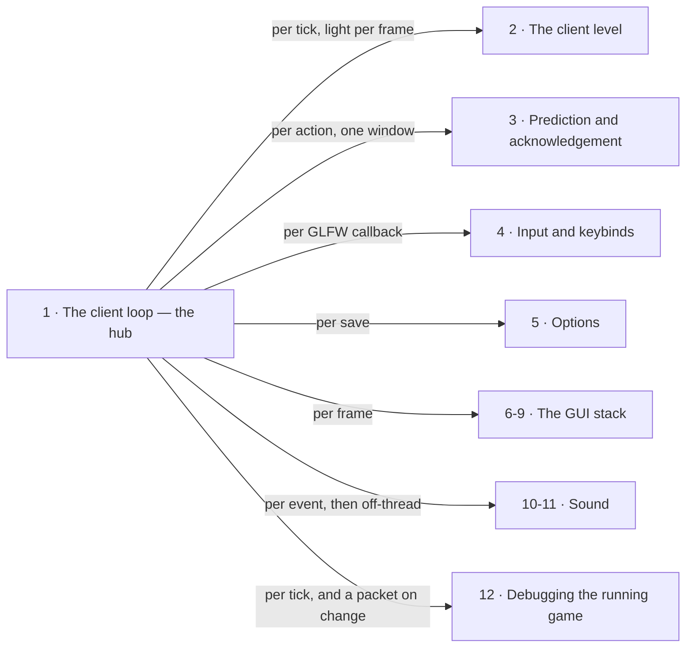

# X · The client

> Verified against **Minecraft 26.2** · Part X · One thread, one loop, and everything else in the part answering the same question about itself: when in that loop does this happen?

A player already knows this part by its symptoms: the stutter where the world
moves on without you, the block that appears and then disappears, the sound
that arrives a beat after the packet. Every one of them is the same
arrangement seen from a different angle. Everything in this part that touches
the game happens on **one thread**, and nothing in the client's simulation is
driven by a scheduler or a timer callback; despite the name printed in every
stack trace there is no separate render thread, and the thread called *Render
thread* is the same one that ticks the world, applies packets, handles your
keyboard, decides what a screen looks like and asks the GPU to draw it. So the
client has no way to do two of those at once, and no way to be interrupted
into doing one of them late. **Everything that looks like the client falling
behind is one thread deciding what to spend a frame on.**

## The shape of the part

Part X is a **hub and its spokes**, and the spokes are cadences rather than
stages: with one exception, noted below, nothing here hands off to anything.
[The client loop](the-client-loop.md) is the hub because it is the one page
that says *when* anything on the client runs, and every other page in the part
answers the same question about itself: **when in that loop does this
happen?** The figure has seven spokes for twelve pages, because the four GUI
pages answer it together and so do the two about sound.

*Numbered to the watch order, and the labels on the arrows are **cadences, not
steps**: each spoke answers the hub's question — when in the loop does this
happen? — and none of them hands off to another.*

The one genuine pipeline inside the part is the GUI stack, and it is a
pipeline whose stages interleave rather than queue: a screen records itself
into a tree, and the text in it is measured and baked *while* it is being
recorded, because the tree cannot place a line it has not measured. So the
tree comes before the text here — you cannot follow the text pipeline until you
know what it is recording into — with the HUD after them both as the other
thing that records into the same tree. Outside that stack and one pair, nothing
in the part depends on anything in the part except the hub: the client level
and prediction share a ledger, and everything else answers the loop
independently.

## Before you start

[Part IX](../networking/README.md), and not optionally — this part is the
same wire watched from the receiving end. Three pages here begin at a packet
that has already arrived, and [the connection](../networking/the-connection.md)
is what it took to get there.

[Part I's anatomy](../anatomy/anatomy.md) for the two-loops figure, which is
the premise of the whole part: the server's tick loop and the client's frame
loop are different clocks, and almost every surprise in Part X is a
consequence of one of them waiting on the other.

[Authority](../entities/authority.md#five-predicates-and-the-final-one-the-other-four-hang-off)
from Part VI, because "what the client is allowed to decide" is the question
this part splits in two: [the client level](the-client-level.md) answers what
it may *simulate*, [prediction and acknowledgement](prediction-and-acks.md)
what it may *show before it is told*, and neither re-derives the five
predicates.

Three smaller ones, each for one page. [Containers and
menus](../items/containers-and-menus.md#the-chest-you-see-is-not-the-chest)
from Part VII before [GUI and screens](gui-and-screens.md), which opens on a
menu and takes for granted that the chest you see is not the chest.
[Part V](../blocks/README.md) before
[prediction and acknowledgement](prediction-and-acks.md): the ledger's six
windows open around rather more than a block placed and a block broken, but
those two are the ones a viewer needs to have seen, and Part V's landing
page already rules that its pages are watched first. And [text
components](../foundations/text-components.md) from Part II before [text and
fonts](text-and-fonts.md), which starts from "you have a `Component`".

## Watch in this order

1. [The client loop](the-client-loop.md) — the hub, and the one page every
   other page in the part leans on. How much simulated time a frame owes,
   what it spends it on, and what happens to the time it cannot afford.
   Watch this before anything else in Parts X and XI.
2. [The client level](the-client-level.md) — the same `Level` class the
   server runs, with its authority removed. A comparison: what the client
   really simulates, and what it only pretends to.
3. [Prediction and acknowledgement](prediction-and-acks.md) — the block that
   appears and then disappears. One ledger, one counter, and a receipt that
   is not a verdict. Watch it straight after two: the ledger it turns on lives
   on `ClientLevel` and is reached through four of that class's methods.
4. [Input and keybinds](input-and-keybinds.md) — everything between the
   operating system and a key being *down*, and the five places a press can
   be swallowed on the way.
5. [Options](options.md) — one flat file and nine fields the server ever
   hears about. A policy page: what saving does, and who is told.
6. [GUI and screens](gui-and-screens.md) — what a screen *is*: the manager,
   the lifecycle, the widget family, and the four routes by which a screen
   comes to exist.
7. [The GUI render tree](the-gui-render-tree.md) — what a screen records
   *into*. Nothing in the 2D UI draws anything; it all appends to a tree that
   infers its own layering from bounding boxes.
8. [Text and fonts](text-and-fonts.md) — the one thing recorded into that
   tree that is a pipeline of its own: six stages from a `Component` at one
   end to a quad with a glyph on it at the other.
9. [The HUD](hud.md) — the other thing that records into that tree, and the
   part's second policy page: what is drawn over the world, in what order,
   and under exactly which conditions.
10. [Sound: the engine](sound-engine.md) — the page in the part with the
    most threads in it: five take part, a block placed near you crosses four
    of them on its way to an OpenAL source, and one hop it cannot skip.
11. [What makes a sound happen](what-makes-a-sound.md) — the content model:
    three doors a sound comes through, only one of which names it.
12. [Debugging the running game](debugging-the-running-game.md) — the
    closer, and the part's one *pattern* lecture: one subscription
    mechanism, sixteen instances, all of them shipped and fifteen of them
    unreachable without a JVM flag.

Six to nine are the GUI stack and are watched together. Ten and eleven are the
two halves of sound and can be watched in either order; the engine first is
the easier way round.

## Where the part stops

At one end, the profiler's *frame* zone: [the
frame](../rendering/the-frame.md#the-zones-a-frame-is-made-of)
begins exactly where [the client loop](the-client-loop.md#one-turn-of-the-loop)
ends, and everything inside that zone is Part XI's — though a few of this
part's own cadences run inside it and stay here for what they decide, the
per-frame light pass and the GUI record pass among them. What the *server*
chose to send is Part IX's.

At the other end, and much the larger boundary: **this part explains what a
screen, a widget and a glyph *are*, not the two hundred-odd screens the game
ships.** {{#include ../../generated/coverage-client.md}}, and nine tenths of
that is one more `Screen` or one more widget — the world creation flow, the
pack picker, the recipe book, a class per container. [GUI and
screens](gui-and-screens.md#who-opens-a-screen) covers them as one pattern with
four routes into it, on purpose. Two more things in the part's packages belong
to other parts (the model tree under `client/resources` to Part XI,
`client/player` to [Part VIII](../player/README.md) as well as here) and one to
nobody: player reporting, which [this book
skips](../anatomy/what-this-book-skips.md#player-reporting) and the atlas
therefore counts in no part at all.

## Reference this part uses

[Diagram lanes](../../reference/lanes.md) for the abbreviations these pages'
figures use, and [the threads](../../reference/threads.md), which is where
the sound engine's own thread sits among the rest of the game's. [HUD
elements](../../reference/hud-elements.md) is the gate table [the
HUD](hud.md) is built on, in record order.
[Packets](../../reference/packets.md) for everything arriving from Part IX,
and [the glossary](../../reference/glossary.md) for *partial tick*,
*prediction ledger* and *extract*. [Naming
drift](../../reference/naming-drift.md) is the one to keep open beside this
part in particular: nine of these twelve pages carry a *for a 1.21-era reader*
box, because the client is where 26.2 renamed the most.

---

*Rules: names, never code · how the system works, not how the code reads ·
newest version only · every backticked name passes `tools/verify_names.py`.*
