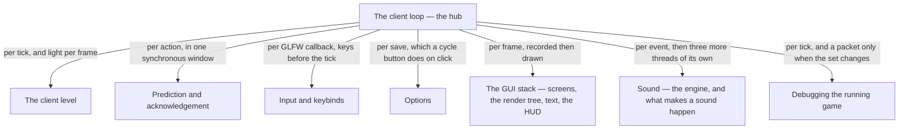

# X · The client

> Verified against **Minecraft 26.2** · Part X · One thread, one loop, and seven systems that differ mainly in how often the loop gets round to them.

Everything in this part that touches the game happens on one thread. Nothing
in the client's simulation is driven by a scheduler or a timer callback —
the two classes that own one, `PeriodicNotificationManager` and
`RemoteFriendListUpdateHandler`, hop back to the game thread before they
touch anything — and, despite the name printed in every stack trace, there
is no render thread: the thread called *Render thread* is the main thread,
and it is the same thread that ticks the world, applies packets, handles your
keyboard, decides what a screen looks like and asks the GPU to draw it. A
player recognises the part by its symptoms of that arrangement: the stutter
where the world moves on without you, the block that appears and then
disappears, the terrain filling in ahead of you as you fly, the sound that
arrives a beat after the packet.

## The shape of the part

Part X is a **hub and its spokes**, and the spokes are cadences rather than
stages: with one exception, noted below, nothing here hands off to anything.
`the-client-loop` is the hub because it is the one
page that says *when* anything on the client runs, and every other page in
the part answers the same question about itself: **when in that loop does
this happen?** Read the labels on the arrows as cadences, not as an order.

The one genuine pipeline inside the part is the GUI stack: a screen records
itself into a tree, the text in it becomes glyphs, and the tree is then
sorted and batched into draws. Those three are three stages of one journey
and are watched in a different order from the one they run in — the tree
before the text, because the text's stages are easier to follow once you know
what they are recording into — with the HUD after them as the other thing
that records into the same tree. Everything else in the part is independent
of everything else in the part.

## Before you start

[Part IX](../networking/README.md), and not optionally — this part is the
same wire watched from the receiving end. Three pages here begin at a packet
that has already arrived, and [the connection](../networking/the-connection.md)
is what it took to get there.

[Part I's anatomy](../anatomy/anatomy.md) for the two-loops figure, which is
the premise of the whole part: the server's tick loop and the client's frame
loop are different clocks, and almost every surprise in Part X is a
consequence of one of them waiting on the other.

[Authority](../entities/authority.md) from Part VI, because "what the client
is allowed to decide" is the question `the-client-level` and
`prediction-and-acks` are both answering, and neither re-derives the five
predicates.

Two smaller ones, each for one page. [Part V](../blocks/README.md) before
[prediction and acknowledgement](prediction-and-acks.md): the ledger's six
windows open around rather more than a block placed and a block broken, but
those two are the ones a viewer needs to have seen, and Part V's landing
page already rules that its pages are watched first. And [text
components](../foundations/text-components.md) from Part II before [text and
fonts](text-and-fonts.md), which starts from "you have a `Component`".

## Watch in this order

1. [The client loop](the-client-loop.md) — the hub, and the one page every
   other page in the part leans on. How much simulated time a frame owes,
   what it spends it on, and what happens to the time it cannot afford.
   Watch this before anything else in Parts X and XI.
2. [The client level](the-client-level.md) — the same `Level` class the
   server runs, with its authority removed. A comparison: what the client
   really simulates, and what it only pretends to.
3. [Prediction and acknowledgement](prediction-and-acks.md) — the block that
   appears and then disappears. One ledger, one counter, and a receipt that
   is not a verdict.
4. [Input and keybinds](input-and-keybinds.md) — everything between the
   operating system and a key being *down*, and the five places a press can
   be swallowed on the way.
5. [Options](options.md) — one flat file and nine fields the server ever
   hears about. A policy page: what saving does, and who is told.
6. [GUI and screens](gui-and-screens.md) — what a screen *is*: the manager,
   the lifecycle, the widget family, and the four routes by which a screen
   comes to exist.
7. [The GUI render tree](the-gui-render-tree.md) — the second stage of the
   same journey. Nothing in the 2D UI draws anything; it all appends to a
   tree that infers its own layering from bounding boxes.
8. [Text and fonts](text-and-fonts.md) — the third stage, and a pipeline of
   its own: six stages from a `Component` at one end to a quad with a glyph
   on it at the other.
9. [The HUD](hud.md) — the other thing that records into that tree, and the
   part's second policy page: what is drawn over the world, in what order,
   and under exactly which conditions.
10. [Sound: the engine](sound-engine.md) — the page in the part with the
    most threads in it: five take part, a block placed near you crosses four
    of them on its way to an OpenAL source, and one hop it cannot skip.
11. [What makes a sound happen](what-makes-a-sound.md) — the content model:
    three doors a sound comes through, only one of which names it.
12. [Debugging the running game](debugging-the-running-game.md) — the
    closer, and the part's one *pattern* lecture: one subscription
    mechanism, sixteen instances, all of them shipped and fifteen of them
    unreachable without a JVM flag.

Two and three are a pair — the ledger lives on `ClientLevel` and is reached
through four of its methods — and six to nine are the GUI stack, watched
together. Ten and eleven are the two halves of sound and can be watched in
either order; the engine first is the easier way round.

## Reference this part uses

[Diagram lanes](../../reference/lanes.md) for the abbreviations these pages'
figures use, and [the threads](../../reference/threads.md), which is where
the sound engine's own thread sits among the rest of the game's. [HUD
elements](../../reference/hud-elements.md) is the gate table [the
HUD](hud.md) is built on, in record order.
[Packets](../../reference/packets.md) for everything arriving from Part IX,
and [the glossary](../../reference/glossary.md) for *partial tick*,
*prediction ledger* and *extract*.

Where the part stops: `Minecraft.renderFrame` from its *extract* zone onwards
is Part XI, which begins where [the client loop](the-client-loop.md) ends —
at [the frame](../rendering/the-frame.md), and the acquired surface. The
handful of statements before that zone are still this part's, which is why
the per-frame light pass is a Part X cadence even though it runs inside the
render method. What the *server*
chose to send is [what the client is
told](../networking/what-the-client-is-told.md) in Part IX.

---

*Rules: names, never code · how the system works, not how the code reads ·
newest version only · every backticked name passes `tools/verify_names.py`.*
