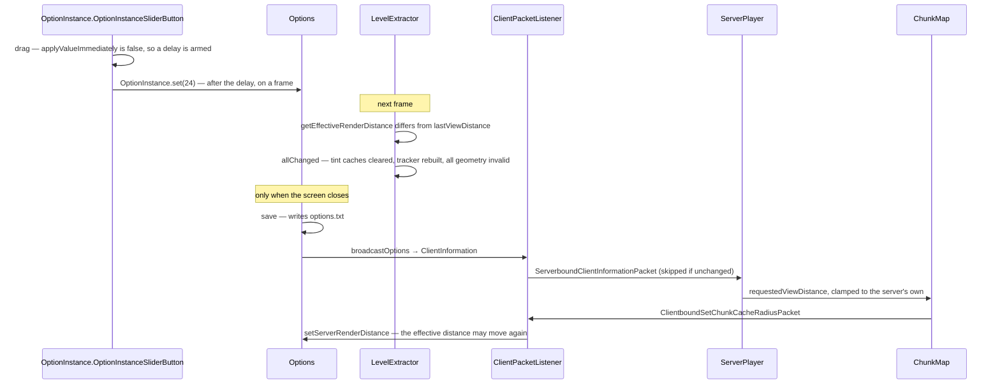

# The client world and options

> Verified against **Minecraft 26.2** · Part X · a render-distance slider, and everything it takes to make the world agree with it.

## Responsibility

The client's own work on its copy of the world — what it ticks, what it
lights, what it guesses and takes back — plus the settings and input that
drive it. [What the client is told](../networking/what-the-client-is-told.md)
owns what arrives from the server; this page owns what the client does
with it and what it decides on its own.

The one sentence a player would recognise: *changing a video setting and
watching the world rebuild.*

The headline for a 1.21-era reader: **the client is not a passive
receiver.** It runs a real light engine, ticks every block entity
regardless of simulation distance, keeps its own free-running clock, and
predicts block changes it has not been told about — holding a ledger of
what the server last said so it can replay that opinion when the
acknowledgement arrives.

## The data it owns

### `ClientLevel`

`ClientLevel.tickingEntities` (an `EntityTickList`) over
`ClientLevel.entityStorage` — a `TransientEntitySectionManager`, not the
server's persistent one. `ClientLevel.clientLevelData` is a
`ClientLevel.ClientLevelData` holding the client's own
`ClientLevel.ClientLevelData.gameTime` and difficulty.
`ClientLevel.lightUpdateQueue` holds deferred light work;
`ClientLevel.tintCaches` holds four `BlockTintCache`s;
`ClientLevel.destroyingBlocks` and `ClientLevel.destructionProgress`
hold the breaking overlays; `ClientLevel.blockStatePredictionHandler` is
the ledger; `ClientLevel.levelExtractor` is the *only* route from a level
mutation to the renderer. Its constants
`ClientLevel.NORMAL_LIGHT_UPDATES_PER_FRAME` and
`ClientLevel.LIGHT_UPDATE_QUEUE_SIZE_THRESHOLD` set the lighting budget.

### Prediction

`MultiPlayerGameMode` is the client's half of the game mode:
`MultiPlayerGameMode.startDestroyBlock`,
`.continueDestroyBlock`, `.destroyBlock`, `.useItemOn`, `.useItem`,
`.attack`, `.interact`, plus `MultiPlayerGameMode.localPlayerMode` and
`MultiPlayerGameMode.getDestroyStage`. Every predicted action goes
through one private helper that opens a `BlockStatePredictionHandler`,
runs the local effect, and sends a packet carrying the sequence number.

`BlockStatePredictionHandler` holds
`BlockStatePredictionHandler.currentSequenceNr` and a map of
`BlockStatePredictionHandler.ServerVerifiedState` — for each predicted
position, the block state the server last asserted, the sequence, and the
player's position at the time. Its verbs are
`BlockStatePredictionHandler.startPredicting`,
`.retainKnownServerState`, `.updateKnownServerState`,
`.endPredictionsUpTo` and `.onTeleport`.

### Options

`Options` reads and writes *options.txt* through `Options.load` and
`Options.save`, with each setting an `OptionInstance` over an
`OptionInstance.ValueSet` (`OptionInstance.IntRange`,
`OptionInstance.Enum`, `OptionInstance.UnitDouble`). The ones the server
is told about are assembled by `Options.buildPlayerInformation` into a
`ClientInformation` — language, view distance, chat visibility, chat
colours, skin model parts, main hand, text filtering, listing
permission, particle status — and sent by `Options.broadcastOptions`.
`Options.getEffectiveRenderDistance` is the clamp against
`Options.serverRenderDistance`.

### Input

`KeyMapping` is a name, a default key, a `KeyMapping.Category` and a
click counter; `KeyMapping.consumeClick` and `KeyMapping.isDown` are how
gameplay reads it, and `KeyMapping.click`, `KeyMapping.set`,
`KeyMapping.releaseAll` and `KeyMapping.resetToggleKeys` how the input
handlers write it. `ToggleKeyMapping` flips instead of assigning.
`MouseHandler` accumulates deltas in
`MouseHandler.accumulatedDX` and `MouseHandler.accumulatedDY` and applies them in
`MouseHandler.handleAccumulatedMovement`, smoothing through `SmoothDouble`.
`KeyboardHandler` handles key events, the debug-key combos and the
clipboard.

`Tutorial` holds a `TutorialStepInstance` chosen by
`Options.tutorialStep` (a `TutorialSteps`), and is nudged by
`Tutorial.onInput`, `Tutorial.onLookAt`, `Tutorial.onDestroyBlock` and
`Tutorial.onOpenInventory`.

## When it runs

**Per client tick** (`Minecraft.tick`): the game mode, then
`Minecraft.pick` with a partial tick of one, then `Gui.tick`, then
`Minecraft.handleKeybinds` — the sole consumer of key clicks for
gameplay — then `GameRenderer.tick`, `ClientLevel.tickEntities`,
`Level.tickBlockEntities`, the sound managers, `Tutorial.tick`,
`ClientLevel.tick` (sky brightness, world border, the clock, weather,
breaking progress, the chunk cache), `ClientLevel.animateTick`,
`ParticleEngine.tick`, and finally the tick-end packet.

**Per frame**, and *only* per frame: `ClientLevel.update`, which polls
the light queue and runs the light engine; `Minecraft.pick` a second
time, at the real partial tick, for the crosshair and block outline;
`MouseHandler.handleAccumulatedMovement`, which turns the player; and the
extract pass, which notices a changed render distance.

**Per input event**: GLFW callbacks are queued onto the client thread and
run before the ticks. Mouse motion only accumulates; key edges are
recorded immediately.

## The trace: the render-distance slider

The shape is the interesting part: the local rebuild happens some
fraction of a second after the drag stops, the server hears nothing until
the screen is dismissed, and the effective distance can then change a
*second* time when the server's clamp comes back.

## The prediction ledger

The other trace worth knowing. When the client breaks or places a block
it opens a prediction, applies the change locally, and sends a packet
carrying the sequence number. Every local `ClientLevel.setBlock` made
while predicting first records the *pre-change* state in the ledger,
along with the player's position.

A server block update arriving before the acknowledgement does **not**
touch the world — `ClientLevel.setServerVerifiedBlockState` merely
overwrites the ledger entry, and the prediction stays on screen. When
`ClientboundBlockChangedAckPacket` arrives,
`BlockStatePredictionHandler.endPredictionsUpTo` replays every settled
entry through `ClientLevel.syncBlockState`, which applies the state only
if it actually differs — so a correct prediction costs nothing — and
snaps the player back to the recorded position if the restored block now
intersects them. A teleport in the meantime suppresses that snap.

The framing that matters: **the client does not roll back — it replays
the server's opinion.** The ledger stores what the server last said, and
the acknowledgement is permission to apply it.

## Interfaces

- **Called by:** `Minecraft.tick` and `Minecraft.renderFrame` — see
  [the frame](the-frame.md).
- **Calls into:** `LevelExtractor` for every renderer notification —
  see [level rendering](level-rendering.md); the light engine described
  in [lighting](../world/lighting.md); `ParticleEngine` and
  `SoundManager`.
- **Crosses the network as:** `ServerboundClientInformationPacket`
  (a *common* packet, so it works in configuration too), the
  sequence-carrying action packets, and inbound
  `ClientboundSetChunkCacheRadiusPacket` and
  `ClientboundSetSimulationDistancePacket`.
- **Data-driven by:** *options.txt*, and nothing else.

## Invariants and surprises

- **The client lights per frame, and the budget is non-linear.** Below a
  queue threshold it trickles a small share of the backlog each frame; at
  or above it, the entire queue is drained in one frame. A big chunk-load
  burst produces one long frame rather than a hundred slightly late ones.
- **The client runs a real light engine**, with block light enabled. The
  server ships light with chunks, but every client-side `Level.setBlock` —
  including predicted ones — relights locally.
- **Every block entity ticks, everywhere.** `Level.shouldTickBlocksAt`
  returns true unconditionally and `ClientLevel` does not override it.
  `ClientLevel.serverSimulationDistance` has exactly one consumer:
  whether a dying entity plays its death animation.
- **Scheduled ticks do not exist client-side.** Both tick lists are
  black holes, which is why a predicted placement of something that
  schedules itself looks inert until the server speaks.
- **Simulation distance is never sent to the server.** The client
  information carries only view distance; the multiplayer simulation
  distance arrives from the server. A multiplayer player's simulation
  slider changes nothing.
- **`Options.save` is the only caller of `Options.broadcastOptions`.**
  There is no settings-changed event — the server learns about a new
  view distance or skin layer only when something saves, and the send is
  then skipped if nothing actually changed.
- **The slider's own maximum depends on the JVM's heap.**
- **Loading options deliberately skips every value listener**, which is
  how a hundred settings are restored without triggering a hundred
  reloads.
- **One key can drive many mappings and the game does not resolve it.**
  Conflict detection is purely cosmetic in the controls screen; two
  things bound to the same key both fire.
- **F3 is a key binding, and the modifier and the overlay toggle are the
  same binding by default** — which is why the overlay toggles on
  *release*, and only if no combo was used in between. Rebind one and
  that behaviour disappears.
- **`KeyMapping.Category` is a registrable record**, not an enum:
  categories can be added without touching the game's own list, and
  display order is registration order.
- **Scoped aiming is exactly eight times slower**, by construction — the
  sensitivity curve is the same, and the ordinary path multiplies it by
  eight while the scoped path does not.
- **Accumulated mouse motion is discarded, not banked**, on any frame
  where it is not applied — window unfocused, cursor ungrabbed, a screen
  open.
- **Grabbing the mouse is what closes a screen**, not the other way
  round.
- **The tutorial is per-installation, not per-world.** Its step lives in
  *options.txt*; once any world drives it to the end, no later world
  shows the toasts again.
- **The client keeps its own clock.** Game time free-runs between time
  packets, which is what makes the breaking-progress expiry approximate
  rather than authoritative.
- **`ClientLevel` never notifies `LevelRenderer` directly.** Everything
  goes through `LevelExtractor`; the chunk cache bypasses the level
  entirely and marks sections dirty itself.
- **Names a 1.21-era reader will hunt for and not find:**
  *Minecraft.screen* and *setScreen* (now on `Gui`), every dirty method
  on `LevelRenderer` (now on `LevelExtractor`),
  *MouseHandler.lastMouseEventTime*, `KeyMapping` categories as strings,
  *Options.mouseSensitivity* as a bare field, *Options.keyBindings*, and
  *ClientLevel.levelRenderer*.

## Where to look

`Minecraft.tick` then `Minecraft.renderFrame` for the two cadences, and
`ClientLevel.tick` and `ClientLevel.update` for what each does to the
world. `MultiPlayerGameMode.startDestroyBlock` and
`BlockStatePredictionHandler` for the ledger. `Options.processOptions`
for the settings table and `Options.buildPlayerInformation` for the
handful the server ever hears about.

---

*Rules: names, never code · how the system works, not how the code reads ·
newest version only · every backticked name passes `tools/verify_names.py`.*
