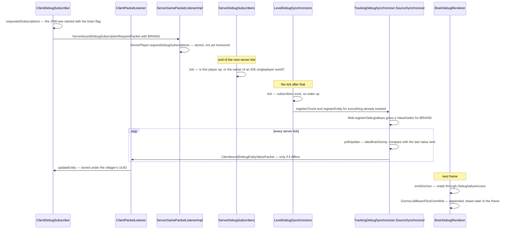

# Debugging the running game

> Verified against **Minecraft 26.2** · Part X · a villager's brain drawn over its head: one subscription mechanism, sixteen instances, all of them in the jar you downloaded and none of them on.

Every one of these sixteen debug views is compiled into the shipped client
and the shipped dedicated server. Every subscription is in the registry,
every packet is in the protocol, every producer call site is there. Nothing
is stripped. **The client simply never asks** — fourteen of the sixteen are
behind a JVM system property read at startup, and the server has to agree
besides. The cost of all this while idle is one emptiness check per level per
tick.

That is the pattern the page is about: a registry of subscription kinds, a
per-level engine that sleeps until somebody asks, a poll-and-diff sender, and
about two dozen renderers that turn the results into floating text and boxes.
It is only half a client system — the machinery ships on the dedicated server
— but the client is the only thing that ever asks and the only thing that
draws, and the trace ends in a renderer.

## The cast

| class | what it decides | thread |
|---|---|---|
| `DebugSubscription` | what one kind of debug value is: a stream codec, and an expiry | both sides |
| `DebugSubscriptions` | the sixteen kinds | both sides |
| `DebugValueSource` | which objects can answer which subscriptions | Server thread |
| `ServerDebugSubscribers` | who is subscribed, rebuilt every tick, and the permission rule | Server thread |
| `LevelDebugSynchronizers` | one synchronizer per subscription per level, and the sleep flag | Server thread |
| `TrackingDebugSynchronizer` | the engine: registration, the diff, and the tracking filter | Server thread |
| `ClientDebugSubscriber` | what to ask for, and the maps holding what came back | Render thread |
| `DebugRenderer` | the renderer list, rebuilt when the enabled entries change | Render thread |

## The idea

A `DebugSubscription` is a registry object — held in
`BuiltInRegistries.DEBUG_SUBSCRIPTION` under `Registries.DEBUG_SUBSCRIPTION`
— carrying exactly two things: a nullable stream codec for its value type,
and an expiry in ticks, which is `DebugSubscription.DOES_NOT_EXPIRE` for
most. Its payload wrappers are the records `DebugSubscription.Update` — a
subscription plus an *optional* value, so absence is expressible — and
`DebugSubscription.Event`, a subscription plus a value. Both are serialised
by dispatching on the registry id onto the subscription's own codec.

That is the whole abstraction, and it replaces what used to be a fixed
packet type per kind of information.

`DebugValueSource` is the supply side, implemented by `Entity`, `Mob`, `Bee`,
`Breeze`, `BlockEntity`, `BeehiveBlockEntity` and `LevelChunk`;
`DebugValueSource.registerDebugValues` hands back one
`DebugValueSource.ValueGetter` per subscription the object can answer. On the
client, `ClientDebugSubscriber` keeps what came back, keyed by chunk
position, block position or entity UUID, plus a list of expiring events, and
`ClientDebugSubscriber.createDebugValueAccess` hands renderers a read-only
`DebugValueAccess` view. `DebugRenderer` is a plain list of
`DebugRenderer.SimpleDebugRenderer`s, rebuilt by
`DebugRenderer.refreshRendererList` — and they do not draw either: they emit
through `Gizmos`.

## The sixteen instances

| subscription | carries | fed by |
|---|---|---|
| `DebugSubscriptions.BRAINS` | `DebugBrainDump` | `Mob.registerDebugValues` |
| `DebugSubscriptions.GOAL_SELECTORS` | `DebugGoalInfo` | `Mob.registerDebugValues` |
| `DebugSubscriptions.ENTITY_PATHS` | `DebugPathInfo` | the navigator's current `Path` |
| `DebugSubscriptions.BEES` / `DebugSubscriptions.BEE_HIVES` | `DebugBeeInfo` / `DebugHiveInfo` | `Bee` and `BeehiveBlockEntity` |
| `DebugSubscriptions.BREEZES` | `DebugBreezeInfo` | `Breeze` |
| `DebugSubscriptions.POIS` | `DebugPoiInfo` | `TrackingDebugSynchronizer.PoiSynchronizer`, event-driven |
| `DebugSubscriptions.VILLAGE_SECTIONS` | nothing but presence | `TrackingDebugSynchronizer.VillageSectionSynchronizer` |
| `DebugSubscriptions.RAIDS` / `DebugSubscriptions.STRUCTURES` | positions / `DebugStructureInfo` | `LevelChunk.registerDebugValues` |
| `DebugSubscriptions.GAME_EVENT_LISTENERS` | `DebugGameEventListenerInfo` | the listener registry |
| `DebugSubscriptions.GAME_EVENTS` | `DebugGameEventInfo` | the dispatcher — an *event*, expiring after 60 ticks |
| `DebugSubscriptions.NEIGHBOR_UPDATES` | a position | a listener installed on the neighbour updater — an event, 200 ticks |
| `DebugSubscriptions.ENTITY_BLOCK_INTERSECTIONS` | `DebugEntityBlockIntersection` | `Entity`, pushed directly, 100 ticks |
| `DebugSubscriptions.REDSTONE_WIRE_ORIENTATIONS` | an `Orientation` | the experimental wire evaluator, 200 ticks |
| `DebugSubscriptions.DEDICATED_SERVER_TICK_TIME` | **no value at all** | see *the sample path* below |

"Expires after *n* ticks" means two different things across those four
expiring rows. For the two *event* kinds it is how long the event stays on
screen; for the two *pushed-value* kinds it is a time-to-live on a stored
value. Only the client purges, and only for subscriptions that declare an
expiry at all.

## One instance traced: a villager's brain

The engine is the middle three steps, and it has three properties worth
naming. **Nothing exists until somebody asks**: the level's synchronizers
start asleep, and the first non-empty subscriber set wakes them and
retroactively registers every ready chunk and every tracked entity.
**Nothing is sent twice**: each value source keeps the last value it sent and
compares. And **nothing reaches a player who cannot see it**: sending is
filtered by subscription *and* by whether that player is tracking the chunk
or entity. When the last subscriber goes away the whole thing is cleared.

The three cadences: `ClientDebugSubscriber.tick` runs from
`ClientPacketListener.tick`, once per client tick, and sends only when the
wanted set differs from the last one sent.
`ServerDebugSubscribers.tick` runs from `MinecraftServer.tickChildren`
*after* the levels have ticked, while each `LevelDebugSynchronizers.tick`
runs *inside* its level's tick — so **every level acts on the previous tick's
subscriber snapshot**, a built-in one-tick lag. And `DebugRenderer.emitGizmos`
runs inside `LevelExtractor.extract`, after entities, block entities,
particles, sky and clouds, fetching one `DebugValueAccess` for the whole
pass.

## The exceptions

Every pattern page's real content.

**Two gates, and the second is not a flag.** Fourteen of the sixteen kinds
are behind `SharedConstants.DEBUG_ENABLED` *and* an individual flag, both
read from JVM system properties at startup — the only subscription an F3 key
can reach is the dedicated server's tick time, through the FPS charts. And
the server still has to agree: `ServerPlayer.debugSubscriptions` returns
nothing unless `ServerDebugSubscribers.hasRequiredPermissions` passes, which
means op on the player list, or the owner of a singleplayer world run from an
IDE. On a normal singleplayer world that means cheats must be on.

**Producers check before they work.** Path finding only records its open and
closed node sets when somebody wants paths; entities only collect block
intersections when somebody wants them; the neighbour updater's debug
listener is only installed while someone is subscribed. The gate is
`LevelDebugSynchronizers.hasAnySubscriberFor`, and it is why this costs
nothing when idle. The change detection, by contrast, is *record equality*: a
brain dump is rebuilt every tick per villager and compared with the last one
sent — so the saving is in bandwidth, not in server time.

**About half the renderers do not use this system at all.** The chunk debug
renderer and the entity hitbox renderer reach directly into
`Minecraft.getSingleplayerServer`, so they show nothing in multiplayer; and a
whole family of them — chunk borders, light, collision boxes, height maps,
the section octree — are purely client-side views that need no server.

**One flag combination silently under-delivers.** The POI renderer reads
brain data to label ticket holders, but the client only subscribes to brains
under the brain flag — so running with the POI flag alone gives POI boxes
with no names. The bee flag avoids the same trap by explicitly also
requesting goal selectors.

**Subscriptions survive a dimension change and a death, but not a
reconnect.** `ServerPlayer.restoreFrom` copies the requested set to the new
player object; a fresh login starts empty, and the client re-sends on its next
tick because `ClientDebugSubscriber` was cleared at login.

## The sample path, which shares only the subscriber map

The performance charts are a separate and much simpler system. A
`SampleLogger` takes a vector of longs; partial values are logged during a
tick and a final call flushes the whole vector. There are two implementations
and the difference is the whole story: `LocalSampleLogger` **is** the storage
— a `SampleStorage` ring buffer the charts read directly — while
`RemoteSampleLogger` stores nothing and broadcasts a
`ClientboundDebugSamplePacket` if anyone is subscribed.

So a dedicated server measures its tick with a remote logger and sends, while
`IntegratedServer.getTickTimeLogger` hands back **the client's own** local
logger and reports logging as unconditionally enabled — singleplayer TPS
never touches the network. Client-side, `DebugScreenOverlay` owns four local
loggers with four different feeders: the frame time from the loop, the tick
time from either of the two paths above, the ping from `PingDebugMonitor`
(which sends its own ping requests, and only while the network charts are
shown), and the bandwidth from a `BandwidthDebugMonitor` that counts bytes on
the Netty thread and is drained by `Connection.tick`.

Six packets carry all of this: `ServerboundDebugSubscriptionRequestPacket`
outbound, and `ClientboundDebugChunkValuePacket`,
`ClientboundDebugBlockValuePacket`, `ClientboundDebugEntityValuePacket`,
`ClientboundDebugEventPacket` and `ClientboundDebugSamplePacket` inbound —
for a system that used to have one per subject.

> **For a 1.21-era reader.** The fixed set of debug packets is gone. Instead
> of one packet type per kind of debug information there is one
> `DebugSubscription` registry and three generic value packets that dispatch
> on the registry id. The debug *screen* is a different system again — the F3
> entry registry described in [the HUD](hud.md) — and the two touch at
> exactly two points: the renderer list is rebuilt when the enabled-entry
> version changes, and the FPS charts gate the tick-time subscription.

## Where to look

`DebugSubscriptions` for the catalogue and `DebugSubscription` for how little
a subscription is. `TrackingDebugSynchronizer` for the engine — the tracking
diff, the back-fill and the equality check are all in that one class.
`LevelDebugSynchronizers.tick` for the sleep flag, `ClientDebugSubscriber`
for both ends of the client's half, and `DebugRenderer.refreshRendererList`
for which renderers exist and why.

---

*Rules: names, never code · how the system works, not how the code reads ·
newest version only · every backticked name passes `tools/verify_names.py`.*
