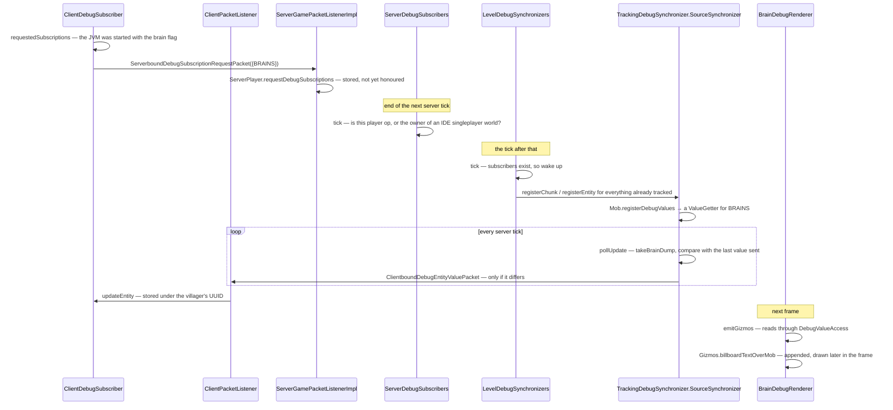

# Debugging the running game

> Verified against **Minecraft 26.2** · Part X · a villager's brain drawn over its head: the client subscribes, the server polls, and a value crosses the wire only when it changes.

## Responsibility

The client can ask the server for its internal state — mob brains, paths,
points of interest, goal selectors, structure bounds, raid centres, game
events, neighbour updates — and draw it in the world. This page is that
system: a registry of subscription kinds, a per-level engine that sleeps
until somebody asks, a poll-and-diff sender, and about two dozen renderers
that turn the results into floating text and boxes.

It is only half a client system. The subscription machinery ships on the
dedicated server; what makes it a Part X page is that the client is the only
thing that ever asks, and the only thing that draws.

The one sentence a player would recognise: *the debug boxes and text you see
in a Mojang developer's screenshots.*

The headline for a 1.21-era reader: **the fixed set of debug packets is
gone.** Instead of one packet type per kind of debug information there is one
`DebugSubscription` registry, and three generic value packets that dispatch
on the registry id.

## The data it owns

- **`DebugSubscription`** — a registry object, held in
  `BuiltInRegistries.DEBUG_SUBSCRIPTION` under
  `Registries.DEBUG_SUBSCRIPTION`, carrying exactly two things: a nullable
  stream codec for its value type, and an expiry in ticks
  (`DebugSubscription.DOES_NOT_EXPIRE` for most). Its payload wrappers are
  the records `DebugSubscription.Update` — a subscription plus an *optional*
  value, so absence is expressible — and `DebugSubscription.Event`, a
  subscription plus a value. Both are serialised by dispatching on the
  registry id onto the subscription's own codec.
- **`DebugSubscriptions`** — the sixteen kinds, listed below.
- **`DebugValueSource`** — the supply interface, implemented by `Entity`,
  `Mob`, `Bee`, `Breeze`, `BlockEntity`, `BeehiveBlockEntity` and
  `LevelChunk`. `DebugValueSource.registerDebugValues` hands back one
  `DebugValueSource.ValueGetter` per subscription the object can answer.
- **`ServerDebugSubscribers`** — one per server, rebuilt every tick from the
  players' requested sets, and the holder of the permission rule.
- **`LevelDebugSynchronizers`** — one per `ServerLevel`, holding one
  `TrackingDebugSynchronizer.SourceSynchronizer` per subscription that has a
  value codec, plus two hand-written ones —
  `TrackingDebugSynchronizer.PoiSynchronizer` and
  `TrackingDebugSynchronizer.VillageSectionSynchronizer` — for the kinds
  that are event-driven rather than pollable. It also owns the sleep flag.
- **`ClientDebugSubscriber`** — the client's half: what to ask for, and the
  maps that hold what came back, keyed by chunk position, block position or
  entity UUID, plus a list of expiring events. `ClientDebugSubscriber.createDebugValueAccess`
  hands renderers a read-only `DebugValueAccess` view.
- **`DebugRenderer`** — a plain list of `DebugRenderer.SimpleDebugRenderer`s,
  rebuilt by `DebugRenderer.refreshRendererList`. They do not draw: they emit
  through `Gizmos`.

### The sixteen kinds

| subscription | carries | fed by |
|---|---|---|
| `DebugSubscriptions.BRAINS` | `DebugBrainDump` | `Mob.registerDebugValues` |
| `DebugSubscriptions.GOAL_SELECTORS` | `DebugGoalInfo` | `Mob.registerDebugValues` |
| `DebugSubscriptions.ENTITY_PATHS` | `DebugPathInfo` | the navigator's current `Path` |
| `DebugSubscriptions.BEES` / `DebugSubscriptions.BEE_HIVES` | `DebugBeeInfo` / `DebugHiveInfo` | `Bee` and `BeehiveBlockEntity` |
| `DebugSubscriptions.BREEZES` | `DebugBreezeInfo` | `Breeze` |
| `DebugSubscriptions.POIS` | `DebugPoiInfo` | the POI synchronizer, event-driven |
| `DebugSubscriptions.VILLAGE_SECTIONS` | nothing but presence | the village-section synchronizer |
| `DebugSubscriptions.RAIDS` / `DebugSubscriptions.STRUCTURES` | positions / `DebugStructureInfo` | `LevelChunk.registerDebugValues` |
| `DebugSubscriptions.GAME_EVENT_LISTENERS` | `DebugGameEventListenerInfo` | the listener registry |
| `DebugSubscriptions.GAME_EVENTS` | `DebugGameEventInfo` | the dispatcher — an *event*, expiring |
| `DebugSubscriptions.NEIGHBOR_UPDATES` | a position | a listener installed on the neighbour updater — an event |
| `DebugSubscriptions.ENTITY_BLOCK_INTERSECTIONS` | `DebugEntityBlockIntersection` | `Entity`, pushed directly, expiring |
| `DebugSubscriptions.REDSTONE_WIRE_ORIENTATIONS` | an `Orientation` | the experimental wire evaluator, expiring |
| `RemoteDebugSampleType.TICK_TIME`'s subscription | **no value at all** | see *the sample path* below |

## When it runs

**On the client**, `ClientDebugSubscriber.tick` runs from
`ClientPacketListener.tick` — once per client tick. It recomputes the wanted
set and sends only when it differs from the last one sent.

**On the server**, `ServerDebugSubscribers.tick` runs from
`MinecraftServer.tickChildren` *after* the levels have ticked, while each
`LevelDebugSynchronizers.tick` runs *inside* its level's tick. Every level
therefore acts on the previous tick's subscriber snapshot — a built-in
one-tick lag.

**On the frame**, `DebugRenderer.emitGizmos` runs inside
`LevelExtractor.extract`, after entities, block entities, particles, sky and
clouds. It fetches one `DebugValueAccess` for the whole pass.

## The trace: a villager's brain

The engine is in the middle three steps. **Nothing exists until somebody
asks**: the level's synchronizers start asleep, and the first non-empty
subscriber set wakes them and retroactively registers every ready chunk and
every tracked entity. **Nothing is sent twice**: each value source keeps the
last value it sent and compares. And **nothing reaches a player who cannot
see it**: sending is filtered by subscription *and* by whether that player is
tracking the chunk or entity. When the last subscriber goes away the whole
thing is cleared, and the idle cost falls back to one emptiness check per
level per tick.

## The sample path

The performance charts are a separate, much simpler system that shares only
the subscriber map. A `SampleLogger` takes a vector of longs; partial values
are logged during a tick and a final call flushes the whole vector. There are
two implementations and the difference is the whole story:
`LocalSampleLogger` *is* the storage — a `SampleStorage` ring buffer that the
charts read directly — while `RemoteSampleLogger` stores nothing and
broadcasts a `ClientboundDebugSamplePacket` if anyone is subscribed.

So a dedicated server measures its tick with a remote logger and sends;
`IntegratedServer.getTickTimeLogger` hands back **the client's own** local
logger and reports logging as unconditionally enabled, so singleplayer TPS
never touches the network. Client-side, `DebugScreenOverlay` owns four local
loggers with four different feeders: the frame time from the loop, the tick
time from either of the two paths above, the ping from `PingDebugMonitor`
(which sends its own ping requests, and only while the network charts are
shown), and the bandwidth from a `BandwidthDebugMonitor` that counts bytes on
the Netty thread and is drained by `Connection.tick`.

## Interfaces

- **Called by:** `ClientPacketListener.tick`, `MinecraftServer.tickChildren`,
  `ServerLevel.tick`, and `LevelExtractor.extract`.
- **Calls into:** `Gizmos`, whose output is collected per frame and drawn by
  the level renderer; `ChunkMap` for every tracking question.
- **Crosses the network as:** `ServerboundDebugSubscriptionRequestPacket`
  outbound; `ClientboundDebugChunkValuePacket`,
  `ClientboundDebugBlockValuePacket`, `ClientboundDebugEntityValuePacket`,
  `ClientboundDebugEventPacket` and `ClientboundDebugSamplePacket` inbound.
  Six packets for a system that used to have one per subject.
- **Data-driven by:** nothing. It is gated by JVM system properties and by
  operator status.

## Invariants and surprises

- **Almost none of this can be turned on from inside the game.** Fourteen of
  the sixteen kinds are behind `SharedConstants.DEBUG_ENABLED` *and* an
  individual flag, both read from JVM system properties at startup. The only
  subscription an F3 key can reach is the dedicated server's tick time, via
  the FPS charts.
- **And the server still has to agree.** `ServerPlayer.debugSubscriptions`
  returns nothing unless `ServerDebugSubscribers.hasRequiredPermissions`
  passes: op on the player list, or the owner of a singleplayer world run
  from an IDE. On a normal singleplayer world that means cheats must be on.
- **None of it is stripped from the shipped jar.** Every subscription is in
  the registry, every packet is in the protocol, and every producer call site
  is compiled in. The shipped client simply never asks.
- **Producers check before they work.** Path finding only records its open
  and closed node sets when somebody wants paths; entities only collect block
  intersections when somebody wants them; the neighbour updater's debug
  listener is only installed while someone is subscribed. The gate is
  `LevelDebugSynchronizers.hasAnySubscriberFor`, and it is why this system
  costs nothing when idle.
- **The change detection is record equality.** A brain dump is rebuilt every
  tick per villager and compared with the last one sent — so the saving is in
  bandwidth, not in server time.
- **Subscriptions survive a dimension change and a death, but not a
  reconnect.** `ServerPlayer.restoreFrom` copies the requested set to the new
  player object; a fresh login starts empty, and the client re-sends on its
  next tick because `ClientDebugSubscriber` was cleared at login.
- **Two of the renderers do not use this system at all.** The chunk debug
  renderer and the entity hitbox renderer reach directly into
  `Minecraft.getSingleplayerServer`, so they show nothing in multiplayer.
  About half the renderers are like this — purely client-side views (chunk
  borders, light, collision boxes, height maps, the section octree) that need
  no server at all.
- **One flag combination silently under-delivers.** The POI renderer reads
  brain data to label ticket holders, but the client only subscribes to
  brains under the brain flag — so running with the POI flag alone gives POI
  boxes with no names. The bee flag avoids the same trap by explicitly also
  requesting goal selectors.
- **"Expires after *n* ticks" means two different things.** For the two event
  kinds it is how long the event stays on screen; for the two pushed-value
  kinds it is a time-to-live on a stored value. Only the client purges, and
  only for subscriptions that declare an expiry at all.
- **The debug *screen* is a different system.** The F3 entry registry
  described in [the HUD](hud.md) touches this one at exactly two points: the
  renderer list is rebuilt when the enabled-entry version changes, and the
  FPS charts gate the tick-time subscription.

## Where to look

`DebugSubscriptions` for the catalogue and `DebugSubscription` for how little
a subscription is. `TrackingDebugSynchronizer` for the engine — the tracking
diff, the back-fill, and the equality check are all in that one class.
`LevelDebugSynchronizers.tick` for the sleep flag, `ClientDebugSubscriber`
for both ends of the client's half, and `DebugRenderer.refreshRendererList`
for which renderers exist and why.

---

*Rules: names, never code · how the system works, not how the code reads ·
newest version only · every backticked name passes `tools/verify_names.py`.*
