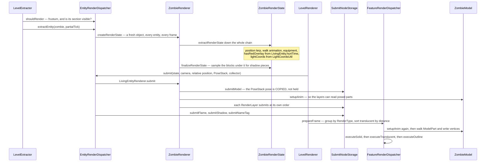

# Entity rendering

> Verified against **Minecraft 26.2** · Part X · a zombie is drawn: extract, submit, prepare, execute.

## Responsibility

Everything in the world that is not terrain: mobs, players, items on the
ground, block entities, name tags, shadows, the flame overlay. This page
is the three-stage pipeline they all go through, and the model and layer
machinery that produces their geometry.

The one sentence a player would recognise: *a zombie walks toward you and
flashes red when you hit it.*

The headline for a 1.21-era reader: **`EntityRenderer` has no *render*
method.** Nor does anything else here. The pair is
`EntityRenderer.extractRenderState` — which reads the live entity — and
`EntityRenderer.submit`, which describes what should be drawn without
touching a vertex. *MultiBufferSource* does not exist anywhere in the
game. Vertices are written a stage later, by a *feature renderer*.

## The data it owns

### Dispatch

- **`EntityRenderDispatcher`** — one `EntityRenderer` per `EntityType`,
  looked up by `EntityRenderDispatcher.getRenderer`. Its two verbs are
  `EntityRenderDispatcher.extractEntity` and
  `EntityRenderDispatcher.submit`, with
  `EntityRenderDispatcher.prepare` setting the camera for the frame.
  Renderers come from the factory table `EntityRenderers` through an
  `EntityRendererProvider.Context`.
- **`BlockEntityRenderDispatcher`** — the same shape, with
  `BlockEntityRenderDispatcher.tryExtractRenderState` and
  `BlockEntityRenderDispatcher.submit`, and
  `BlockEntityRenderer.shouldRenderOffScreen` deciding which of the two
  gathering paths an entity may arrive on.

### Render states

Every entity produces a fresh, allocation-per-frame value object.
`EntityRenderState` holds position, `EntityRenderState.ageInTicks`,
`EntityRenderState.lightCoords`, `EntityRenderState.outlineColor`,
`EntityRenderState.nameTag`, `EntityRenderState.leashStates` and
`EntityRenderState.shadowPieces`. `LivingEntityRenderState` adds
rotations, `LivingEntityRenderState.walkAnimationPos`,
`LivingEntityRenderState.deathTime`, `LivingEntityRenderState.isBaby`
and `LivingEntityRenderState.hasRedOverlay`. `ArmedEntityRenderState`
adds the hands, `HumanoidRenderState` the pose and equipment,
`ZombieRenderState` its two flags. The player's is `AvatarRenderState`.

Nothing in these classes holds an `Entity` or a `Level`. The one thing
that looks live — an `AnimationState` on the states that have one — is a
tick-counter value object, not a handle.

### Renderers, models and layers

`EntityRenderer` → `LivingEntityRenderer` → `MobRenderer` →
`AgeableMobRenderer` → `HumanoidMobRenderer` → `AbstractZombieRenderer`
→ `ZombieRenderer`. Players are served by `AvatarRenderer`, keyed by
skin model rather than by entity type.

Geometry is `Model` → `EntityModel` → `HumanoidModel`, built from
`ModelPart`s. A model is baked once from a `LayerDefinition` /
`MeshDefinition` / `PartDefinition` tree named by a `ModelLayerLocation`
in `ModelLayers` and held in an `EntityModelSet`. Posing is
`Model.setupAnim`, either hand-written or driven by an
`AnimationDefinition` of `Keyframe`s through `KeyframeAnimation`.

Extras hang off `RenderLayer` — `HumanoidArmorLayer`, `ItemInHandLayer`,
`CustomHeadLayer`, `WingsLayer`, `EyesLayer`, `CapeLayer` and a few
dozen more — each contributing through `RenderLayer.submit`.
Armour and trims funnel through `EquipmentLayerRenderer`.

### The submit layer

`SubmitNodeCollector` is the description API: `OrderedSubmitNodeCollector.submitModel`,
`.submitItem`, `.submitText`, `.submitNameTag`, `.submitShadow`,
`.submitFlame`, `.submitLeash`, `.submitBlockModel`, `.submitCustomGeometry`,
plus `SubmitNodeCollector.order` to pick a draw-order bucket.
`SubmitNodeStorage` collects those into a `SubmitNodeCollection` per
order, each holding fifteen named phases —
`SubmitNodeCollection.solid`, `.shadows`, `.nameTags`, `.texts`,
`.translucentModels`, `.breakingOverlay`, `.afterTerrain`,
`.alwaysOnTop`, `.outline` and the rest.

`FeatureRenderDispatcher` turns that into draws:
`FeatureRenderDispatcher.prepareFrame` sorts and batches every submit,
then `FeatureRenderDispatcher.PreparedFrame.executeSolid`,
`.executeTranslucent`, `.executeOutline`,
`.executeTranslucentAfterTerrain` and `.executeAlwaysOnTop` are called
from the frame graph. `ModelFeatureRenderer` is the one that finally
walks a `ModelPart` tree and writes vertices.

## When it runs

All on the client thread, inside one `Minecraft.renderFrame` — but the
code is already split as though it were not. The extract half touches
live entities; the render half touches only value snapshots. The seam is
visible in the gizmo plumbing, where the extract phase's collection is
handed to the render phase's explicitly.

- **Extract** — `LevelExtractor.extractVisibleEntities` walks
  `ClientLevel.entitiesForRendering`, culls with
  `EntityRenderer.shouldRender`, and calls
  `EntityRenderDispatcher.extractEntity`, which allocates and fills a
  render state and then `EntityRenderer.finalizeRenderState` samples the
  shadow from the world.
- **Submit** — `LevelRenderer.submitEntities` walks the states and calls
  `EntityRenderDispatcher.submit` with a shared `PoseStack`.
- **Prepare** — `FeatureRenderDispatcher.prepareFrame` groups submits,
  and `ModelFeatureRenderer` builds the vertices.
- **Execute** — the frame graph's main pass issues the draws.

## The trace: a zombie is drawn

The zombie is animated **twice** per frame. Once during submit — but only
because it has layers, and `ItemInHandLayer` and `CustomHeadLayer` need
posed `ModelPart`s to hang things off — and once again at geometry time.
That is only sound because the model is stateless between calls and the
render state is a pure snapshot. An entity with no layers is animated
once.

And the red flash is not a colour. `LivingEntity.hurtTime` becomes
`LivingEntityRenderState.hasRedOverlay` at extract;
`LivingEntityRenderer.getOverlayCoords` packs it into an `OverlayTexture`
coordinate; that packed integer rides through the submit node and lands
as a per-vertex attribute.

## Interfaces

- **Called by:** `LevelExtractor` and `LevelRenderer` — see
  [level rendering](level-rendering.md).
- **Calls into:** `EntityModelSet` and the model tree;
  `ItemModelResolver` and `ItemStackRenderState` for held and worn items
  (see [models and atlases](models-and-atlases.md)); [blaze3d](blaze3d.md)
  for the draws.
- **Crosses the network as:** nothing directly — everything drawn here
  is read from entities the server described, as in
  [what the client is told](../networking/what-the-client-is-told.md) and
  [synched entity data](../entities/synched-entity-data.md).
- **Data-driven by:** entity textures and equipment assets from resource
  packs, via `EquipmentAssetManager` and `EquipmentClientInfo`.

## Invariants and surprises

- **Renderers and models are shared and mutable; render states are not.**
  One `ZombieRenderer` and one `ZombieModel` serve every zombie, and the
  ageable renderer even swaps its model per entity. Safety comes entirely
  from the fresh per-entity state and from replaying the animation at
  draw time.
- **Shadows are sampled from the world during extract.** The renderer
  walks the blocks under the entity, computes each piece's alpha, and
  stores shapes and alphas in the render state. The feature renderer only
  turns those into quads. Invisible entities skip it entirely.
- **Avatars get their shadow at a different origin.** The crouch offset
  is removed before the shadow is submitted for a player and after it for
  everything else — which is what stops a sneaking player's shadow
  sinking into the ground.
- **`SubmitNodeCollector.order` is a global key, not a per-entity one.**
  Order one means "after every entity's order-zero body in the whole
  world", not "after this entity's body". That is how the eyes layer, the
  armour layers and the glint stack correctly across a crowd — and how
  one layer gets *underneath* everything by asking for a negative order.
- **Batching is by `RenderType` identity, and translucency defeats it on
  purpose.** All zombies collapse into one draw; translucent phases mark
  their groups strictly ordered so consecutive draws are not merged.
- **The pose stack is transient.** A submit copies the current pose;
  nothing downstream ever sees the stack. And a leaked push is fatal —
  `LevelRenderer.submitFeatures` throws if the stack is not empty at the
  end of the frame.
- **Player renderers are keyed by skin model, not entity type.** There is
  no entry for the player in the type map at all; the dispatcher
  pattern-matches and looks up by wide-or-slim.
- **Block entities take the same three stages but a stricter visibility
  rule.** A block entity is extracted from the visible-section walk *or*
  from the globally-rendered list, never both — the check is an exact
  match against `BlockEntityRenderer.shouldRenderOffScreen`, and only
  three renderers opt in. Sections must also be past a visibility
  threshold to contribute at all.
- **`AgeableMobRenderer` is deprecated and still the base of every
  humanoid mob.** The intended replacement is one model that reads the
  baby flag, or a baked adult/baby pair.
- **Hitboxes left the renderer.** F3+B is a debug-entry toggle read by a
  separate debug renderer that emits gizmo primitives; the old hitbox
  render state record is dead code with no references.
- **Names a 1.21-era reader will hunt for and not find:**
  *PlayerRenderer* (now `AvatarRenderer`, serving both players and
  mannequins), every *render* method on `EntityRenderer` and `RenderLayer`
  (now *submit*), *MultiBufferSource* and every buffer source,
  *EntityRenderDispatcher.renderHitbox* and *renderLeash*,
  *LivingEntityRenderer.getBob*, *MobRenderer.prepareMobModel*,
  *RenderType.entityCutoutNoCull* (the polarity flipped — the culled
  variant is now the one that says so), *ItemBlockRenderTypes* and
  *ElytraLayer* (now `WingsLayer`). `RenderLayerParent`, `PoseStack` and
  `ModelPart` all survive unchanged.

## Where to look

`EntityRenderDispatcher.extractEntity` and
`EntityRenderer.extractRenderState` for the first stage,
`LivingEntityRenderer.submit` for the second — it is the clearest single
method in the part. Then `SubmitNodeCollection` for the phase list and
`ModelFeatureRenderer` for where vertices are finally written.
`ModelLayers` and `LayerDefinition` for how a model is described.

---

*Rules: names, never code · how the system works, not how the code reads ·
newest version only · every backticked name passes `tools/verify_names.py`.*
