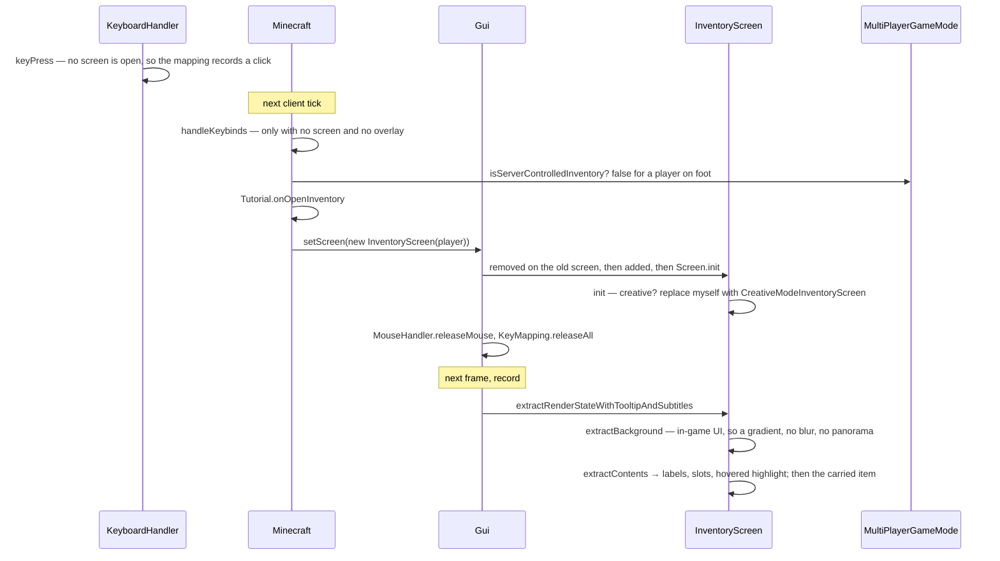

# GUI and screens

> Verified against **Minecraft 26.2** · Part X · pressing E: a screen the server is never told about, and everything the client does at the two ends of a screen's life.

## Responsibility

The screen manager, the screen lifecycle, widgets, layouts, focus and
narration, and the container screens that mirror a server-side menu. How a
screen's contents become pixels is
[the GUI render tree](the-gui-render-tree.md); how a `Component` becomes
glyphs is [text and fonts](text-and-fonts.md). This page is what a screen
*is* and when it runs.

The one sentence a player would recognise: *opening your inventory.*

The headline for a 1.21-era reader: **`Minecraft.screen` is gone.** The
current screen belongs to `Gui`, which is now the screen-and-overlay
manager rather than the HUD — the HUD is `Hud`, reached as `Gui.hud`. And
*Screen.render* is gone with it: a screen *records* itself with
`Screen.extractRenderState` and is drawn later.

## The data it owns

### The screen manager

`Gui` owns `Gui.screen` and `Gui.overlay` (through `Gui.setScreen` and
`Gui.setOverlay`), `Gui.hud`, `Gui.toastManager`, `Gui.chatListener`,
`Gui.splashManager` and the reference to the frame's render state. It has
three cadences, not two: `Gui.tick` once per client tick, `Gui.update` once
per frame — which advances toasts and fires delayed narration — and
`Gui.extractRenderState` once per frame in the record pass. The rest of its
surface is `Gui.isPausing`, `Gui.handleKeybinds`, `Gui.openChatScreen`,
`Gui.canInterruptScreen`, `Gui.buildInitialScreens` and
`Gui.setClientLevelTeardownInProgress`.

### Screens and widgets

`Screen` holds `Screen.children`, `Screen.renderables`,
`Screen.narratables`, `Screen.width`, `Screen.height` and
`Screen.narrationState`. Its lifecycle is `Screen.init` — final, and it runs
the overridable init hook only the first time, taking
`Screen.repositionElements` on every later call — plus
`Screen.rebuildWidgets`, `Screen.added`, `Screen.tick`, `Screen.removed`,
`Screen.resize` and `Screen.onClose`. Widgets are registered with
`Screen.addRenderableWidget` and its siblings. Its record entry point is the
final `Screen.extractRenderStateWithTooltipAndSubtitles`.

`Renderable` has exactly one method. `AbstractWidget` implements it as final
and hands subclasses `AbstractWidget.extractWidgetRenderState`;
`AbstractButton` narrows that again with a final override and an abstract
`AbstractButton.extractContents`. The family is `Button`, `EditBox`,
`Checkbox`, `CycleButton`, `AbstractScrollArea` and the selection lists over
it — `AbstractSelectionList`, `ObjectSelectionList`,
`ContainerObjectSelectionList`, `OptionsList`. `Tooltip` and
`MultiLineLabel` are not widgets: the first is held by a
`WidgetTooltipHolder`, the second is an interface.

Layout is `Layout` over `LayoutElement`: `LinearLayout`, `GridLayout`,
`FrameLayout`, `EqualSpacingLayout`, `HeaderAndFooterLayout`,
`SpacerElement`, configured by `LayoutSettings` and resolved by
`Layout.arrangeElements` and `Layout.visitWidgets`.

Input arrives as the `client/input` records — `KeyEvent`,
`MouseButtonEvent`, `CharacterEvent`, `PreeditEvent` — through
`GuiEventListener` and `ContainerEventHandler`. Focus is a `ComponentPath`
moved by a `FocusNavigationEvent`; ordering comes from
`TabOrderedElement.getTabOrderGroup`. Geometry is `ScreenRectangle`,
`ScreenPosition`, `ScreenAxis`, `ScreenDirection`. Narration is
`NarratableEntry` and `NarrationSupplier` collected into a
`ScreenNarrationCollector` and delivered by `Screen.handleDelayedNarration`.

### Container screens

`AbstractContainerScreen` holds `AbstractContainerScreen.menu`,
`AbstractContainerScreen.leftPos`, `AbstractContainerScreen.topPos`,
`AbstractContainerScreen.hoveredSlot` and the quick-craft state. Its record
pass is `AbstractContainerScreen.extractContents`, then
`AbstractContainerScreen.extractCarriedItem`, then
`AbstractContainerScreen.extractTooltip`; the first of those internally
draws the widget list, translates to the container origin, and runs
`AbstractContainerScreen.extractLabels`,
`AbstractContainerScreen.extractSlots` and the two slot-highlight passes. A
click goes `AbstractContainerScreen.slotClicked` →
`MultiPlayerGameMode.handleContainerInput` — see
[containers and menus](../items/containers-and-menus.md).
`MenuScreens` maps a `MenuType` to a screen class and is the only registry
of screens in the game.

## When it runs

`Gui.tick` ticks the screen at 20 Hz. `Gui.update` and
`Gui.extractRenderState` run per frame, the latter as the record half of
[the two-phase GUI](the-gui-render-tree.md). The record order is: the HUD;
then the overlay **or** the screen — an overlay suppresses the screen
entirely rather than stacking on it; then the saving indicator, toasts, the
debug overlay and any deferred subtitles. Toasts and the debug overlay are
therefore always above a screen.

Everything here is gated further up: `GameRenderer.extract` only asks for the
HUD when resources are loaded, the frame is advancing game time and a level
exists, and only asks for the screen when resources are loaded.

## The trace: pressing E

The point of the trace: **the survival inventory is entirely client-side and
no packet opens it.** `Player.inventoryMenu` has existed since the player was
constructed, it has no `MenuType` at all, and `MenuScreens` could never build
an `InventoryScreen` from a packet. The honest version of that sentence needs
one qualification, though — the *screen* is client-side; the *menu* is not
symmetric. `InventoryMenu` is constructed on both sides, and its crafting
result is recomputed only on the server, so the client renders a result it
did not compute.

## Who opens a screen

| route | examples |
|---|---|
| entirely client-side | title, pause, options, chat, advancements, social interactions, the survival and creative inventories |
| `ClientboundOpenScreenPacket` | every menu with a `MenuType` — chests, furnaces, anvils, and a chest boat |
| `ClientboundMountScreenOpenPacket` | a horse's or a nautilus's own inventory |
| other packets | the book viewer, the sign editor, the death screen, the win screen, the demo popup, the level-loading screen, dialogs |

Three entities implement `HasCustomInventoryScreen`, and they do not agree:
two use the mount packet and one falls back to the ordinary menu packet.

## Interfaces

- **Called by:** `GameRenderer.extract` and `GameRenderer.render` — see
  [the frame](../rendering/the-frame.md); `Minecraft.tick`.
- **Calls into:** [the GUI render tree](the-gui-render-tree.md) for every
  recorded element; `ItemModelResolver` for item icons; the entity render
  pipeline for the player model in the inventory.
- **Crosses the network as:** `ServerboundContainerClickPacket` and
  `ServerboundContainerClosePacket` from container screens (Part VII);
  inbound, the packets in the table above.
- **Data-driven by:** the GUI atlas and *font/* definitions from resource
  packs; `Options.guiScale`, the menu-background blurriness and the narrator
  settings.

## Invariants and surprises

- **`Gui.setScreen(null)` does not mean "close the screen".** With no level
  it substitutes the title screen; with a dead player it substitutes the
  death screen, or respawns; otherwise it restores the chat screen if one
  was saved. During a level teardown it throws rather than return you to a
  world that is being dismantled.
- **`Gui.isPausing` is what stops the integrated server.**
  `Screen.isPauseScreen` defaults to **true**, and `AbstractContainerScreen`
  overrides it to false — which is the whole reason a chest does not pause
  singleplayer and the options screen does. An overlay pauses by default
  too.
- **An overlay replaces the screen in the record pass.** Nothing draws both.
  `LoadingOverlay` is the only implementation of `Overlay` in the game.
- **`Screen.init` does not run again on a resize.** A resize calls
  `Screen.resize`, which repositions; only the *default* implementation of
  that falls back to rebuilding every widget. Forty screens override it and
  keep their widgets — so "everything is rebuilt on resize" is true of a
  plain screen and false of most interesting ones.
- **`Minecraft.setScreenAndShow` draws a frame synchronously.** It sets the
  screen and then renders one frame on the spot, which is how progress
  appears during blocking main-thread work — a world load, a data fix, a
  save.
- **The framework fixes the outer shape.** `Screen.init`,
  `Screen.extractRenderStateWithTooltipAndSubtitles`,
  `AbstractWidget.extractRenderState`, `AbstractWidget.updateNarration`,
  `AbstractButton.extractWidgetRenderState` and
  `AbstractContainerScreen.tick` are all final, each handing the subclass one
  inner hook.
- **Hover is scissor-aware.** `AbstractWidget.extractRenderState` computes
  hovered as "inside my rectangle *and* inside the current scissor", so a
  widget scrolled out of a list does not light up.
- **A container screen force-closes itself.** The final
  `AbstractContainerScreen.tick` closes the container when the player is dead
  or removed — the client, not the server, notices first.
- **The first screens you see are a chain, not a screen.**
  `Gui.buildInitialScreens` composes accessibility onboarding, ban notices,
  a forced name change and a banned-skin notice ahead of the title screen or
  a quick-play launch.
- **Narration is timed, not immediate.** `Screen.handleDelayedNarration`
  fires from `Gui.update` once two clocks have passed — one delay after a
  mouse move, a shorter one after a keyboard action, and a two-second
  suppression after a screen is built — and then picks a single widget to
  narrate by tab-order group and priority.
- **Names a 1.21-era reader will hunt for and not find:**
  *Screen.render*, *renderBackground* and *renderDirtBackground*;
  *AbstractContainerScreen.renderBg* / *renderLabels* / *renderSlot*;
  *AbstractWidget.renderWidget*; *ClickType* (now `ContainerInput`);
  *MultiPlayerGameMode.handleInventoryMouseClick* (now
  `MultiPlayerGameMode.handleContainerInput`); and *Minecraft.screen* and
  *Minecraft.setScreen*.

## Where to look

`Gui.setScreen` — the substitution tree and the input housekeeping at both
ends of a screen's life. `Screen.init` and `Screen.resize` for the
lifecycle, `Screen.extractRenderStateWithTooltipAndSubtitles` for the record
pass, and `Gui.extractRenderState` for the frame's contributor order.
`AbstractContainerScreen.extractContents` for the busiest screen in the game,
and `MenuScreens` for the only screen registry there is.

---

*Rules: names, never code · how the system works, not how the code reads ·
newest version only · every backticked name passes `tools/verify_names.py`.*
