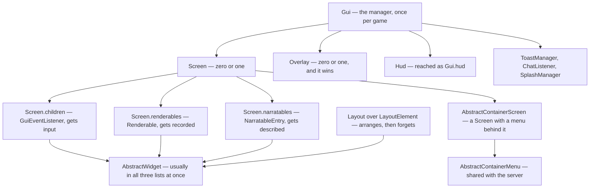
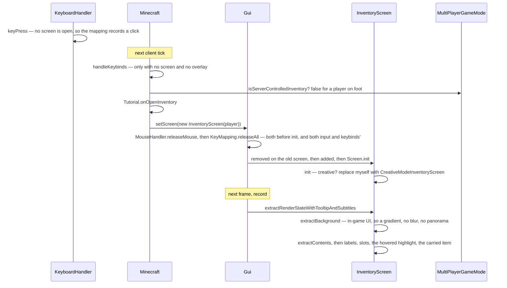

# GUI and screens

> Verified against **Minecraft 26.2** · Part X · pressing E: a screen the server is not told about until you close it, opened onto a menu that was built when you spawned.

Press E in survival and no packet is sent, no packet is received, and nothing
on the server changes. `Player.inventoryMenu` has existed since the player
object was constructed, it has **no `MenuType` at all**, and `MenuScreens`
could therefore never build an `InventoryScreen` from a packet even if one
arrived. The *opening* is entirely a client-side event. Press E again and the
symmetry breaks: `LocalPlayer.closeContainer` sends
`ServerboundContainerClosePacket`, and the server empties your 2×2 crafting
grid on the way out, returning or dropping what was in it. The screen the server is never told about is one the
server is told about exactly once, at the end.

The menu underneath it is not symmetric in the same way, and the qualification
matters: `InventoryMenu` is constructed on both sides, and its crafting
result is recomputed only on the server — so the client is rendering a result
it did not compute, in a screen the server does not know is open.

This page is what a screen *is*: the manager that holds one, the lifecycle it
runs through, the widget and layout families it is built from, and the four
routes by which one comes to exist. How its contents become pixels is [the
GUI render tree](the-gui-render-tree.md); how a `Component` becomes glyphs is
[text and fonts](text-and-fonts.md).

## The cast

| class | what it decides | thread |
|---|---|---|
| `Gui` | which screen and which overlay exist, and what an absent screen means | Render thread |
| `Screen` | one screen's lifecycle, children, focus and narration | Render thread |
| `AbstractWidget` | the final outer shape of a widget, and one inner hook per subclass | Render thread |
| `Layout` over `LayoutElement` | where widgets end up, re-arranged on most screens whenever the window changes | Render thread |
| `AbstractContainerScreen` | a screen mirroring a server-side menu, and the slot geometry | Render thread |
| `MenuScreens` | `MenuType` to screen class — the registry the menu packets look a screen up in | Render thread |
| `Overlay` | suppresses the screen's record pass, its mouse and its typing — but not its key presses | Render thread |
| `ScreenNarrationCollector` | what has already been said, so it is not said twice | Render thread |

## The objects, and what contains what

The three lists on `Screen` are the shape worth remembering: a widget added
with `Screen.addRenderableWidget` joins all three, and the sibling add methods
exist precisely so that something can be in one or two of them and not the
rest. A `Tooltip` is in none of them — it is held by a `WidgetTooltipHolder`
— and `MultiLineLabel` is an interface rather than a widget at all.

## `Gui`, which is not the HUD

`Gui` owns `Gui.screen` and `Gui.overlay` — set through `Gui.setScreen` and
`Gui.setOverlay` — plus `Gui.hud`, `Gui.toastManager`, `Gui.chatListener`,
`Gui.splashManager` and the reference to the frame's render state. It has
**three** cadences, not two: `Gui.tick` once per client tick, `Gui.update`
once per frame — which advances toasts and fires delayed narration — and
`Gui.extractRenderState` once per frame in the record pass. The rest of its
surface is `Gui.isPausing`, `Gui.handleKeybinds`, `Gui.openChatScreen`,
`Gui.canInterruptScreen`, `Gui.buildInitialScreens` and
`Gui.setClientLevelTeardownInProgress`.

Two of its behaviours are the sort of thing a reader assumes and gets wrong.

**`Gui.setScreen` with a null screen does not mean "close the screen".** It means "decide
what should be up instead". With no level it substitutes the title screen;
with a dead player it substitutes the death screen, or respawns; otherwise it
restores the chat screen if one was saved. During a level teardown it throws,
rather than return you to a world that is being dismantled.

**`Gui.isPausing` is the screen's vote on whether the game stops**, and it is
one of three conjuncts: [the client
loop](the-client-loop.md#pausing-which-is-two-things-and-neither-is-the-menu)
owns the pause itself and the other two, and the vote is cast by
`Screen.isPauseScreen`, which defaults to **true**. An overlay pauses by
default too, which the loop page does not say, and is why a resource reload
stops a singleplayer world as surely as the options screen does.

And an overlay does not stack on a screen: in the record pass it *replaces*
it. Nothing draws both. `LoadingOverlay` is the only implementation of
`Overlay` in the game.

## The lifecycle, and what is final

`Screen.init` is **final**, and a resize goes through `Screen.resize` to
`Screen.repositionElements`. The default `Screen.repositionElements` rebuilds
every widget through `Screen.rebuildWidgets`, which does re-enter the
overridable `Screen.init` hook — so on a plain screen everything really is rebuilt.
Forty-one screens override `Screen.repositionElements` instead and keep their
widgets, most of them just re-arranging their `Layout`. "Everything is rebuilt
on resize" is true of a plain screen and false of most interesting ones.

The rest of the lifecycle is `Screen.added`, `Screen.tick`, `Screen.removed`
and `Screen.onClose`, and the record entry point is the final
`Screen.extractRenderStateWithTooltipAndSubtitles`.

The framework fixes the outer shape everywhere and hands the subclass one
inner hook. `Screen.init`,
`Screen.extractRenderStateWithTooltipAndSubtitles`,
`AbstractWidget.extractRenderState`, `AbstractWidget.updateNarration`,
`AbstractButton.extractWidgetRenderState` and `AbstractContainerScreen.tick`
are all final; `AbstractWidget.extractWidgetRenderState` and
`AbstractButton.extractContents` are the hooks they leave open. The widget
family under them is `Button`, `EditBox`, `Checkbox`, `CycleButton`,
`AbstractScrollArea` and the selection lists over it —
`AbstractSelectionList`, `ObjectSelectionList`,
`ContainerObjectSelectionList` and `OptionsList`.

Layout is `Layout` over `LayoutElement`: `LinearLayout`, `GridLayout`,
`FrameLayout`, `EqualSpacingLayout`, `HeaderAndFooterLayout` and
`SpacerElement`, configured by `LayoutSettings` and resolved by
`Layout.arrangeElements` and `Layout.visitWidgets`. Input arrives as the
`client/input` records — `KeyEvent`, `MouseButtonEvent` and their siblings,
which are [input and keybinds](input-and-keybinds.md)' — through
`GuiEventListener` and `ContainerEventHandler`; focus is a `ComponentPath` moved by a
`FocusNavigationEvent`, ordered by `TabOrderedElement.getTabOrderGroup`; and
geometry is `ScreenRectangle`, `ScreenPosition`, `ScreenAxis` and
`ScreenDirection`.

One consequence of doing all this in a record pass:
`AbstractWidget.extractRenderState` computes *hovered* as "inside my
rectangle **and** inside the current scissor", so a widget scrolled out of a
list does not light up.

## Pressing E

The busiest screen in the game is `AbstractContainerScreen`, and its record
pass is worth following once: `AbstractContainerScreen.extractContents` draws
the widget list, translates to the container origin, and runs
`AbstractContainerScreen.extractLabels`,
`AbstractContainerScreen.extractSlots` and the two slot-highlight passes;
then `AbstractContainerScreen.extractCarriedItem`, then
`AbstractContainerScreen.extractTooltip`. It holds
`AbstractContainerScreen.menu`, `AbstractContainerScreen.leftPos`,
`AbstractContainerScreen.topPos`, `AbstractContainerScreen.hoveredSlot` and
the quick-craft state, and a click goes
`AbstractContainerScreen.slotClicked` to
`MultiPlayerGameMode.handleContainerInput` — see [containers and
menus](../items/containers-and-menus.md#the-chest-you-see-is-not-the-chest),
which also owns the fact this page's second paragraph turns on: the client
never computes a crafting result.

The final `AbstractContainerScreen.tick` closes the container when the player
is dead or removed. The *client* notices first.

## Who opens a screen

| route | examples |
|---|---|
| entirely client-side | `TitleScreen`, `PauseScreen`, `OptionsScreen`, `ChatScreen`, advancements, social interactions, the survival and creative inventories |
| `ClientboundOpenScreenPacket` | every menu with a `MenuType` — chests, furnaces, anvils, and a chest boat |
| `ClientboundMountScreenOpenPacket` | a horse's or a nautilus's own inventory |
| other packets | `BookViewScreen`, `AbstractSignEditScreen`, `DeathScreen`, `WinScreen`, the demo popup, `LevelLoadingScreen`, dialogs |

Three entities implement `HasCustomInventoryScreen`, and they do not agree:
two use the mount packet and one falls back to the ordinary menu packet.

**Those seven names are examples and the book keeps them that way.** There are
two hundred-odd classes in `client/gui/screens` and its eighteen
sub-packages — the world-creation flow, the pack picker, the report screens,
the friends and social lists, the recipe book, a class per container — and
they are the single largest thing in Part X by line count. Every one of them
is this section's four routes, the lifecycle above, the widget and layout
families below and nothing else; the book explains the pattern once, here, and
names a screen only where some other page's scenario walks into it. The
exception it does *not* cover is player reporting, declined for its own
reasons in [what this book
skips](../anatomy/what-this-book-skips.md#player-reporting).

The screens you see *first* are a chain rather than a screen.
`Gui.buildInitialScreens` composes accessibility onboarding, ban notices, a
forced name change and a banned-skin notice ahead of the title screen or a
quick-play launch. And `Minecraft.setScreenAndShow` sets a screen and then
renders one frame on the spot — synchronously — which is how progress appears
during blocking main-thread work such as a world load, a data fix or a save.

Narration, finally, is mostly timed rather than immediate — mostly, because
`Screen.init` narrates the new screen at once before arming anything. What
does the speaking is `GameNarrator`, a thin wrapper over Mojang's *text2speech*
library with a four-valued `NarratorStatus` option in front of it and two
tempers: the *queued* methods, which yield to whatever is already being said,
and `GameNarrator.saySystemNow`, which interrupts.
Thereafter `Screen.handleDelayedNarration` fires from `Gui.update` once two
clocks have passed — one delay after a mouse move, a shorter one after a
keyboard action, and a two-second suppression after a screen is built — and
then picks a *single* widget to narrate, by tab-order group and priority.

> **For a 1.21-era reader.** `Minecraft.screen` is gone: the current screen
> belongs to `Gui`, which is now the screen-and-overlay manager rather than
> the HUD — the HUD is `Hud`, reached as `Gui.hud`. Gone with it:
> *Screen.render*, *renderBackground* and *renderDirtBackground*;
> *AbstractContainerScreen.renderBg* / *renderLabels* / *renderSlot*;
> *AbstractWidget.renderWidget*; *ClickType* (now `ContainerInput`);
> *MultiPlayerGameMode.handleInventoryMouseClick* (now
> `MultiPlayerGameMode.handleContainerInput`); and *Minecraft.setScreen*.
> A screen no longer draws — it *records*.

## Where to look

`Gui.setScreen` — the substitution tree, and the input housekeeping at both
ends of a screen's life that [input and
keybinds](input-and-keybinds.md#the-bulk-operations-and-their-single-callers)
explains. `Screen.init` and `Screen.resize` for the lifecycle,
`Screen.extractRenderStateWithTooltipAndSubtitles` for the record pass, and
`Gui.extractRenderState` for the frame's contributor order.
`AbstractContainerScreen.extractContents` for the busiest screen in the game,
and `MenuScreens` for the screen registry the menu types use — `DialogScreens`
is the second one.

---

*Rules: names, never code · how the system works, not how the code reads ·
newest version only · every backticked name passes `tools/verify_names.py`.*
