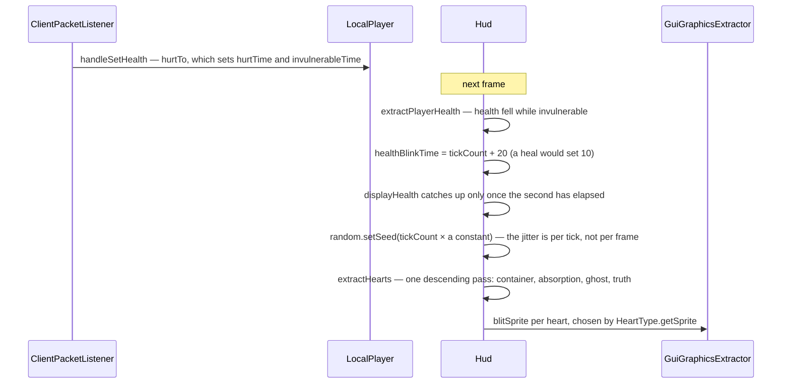

# The HUD

> Verified against **Minecraft 26.2** · Part X · the player takes damage and the hearts shake, blink, and lie about how much health is left.

## Responsibility

Everything drawn over the world when no screen is up: hotbar, hearts, hunger,
air, the crosshair, effects, boss bars, the scoreboard, the tab list, chat,
titles, the contextual bar and the debug screen. The machinery underneath is
[the GUI render tree](the-gui-render-tree.md); this page is what uses it, in
what order, and under what conditions.

The one sentence a player would recognise: *the hearts and the hotbar.*

The headline for a 1.21-era reader: **`Gui` is not the HUD any more.** The
class that drew the hotbar and hearts is `Hud`; the name `Gui` was reused for
the screen and overlay manager that used to be fields on `Minecraft`. The
canonical path is `Gui.hud`.

## The data it owns

`Hud` holds the sub-overlays — `Hud.chat` (a `ChatComponent`),
`Hud.bossOverlay` (`BossHealthOverlay`), `Hud.tabList` (`PlayerTabOverlay`),
`Hud.subtitleOverlay` (`SubtitleOverlay`), `Hud.spectatorGui`
(`SpectatorGui`), `Hud.debugOverlay` (`DebugScreenOverlay`) — and its own
animation state: `Hud.tickCount`, `Hud.random`, `Hud.isHidden`,
`Hud.lastHealth`, `Hud.displayHealth`, `Hud.lastHealthTime`,
`Hud.healthBlinkTime`, `Hud.overlayMessageString`, `Hud.title`,
`Hud.subtitle`, `Hud.toolHighlightTimer`, `Hud.vignetteBrightness`,
`Hud.autosaveIndicatorValue` and `Hud.contextualInfoBar`. It also registers
one reload listener of its own, `Hud.waypointStyles`, a
`WaypointStyleManager` feeding the locator bar.

Its nested types are `Hud.HeartType` — six constants, one of which Mojang
spells `Hud.HeartType.POISIONED`, each with eight sprites — and
`Hud.ContextualInfo`.

The contextual bar is `ContextualBar` with three implementations:
`ExperienceBar`, `LocatorBar` (backed by `ClientWaypointManager`) and
`JumpableVehicleBar`.

The chat side is `ChatComponent` over `GuiMessage`, `GuiMessageTag` and
`GuiMessageSource`, with `ChatComponent.DisplayMode`, fed by `ChatListener`.
Signing belongs to [chat and signing](../networking/chat-and-signing.md);
this page owns display only.

The debug screen is a registry. `DebugScreenEntries` holds every entry by
`Identifier`; each is a `DebugScreenEntry` writing lines through a
`DebugScreenDisplayer`. `DebugScreenEntryList`, reachable as
`Minecraft.debugEntries`, stores a `DebugScreenEntryStatus` per entry, ships
`DebugScreenProfile` presets and persists to its own file. The charts are
`FpsDebugChart`, `TpsDebugChart`, `PingDebugChart` and `BandwidthDebugChart`
over `AbstractDebugChart`, plus `ProfilerPieChart`, which is not one of them.

## When it runs

`Hud.tick` runs from `Gui.tick` once per client tick and takes a pause flag:
the autosave indicator animates either way, everything else only when the
game is not paused. `Hud.extractRenderState` runs from
`Gui.extractRenderState` once per frame and records rather than draws.

Three gates sit above all of it and none of them is on this page's classes:
`GameRenderer.extract` only asks for the HUD when resources are loaded, the
frame advances game time and a level exists. The method then short-circuits
entirely while the level-loading screen is up — but it publishes the hidden
flag to the render state *before* that check, so the flag is always current.

The order it records in is the order things appear in front of each other,
and it is **two** hidden-gated blocks with one ungated element between them:
camera overlays (vignette, spyglass, an equipment-supplied overlay, powder
snow, portal or nausea) → crosshair → a new stratum → the hotbar block
(`Hud.extractHotbarAndDecorations`: hotbar, armour, hearts, food, air, mount
health, the contextual bar with the experience level nested inside it, the
selected-item name) → effects → boss bars — then **the sleep fade, which F1
does not hide** — then demo text → scoreboard sidebar → action bar → title →
chat → tab list → subtitles.

The four elements a reader expects at the end of that list are not on `Hud`'s
list at all: the saving indicator, toasts, the debug overlay and the deferred
subtitles are recorded by `Gui`, after the overlay or screen. And of those,
only the saving indicator ignores the hidden flag — toasts and the debug
overlay check it themselves.

## The trace: the hearts shake

Two details worth the diagram. The shake is a random offset applied when
health *plus absorption* is very low, seeded from the HUD's tick counter — so
it jitters at 20 Hz and is identical across two frames of the same tick, and
the same seeded stream also drives the hunger jitter and the air-bubble
wobble. And the blink is a square wave with a three-tick half-period, running
for twenty ticks after damage and ten after a heal, which draws the *ghost*:
the HUD keeps three health numbers at once — last frame's, a lagging display
value that catches up about once a second, and the truth — and the blinking
layer shows the one that is out of date on purpose.

## Interfaces

- **Called by:** `Gui.tick` and `Gui.extractRenderState`.
- **Calls into:** `GuiGraphicsExtractor` for everything it records.
- **Crosses the network as:** it reads the results of
  `ClientboundSetHealthPacket`, `ClientboundSetExperiencePacket`,
  `ClientboundBossEventPacket`, `ClientboundTabListPacket`,
  `ClientboundSetActionBarTextPacket` and the title packets — the handlers
  call `Hud.setOverlayMessage`, `Hud.setTitle`, `Hud.setSubtitle`,
  `Hud.setTimes` and `BossHealthOverlay.update`.
- **Data-driven by:** the GUI atlas; waypoint styles from resource packs;
  `Equippable`'s camera overlay and `DataComponents.ATTACK_RANGE` on items;
  and the options — `Options.attackIndicator`, the chat geometry options,
  and `Options.keyToggleGui` for the hidden flag.

## Invariants and surprises

- **`Gui` and `Hud` are different things.** `Gui` is "what screen is up, and
  the things that outlive screens"; `Hud` is "what is drawn over the world".
  Neither draws: both extract.
- **F1 does not hide everything, and the exception is the sleep fade** —
  which sits between the two hidden-gated blocks, so you can black out while
  the HUD is off.
- **The hidden flag travels two ways, and the interesting one is the
  smaller.** It is published to the renderer as
  `GuiRenderState.isHudHidden`, read by `GameRenderer` in three places to
  suppress the held item, the screen effects and the three-dimensional
  crosshair. But `Hud.isHidden` itself is read directly by six other places
  across the client, including two entity renderers that suppress name tags.
- **Four bars share one slot, and the priority is not symmetric.** The
  contextual bar chooses between nothing, experience, the locator and a
  jumpable vehicle by a rule re-evaluated every frame, not by a state
  machine. With waypoints present, a jumping vehicle or a *recently changed*
  experience total beats the locator; with no waypoints, a jumpable vehicle
  beats experience unconditionally — so mounting a horse silently takes your
  XP bar away. The level number is drawn inside the bar's own record pass,
  not after it, and it survives whichever bar wins.
- **One gate silences four elements at once.** Armour, hearts, food and air
  are all recorded inside `Hud.extractPlayerHealth` and all gated on the game
  mode being able to hurt you — which is why creative has no armour bar
  either.
- **Food and mount health share a slot**, and the air bubbles shift up when
  either is drawn.
- **The HUD makes a sound.** Air bubbles pop with
  `Hud.playAirBubblePoppedSound`, whose volume and pitch ramp with how many
  are left.
- **Subtitles are the only deferred element, and they end up *below* the
  screen.** The deferral fires when there is no screen at all or the screen
  declares itself in-game UI — the common case, not the rare one — and the
  deferred call is made from a screen's *background* pass, so subtitles land
  under the screen's widgets rather than over them.
- **The debug screen is data-driven and persisted.** Entries are registered
  by identifier with a three-valued status, an entry set to always-on
  renders with F3 never pressed, and the whole set is saved to disk with its
  own data-fixer type. The screen that edits it is suppressed by `Gui`, not
  by the overlay.
- **Not every F3 shortcut is a key mapping.** Twenty are; a second family is
  a raw switch on key codes behind the game's debug flag, bindable to
  nothing. Several of the mappings toggle debug entries that print nothing
  and exist only to carry a flag the world renderer reads.
- **Boss bars have world-rendering consequences.** The overlay answers three
  questions — should the screen darken, should world fog be created, should
  the End music play — read from five places between the frame, the fog
  environment and the lightmap. The bar itself interpolates against
  wall-clock time inside `LerpingBossEvent`, so discrete packet progress
  becomes a smooth bar.
- **The chat HUD and the chat screen are the same code in different modes.**
  The HUD bails out entirely when the chat screen is focused. Message age is
  measured in HUD ticks, not timestamps, and a message the server asked to
  delete keeps its original timestamp when it is replaced by a marker — so
  the marker fades on the original message's schedule.
- **`ChatComponent` holds four collections, not two.** Every message and
  every wrapped *line* are separate lists with separate caps; the
  deletion queue and the recent-input history are the other two. The
  delay-option queue is a fifth, and it lives on `ChatListener`.
- **The camera overlay list is data-driven.** The pumpkin blur is not a
  hardcoded block check: every equipment slot is asked whether its item
  declares a camera overlay.
- **`Hud.onDisconnected` is the only place that resets the HUD as a whole** —
  tab list, boss bars, toasts, debug overlay, chat and titles together. It is
  a good definition of what counts as HUD state.
- **Names a 1.21-era reader will hunt for and not find:** every
  `Gui.render*` method (now `Hud.extract*`), *LayeredDraw*,
  *Minecraft.screen*, *Minecraft.getToastManager*, *Minecraft.fpsString*,
  *Options.hideGui*, and *DebugScreenOverlay.render* along with its two
  information-gathering methods — the line content moved out into the entry
  registry.

## Where to look

`Hud.extractRenderState` — the whole HUD is one ordered method, and the two
hidden-gated blocks are visible at a glance. Then `Hud.extractPlayerHealth`
for the most-loved twenty lines in the client, `Hud.nextContextualInfoState`
for the bar arbitration, `DebugScreenEntries` for the debug registry, and
`ChatComponent` for the message list.

---

*Rules: names, never code · how the system works, not how the code reads ·
newest version only · every backticked name passes `tools/verify_names.py`.*
