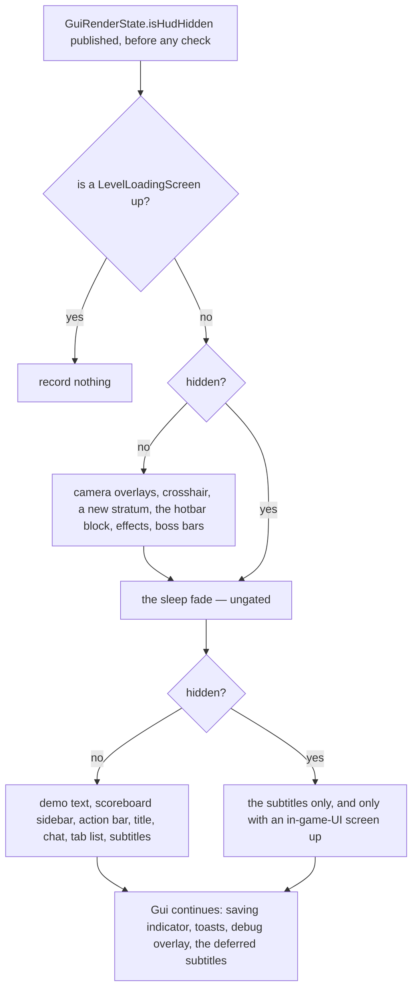
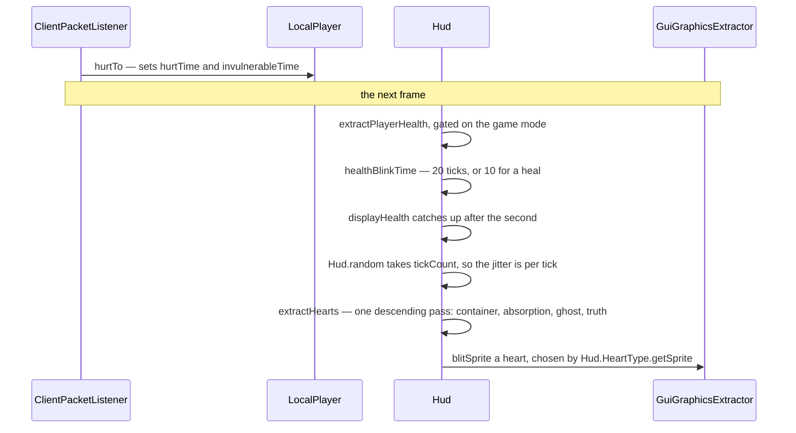

# The HUD

> Verified against **Minecraft 26.2** · Part X · press F1 and the interface goes away — except for the thing that can black out your whole screen.

Press F1 and the hearts go, the hotbar goes, the crosshair, chat and the tab
list go. Get into bed with the interface hidden and the screen still fades to
black. That one exception is not a special case in the code: it is a
consequence of where a single element sits. `Hud.extractRenderState` is one
ordered method wrapped in **two** blocks gated on the hidden flag, and the
sleep fade is recorded in the gap between them.

That is what this page is: not a tour of hearts and hotbars but a **policy**.
What is drawn over the world, in what order, under exactly which conditions,
and which of those conditions is a surprise. The full per-element table is
[what the HUD draws, and when](../../reference/hud-elements.md) in Reference;
the machinery underneath every one of them is [the GUI render
tree](the-gui-render-tree.md#the-tree-and-where-a-new-element-lands), and what
a *screen* is — the other thing recorded into the same tree — is [GUI and
screens](gui-and-screens.md#gui-which-is-not-the-hud).

## The order, and the two blocks

*Two identical `hidden?` gates with the sleep fade between them, which is the
whole shape: the fade is the only thing `Hud` records whatever you press. Both
branches reach the subtitles, on different conditions — the visible one needs
no screen **or** an in-game-UI screen, the hidden one needs an in-game-UI
screen to exist — and either way what they record is the deferred call at the
foot.*

Above all of that sit gates that are not `Hud`'s at all, and a page about
conditions has to name them: `GameRenderer.extract` computes whether resources
are loaded, whether this frame advances game time and whether there is a level,
and `Gui.extractRenderState` applies them, calling into `Hud` only when they
hold. That is why a HUD-less frame is the normal state of a loading screen
rather than a special case of one.

Four more elements are recorded by `Gui` itself, *after* the screen rather than
with the rest of the HUD, and they are gated at three different depths — which
is the one thing about them worth memorising, because it decides what you see
on a title screen, on a loading screen and under F1.

| recorded after the screen | when `Gui` records it | under F1 |
|---|---|---|
| the saving indicator | only on a frame that renders a level | **drawn** — the one element that ignores the flag |
| the toasts | whenever resources are loaded, level or not | hidden |
| the debug overlay | always, unless the debug-options screen is the one open | hidden, *unless* some screen is open |
| the deferred subtitles | always | whatever the screen's own block decided |

Two structural facts follow from the shape. The hidden flag is published
*before* the loading-screen short-circuit, so the renderer's copy is correct
even on a frame where the HUD records nothing. And toasts and the debug
overlay are always **above** a screen, because `Gui` records them after it —
while the deferred subtitles are called from a screen's *background* pass, so
the deferral that fires after the screen finds nothing left to draw and the
subtitles a screen drew for itself sit under that screen's widgets.

`Hud.tick` runs from `Gui.tick` once per client tick and takes a pause flag:
the autosave indicator animates either way, everything else only when the
game is not paused.

## The cast

| class | what it decides | thread |
|---|---|---|
| `Hud` | the order, the two hidden-gated blocks, and the health animation state | Render thread |
| `Gui` | the four elements recorded *after* the screen, and their three different gates | Render thread |
| `ContextualBar` | which of four things occupies the one slot above the hotbar | Render thread |
| `BossHealthOverlay` | the bars, and three questions the world renderer asks it | Render thread |
| `ChatComponent` | the message list, its wrapped lines, and what is faded out | Render thread |
| `DebugScreenEntries` | the F3 registry: what an entry is, and whether it is on | Render thread |
| `DebugScreenEntryList` | the per-entry status, its presets, and its own save file | Render thread |
| `GuiGraphicsExtractor` | everything the HUD records into | Render thread |

## The toast shelf

The toasts are the one element in that list with arbitration of its own, and
it is a shelf rather than a queue. `ToastManager` holds **five** slots and a
waiting deque; a toast declares how many consecutive slots it wants through
`Toast.occcupiedSlotCount` — Mojang's spelling — and is admitted only when
that many free slots sit next to each other, so a wide toast can wait behind
narrow ones that arrived after it. `Toast.Visibility` is the two-state
animation, each state carrying its own sound, and a toast is asked its wanted
visibility every frame rather than given a lifetime. `Toast.getToken` is what
lets a second advancement replace the first instead of stacking on it. The
implementations are `AdvancementToast`, `RecipeToast`, `TutorialToast`,
`SystemToast`, `FriendToast` and `NowPlayingToast` — the last of which is not
on the shelf at all: it is a field of its own, drawn after the five and
suppressed by the pause screen and by `MusicToastDisplayState`.

## The hidden flag travels two ways

The interesting one is the smaller. `GuiRenderState.isHudHidden` is read by
`GameRenderer` in three places, to suppress the held item, the
three-dimensional crosshair and — the smallest of the three — the totem-pop
animation. The block-in-eyes, water and fire overlays are drawn whatever F1
says. So a 2D flag does change how the *world* is drawn, in three narrow
ways. But `Hud.isHidden` itself is read directly by six other places across
the client, including two entity renderers that suppress name tags.

It is not the only field on the tree the world reads back: a clear-colour
override lives there too, and every site that reads either of them is
`GameRenderer`'s rather than `LevelRenderer`'s — the 2D side never reaches
into the world renderer, only into the thing that drives it.

The traffic goes the other way as well, and this page's own boss bar is the
loudest example. `BossHealthOverlay` reads world fog, the lightmap and the
level render state — five places between the frame, the fog environment and the
lightmap — to answer three questions: should the screen darken, should world
fog be created, should the End music play. So a dragon changes the sky because
a HUD element asked the world to, not the other way round. The bar itself
interpolates against wall-clock time inside `LerpingBossEvent`, which is what
turns the discrete progress the server sends into a smooth bar; what is on the
other end of those packets — the saved model, its members, and the `execute
store` that writes it — is [scores, teams and stored
data](../commands/scoreboard-and-data.md#the-third-sink-is-a-boss-bar-and-it-is-this-pages-shape-again).

## Four states, one slot, and an asymmetric rule

`Hud.contextualInfoBar` holds one of four states — nothing, experience, the
locator, a jumpable vehicle — and `Hud.nextContextualInfoState` re-decides
which every frame. It is a rule, not a state machine, and the rule is not
symmetric. With waypoints present, a jumping vehicle or a *recently changed*
experience total beats the locator; with no waypoints, a jumpable vehicle
beats experience unconditionally — so **mounting a horse silently takes your
XP bar away.** The level number is recorded separately from the bar, so it
survives whichever bar wins.

The three implementations are `ExperienceBar`, `LocatorBar` — backed by
`ClientWaypointManager` and styled by `Hud.waypointStyles`, a
`WaypointStyleManager` that is the HUD's own reload listener — and
`JumpableVehicleBar`. `Hud.ContextualInfo` is the enum of the four states.

## The hearts, which are three numbers at once

*One packet, one frame later, and seven steps that all belong to `Hud`: the
packet's own handler is `ClientPacketListener.handleSetHealth`, and everything
it does to the hearts it does by calling `LocalPlayer.hurtTo`. Nothing in the
band below is a reaction to the packet — it is what the HUD does every frame,
reading numbers the packet left behind.*

The figure's steps are `Hud.extractPlayerHealth`, which sets
`Hud.healthBlinkTime` from `Hud.tickCount` when the health fell;
`Hud.displayHealth`, which lags; `Hud.random`, reseeded from that same tick
counter; `Hud.extractHearts`, the one descending pass; and one
`GuiGraphicsExtractor.blitSprite` per heart, the sprite chosen by
`Hud.HeartType.getSprite`. `LocalPlayer.hurtTo` is what the packet touched:
it sets `LivingEntity.hurtTime` and `Entity.invulnerableTime` and nothing on
`Hud` at all.

**The shake is seeded from the tick counter**, so it jitters at 20 Hz and is
identical across two frames of the same tick — and the same seeded stream
drives the hunger jitter and the air-bubble wobble, which is why they shake
together. **The blink is a square wave** with a three-tick half-period, running
for twenty ticks after damage and ten after a heal.

Three numbers and four layers is the arithmetic of a heart row, and they are
not the same list. The three *numbers* are `Hud.lastHealth`, which is what the
previous frame saw; `Hud.displayHealth`, a lagging value that catches up about
once a second; and the truth, read off the player. The four *layers* the
descending pass draws are the container, absorption, the ghost and the truth —
and the ghost is `Hud.displayHealth`, the number that is out of date on
purpose. That is what the blink shows you: not damage, but the gap between two
of the three numbers.

`Hud.HeartType` is six constants, one of which Mojang spells
`Hud.HeartType.POISIONED`, each with eight sprites.

One gate silences four elements at once: armour, hearts, food and air are all
recorded inside `Hud.extractPlayerHealth`, which is gated on the game mode
being able to hurt you — which is why creative has no armour bar either. Food
and mount health share a slot, and the air bubbles shift up when either is
drawn. And the air bubbles make a **sound**:
`Hud.playAirBubblePoppedSound` ramps volume and pitch with how many bubbles are
*gone*, and hands it to [the sound
engine](sound-engine.md#volume-looping-and-the-attenuation-everyone-explains-wrongly)
like any other client-side sound. It is the only element inside
`Hud.extractRenderState` that is also an audio event — the toasts have sounds
too, but they arrive with the toast rather than out of a drawing pass.

## Chat is one thing in two modes, and five collections

The chat you read and the chat you type into are the same code in different
modes: the HUD bails out entirely when the chat screen is focused. Message age
is measured in HUD ticks rather than timestamps, and a message the server asked
to delete keeps its original timestamp when it is replaced by a marker — so the
marker fades on the original message's schedule.

`ChatComponent` holds **four** collections, not two: every message and every
wrapped *line* are separate lists with separate caps, and the deletion queue
and the recent-input history are the other two. A fifth, the delay-option
queue, lives on `ChatListener`, and is the reason a chat-delay setting can hold
a message that has already arrived.

What those lists hold is a `GuiMessage` — the time it arrived in HUD ticks,
the `Component`, the signature if it had one, a `GuiMessageSource` saying
whether a player, the server or this client produced it, and a nullable
`GuiMessageTag`. **The tag is the client's own verdict, drawn as a two-pixel
bar to the *left* of the line**, outside the text entirely, with the reason as
a tooltip when you hover it: system, system-in-singleplayer, not-secure,
modified, error. Only *modified* also carries an icon, and that one goes after
the text rather than beside the bar; each tag additionally carries a short
`GuiMessageTag.logTag` string, which is the only part of it that reaches
`ChatLog` — a separate ring of `LoggedChatEvent`s kept for the reporting
screens rather than for display. Which verdict a message earned is [chat and
signing](../networking/chat-and-signing.md#three-ways-to-say-no-and-one-way-not-to-ask)';
this page owns the bar.

## What a debug line is, and who turns one on

The F3 overlay is a registry rather than a method, and it is the second of the
two debug systems this book describes. `DebugScreenEntries` holds every entry
by `Identifier`, each a `DebugScreenEntry` writing lines through a
`DebugScreenDisplayer`. `DebugScreenEntryList`, reachable as
`Minecraft.debugEntries`, stores a `DebugScreenEntryStatus` per entry, ships
`DebugScreenProfile` presets and persists to its own file with its own
data-fixer type — so an entry set to always-on renders with F3 never pressed,
and the game remembers that you set it. The screen that edits it is suppressed
by `Gui` rather than by the overlay, which is the one place a screen decides
whether the debug overlay records at all.

The charts hanging off it are `FpsDebugChart`, `TpsDebugChart`,
`PingDebugChart` and `BandwidthDebugChart` over `AbstractDebugChart`, plus
`ProfilerPieChart`, which is not one of them.

Two seams run out of here. Several of the rebindable debug mappings toggle
entries that print no line at all and exist only to carry a flag the world
renderer reads — which family a given shortcut belongs to is [input and
keybinds](input-and-keybinds.md#the-two-debug-key-families-and-which-one-is-bindable)'.
And the *other* debug system, the one that asks the server for a villager's
brain, is [debugging the running
game](debugging-the-running-game.md#the-idea): the two meet because an F3 entry
decides whether eleven of that page's twenty-five renderers exist at all, and
the FPS charts are what turn its tick-time subscription on.

## Questions players ask

**Why do subtitles appear under an open chest?** They are deferred past the
screen, along with the tooltip and the pre-edit overlay the extractor holds.
The deferral fires when there is no screen at all *or* the screen declares
itself in-game UI — the common case, not the rare one — and the deferred call
is made from a screen's background pass.

**Is the pumpkin blur hardcoded?** No. The camera overlay list is
data-driven: every equipment slot is asked whether its item declares a camera
overlay.

**Why does everything on my HUD vanish at once when I disconnect?** Because
one method clears it as a whole. `Hud.onDisconnected` resets the tab list, the
boss bars, the toasts, the debug overlay, chat and titles together — which is a
better definition of "HUD state" than any list of fields.

> **For a 1.21-era reader.** `Gui` is not the HUD any more. The class that
> drew the hotbar and hearts is `Hud`; the name `Gui` was reused for the
> screen and overlay manager that used to be fields on `Minecraft`. The
> canonical path is `Gui.hud`. Every *render\** method on `Gui` is now an *extract\** on `Hud`, and gone with them: *LayeredDraw*, *Minecraft.screen*,
> *Minecraft.getToastManager*, *Minecraft.fpsString*, *Options.hideGui*, and
> *DebugScreenOverlay.render* along with its two information-gathering
> methods — the line content moved out into the entry registry.

## Where to look

`Hud.extractRenderState` — the whole HUD is one ordered method, and the two
hidden-gated blocks are visible at a glance. Then `Hud.extractPlayerHealth`
for the most-loved fifty-seven lines in the client,
`Hud.nextContextualInfoState` for the bar arbitration, `Gui.extractRenderState`
for the four recorded after the screen, `DebugScreenEntries` for the F3
registry, and `ChatComponent` for the message list.

---

*Rules: names, never code · how the system works, not how the code reads ·
newest version only · every backticked name passes `tools/verify_names.py`.*
