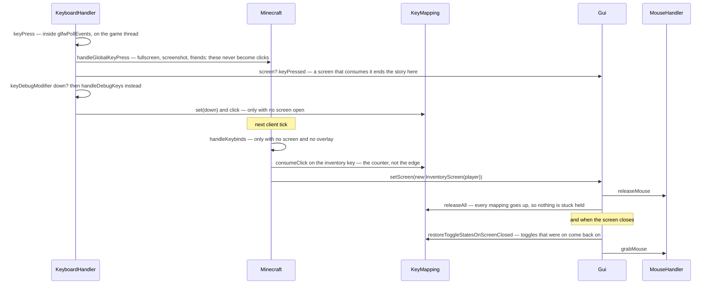

# Input and keybinds

> Verified against **Minecraft 26.2** · Part X · pressing E: a GLFW callback, five chances to be swallowed, and a click counter that a tick drains later.

## Responsibility

Everything between the operating system and a `KeyMapping` being *down*: the
GLFW callbacks, the gauntlet a key press runs before it counts as gameplay
input, the click counter that gameplay actually reads, and the mouse — its
accumulation, its sensitivity curve, and who is allowed to turn the player.
What the movement keys *mean* once they are down belongs to
[input to movement](../player/input-to-movement.md); this page stops at the
mapping.

The one sentence a player would recognise: *rebinding a key, and finding
that two things now happen.*

The headline for a 1.21-era reader: **input events are records now.** The
`(key, scancode, modifiers, action)` integer tuple is gone from every screen
signature, replaced by `KeyEvent`, `MouseButtonEvent`, `CharacterEvent` and
`PreeditEvent` in `client/input`, with shared helpers on
`InputWithModifiers` — so a widget asks an event whether it *is* a
confirmation or a paste rather than decoding modifiers itself.

## The data it owns

- **`KeyMapping`** — a name, a `KeyMapping.Category`, a
  `KeyMapping.defaultKey` and a mutable `KeyMapping.key`, an ordering int,
  a boolean "is held" and a click *counter*. Gameplay reads it with
  `KeyMapping.consumeClick` and `KeyMapping.isDown`; the input handlers
  write it with `KeyMapping.set` and `KeyMapping.click`. The class also owns
  two static registries of every mapping ever constructed, which is how a
  key code is turned back into the mappings that want it.
  `KeyMapping.matches` and `KeyMapping.matchesMouse` are the direct tests
  used where no click counter is wanted, and `KeyMapping.same`,
  `KeyMapping.isDefault` and `KeyMapping.isUnbound` are what the binding
  screen asks.
- **`ToggleKeyMapping`** — the four mappings that can behave as toggles:
  sneak, sprint, use and attack. Each holds a supplier saying whether toggle
  mode is on; `ToggleKeyMapping.setDown` flips the state on a press when it
  is, and behaves exactly like `KeyMapping` when it is not — in toggle mode
  the *release* is swallowed entirely.
- **The bulk operations**, each with exactly one caller:
  `KeyMapping.releaseAll` and `KeyMapping.restoreToggleStatesOnScreenClosed`
  from `Gui.setScreen`, `KeyMapping.resetToggleKeys` from
  `LocalPlayer.respawn`, and `KeyMapping.setAll` from
  `MouseHandler.grabMouse` — that last one only on platforms where
  `InputQuirks.RESTORE_KEY_STATE_AFTER_MOUSE_GRAB` is set.
- **`KeyboardHandler`** — the key, character and pre-edit callbacks, the
  debug-key dispatch, the clipboard, and the countdown that turns a held
  F3+C into a deliberate crash.
- **`MouseHandler`** — `MouseHandler.onMove`, `MouseHandler.onButton`,
  `MouseHandler.onScroll` and `MouseHandler.onDrop` as the callbacks;
  `MouseHandler.accumulatedDX` and `MouseHandler.accumulatedDY` as the
  pending motion; `MouseHandler.handleAccumulatedMovement` and
  `MouseHandler.turnPlayer` as the per-frame application, smoothed through
  a `SmoothDouble` when the smooth-camera flag is on;
  `MouseHandler.grabMouse` / `MouseHandler.releaseMouse` /
  `MouseHandler.isMouseGrabbed` for the cursor;
  `MouseHandler.setIgnoreFirstMove` for the jump after a resize; and
  `MouseHandler.simulateRightClick` for the macOS long-left-click quirk.
- **`InputConstants`** — the key universe: `InputConstants.Key`,
  `InputConstants.Type`, `InputConstants.UNKNOWN`, the string form a
  binding is saved as, and `InputConstants.isRawMouseInputSupported`.
- **`InputQuirks`** — four platform constants that visibly change
  behaviour: command instead of control for edit shortcuts on macOS, the
  long-left-click right-click simulation, and the key-state restore above.
- **`ScrollWheelHandler`** and **`InputType`** — the wheel's accumulator,
  and the three-valued "what did the player last use" that decides whether
  focus is drawn.

## When it runs

**Callbacks run inline, on the game thread.** GLFW dispatches them from
inside `RenderSystem.pollEvents`, which `Minecraft.run` calls immediately
before `Minecraft.runTick`. The handlers wrap their bodies in
`BlockableEventLoop.execute`, but on the game thread that runs the task
rather than queueing it — so a key press is fully processed *before* the tick
that will observe it, not inside it.

**Clicks are drained in the tick.** `Minecraft.handleKeybinds` is called
from `Minecraft.tick`, and only when there is neither a screen nor an
overlay. It loops on `KeyMapping.consumeClick` — the counter, not the edge —
so a key pressed and released twice within one tick fires twice.

**The mouse is applied in the loop, once per frame.**
`MouseHandler.handleAccumulatedMovement` runs between the sound update and
the frame proper, so a look is applied at frame rate rather than tick rate.

## The trace: pressing E

The shape to take away: **a key press has five chances to be swallowed
before it ever becomes a click** — the global-key check, an open screen, the
debug modifier, the no-screen gate on recording, and the no-screen-no-overlay
gate on draining. And the two ends of a screen's life are where the input
system does its housekeeping: opening a screen releases every mapping,
closing one restores the toggles.

## Interfaces

- **Called by:** `RenderSystem.pollEvents`, indirectly, through GLFW; then
  `Minecraft.tick` and `Minecraft.runTick` — see
  [the client loop](the-client-loop.md).
- **Calls into:** `Gui` and `Screen` for screen-directed events (see
  [GUI and screens](gui-and-screens.md)); `MultiPlayerGameMode` for the
  actions a keybind triggers; `LocalPlayer` for the look angles.
- **Crosses the network as:** nothing. Not one class on this page sends a
  packet — which is worth saying out loud, because the intent it produces
  reaches the server much later and by a different route entirely.
- **Data-driven by:** *options.txt*, which stores every binding as a key
  name — see [options](options.md).

## Invariants and surprises

- **One key can drive many mappings, and the game never resolves it.**
  Conflict detection lives only in the binding screen, and it is
  cosmetic — two things bound to the same key both fire. It also refuses to
  flag a collision when *both* mappings are still at their defaults, which
  quietly exempts the pairs the game itself ships colliding.
- **`KeyMapping.consumeClick` is a drain, not an edge.** It decrements a
  counter, so presses that happened faster than the tick rate are not lost —
  and a keybind read from two places consumes twice.
- **Three keys never become clicks at all.** Fullscreen, screenshot and the
  friends key are handled in `Minecraft.handleGlobalKeyPress` at callback
  time, before any counter is touched — and that method is itself skipped
  while the debug modifier is held.
- **A screen consuming a key *release* is the one way a release is lost.**
  Presses that a screen swallows are harmless because the mapping was never
  set down; a swallowed release is not, which is why `Gui.setScreen` calls
  `KeyMapping.releaseAll` defensively.
- **F3 is a key binding, and the modifier and the overlay toggle are the
  same key by default** — which is why the overlay toggles on *release*, and
  only when no combination was used in between. Rebind either and that
  behaviour disappears.
- **Not every debug shortcut is rebindable.** Twenty are ordinary mappings
  in the debug-keys array; a second family is a raw switch on key codes in
  `KeyboardHandler.handleChunkDebugKeys`, gated on the game's debug flag and
  bindable to nothing.
- **`KeyMapping.Category` is a registrable record, not an enum.** Categories
  can be added without touching the game's list; registering a duplicate id
  throws. Ordering is a fixed list of the built-in categories first, then
  registration order.
- **Scoped aiming is exactly eight times slower, by construction.** The
  sensitivity curve is a cube of the slider, and the ordinary and
  smooth-camera paths multiply it by eight while the scoped path does not.
  The scoped path additionally requires the smooth camera to be off, the
  camera to be first-person, and the player to be actually scoping.
- **Minimum sensitivity is not zero.** The cubed term is taken of the slider
  scaled and offset, so the slowest setting still turns.
- **Accumulated motion is applied to whatever is in front of it, then
  cleared unconditionally.** With a screen open the delta goes to the
  screen's move and drag handlers rather than the player; with the window
  unfocused nothing accumulates in the first place; and the reset at the end
  runs either way, so motion is never banked.
- **Grabbing the mouse and closing a screen are two directions of the same
  edge.** `Gui.setScreen` releases the cursor on the way in and grabs it on
  the way out; `MouseHandler.grabMouse` also clears the screen, guarded so
  the two cannot recurse.
- **Double-click is a threshold plus two identities.** The two clicks must
  be within a quarter of a second, on the same button, *and* on the same
  screen instance.
- **Names a 1.21-era reader will hunt for and not find:**
  *Options.keyBindings* (now the key-mappings array), `KeyMapping` categories
  as translation-key strings, *MouseHandler.lastMouseEventTime*, and the raw
  integer signatures on every `Screen` input method, replaced by the
  `client/input` event records.

## Where to look

`KeyboardHandler.keyPress` — the whole gauntlet is one method, read top to
bottom. Then `Minecraft.handleKeybinds` for the drain, `Gui.setScreen` for
the housekeeping at both ends of a screen, and `MouseHandler.turnPlayer` for
the sensitivity curve and its three gates. `KeyMapping` itself is small and
worth reading whole.

---

*Rules: names, never code · how the system works, not how the code reads ·
newest version only · every backticked name passes `tools/verify_names.py`.*
