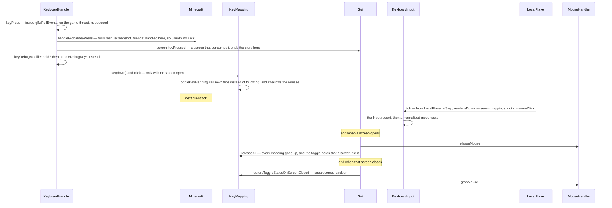

# Input and keybinds

> Verified against **Minecraft 26.2** · Part X · holding sneak: a GLFW callback, five chances to be swallowed, and a key that stays down while you are not touching it.

Turn on toggle sneak and hold the key. `ToggleKeyMapping.setDown` sees the
press, flips the mapping to *down*, and then swallows the release entirely —
so as far as the rest of the game is concerned you are still holding a key
you let go of. Open your inventory and the mapping is released along with
every other one; close it and the mapping *comes back on*, because the toggle
remembered it was released by a screen rather than by you. The press and the
release never involve the tick at all — they have already happened by the time
the tick that observes them runs. Opening the inventory is the exception that
shows where the seam is: that one is a *drain*, and the drain is inside the
tick.

That is the fact this page is built on. **GLFW callbacks are not queued.**
They are dispatched from inside `RenderSystem.pollEvents`, which
`Minecraft.run` calls immediately before `Minecraft.runTick`; the handlers
wrap their bodies in `BlockableEventLoop.execute`, but on the game thread
that call runs the task rather than queueing it. Any description of Minecraft
input that says a key press is "queued onto the client thread" is describing
a different game.

What the movement keys *mean* once they are down belongs to [input to
movement](../player/input-to-movement.md); this page stops at the mapping.

## The cast

| class | what it decides | thread |
|---|---|---|
| `KeyboardHandler` | the key, character and pre-edit callbacks, and the gauntlet a press runs | Render thread |
| `MouseHandler` | motion accumulation, the sensitivity curve, and who is allowed to turn the player | Render thread |
| `KeyMapping` | whether a mapping is down, and how many clicks are owed | Render thread |
| `ToggleKeyMapping` | the four mappings that can behave as toggles: sneak, sprint, use, attack | Render thread |
| `InputConstants` | the key universe, and the string a binding is saved as | Render thread |
| `InputQuirks` | four platform constants that visibly change behaviour | Render thread |
| `KeyboardInput` | which of the seven movement mappings are down, once per tick | Render thread |
| `Gui` | the housekeeping at both ends of a screen's life | Render thread |

## Holding sneak

**A key press has five chances to be swallowed before it counts** — the
global-key check, an open screen, the debug modifier, the no-screen gate on
recording, and the no-screen-no-overlay gate on draining. And the two ends of
a screen's life are where the input system does its housekeeping: opening a
screen releases every mapping, and closing one restores those toggles that
asked to be restored — with default bindings, sneak and sprint, and only when
there is a level.

## Two ways gameplay reads a mapping, and they behave differently

`KeyMapping.isDown` is a boolean the movement code samples. `KeyboardInput.tick`
reads seven of them — forward, back, left, right, jump, sneak, sprint — once
per client tick, packs them into an `Input` record and derives a normalised
move vector. Nothing is consumed; a key held for ten ticks reads down ten
times.

`KeyMapping.consumeClick` is a **drain, not an edge**. It decrements a
counter that `KeyMapping.click` incremented, which means presses that
happened faster than the tick rate are not lost — and that binding two
*mappings* to one key code fires both, because `KeyMapping.click` increments
every mapping registered under that key. `Minecraft.handleKeybinds` is the
drain, and
it runs from `Minecraft.tick` only when there is neither a screen nor an
overlay.

`KeyMapping.matches` and `KeyMapping.matchesMouse` are the third way, used
where no counter is wanted: they test an event against the binding directly,
which is what screens do, and what `KeyboardHandler.handleDebugKeys` does
twenty times over for the F3 combinations. `KeyMapping.same`,
`KeyMapping.isDefault` and
`KeyMapping.isUnbound` are what the binding screen asks.

## The bulk operations, and their single callers

`KeyMapping` keeps two static registries of every mapping ever constructed —
one by name, one by key — which is how a key code is turned back into the
mappings that want it. Five static operations walk them. Four of the five are
called from exactly one place each, and those four are the interesting ones —
the fifth, `KeyMapping.resetMapping`, is the binding screen's own reset and
has two callers.

| operation | called from | why |
|---|---|---|
| `KeyMapping.releaseAll` | `Gui.setScreen` | a screen may swallow a release, and a stuck-held mapping is worse than a lost press |
| `KeyMapping.restoreToggleStatesOnScreenClosed` | `Gui.setScreen` | put back the toggles that the release above turned off |
| `KeyMapping.resetToggleKeys` | `LocalPlayer.respawn` | you should not wake up sneaking |
| `KeyMapping.setAll` | `MouseHandler.grabMouse` | only where `InputQuirks.RESTORE_KEY_STATE_AFTER_MOUSE_GRAB` is set |

The asymmetry between a swallowed press and a swallowed release is worth
stating plainly, because it is the reason the first two rows exist. A press a
screen swallows is harmless: the mapping was never set down. A *release* a
screen swallows leaves the mapping down with nothing to clear it.

## The mouse: accumulate, apply, discard

`MouseHandler.onMove`, `MouseHandler.onButton`, `MouseHandler.onScroll` and
`MouseHandler.onDrop` are the callbacks; `MouseHandler.accumulatedDX` and
`MouseHandler.accumulatedDY` are the pending motion; and
`MouseHandler.handleAccumulatedMovement` applies it — from `Minecraft.runTick`,
between the sound update and the frame, **once per frame rather than once per
tick**. So a look is applied at frame rate and a step is applied at tick rate,
on the same input device.

Accumulated motion goes to whatever is in front of it and is then cleared
unconditionally. With a screen open the delta goes to the screen's move and
drag handlers, and not to the player — not because the two are exclusive in
`MouseHandler`, which tests them separately, but because opening a screen
released the mouse. With the window unfocused nothing
accumulates in the first place; and the reset at the end runs either way, so
motion is never banked.

`MouseHandler.turnPlayer` holds the sensitivity curve, and it has an
arithmetic surprise in it. The curve is a **cube** of the slider, and the
ordinary and smooth-camera paths multiply the result by eight while the
scoped path does not — so **aiming a spyglass is exactly eight times slower,
by construction.** The scoped path additionally requires the smooth camera to
be off, the camera to be first-person, and the player to be actually scoping.
Minimum sensitivity is not zero either: the cubed term is taken of the slider
scaled and offset, so the slowest setting still turns.

`MouseHandler.grabMouse` and `MouseHandler.releaseMouse` are two directions
of one edge with `Gui.setScreen`, guarded so the two cannot recurse —
though only `MouseHandler.releaseMouse` has the single caller;
`MouseHandler.grabMouse` has five, and also clears the screen. `MouseHandler.isMouseGrabbed` is the state,
`MouseHandler.setIgnoreFirstMove` suppresses the jump after a resize, and
`MouseHandler.simulateRightClick` is macOS-only and fires on a
control-modified left click rather than on a long one, whatever its constant
is called.
Double-click is a threshold plus two identities: the two clicks must be
within a quarter of a second, on the same button, **and** on the same screen
instance.

## Questions players ask

**I bound two things to one key and both happen.** They will. Conflict
detection lives only in the binding screen and is purely cosmetic — nothing
in the input path resolves a collision. It also refuses to flag one when
*both* mappings are still at their defaults, which quietly exempts the pairs
the game itself ships colliding.

**Why does F3 toggle on release?** F3 is a key binding, and the debug
modifier and the overlay toggle are the same key by default — so the overlay
can only fire on the release, and only when no combination was used in
between. Rebind either and that behaviour disappears.

**Why can I not rebind that debug shortcut?** Twenty debug shortcuts are
ordinary mappings in the debug-keys array. A second family is a raw switch on
key codes in `KeyboardHandler.handleChunkDebugKeys`, gated on the game's
debug flag and bindable to nothing.

**Can a mod add a keybind category?** `KeyMapping.Category` is a registrable
record, not an enum, so yes; registering a duplicate id throws. Ordering is
plain registration order into one list — the eight built-ins come first only
because the record's own static initialiser registers them first.

Almost nothing on this page sends a packet, and the exceptions are worth
naming because they are the shortcuts: `KeyboardHandler` sends
`ServerboundChangeGameModePacket` for F3+N, and `Minecraft.handleKeybinds`
sends the swap-offhand action straight out of the drain. Everything else a
key press means reaches the server later and by an entirely different route.
The two smaller supporting types are `ScrollWheelHandler`, the wheel's
accumulator, and `InputType`, the four-valued "what did the player last use"
that decides initial keyboard focus, narration timing and whether a focused
widget shows its tooltip.

> **For a 1.21-era reader.** Input events are **records** now. The
> `(key, scancode, modifiers, action)` integer tuple is gone from every
> screen signature, replaced by `KeyEvent`, `MouseButtonEvent`,
> `CharacterEvent` and `PreeditEvent` in `client/input`, with shared helpers
> on `InputWithModifiers` — so a widget asks an event whether it *is* a
> confirmation or a paste rather than decoding modifiers itself. Also gone:
> *Options.keyBindings* (now the key-mappings array), categories as
> translation-key strings, and *MouseHandler.lastMouseEventTime*.

## Where to look

`KeyboardHandler.keyPress` — the whole gauntlet is one method, read top to
bottom. Then `ToggleKeyMapping` end to end, which is under sixty lines and
explains
this page's opening paragraph; `Minecraft.handleKeybinds` for the drain;
`KeyboardInput.tick` for the other way a mapping is read; `Gui.setScreen` for
the housekeeping at both ends of a screen; and `MouseHandler.turnPlayer` for
the sensitivity curve and its three gates.

---

*Rules: names, never code · how the system works, not how the code reads ·
newest version only · every backticked name passes `tools/verify_names.py`.*
