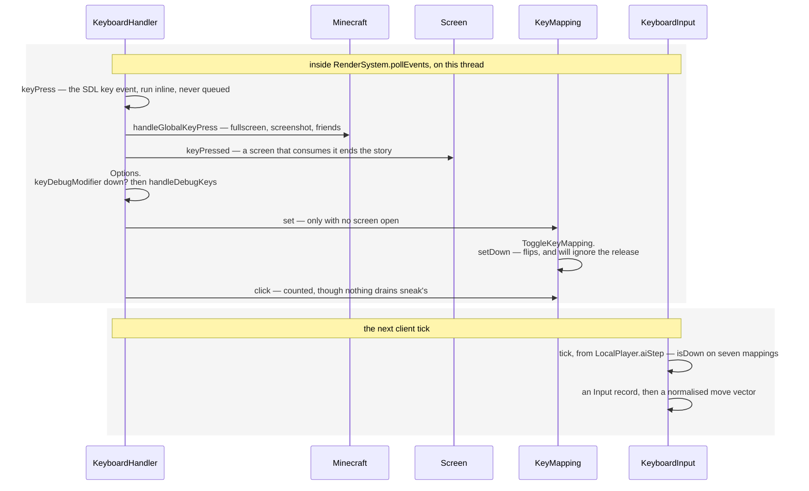

# Input and keybinds

> Verified against **Minecraft 26.3** · Part X · holding sneak: an SDL event, four chances to be swallowed, and a key that stays down while you are not touching it.

Turn on toggle sneak and hold the key. `ToggleKeyMapping.setDown` sees the
press, flips the mapping to *down*, and then swallows the release entirely —
so as far as the rest of the game is concerned you are still holding a key
you let go of. Open your inventory and the mapping is released along with
every other one; close it and the mapping *comes back on*, because the toggle
remembered it was released by a screen rather than by you. **Neither the flip nor the swallowed release involves the tick.** The press and the release have both already happened by
the time the tick that observes them runs, and the tick's part is only to read
what the mapping now says.

What the movement keys *mean* once they are down belongs to [input to
movement](../player/input-to-movement.md); this page stops at the mapping.

## A key press is not queued

**SDL events are not queued by the game.** `SDLEventHandler.pollEvents`
drains them from SDL's own queue inside `RenderSystem.pollEvents`, which
`Minecraft.run` calls immediately before `Minecraft.runTick`; `SDLEventHandler`
hands the input events to their handlers through `BlockableEventLoop.execute`,
but on the Render thread that call runs the task rather than queueing it — the
qualification [the client
loop](the-client-loop.md#where-work-leaves-this-thread-and-where-it-comes-back)
puts on the same method. Any description of Minecraft input that says a key
press is "queued onto the client thread" is describing a different game.

## The cast

| class | what it decides | thread |
|---|---|---|
| `KeyboardHandler` | the key, character and pre-edit handlers, and four of the five gates a press runs | Render thread |
| `MouseHandler` | motion accumulation, the sensitivity curve, and who is allowed to turn the player | Render thread |
| `KeyMapping` | whether a mapping is down, and how many clicks are owed | Render thread |
| `ToggleKeyMapping` | the four mappings that can behave as toggles: sneak, sprint, use, attack | Render thread |
| `InputConstants` | the key universe, and the string a binding is saved as | Render thread |
| `InputQuirks` | five platform constants that visibly change behaviour | Render thread |
| `KeyboardInput` | which of the seven movement mappings are down, once per tick | Render thread |
| `Gui` | the housekeeping at both ends of a screen's life | Render thread |

## Holding sneak

```mermaid
sequenceDiagram
    participant KH as KeyboardHandler
    participant MC as Minecraft
    participant Screen as Screen
    participant KM as KeyMapping
    participant KI as KeyboardInput
    rect rgba(0, 0, 0, 0.04)
    Note over KH,KI: inside RenderSystem.pollEvents, on this thread
    KH->>KH: keyPress — the SDL key event, run inline, never queued
    KH->>MC: handleGlobalKeyPress — fullscreen, screenshot, friends
    KH->>Screen: keyPressed — a screen that consumes it ends the story
    KH->>KH: Options.<br/>keyDebugModifier down? then handleDebugKeys
    KH->>KM: set — only with no screen open
    KM->>KM: ToggleKeyMapping.<br/>setDown — flips, and will ignore the release
    KH->>KM: click — counted, though nothing drains sneak's
    end
    rect rgba(0, 0, 0, 0.04)
    Note over KH,KI: the next client tick
    KI->>KI: tick, from LocalPlayer.aiStep — isDown on seven mappings
    KI->>KI: an Input record, then a normalised move vector
    end
```

*Four gates, all in the top band; a drained press meets a fifth, the no-screen-no-overlay test `Minecraft.tick` makes before it drains the clicks, which sneak, read as held, never reaches. Everything in that band is one SDL event, the lower band is the next client tick, and nothing between them asked for the key.*

**A key press has five chances to be swallowed before it counts** — the global-key check, an open screen, the debug modifier, the no-screen gate on recording, and the no-screen-no-overlay gate on draining, which a mapping read only as held, like sneak, never meets. And the two ends of
a screen's life are where the input system does its housekeeping: opening a
screen releases every mapping, and closing one restores those toggles that
asked to be restored — with default bindings, sneak and sprint, and only when
there is a level.

## Two ways gameplay reads a mapping, and they behave differently

`KeyMapping.isDown` is a boolean the movement code samples. `KeyboardInput.tick`
reads seven of them — forward, back, left, right, jump, sneak, sprint — once
per client tick, packs them into an `Input` record and derives a normalised
move vector. Nothing is consumed; a key held for ten ticks reads down ten
times.

`KeyMapping.consumeClick` is a **drain, not an edge**. It decrements a
counter that `KeyMapping.click` incremented, which means presses that
happened faster than the tick rate are not lost — and that binding two
*mappings* to one key code fires both, because `KeyMapping.click` increments
every mapping registered under that key. `Minecraft.handleKeybinds` is the
drain, and
it runs from `Minecraft.tick` only when there is neither a screen nor an
overlay.

`KeyMapping.matches` and `KeyMapping.matchesMouse` are the third way, used
where no counter is wanted: they test an event against the binding directly,
which is what screens do, and what `KeyboardHandler.handleDebugKeys` does
twenty times over as it works through the F3 combinations one test at a
time. `KeyMapping.same`,
`KeyMapping.isDefault` and
`KeyMapping.isUnbound` are what the binding screen asks.

## The bulk operations, and their single callers

`Options.keyMappings` is the array every mapping is reached through — the
third of the three shapes [options](options.md#the-three-ways-a-setting-is-stored)
lists. Beside it
`KeyMapping` keeps two static registries of every mapping ever constructed —
`KeyMapping.ALL` by name, `KeyMapping.MAP` by key — which is how a key code is turned back into the
mappings that want it. Five static operations walk them. Four of the five are
called from exactly one place each, and those four are the interesting ones —
the fifth, `KeyMapping.resetMapping`, rebuilds the key index from every mapping and has two callers, the binding screen and `Options.load`.

| operation | called from | why |
|---|---|---|
| `KeyMapping.releaseAll` | `Gui.setScreen` ([GUI and screens](gui-and-screens.md#gui-which-is-not-the-hud)) | a screen may swallow a release, and a stuck-held mapping is worse than a lost press |
| `KeyMapping.restoreToggleStatesOnScreenClosed` | `Gui.setScreen` | put back the toggles that the release above turned off |
| `KeyMapping.resetToggleKeys` | `LocalPlayer.respawn` | you should not wake up sneaking |
| `KeyMapping.setAll` | `MouseHandler.grabMouse` | asks SDL which keys are physically down and sets each willing mapping to match — only where `InputQuirks.RESTORE_KEY_STATE_AFTER_MOUSE_GRAB` is set |

The asymmetry between a swallowed press and a swallowed release is worth
stating plainly, because it is the reason the first two rows exist. A press a
screen swallows is harmless: the mapping was never set down. A *release* a screen swallows would leave the mapping down with nothing to clear it, which the first row prevents for every mapping set down before the screen opened.

## The mouse: accumulate, apply, discard

`MouseHandler.onMove`, `MouseHandler.onButton`, `MouseHandler.onScroll` and
`MouseHandler.onDrop` are the handlers; `MouseHandler.accumulatedDX` and
`MouseHandler.accumulatedDY` are the pending motion; and
`MouseHandler.handleAccumulatedMovement` applies it — from `Minecraft.runTick`,
between the sound update and the frame, **once per frame rather than once per
tick**. So a look is applied at frame rate and a step is applied at tick rate.

Accumulated motion goes to whatever is in front of it and is then cleared
unconditionally. With a screen open the pointer goes to the screen's move handler and the delta to its drag handler, and neither to the player — not because the two are exclusive in
`MouseHandler`, which tests them separately, but because opening a screen
released the mouse. With the window unfocused nothing
accumulates in the first place; and the reset at the end runs either way, so
motion is never banked.

`MouseHandler.turnPlayer` holds the sensitivity curve, and it has an
arithmetic surprise in it. The curve is a **cube** of the slider, and the
ordinary and smooth-camera paths multiply the result by eight while the
scoped path does not — so **aiming a spyglass is exactly eight times slower,
by construction.** The scoped path additionally requires the smooth camera to
be off, the camera to be first-person, and the player to be scoping.
Minimum sensitivity is not zero either: the cubed term is taken of the slider
scaled and offset, so the slowest setting still turns.

`MouseHandler.grabMouse` and `MouseHandler.releaseMouse` are two directions
of one edge with `Gui.setScreen`, guarded so the two cannot recurse —
though only `MouseHandler.releaseMouse` has the single caller;
`MouseHandler.grabMouse` has five, and on its way it also sets the current
screen to none. `MouseHandler.isMouseGrabbed` is the state and
`MouseHandler.setIgnoreFirstMove` suppresses the jump after a resize. A
control-click is a right click only on macOS and only with
`Options.ctrlClickEmulatesRightClick` on, which it is not by default:
`MacosUtil.setCtrlClickEmulatesRightClick` hands the setting to SDL as a hint,
and `MouseHandler` rewrites no click itself. Double-click is a threshold plus
two identities: the two clicks must be within a quarter of a second, on the
same button, **and** on the same screen instance.

## The two debug-key families, and which one is bindable

Debug shortcuts look like one family and are two, which is why some of them
can be rebound and some cannot. `Options.debugKeys` holds **twenty-one**
ordinary `KeyMapping`s, every one of them rebindable and every one of them
listed by the binding screen; `KeyboardHandler.handleDebugKeys` tests twenty
of them, one `KeyMapping.matches` apiece, and `KeyboardHandler.keyPress` tests
the twenty-first, the crash key, with the overlay and modifier keys. The
second family is not mappings at all: a raw switch on key codes in
`KeyboardHandler.handleChunkDebugKeys`, gated on the game's debug flag and
bindable to nothing. Two of the *bindable* twenty-one, hitboxes and chunk borders, switch F3 entries that print no line and exist only to carry a flag something else reads — which is the seam between this page and [the
HUD](hud.md#what-a-debug-line-is-and-who-turns-one-on), whose F3 entry registry
is what those flags feed.

New categories are a third thing again. `KeyMapping.Category` is a registrable
record rather than an enum, so a mod can add one; registering a duplicate id
throws. Ordering is plain registration order into one list, and the eight
built-ins come first only because the record's own static initialiser
registers them first.

## What a key press sends, and from where

`KeyboardHandler` sends packets for two keys itself: `ServerboundChangeGameModePacket` for F3+N and, through `DebugQueryHandler`, a block-entity or entity tag query for the copy-recreate key. Every other press made outside a screen is drained by `Minecraft.handleKeybinds`, which sends the swap-offhand action itself and hands the others to the verbs that own them: an attack's `ServerboundPunchPacket`, a use, a pick, a drop and a mount's inventory each go out inside that same call, and a hotbar key's slot goes out on the next tick from `MultiPlayerGameMode.tick`. A press a screen consumes sends what that screen sends. The movement keys reach the server only from the tick, as the input, movement, player-command and abilities packets `LocalPlayer` sends there. None of those verbs is this page's.

Two smaller types sit beside the two handlers. `ScrollWheelHandler` is the wheel's accumulator, one of which `MouseHandler` keeps, and `InputType`, which belongs to neither, is the
four-valued "what did the player last use" that decides initial keyboard
focus, narration timing and whether a focused widget shows its tooltip.

## Questions players ask

**I bound two things to one key and both happen.** They will. Conflict
detection lives only in the binding screen — `ControlsScreen` over
`KeyBindsScreen` over the `KeyBindsList` that draws one row per mapping — and
is purely cosmetic: nothing in the input path resolves a collision. It also refuses to flag one when
*both* mappings are still at their defaults, which quietly exempts the pairs
the game itself ships colliding.

**Why does F3 toggle on release?** F3 is a key binding, and the debug
modifier and the overlay toggle are the same key by default — so the overlay
can only fire on the release, and only when no combination was used in
between. Rebind either and that behaviour disappears.

> **For a 1.21-era reader.** Input events are **records** now. The
> `(key, scancode, modifiers, action)` integer tuple is gone from every
> screen signature, replaced by `KeyEvent`, `MouseButtonEvent`,
> `CharacterEvent` and `PreeditEvent` in `client/input`, with shared helpers
> on `InputWithModifiers` — so a widget asks an event whether it *is* a
> confirmation or a paste rather than decoding modifiers itself. Also gone:
> categories as translation-key strings, and *MouseHandler.lastMouseEventTime*.

## Where to look

`KeyboardHandler.keyPress` — four of the five gates are one method, read top to bottom. Then `ToggleKeyMapping` end to end, which explains
this page's opening paragraph; `Minecraft.handleKeybinds` for the drain;
`KeyboardInput.tick` for the other way a mapping is read; `Gui.setScreen` for
the housekeeping at both ends of a screen; and `MouseHandler.turnPlayer` for
the sensitivity curve and its three gates.

---

*Rules: names, never code · how the system works, not how the code reads ·
newest version only · every backticked name passes `tools/verify_names.py`.*
