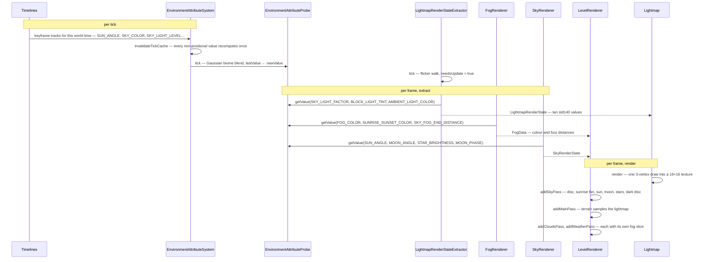

# Lightmap, fog and sky

> Verified against **Minecraft 26.2** · Part X · the sun goes down: every colour on screen, traced back to one keyframe curve.

## Responsibility

This is the part of the renderer that decides what colour the world is.
Not what shape it is — that is [level rendering](level-rendering.md) — but
how bright a torch-lit corner reads, how far you can see through the
murk, what hangs above the horizon and what falls out of it. Four
renderers own the four answers: `Lightmap` (how bright), `FogRenderer`
(how far), `SkyRenderer` and `CloudRenderer` (what is up there),
`WeatherEffectRenderer` (what is coming down).

The one sentence a player would recognise: *it gets dark, and then it
gets foggy, and then it rains.*

The headline for a 1.21-era reader: **none of these renderers knows what
time it is.** *DimensionSpecialEffects* is gone. *LightTexture* is gone.
Every per-dimension, per-biome, per-time-of-day visual constant now lives
in one registry-backed, data-driven, layered system —
`EnvironmentAttributes` — and each renderer asks a probe for a value at a
position and a partial tick. The day/night cycle is a `Timeline`: JSON
keyframes, in a data pack.

## The data it owns

### The attribute system (server-side data, client-side consumers)

- **`EnvironmentAttribute`** — one visual (or gameplay) quantity, in
  `BuiltInRegistries`. Each declares `EnvironmentAttribute.defaultValue`,
  an `EnvironmentAttribute.type` (`AttributeTypes.RGB_COLOR`,
  `AttributeTypes.ARGB_COLOR`, `AttributeTypes.FLOAT`,
  `AttributeTypes.ANGLE_DEGREES`, `AttributeTypes.MOON_PHASE`), and two
  flags that decide how it is sampled:
  `EnvironmentAttribute.isPositional` and
  `EnvironmentAttribute.isSpatiallyInterpolated`.
  `EnvironmentAttribute.Builder.spatiallyInterpolated`,
  `EnvironmentAttribute.Builder.syncable` and
  `EnvironmentAttribute.Builder.notPositional` set them.
- **`EnvironmentAttributes`** — the catalogue. The ones this page uses:
  `EnvironmentAttributes.SKY_COLOR`, `EnvironmentAttributes.FOG_COLOR`,
  `EnvironmentAttributes.FOG_START_DISTANCE`,
  `EnvironmentAttributes.FOG_END_DISTANCE`,
  `EnvironmentAttributes.SKY_FOG_END_DISTANCE`,
  `EnvironmentAttributes.CLOUD_FOG_END_DISTANCE`,
  `EnvironmentAttributes.WATER_FOG_COLOR`,
  `EnvironmentAttributes.SUNRISE_SUNSET_COLOR`,
  `EnvironmentAttributes.CLOUD_COLOR`,
  `EnvironmentAttributes.CLOUD_HEIGHT`,
  `EnvironmentAttributes.SUN_ANGLE`,
  `EnvironmentAttributes.MOON_ANGLE`,
  `EnvironmentAttributes.STAR_ANGLE`,
  `EnvironmentAttributes.STAR_BRIGHTNESS`,
  `EnvironmentAttributes.MOON_PHASE`,
  `EnvironmentAttributes.BLOCK_LIGHT_TINT`,
  `EnvironmentAttributes.SKY_LIGHT_COLOR`,
  `EnvironmentAttributes.SKY_LIGHT_FACTOR`,
  `EnvironmentAttributes.SKY_LIGHT_LEVEL`,
  `EnvironmentAttributes.AMBIENT_LIGHT_COLOR`,
  `EnvironmentAttributes.NIGHT_VISION_COLOR`,
  `EnvironmentAttributes.AMBIENT_PARTICLES`.
- **`EnvironmentAttributeSystem`** — the per-level stack of layers.
  `EnvironmentAttributeSystem.addDefaultLayers` builds it from
  `EnvironmentAttributeSystem.addDimensionLayer` (constants from
  `DimensionType.attributes`), `EnvironmentAttributeSystem.addBiomeLayer`
  (positional, from `Biome.getAttributes`) and the timelines. The
  builder verbs are
  `EnvironmentAttributeSystem.Builder.addConstantLayer`,
  `EnvironmentAttributeSystem.Builder.addTimeBasedLayer`,
  `EnvironmentAttributeSystem.Builder.addPositionalLayer` and
  `EnvironmentAttributeSystem.Builder.addTimelineLayer`; the layer types
  are `EnvironmentAttributeLayer.Constant`,
  `EnvironmentAttributeLayer.TimeBased` and
  `EnvironmentAttributeLayer.Positional`. Each attribute ends up as one
  `EnvironmentAttributeSystem.ValueSampler`, holding a folded
  `EnvironmentAttributeSystem.ValueSampler.baseValue`, the surviving
  `EnvironmentAttributeSystem.ValueSampler.layers`,
  `EnvironmentAttributeSystem.ValueSampler.isAffectedByPosition` and a
  per-tick cache (`EnvironmentAttributeSystem.ValueSampler.cachedTickValue`
  against `EnvironmentAttributeSystem.ValueSampler.cacheTickId`).
- **`EnvironmentAttributeProbe`** — the camera's sampler.
  `EnvironmentAttributeProbe.tick` Gaussian-samples the surrounding
  biomes into a `SpatialAttributeInterpolator` and rolls every
  `EnvironmentAttributeProbe.ValueProbe.lastValue` to
  `EnvironmentAttributeProbe.ValueProbe.newValue`;
  `EnvironmentAttributeProbe.getValue` interpolates between the two by
  partial tick. Layers combine through
  `ColorModifier.MULTIPLY_RGB`, `ColorModifier.ALPHA_BLEND`,
  `FloatModifier.MULTIPLY`, `FloatModifier.MAXIMUM` and friends.
- **`Timeline`** — a period in ticks plus keyframe tracks
  (`Timeline.addTrack`, `Timeline.addModifierTrack`,
  `Timeline.addTimeMarker`, eased by `EasingType`). `Timelines.OVERWORLD_DAY`
  is the day/night cycle; `Timelines.MOON` is a second, longer one.
  Time itself comes from `WorldClock`/`ClockManager` (see
  [the level tick](../server/server-level-tick.md)), and
  `ClockTimeMarkers.DAY`, `ClockTimeMarkers.NOON`, `ClockTimeMarkers.NIGHT`
  and `ClockTimeMarkers.MIDNIGHT` are the named instants on it.
- **`DimensionType`** now carries `DimensionType.skybox` — a three-valued
  `DimensionType.Skybox` (`DimensionType.Skybox.NONE`,
  `DimensionType.Skybox.OVERWORLD`, `DimensionType.Skybox.END`) —
  plus `DimensionType.attributes` (an `EnvironmentAttributeMap`) and
  `DimensionType.timelines`. `BiomeSpecialEffects` still exists but has
  been hollowed out to `BiomeSpecialEffects.waterColor`,
  `BiomeSpecialEffects.grassColorOverride` and the foliage colours; every
  fog and sky colour left it.

### The lightmap

- **`Lightmap`** — a 16×16 `GpuTexture` (`Lightmap.texture`,
  `Lightmap.textureView`, `Lightmap.TEXTURE_SIZE`) and a
  `MappableRingBuffer` of uniforms (`Lightmap.ubo`,
  `Lightmap.LIGHTMAP_UBO_SIZE`). `Lightmap.render` writes the uniforms
  and issues one three-vertex draw with `RenderPipelines.LIGHTMAP`.
- **`LightmapRenderState`** — the ten values that draw is parameterised
  by, in std140 order: `LightmapRenderState.needsUpdate`,
  `LightmapRenderState.skyFactor`, `LightmapRenderState.blockFactor`,
  `LightmapRenderState.nightVisionEffectIntensity`,
  `LightmapRenderState.darknessEffectScale`,
  `LightmapRenderState.bossOverlayWorldDarkening`,
  `LightmapRenderState.brightness`,
  `LightmapRenderState.blockLightTint`,
  `LightmapRenderState.skyLightColor`,
  `LightmapRenderState.ambientColor` and
  `LightmapRenderState.nightVisionColor`.
- **`LightmapRenderStateExtractor`** — fills that state.
  `LightmapRenderStateExtractor.tick` runs the torch-flicker random walk
  (`LightmapRenderStateExtractor.blockLightFlicker`) and sets
  `LightmapRenderStateExtractor.needsUpdate`;
  `LightmapRenderStateExtractor.extract` reads the probe, `Options.gamma`
  and `LightmapRenderStateExtractor.calculateDarknessScale`.
- **`LightCoordsUtil`** — the packing statics, split out of the texture.
  `LightCoordsUtil.pack`, `LightCoordsUtil.block`, `LightCoordsUtil.sky`,
  `LightCoordsUtil.FULL_BRIGHT`, `LightCoordsUtil.FULL_SKY`, the smooth
  variants used by ambient occlusion
  (`LightCoordsUtil.smoothPack`, `LightCoordsUtil.smoothBlend`,
  `LightCoordsUtil.addSmoothBlockEmission`) and the lookups
  `LightCoordsUtil.getLightCoords` with its
  `LightCoordsUtil.BrightnessGetter.DEFAULT`. A packed value reaches a
  vertex through `VertexConsumer.setLight`.
- **`UiLightmap`** — a 1×1 white `DynamicTexture`. `GameRenderer.lightmap`
  hands this out while `GameRenderer.useUiLightmap` is set;
  `GameRenderer.levelLightmap` always returns the real one.

### Fog

`FogRenderer` owns two ring buffers (`FogRenderer.regularBuffer`,
`FogRenderer.emptyBuffer`) and the ordered list `FogRenderer.FOG_ENVIRONMENTS`.
Its output is a mutable `FogData` — `FogData.color`,
`FogData.environmentalStart`, `FogData.environmentalEnd`,
`FogData.renderDistanceStart`, `FogData.renderDistanceEnd`,
`FogData.skyEnd`, `FogData.cloudEnd` — stashed on
`CameraRenderState.fogData` and uploaded by `FogRenderer.updateBuffer`.
The environments are `AtmosphericFogEnvironment`, `WaterFogEnvironment`,
`LavaFogEnvironment`, `PowderedSnowFogEnvironment`,
`BlindnessFogEnvironment` and `DarknessFogEnvironment`, all implementing
`FogEnvironment.isApplicable`, `FogEnvironment.providesColor`,
`FogEnvironment.modifiesDarkness`, `FogEnvironment.getBaseColor` and
`FogEnvironment.setupFog`. `FogType` (`FogType.WATER`, `FogType.LAVA`,
`FogType.POWDER_SNOW`, `FogType.ATMOSPHERIC`, `FogType.NONE`) says which
medium the camera is in.

### Sky, clouds, weather

`SkyRenderer` builds every buffer it will ever need in its constructor:
`SkyRenderer.starBuffer` (`SkyRenderer.buildStars`),
`SkyRenderer.topSkyBuffer` and `SkyRenderer.bottomSkyBuffer`
(`SkyRenderer.buildSkyDisc`, `SkyRenderer.SKY_DISC_RADIUS`),
`SkyRenderer.sunriseBuffer` (`SkyRenderer.buildSunriseFan`),
`SkyRenderer.sunBuffer` and `SkyRenderer.moonBuffer`
(`SkyRenderer.buildSunQuad`, `SkyRenderer.buildMoonPhases`, from the
`AtlasIds.CELESTIALS` atlas), `SkyRenderer.endSkyBuffer` and
`SkyRenderer.endFlashBuffer`. Per frame it fills a `SkyRenderState` —
`SkyRenderState.skybox`, `SkyRenderState.sunAngle`,
`SkyRenderState.moonAngle`, `SkyRenderState.starAngle`,
`SkyRenderState.starBrightness`, `SkyRenderState.skyColor`,
`SkyRenderState.sunriseAndSunsetColor`, `SkyRenderState.moonPhase`,
`SkyRenderState.rainBrightness`, `SkyRenderState.shouldRenderDarkDisc`,
`SkyRenderState.endFlashIntensity`.

`CloudRenderer` is a `SimplePreparableReloadListener`: `CloudRenderer.prepare`
reads the cloud image and `CloudRenderer.apply` bakes it into
`CloudRenderer.TextureData`, one 64-bit word per pixel with the colour in the
high bits and four neighbour-emptiness flags in the low four
(`CloudRenderer.packCellData`, `CloudRenderer.isCellEmpty`).
`CloudRenderer.buildMesh` walks cells (`CloudRenderer.CELL_SIZE_IN_BLOCKS`)
and writes three bytes per face through `CloudRenderer.encodeFace`;
`CloudRenderer.RelativeCameraPos` and `CloudStatus` decide which faces
exist at all.

`WeatherEffectRenderer` holds one `WeatherEffectRenderer.vertexBuffer` and
the precomputed tangent tables `WeatherEffectRenderer.columnSizeX` and
`WeatherEffectRenderer.columnSizeZ` (`WeatherEffectRenderer.RAIN_TABLE_SIZE`).
Its per-frame product is a list of
`WeatherEffectRenderer.ColumnInstance` records inside `WeatherRenderState`
(`WeatherRenderState.rainColumns`, `WeatherRenderState.snowColumns`,
`WeatherRenderState.intensity`, `WeatherRenderState.radius`).

## When it runs

All of it is on the client's main thread, inside `Minecraft.runTick`.
Nothing here is handed to a worker.

**Per client tick.** `EnvironmentAttributeSystem.invalidateTickCache`
bumps the cache id, dropping every non-positional cached value.
`EnvironmentAttributeProbe.tick` re-samples the biome neighbourhood.
`LightmapRenderStateExtractor.tick` advances the flicker and raises
`LightmapRenderState.needsUpdate`. `Level.updateSkyBrightness` recomputes
`Level.skyDarken`. `ClientLevel.tickWeatherEffects` spawns rain particles
and sounds within `Options.weatherRadius`; `ClientLevel.animateTick` runs
the ambient particle scatter; `EndFlashState.tick` advances the dragon-fight
flash.

**Per frame, extract.** `GameRenderer.extract` runs
`LightmapRenderStateExtractor.extract` first, then
`GameRenderer.extractCamera` (which calls `FogRenderer.setupFog` and
stores the `FogData`), then `LevelExtractor.extract`, which drives
`WeatherEffectRenderer.extractRenderState` and
`SkyRenderer.extractRenderState` and reads the cloud colour and height.

**Per frame, render.** `Lightmap.render` goes first and returns
immediately unless the tick flag is set. `GameRenderer.renderLevel`
uploads the fog with `FogRenderer.updateBuffer` and takes a slice with
`FogRenderer.getBuffer`. `LevelRenderer.render` then declares the passes:
`LevelRenderer.addSkyPass`, `LevelRenderer.addMainPass`,
`LevelRenderer.addCloudsPass`, `LevelRenderer.addWeatherPass`. Each pass
binds its own fog slice with `RenderSystem.setShaderFog` — the sky and
the clouds get *different* fog ends than the terrain does. The frame
closes with `FogRenderer.endFrame` and `CloudRenderer.endFrame` rotating
their ring buffers.

**Per resource reload.** `CloudRenderer.prepare`/`CloudRenderer.apply`
rebake the cloud cells, and `LevelExtractor.onResourceManagerReload` sets
`LevelExtractor.shouldResetSkyRenderer`, which makes
`LevelRenderer.addSkyPass` close and reconstruct the entire `SkyRenderer`
— stars, moon phases and all.

## The trace: the sun goes down

Read the diagram as one question asked repeatedly: *what is this
attribute worth, here, now?* The timeline supplies the curve, the layer
stack decides how dimension, biome, time and weather combine, the probe
smooths the answer over space and time, and four renderers consume it.
`SkyRenderer.renderSunriseAndSunset` is the clearest case — the sunrise
fan's colour is `EnvironmentAttributes.SUNRISE_SUNSET_COLOR`, an ARGB
keyframe track, and its visibility is the dot product of the sun's
direction with the camera's forward vector.

## Interfaces

- **Called by:** `GameRenderer.extract` and `GameRenderer.render` for the
  lightmap and fog; `LevelRenderer.render` for sky, clouds and weather,
  through the frame graph described in
  [level rendering](level-rendering.md).
- **Calls into:** `EnvironmentAttributeProbe` for every value;
  `RenderSystem.setShaderFog` and `RenderPipelines.LIGHTMAP`,
  `RenderPipelines.SKY`, `RenderPipelines.CELESTIAL`,
  `RenderPipelines.STARS`, `RenderPipelines.CLOUDS`,
  `RenderPipelines.WEATHER_DEPTH_WRITE` for the draws — see
  [blaze3d](blaze3d.md).
- **Crosses the network as:** nothing directly. The inputs arrive as
  registry sync (`DimensionType`, `Biome`, `Timeline`,
  `EnvironmentAttributeMap.NETWORK_CODEC`) during configuration, and as
  the world time and weather in the play phase — see
  [protocol phases](../networking/protocol-phases.md).
- **Data-driven by:** `DimensionType.attributes`, `Biome.getAttributes`,
  `Timelines.OVERWORLD_DAY` and `Timelines.MOON`, all reloadable
  registries. A data pack can retint a dimension without touching the
  client.

## Invariants and surprises

- **The lightmap is computed on the GPU now, and only once per tick.**
  `Lightmap.render` writes ten uniforms and draws three vertices; the
  brightness curve lives in the shader. It early-outs unless
  `LightmapRenderState.needsUpdate`, which only
  `LightmapRenderStateExtractor.tick` sets. In 1.21 this was a 16×16
  `NativeImage` filled pixel by pixel in Java and re-uploaded every frame.
- **The lightmap deliberately ignores partial ticks.**
  `GameRenderer.extract` passes a literal `1.0` to
  `LightmapRenderStateExtractor.extract`, while `FogRenderer.setupFog`
  and `SkyRenderer.extractRenderState` use the real one. Sky and fog
  interpolate mid-tick; world lighting steps.
- **`Lightmap.getBrightness` survives but no longer feeds the lightmap.**
  It is a CPU-side duplicate of the shader's curve, kept for `Hud`,
  `EntityRenderer` shadows and `ScreenEffectRenderer`.
- **Fog picks its colour and its darkening from different sources.**
  `FogRenderer.computeFogColor` walks `FogRenderer.FOG_ENVIRONMENTS` in a
  fixed priority order and takes the first that
  `FogEnvironment.providesColor` and, separately, the first that
  `FogEnvironment.modifiesDarkness`. `MobEffectFogEnvironment` declares
  the former false — blindness and darkness can only darken somebody
  else's colour, never supply one.
- **Rain fog is the only stateful fog.**
  `AtmosphericFogEnvironment.rainFogMultiplier` is an exponential
  follower, so fog lags a storm starting; and
  `AtmosphericFogEnvironment.updateRainFogState` still thickens it in a
  biome that has no precipitation, at half strength.
- **The cloud texture is never bound as a texture.** It is baked into a
  `CloudRenderer.TextureData` cell array at reload, and the mesh is a
  compressed *face list* — three bytes per face, expanded to quads in the
  shader. The mesh is rebuilt only when the camera crosses a cell
  boundary, changes side (`CloudRenderer.RelativeCameraPos`), or the
  `CloudStatus` changes.
- **The stars are the same in every world.** `SkyRenderer.buildStars`
  seeds a fixed constant and rejects samples outside a shell, so
  `SkyRenderer.STAR_COUNT` is an attempt count, not a star count. They
  are built once in the constructor and only rebuilt when a resource
  reload reconstructs the whole `SkyRenderer`.
- **Weather is fully re-derived on the CPU every frame.**
  `WeatherEffectRenderer.extractRenderState` loops every column in a
  square of radius `Options.weatherRadius`, queries the heightmap and
  `Biome.getPrecipitationAt`, and rebuilds the vertex buffer. Rain and
  snow are two indexed draws sharing one buffer.
- **The sky can be skipped entirely.** `LevelRenderer.addSkyPass` bails
  in lava, in powder snow, and under a mob effect that blocks the sky;
  `GameRenderer.renderLevel` also suppresses it when a boss bar wants
  world fog, and `AtmosphericFogEnvironment.setupFog` clamps the fog
  hard in that case.
- **Moon phase is no longer arithmetic on the day count.** It is
  `EnvironmentAttributes.MOON_PHASE`, driven by `Timelines.MOON`, whose
  period is `MoonPhase.COUNT` days; the renderer selects a sub-quad of one
  eight-quad buffer by `MoonPhase.index`.
- **Gameplay darkness and visual darkness are the same curve.**
  `Level.updateSkyBrightness` derives `Level.skyDarken` from
  `EnvironmentAttributes.SKY_LIGHT_LEVEL`, the same track that drives the
  lightmap's sky factor. Mob spawning and the colour of the world come
  from one keyframe.
- **Names a 1.21-era reader will hunt for and not find:**
  *LightTexture* (now `Lightmap` plus `LightCoordsUtil`),
  *DimensionSpecialEffects* and all three of its subclasses (now
  `DimensionType.skybox` plus attributes), *FogParameters* (now `FogData`),
  *RenderSystem.setShaderFogColor* and its siblings (now one
  `RenderSystem.setShaderFog` taking a uniform slice),
  *LevelRenderer.renderSky* / *renderClouds* / *renderSnowAndRain* (now
  the `LevelRenderer.addSkyPass` family of frame-graph passes),
  *Level.getSkyColor*, *ClientLevel.getStarBrightness* and
  *ClientLevel.effects* (all attributes now).

## Where to look

`Lightmap`, then `LightmapRenderStateExtractor.extract` for what feeds
it. `EnvironmentAttributes` for the catalogue and
`EnvironmentAttributeSystem.addDefaultLayers` for how a value is
assembled. `FogRenderer.computeFogColor` for the priority walk.
`SkyRenderer.extractRenderState` and `LevelRenderer.addSkyPass` for the
sky. `CloudRenderer.buildMesh` and
`WeatherEffectRenderer.extractRenderState` for the two per-frame meshes.

---

*Rules: names, never code · how the system works, not how the code reads ·
newest version only · every backticked name passes `tools/verify_names.py`.*
