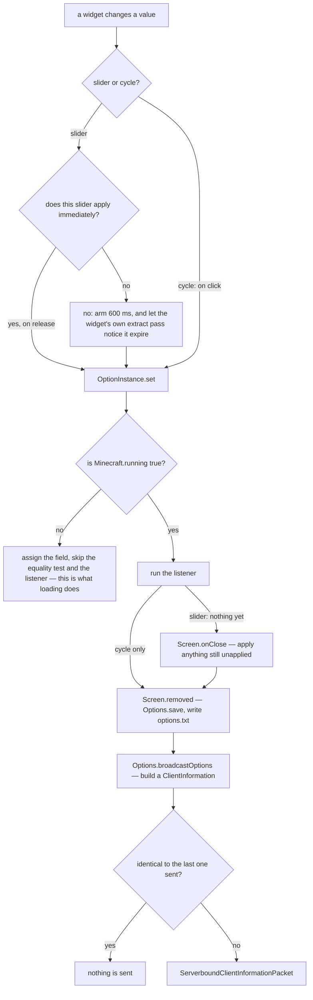

# Options

> Verified against **Minecraft 26.2** · Part X · the render-distance slider: a value that takes effect on a delay, rebuilds the world on a later frame, and reaches the server only when a screen closes — with no reply.

There is no settings-changed hook in the Minecraft client. **Saving is the
event system.** The server learns your new view distance because something
called `Options.save`, and `Options.save` is the only caller of
`Options.broadcastOptions` — which sounds like a tight, tidy rule until you
notice that every cycle-option button calls `Options.save` on click. Change
chat visibility and your `ClientInformation` is on the wire before you have
left the screen; drag the render-distance slider and nothing is sent until
the screen closes.

This page is the policy: what a setting *is*, when a change takes effect, who
finds out, and what the server does with the nine fields it is told. The
bindings that also live on `Options` are [input and
keybinds](input-and-keybinds.md).

## The cast

| class | what it decides | thread |
|---|---|---|
| `Options` | the file, the fields, and when to save | Render thread |
| `OptionInstance` | one setting: value, codec, caption, listener, and the widget | Render thread |
| `OptionInstance.ValueSet` | the legal values — and, by its subtype, whether the widget saves on click | Render thread |
| `ClientInformation` | the nine-field record the server is told, kept in `server/level` | crosses the wire |
| `LevelExtractor` | notices, next frame, that the effective render distance changed | Render thread |
| `ChunkMap` | clamps the request and re-tracks, silently | Server thread |
| `IntegratedServer` | the singleplayer back door: reads the sliders directly, every unpaused server tick | Server thread |

## What happens when a setting changes

Four decisions stand between a widget and the wire, and none of them is "run
the listener and be done".

Follow the two branches to the right-hand column and the asymmetry is the
whole behaviour difference between the widget families. A cycle button's own
handler calls `Options.save` on the click, so the packet is built before you
have stopped looking at the button. A slider's value reaches the field on
release or 600 ms later, and nothing saves it: saving happens once, in
`OptionsSubScreen.removed`, when the screen comes down — with
`OptionsSubScreen.onClose` applying any value still sitting in an armed timer
first, so that leaving fast does not lose your drag. The difference comes from
the value set's subtype, `OptionInstance.SliderableValueSet` against
`OptionInstance.CycleableValueSet`, and from nothing else.

## The three ways a setting is stored

`OptionInstance` is the modern shape — a value, a codec, an initial value, a
caption, a listener, and an `OptionInstance.ValueSet` that decides both the
legal values and the widget. The concrete sets are
`OptionInstance.IntRange`, `OptionInstance.ClampingLazyMaxIntRange`,
`OptionInstance.UnitDouble`, `OptionInstance.Enum`,
`OptionInstance.LazyEnum`, `OptionInstance.AltEnum` and
`OptionInstance.SliderableEnum`.

**Plain fields** are the older shape, read and written by name in
`Options.processOptions`: the language code, the resource-pack lists,
`Options.tutorialStep`, `Options.smoothCamera`,
`Options.advancedItemTooltips`, `Options.joinedFirstServer`,
`Options.startedCleanly` and a dozen others. They have no listener and no
widget machinery at all — and `Options.smoothCamera`, which a keybind
toggles, is not persisted anywhere.

**The key-mapping array** is the third, and is the input page's subject.

`Options.processOptions` is worth naming twice: it is the file format and the
field list in one method, which is why it is the first place to look for
anything about *options.txt*. `Options.dumpOptionsForReport` and
`Options.processDumpedOptions` are the smaller subset that goes into the
profiling report.

## The delay, and why the world rebuilds anyway

The render-distance slider's listener does exactly one thing: it marks the
graphics preset custom. It does not invalidate a single chunk. It is also one
of only three options in the game that defer their value at all — with
simulation distance and biome blend, it is built to *not* apply immediately,
which is what arms the 600 ms; every other slider applies on release.

The world rebuilds because `LevelExtractor` notices, on the *next frame*,
that `Options.getEffectiveRenderDistance` differs from the last value it saw,
and calls its own full invalidation — tint caches cleared, the tracker
rebuilt, all geometry dirty. The setting and the consequence are joined by a
poll, not by a callback.

Sixteen other settings carry a listener that touches the graphics preset, and
they split cleanly. **Seven** of them also reach straight into the level
extractor and invalidate something: cloud range, cutout leaves, improved
transparency, ambient occlusion, anisotropic filtering, texture filtering and
biome blend radius. Those seven really are the callback the render-distance
slider is not. The other **nine** do exactly what render distance's does and
nothing else: flip `Options.graphicsPreset` back to custom through
`Options.setGraphicsPresetToCustom`. That is why "Custom" appears without
anyone selecting it — a preset writes a batch of settings at once, and every
one of the sixteen undoes the preset's name on the way past.

Elsewhere in the file the immediate listeners are real enough, and the
interesting ones are far more interesting than their options. GUI scale
resizes whichever screen is open. Vsync invalidates the surface configuration,
which is what the window is drawn into. Fullscreen toggles the window and then
writes the option back from what the window actually did. The unicode-font
toggle throws away every glyph atlas. High contrast adds and removes a
resource pack.

## The guard that silences every setting at startup

`OptionInstance.set` is not an unconditional write. It first asks whether
`Minecraft.running` is true, and when the game is not running it assigns the
field and skips **both** the equality test and the listener. That is not a
special path for loading: it silences *any* set performed before the loop
starts, and loading happens to be the biggest thing that happens there.

The ordering is what makes it bite. `Options` are read from disk inside the
`Options` constructor, which runs inside the `Minecraft` constructor, five
statements before `Minecraft.running` is set true ([the client
loop](the-client-loop.md#starting-and-the-three-ways-of-stopping) has the rest
of that sequence). So every value that comes out of *options.txt* is installed
with its side effect suppressed — no atlas thrown away, no window resized, no
preset marked custom — and the game instead arranges for the startup state to
be right by other means. A setting whose only effect is in its listener is
therefore a setting that does nothing until you change it in the interface.

## Who is told, and what is not said

`Options.buildPlayerInformation` assembles a `ClientInformation`: language,
view distance, chat visibility, chat colours, skin model parts, main hand,
text filtering, listing permission, particle status. **Nine fields, and
simulation distance is not one of them** — the record has no place to put it.

The packet is `ServerboundClientInformationPacket`, and it is a *common*
packet rather than a play one: the first is sent during configuration,
straight from `ClientHandshakePacketListenerImpl`, before the play phase
exists. Every later one comes from `Options.broadcastOptions`.

**There is no acknowledgement, and the absence is the point.** What the packet
provokes goes *outward, to other people*, never back to you: a hat-visibility
broadcast to the whole player list, and — because
`ServerPlayer.updateOptions` writes two of the nine fields into synched data
rather than into fields of its own — the skin-customisation byte and the main
hand travel to everyone tracking you as [synched entity
data](../entities/synched-entity-data.md#five-more-channels-all-keyed-by-the-same-entity-id). The other
seven are read off the `ServerPlayer` by whoever needs them. Nothing in any of
it tells you what happened to what you asked for. The only thing that ever
sets `Options.serverRenderDistance` is the server announcing its *own* view
distance — in the login packet, or by broadcasting
`ClientboundSetChunkCacheRadiusPacket` when an operator changes it. Your
request is clamped by `ChunkMap.getPlayerViewDistance` and used for [chunk
tracking](../world/tickets-and-loading.md), and you are never told what it was
clamped to; the client clamps itself, with
`Options.getEffectiveRenderDistance`. `ClientboundSetSimulationDistancePacket`
is likewise an announcement, not a reply.

Singleplayer short-circuits half of it. `IntegratedServer.tickServer` reads
both the simulation and render sliders off the client's options every unpaused
server tick and pushes them into the player list, so both drive the server
directly without waiting for a packet. Render distance travels as client
information anyway — it is field two of the record, sent over the memory
connection exactly as over a socket — and simulation distance never does, in
singleplayer or out of it, because that is the one number the client has no
say in.

## Questions players ask

**Why does my render-distance slider stop short?** Its maximum is computed
once, from the JVM's maximum memory, and the option is a plain
`OptionInstance.IntRange` built around that bound. It depends on your heap,
not on your graphics card. (The genuinely lazy
`OptionInstance.ClampingLazyMaxIntRange` is GUI scale's, and reads the
window.)

**Why did none of my settings' side effects run at startup?** Because
`Minecraft.running` is still false. `OptionInstance.set` checks it and, when
the game is not running, assigns the field and skips both the equality test
and the listener. That is not a special path for loading — it silences *any*
set performed before the loop starts, and loading happens in the `Options`
constructor, which runs inside the `Minecraft` constructor five statements
before `Minecraft.running` is set.

**Which settings really need a restart?** Two, and they say so. The graphics
backend and exclusive fullscreen are compared against snapshots taken at
startup, and `Options.isRestartRequiredToApplyVideoSettings` is what the
screen asks. Related: `Options.startedCleanly` is written false at startup
and true once the game is up, so a crash during boot can drop the client back
to a safe backend.

**Why does the tutorial never come back?** Options are per installation,
never per world — including `Options.tutorialStep`. Once any world drives the
tutorial to the end, no later world shows the toasts again, and an
unrecognised step name silently reads as *finished*.

**I edited options.txt and broke it. Why did nothing complain?** Failure is
quiet by design: a bad line is logged and skipped, a bad value for an
`OptionInstance` is logged and dropped back to the initial value, and a bad
number keeps the current one. Nothing about a corrupt *options.txt* stops the
game starting. The file carries a version line and is run through the data
fixer on load.

> **For a 1.21-era reader.** *Options.mouseSensitivity* and the other bare
> public fields are gone — most settings are now private with an accessor of
> the same name, so `Options.fov` and `Options.guiScale` are calls. Two traps:
> mouse sensitivity was *renamed* as well as encapsulated, to
> `Options.sensitivity` (only *options.txt* still says *mouseSensitivity*);
> and *Options.keyBindings* was renamed to `Options.keyMappings` but is still
> a public field, not a call.

## Where to look

`Options.processOptions` for the settings table. `OptionInstance.set` for the
listener guard that explains the loading behaviour, and
`OptionInstance.CycleableValueSet` for the button that saves on click.
`Options.buildPlayerInformation` for the nine fields the server hears.
`ChunkMap.getPlayerViewDistance` for what the server does with the one that
matters, and `IntegratedServer.tickServer` for the singleplayer back door.

---

*Rules: names, never code · how the system works, not how the code reads ·
newest version only · every backticked name passes `tools/verify_names.py`.*
