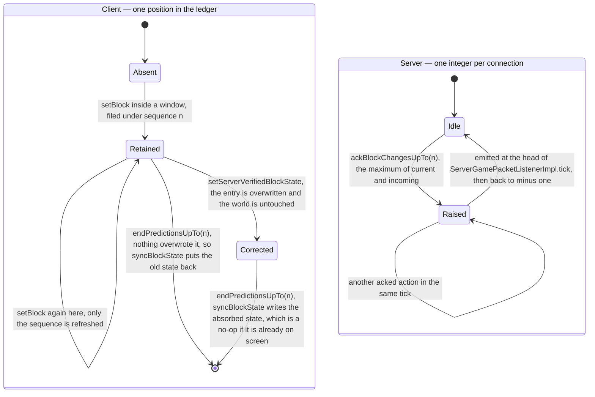
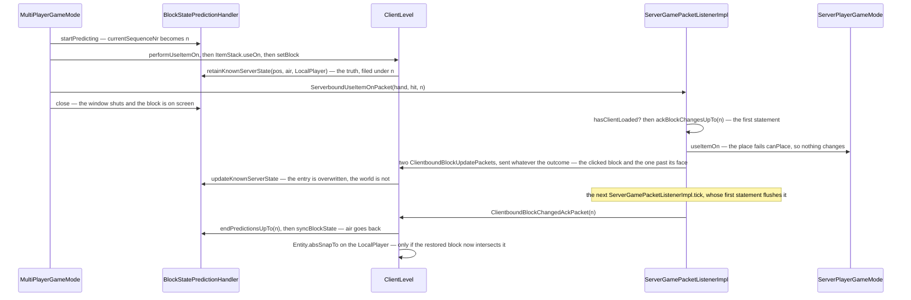

# Prediction and acknowledgement

> Verified against **Minecraft 26.2** · Part X · a block placed against a wall the server will not allow: the client shows it, the server refuses it, and a numbered receipt decides when the lie ends.

The client cannot wait a round trip to show you the block you just placed, so
it places it locally and tells the server afterwards. Everybody who has
described this system has described it as a rollback: the client guesses, the
server judges, the ack says yes or no. That is not what happens.
`ClientboundBlockChangedAckPacket` carries no verdict at all — it is a receipt
for a number, sent for actions the server refused exactly as it is sent for
actions it allowed, and sent carrying zero for an aborted dig. Nothing in the
protocol ever says *no*. **What makes the system correct instead is an
ordering rule: any correction the server intends travels earlier in the stream
than the receipt for it, because the correction leaves from inside the handler
while the receipt is only a number the connection flushes on its next tick.**

This page is the machinery under that rule: one ledger per level, one counter
per connection, six windows in which a prediction can be opened, and four
methods that between them decide whether the world moves. It is also the
client's second answer to the question
[authority](../entities/authority.md#five-predicates-and-the-final-one-the-other-four-hang-off)
asks — the client level answers *what may I simulate*, and this answers *what
may I show before I am told* — and Part V's [block
interaction](../blocks/block-interaction.md) and [block
breaking](../blocks/block-breaking.md) are where the two applications are
watched.

## The cast

| class | what it decides | thread |
|---|---|---|
| `MultiPlayerGameMode` | when a prediction window opens, and what goes in it | Render thread |
| `BlockStatePredictionHandler` | the ledger: what was there before, under which sequence number | Render thread |
| `ClientLevel` | the four writes — the prediction, the absorbed correction, the trigger, the settle | Render thread |
| `PredictiveAction` | a one-method interface: given the sequence, produce the packet | Render thread |
| `ServerGamePacketListenerImpl` | one integer per connection, and when it is emitted | Server thread |
| `ServerPlayerGameMode` | the authoritative version of the same action | Server thread |

## Two state machines, running against each other

The whole mechanism is one small state machine on each side, and neither
knows the other's state. The client's runs per *position*; the server's runs
per *connection*.

Read the two columns as running at different rates. The client's machine
advances several times per tick, once per position touched. The server's
advances on every packet that reaches a
`ServerGamePacketListenerImpl.ackBlockChangesUpTo` call. There are three such
call sites: `ServerboundUseItemOnPacket`, `ServerboundUseItemPacket`, and the
three destroying actions inside `ServerboundPlayerActionPacket`'s handler.
`ServerboundPlayerActionPacket` carries eight actions in all, and the other
five — dropping one item, dropping a stack, releasing a use, swapping hands
and the stab — raise nothing.
The counter then *empties* once per connection tick, which is why five acked
actions in one tick produce one receipt carrying the highest number, and why
one ack can drive a dozen positions out of the ledger at once.

Note what the diagram does not contain: any transition on which the server
says *no*. There is none. Both of the client's exit transitions are driven by
the same packet, and which of the two a position takes is decided entirely by
whether a block update reached it first.

## The four writes

Everything the ledger does happens through four methods on `ClientLevel`, and
the difference between them is the whole mechanism.

**`ClientLevel.setBlock`** — the ordinary write. While a prediction is open,
and only if the write succeeded, it calls
`BlockStatePredictionHandler.retainKnownServerState` with the state that was
there *before*. If the position already has an entry, only the sequence is
refreshed: the ledger keeps the **first** pre-change state it ever saw for
that position, and the player position recorded with it.

**`ClientLevel.setServerVerifiedBlockState`** — every inbound block update
goes through here. If the position is in the ledger it overwrites the entry
and the world is not touched, so the prediction stays on screen. If it is
**not** in the ledger — the common case, for blocks the player did not touch
— it writes the world immediately. The absorption is per position, not per
packet.

**`ClientLevel.handleBlockChangedAck`** — the trigger. The ledger's only
entry point from the network: it hands the receipt's number straight to
`BlockStatePredictionHandler.endPredictionsUpTo`, which removes every entry at
or below it and passes each one's recorded state to the settle.

**`ClientLevel.syncBlockState`** — the settle. Applies the recorded state
only if it differs from what is there, with flags `Block.UPDATE_NEIGHBORS`
plus `Block.UPDATE_CLIENTS` plus `Block.UPDATE_KNOWN_SHAPE` (the whole set is
in [block update flags](../../reference/block-update-flags.md)). That third flag
suppresses the shape pass, and neighbour updates are inert on the client
anyway — so the restore is a bare state write plus a remesh. A prediction
usually touches more than the block you clicked: placing one half of a door
writes the other, and a shape update can walk outwards from the block that
changed. Call that spread the *cascade*. **The cascade does not re-run on the
way back.** Reconciliation is correct only because every position the cascade
touched got its own ledger entry on the way out.

## A placement the server refuses

The state diagram says what the states are; this says what order the packets
arrive in, which is the part correctness actually rests on.

The ack is recorded **before** the action is attempted, so by the time the
refusal happens the receipt is already promised. The correction is not the
ordinary chunk broadcast but a targeted pair of resends the handler makes
unconditionally, which is what actually puts it ahead of the receipt: the
resends go out inside the handler, while the ack is only a field assignment
that `ServerGamePacketListenerImpl.tick` flushes later. The settle is what
finally moves the world, and it is a no-op when the absorbed state is already
what is on screen. And the snap only happens when the restored block turns
out to be inside the player.

Because the ack is buffered rather than sent, *where* a handler records it
does not affect stream order — `ServerGamePacketListenerImpl.handleUseItemOn`
and `ServerGamePacketListenerImpl.handleUseItem` record it as their first
statement, `ServerGamePacketListenerImpl.handlePlayerAction` after running the
break action, and in both cases the correction still reaches the client first.

## The six windows

A window is a few microseconds long and entirely synchronous: on the client
thread, inside one call from `Minecraft.tick`. The counter is raised, the
local effect runs, the packet is built with the new sequence and sent, and the
window closes — in that order, so the packet is constructed while the ledger
is still recording. `MultiPlayerGameMode.startPrediction` is the private method all six go
through, and it is not the same thing as
`BlockStatePredictionHandler.startPredicting`, which is what it calls: the
first is the window, the second is the pre-increment of
`BlockStatePredictionHandler.currentSequenceNr` that gives the window its
number. `ClientLevel.getBlockStatePredictionHandler` is package-private, so
nothing outside `client/multiplayer` can reach the ledger at all.

| where | what it predicts locally | what it sends |
|---|---|---|
| `MultiPlayerGameMode.startDestroyBlock`, creative | the block removed at once | `ServerboundPlayerActionPacket` START |
| `MultiPlayerGameMode.startDestroyBlock`, survival | `BlockBehaviour.attack`, then removal if the block breaks instantly | START |
| `MultiPlayerGameMode.continueDestroyBlock`, creative | removal, every sixth tick | START |
| `MultiPlayerGameMode.continueDestroyBlock`, at full progress | removal | STOP |
| `MultiPlayerGameMode.useItemOn` | `MultiPlayerGameMode.performUseItemOn` — the block's hook, the empty-hand hook, `ItemStack.useOn` | `ServerboundUseItemOnPacket` |
| `MultiPlayerGameMode.useItem` | `ItemStack.use`, including a transformed held item | `ServerboundUseItemPacket` |

So the ledger covers rather more than "blocks the player placed or broke": it
covers **every** `ClientLevel.setBlock` performed inside one of those windows.
That includes the second half of a door, every position a shape cascade
revisits, and — the only case of its own — `RedStoneOreBlock.attack`, whose
lighting change is not side-gated and therefore files a ledger entry when you
merely left-click redstone ore.

## What the ledger does not cover

Half the value of this page is the list of things people assume it handles.
`MultiPlayerGameMode`'s non-predicting verbs are the giveaway:
`MultiPlayerGameMode.attack`, `MultiPlayerGameMode.interact`,
`MultiPlayerGameMode.stopDestroyBlock`,
`MultiPlayerGameMode.releaseUsingItem`,
`MultiPlayerGameMode.piercingAttack` and every container verb open no window
at all.

- **Breaking progress.** `MultiPlayerGameMode.destroyProgress` and its
  companions are a plain parallel clock with no sequence and no
  reconciliation; the crack overlay is written straight into the client
  level. Of the progress clock itself nothing is predicted — only the
  removals at either end of it are.
- **Item use.** `MultiPlayerGameMode.useItem` opens a window, but a consumed
  item, a started use and a cooldown are not block states and the ack does
  nothing for them. They are corrected by other means: the living-entity
  flags in synched data, `ClientboundCooldownPacket`, and the menu resend the
  server performs when the stack changed.
- **Dropping.** `LocalPlayer.drop` predicts the removal from the selected
  slot and sends its action packet with sequence **zero** — a local mutation
  with no rollback path at all.
- **Movement.** Rubber-banding is a different mechanism entirely: an
  id-matched teleport handshake with no sequence and no ledger, described in
  [input to movement](../player/input-to-movement.md). The two systems touch
  at one point in each direction — `ClientPacketListener.handleMovePlayer`
  calls `BlockStatePredictionHandler.onTeleport`, so a teleport disarms the
  ledger's position snap, and the settle calls `Entity.absSnapTo` on the
  `LocalPlayer` when
  the restored block is inside you.

## What one ack does, and the numbers that are not sequences

One receipt is not one action undone. Every entry at or below the acknowledged
sequence is removed and handed to the settle, and there the paths part: write
nothing, because the recorded state is already on screen (the correct
prediction); write the state; or write the state and snap the player. A single
ack can produce all three across the map in one pass — which is what the
player-position recorded in each entry is for, and the only thing that reads
it. `BlockStatePredictionHandler.lastTeleportSequence` is the exception that
makes the snap coarse: it is compared against the *acknowledged* sequence
rather than each entry's, and is never reset, so one teleport suppresses a
whole batch of snaps rather than one.

**Zero is not a sequence.** `BlockStatePredictionHandler.startPredicting`
pre-increments, so the first real sequence is one and no genuine prediction is
ever numbered zero. The three-argument `ServerboundPlayerActionPacket`
constructor defaults the sequence to zero and aborting a dig uses it, so the
server dutifully sends a `ClientboundBlockChangedAckPacket` carrying zero — and
it settles nothing.

**Nothing expires.** There is no timeout and no cap on the ledger: nothing
clears it except a settle, and while the server considers the client not yet
loaded, sequenced packets are dropped *before* the ack is recorded. So a wrong
guess can stand on screen indefinitely, predictions accumulating behind it. The
only reset is a new `ClientLevel`.

And the two directions do not use the same flags. The predicted removal in
`MultiPlayerGameMode.destroyBlock` — the write inside the first two rows of the
window table — goes out with `Block.UPDATE_IMMEDIATE` in the mix; the restore
comes back with `Block.UPDATE_KNOWN_SHAPE`. One cascades, the other
deliberately does not, which is the four writes' asymmetry stated in flags.

## Questions players ask

**Why does the block come back and then vanish again?** Because the two
progress clocks disagreed and the ack does not care — [block
breaking](../blocks/block-breaking.md#two-clocks-and-the-plus-one-that-makes-them-agree)
follows both clocks. What is this page's is the consequence: the action is
acknowledged whatever the server decided, so the entry settles, the stone
comes back, and it vanishes again when the server's own delayed destroy
finishes. Releasing the mouse does *not* do this — that is
`MultiPlayerGameMode.stopDestroyBlock`, which opens no window at all.

**Why can I not right-click while mining?** Because `Minecraft.startUseItem`
is gated on `MultiPlayerGameMode.isDestroying`, one of the click gates [block
interaction](../blocks/block-interaction.md#one-press-one-hand-at-a-time)
lists. A spectator is stopped in the other direction, and the ledger treats
the two halves of that asymmetrically: `MultiPlayerGameMode.useItem` returns
early, before the window opens, while `MultiPlayerGameMode.useItemOn` returns
*inside* it — so the sequence is burned and the packet is sent anyway.

## Where to look

`MultiPlayerGameMode.startPrediction` — the whole client side is that one
private method and its six call sites. `BlockStatePredictionHandler` end to
end; it is under a hundred lines and every one of them matters, including
`BlockStatePredictionHandler.currentSequence`,
`BlockStatePredictionHandler.isPredicting` and
`BlockStatePredictionHandler.close`. `ClientLevel.setBlock`,
`ClientLevel.setServerVerifiedBlockState`, `ClientLevel.handleBlockChangedAck`
and `ClientLevel.syncBlockState` for the four writes, in that order. Then the
server's half, which is smaller than the client's:
`ServerGamePacketListenerImpl.ackBlockChangesUpTo` — a method and, confusingly,
a field of the same name, the field holding minus one when there is nothing to
send — and the first statement of `ServerGamePacketListenerImpl.tick`, which is
where it goes out.

---

*Rules: names, never code · how the system works, not how the code reads ·
newest version only · every backticked name passes `tools/verify_names.py`.*
