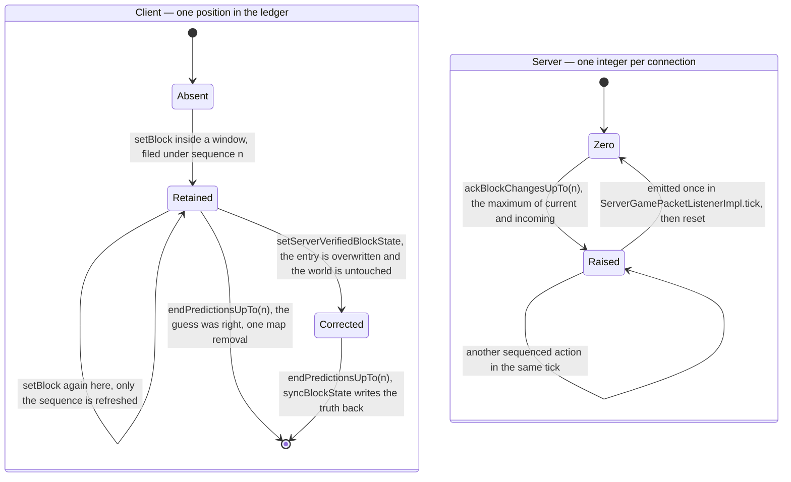
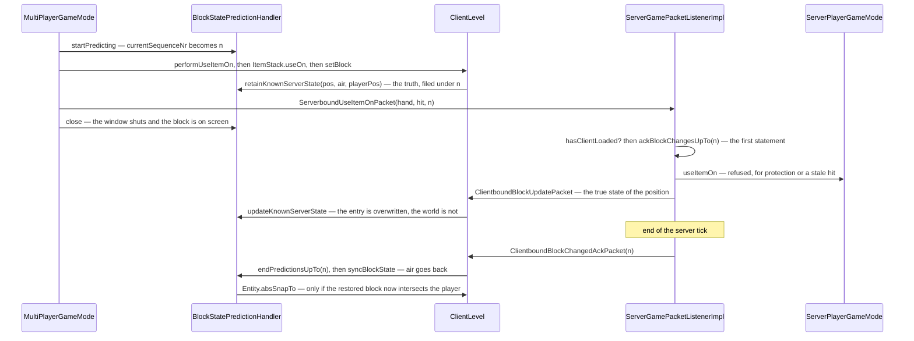

# Prediction and acknowledgement

> Verified against **Minecraft 26.2** · Part X · a block placed against a wall the server will not allow: the client shows it, the server refuses it, and a numbered receipt decides when the lie ends.

The client cannot wait a round trip to show you the block you just placed, so
it places it locally and tells the server afterwards. Everybody who has
described this system has described it as a rollback: the client guesses, the
server judges, the ack says yes or no. That is not what happens.
**`ClientboundBlockChangedAckPacket` is a receipt for a number, not a verdict
on an action.** It is sent for actions the server refused exactly as it is
sent for actions it allowed, and for an aborted dig it is sent carrying zero.
What makes the system correct is an ordering rule instead: any correction the
server intends travels in the same tick and *earlier in the stream* than the
receipt for it.

Part V's [block interaction](../blocks/block-interaction.md) and [block
breaking](../blocks/block-breaking.md) are the two applications, and both
carry the same four-sentence statement of that contract. This page is the
machinery underneath: one ledger per level, one counter per connection, six
windows in which a prediction can be opened, and three writes that between
them decide whether the world moves.

## The cast

| class | what it decides | thread |
|---|---|---|
| `MultiPlayerGameMode` | when a prediction window opens, and what goes in it | Render thread |
| `BlockStatePredictionHandler` | the ledger: what was there before, under which sequence number | Render thread |
| `ClientLevel` | the three writes — the prediction, the absorbed correction, the settle | Render thread |
| `PredictiveAction` | a one-method interface: given the sequence, produce the packet | Render thread |
| `ServerGamePacketListenerImpl` | one integer per connection, and when it is emitted | Server thread |
| `ServerPlayerGameMode` | the authoritative version of the same action | Server thread |

## Two state machines, running against each other

The whole mechanism is one small state machine on each side, and neither
knows the other's state. The client's runs per *position*; the server's runs
per *connection*.

Read the two columns as running at different rates. The client's machine
advances several times per tick, once per position touched. The server's
advances on every sequenced packet and *empties* once per connection tick,
which is why five sequenced actions in one tick produce one receipt carrying
the highest number, and why one ack can drive a dozen positions out of the
ledger at once.

Note what the diagram does not contain: any transition on which the server
says *no*. There is none. Both of the client's exit transitions are driven by
the same packet.

## The three writes

Everything the ledger does happens through three methods on `ClientLevel`,
and the difference between them is the whole mechanism.

**`ClientLevel.setBlock`** — the ordinary write. While a prediction is open,
and only if the write succeeded, it calls
`BlockStatePredictionHandler.retainKnownServerState` with the state that was
there *before*. If the position already has an entry, only the sequence is
refreshed: the ledger keeps the **first** pre-change state it ever saw for
that position, and the player position recorded with it.

**`ClientLevel.setServerVerifiedBlockState`** — every inbound block update
goes through here. If the position is in the ledger it overwrites the entry
and the world is not touched, so the prediction stays on screen. If it is
**not** in the ledger — the common case, for blocks the player did not touch
— it writes the world immediately. The absorption is per position, not per
packet.

**`ClientLevel.syncBlockState`** — the settle. Applies the recorded state
only if it differs from what is there, with flags `Block.UPDATE_NEIGHBORS`
plus `Block.UPDATE_CLIENTS` plus `Block.UPDATE_KNOWN_SHAPE`. That third flag
suppresses the shape pass, and neighbour updates are inert on the client
anyway — so the restore is a bare state write plus a remesh. **The cascade
that produced the prediction does not re-run on the way back.**
Reconciliation is correct only because every position the cascade touched got
its own ledger entry on the way out.

## A placement the server refuses

The state diagram says what the states are; this says what order the packets
arrive in, which is the part correctness actually rests on.

The ack is recorded **before** the action is attempted, so by the time the
refusal happens the receipt is already promised. The correction is an
ordinary block update that the ledger absorbs rather than applies. The settle
is what finally moves the world, and it is a no-op when the prediction was
right. And the snap only happens when the restored block turns out to be
inside the player.

The ordering is not the same for every packet, and the difference is
deliberate. `ServerGamePacketListenerImpl.handleUseItemOn` and
`ServerGamePacketListenerImpl.handleUseItem` record the ack as their first
statement; `ServerGamePacketListenerImpl.handlePlayerAction` records it
**after** running the break action, which is why the correction from a
refused break is always ahead of its receipt in the stream.

## The six windows

A window is a few microseconds long and entirely synchronous: on the client
thread, inside one call from `Minecraft.tick`. The counter is raised, the
local effect runs, the packet is built with the new sequence and sent, and the
window closes — in that order, so the packet is constructed while the ledger
is still recording. `MultiPlayerGameMode.startPrediction` is the private
method all six go through, and `ClientLevel.getBlockStatePredictionHandler`
is package-private, so nothing outside `client/multiplayer` can reach the
ledger at all.

| where | what it predicts locally | what it sends |
|---|---|---|
| `MultiPlayerGameMode.startDestroyBlock`, creative | the block removed at once | `ServerboundPlayerActionPacket` START |
| `MultiPlayerGameMode.startDestroyBlock`, survival | `BlockBehaviour.attack`, then removal if the block breaks instantly | START |
| `MultiPlayerGameMode.continueDestroyBlock`, creative | removal, every five ticks | START |
| `MultiPlayerGameMode.continueDestroyBlock`, at full progress | removal | STOP |
| `MultiPlayerGameMode.useItemOn` | `MultiPlayerGameMode.performUseItemOn` — the block's hook, the empty-hand hook, `ItemStack.useOn` | `ServerboundUseItemOnPacket` |
| `MultiPlayerGameMode.useItem` | `ItemStack.use`, including a transformed held item | `ServerboundUseItemPacket` |

So the ledger covers rather more than "blocks the player placed or broke": it
covers **every** `ClientLevel.setBlock` performed inside one of those windows.
That includes the second half of a door, every position a shape cascade
revisits, and — the only case of its own — `RedStoneOreBlock.attack`, whose
lighting change is not side-gated and therefore files a ledger entry when you
merely left-click redstone ore.

## What the ledger does not cover

Half the value of this page is the list of things people assume it handles.
`MultiPlayerGameMode`'s non-predicting verbs are the giveaway:
`MultiPlayerGameMode.attack`, `MultiPlayerGameMode.interact`,
`MultiPlayerGameMode.stopDestroyBlock`,
`MultiPlayerGameMode.releaseUsingItem`,
`MultiPlayerGameMode.piercingAttack` and every container verb open no window
at all.

- **Breaking progress.** `MultiPlayerGameMode.destroyProgress` and its
  companions are a plain parallel clock with no sequence and no
  reconciliation; the crack overlay is written straight into the client
  level. Only the final removal is predicted.
- **Item use.** `MultiPlayerGameMode.useItem` opens a window, but a consumed
  item, a started use and a cooldown are not block states and the ack does
  nothing for them. They are corrected by other means: the living-entity
  flags in synched data, `ClientboundCooldownPacket`, and the menu resend the
  server performs when the stack changed.
- **Dropping.** `LocalPlayer.drop` predicts the removal from the selected
  slot and sends its action packet with sequence **zero** — a local mutation
  with no rollback path at all.
- **Movement.** Rubber-banding is a different mechanism entirely: an
  id-matched teleport handshake with no sequence and no ledger, described in
  [input to movement](../player/input-to-movement.md). The two systems touch
  at exactly one point — `ClientPacketListener.handleMovePlayer` calls
  `BlockStatePredictionHandler.onTeleport`, so a teleport disarms the
  ledger's position snap.

## Questions players ask

**Why does the block come back and then vanish again?** You released the
mouse below the server's progress threshold. That changes no block on the
server that tick but is still acknowledged, so the client settles the entry,
restores the stone, and the block reappears — until the server's own delayed
destroy completes and broadcasts air.

**Why did that ack arrive with a zero in it?** The three-argument
`ServerboundPlayerActionPacket` constructor defaults the sequence to zero,
and aborting a dig uses it. The server dutifully sends
`ClientboundBlockChangedAckPacket` carrying zero, which settles nothing —
`BlockStatePredictionHandler.startPredicting` pre-increments, so the first
real sequence is one and no genuine prediction is ever numbered zero.

**Can a wrong guess get stuck on screen forever?** Yes. There is no timeout
and no cap: nothing clears the ledger except a settle, and while the server
considers the client not yet loaded, sequenced packets are dropped *before*
the ack is recorded. Predictions accumulate and the client's guess stands.
The only reset is a new `ClientLevel`.

**Does one ack do one thing?** It does four. For each entry at or below the
acknowledged sequence: nothing; remove the entry and leave the world alone
(the correct prediction); write the state; or write the state and snap the
player. A single ack can produce all four across the map in one pass. And
`BlockStatePredictionHandler.lastTeleportSequence` is compared against the
*acknowledged* sequence rather than each entry's, and is never reset, so one
teleport suppresses a whole batch of snaps.

**Why can I not right-click while mining?** `Minecraft.startUseItem` is gated
on `MultiPlayerGameMode.isDestroying`. Spectators are the odd case in the
other direction and are asymmetric about it:
`MultiPlayerGameMode.useItem` returns early, before the window opens, while
`MultiPlayerGameMode.useItemOn` returns *inside* it — so the sequence is
burned and the packet is sent anyway.

One last asymmetry worth carrying away: the outbound write and the inbound
restore use different flags. The predicted removal in
`MultiPlayerGameMode.destroyBlock` writes with `Block.UPDATE_IMMEDIATE` in
the mix; the restore writes with `Block.UPDATE_KNOWN_SHAPE`. One cascades,
the other deliberately does not.

## Where to look

`MultiPlayerGameMode.startPrediction` — the whole client side is that one
private method and its six call sites. `BlockStatePredictionHandler` end to
end; it is under a hundred lines and every one of them matters, including
`BlockStatePredictionHandler.currentSequence`,
`BlockStatePredictionHandler.isPredicting` and
`BlockStatePredictionHandler.close`. `ClientLevel.setBlock`,
`ClientLevel.setServerVerifiedBlockState` and `ClientLevel.syncBlockState`
for the three writes. `ServerGamePacketListenerImpl.ackBlockChangesUpTo` and
`ServerGamePacketListenerImpl.tick` for the receipt — the field and the
method that raises it share a name.

---

*Rules: names, never code · how the system works, not how the code reads ·
newest version only · every backticked name passes `tools/verify_names.py`.*
