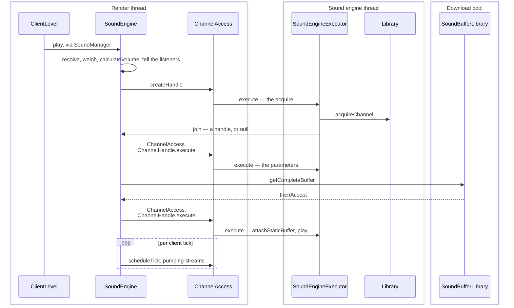

# Sound: the engine

> Verified against **Minecraft 26.2** · Part X · a block placed near you: from a packet on the client's Render thread to an OpenAL source, across four of the five threads that take part and one hop the sound cannot skip.

`SoundEngine.play` never starts a sound. It resolves the name, picks a
variant, tells the subtitle overlay, computes the volume and asks for a
channel — and then posts *attach buffer, play* as a task on another thread.
Even when the decoded audio is already in the cache, **a sound always starts
at least one hop after the packet that asked for it**, because the engine has
no path that calls `Channel.play` itself. Preloading removes the decode from
that latency; it does not remove the hop.

This page is the machine: the five threads that take part, the borrowed
OpenAL source, the buffer that arrives afterwards, and the arithmetic that
decides how loud it is. What *decides that a sound should happen at all* —
and the fact that most world sounds are not named on the wire — is [what
makes a sound happen](what-makes-a-sound.md).

OpenAL is touched **only** inside `com/mojang/blaze3d/audio`, plus
`NativeLibrariesBootstrap`, which loads the native library. Nothing in
`client/sounds` makes an AL call itself: it calls into that wrapper, and
everything outside calls `SoundManager.play` and forgets.

## The cast

| class | what it decides | thread |
|---|---|---|
| `SoundManager` | the loaded `sounds.json` map, and the public front door | Render thread |
| `SoundEngine` | which instances are playing, how loud, and what to drop | Render thread |
| `SoundInstance` | one playing-or-wanting-to-play sound: position, pitch, looping, attenuation | Render thread |
| `SoundEngineExecutor` | one daemon thread with a task queue in front of it — where a *per-source* AL call is made | Sound engine |
| `ChannelAccess` | acquiring, configuring and releasing a channel, as tasks | posts to Sound engine |
| `Library` | the OpenAL device, context, listener and channel limits | Render thread opens it |
| `SoundBufferLibrary` | decoded `.ogg` data, cached per path | Download pool |
| `AbstractDeviceTracker` | noticing that the default device changed | IO-Worker, plus OpenAL's own callback |

## Five threads, and one the game does not own

The page is mostly about which thread does what, so it is worth having the
list before the trace.

| thread | its part in a sound |
|---|---|
| **Server** | decides a sound happens, computes who is in range, sends packets. Never audio. |
| **Render** (the client game thread) | receives the packet, builds a `SoundInstance`, calls `SoundManager.play`. Also everything OpenAL that is *not* per-source: opening and closing the device and context, resetting the `Listener`, deleting buffers. |
| **Sound engine** | every per-source AL call while the game is running: channel acquisition, parameter setting and release through `ChannelAccess`, plus the listener transform, which `SoundEngine.updateSource` posts to the executor directly. The two bulk teardowns are the exception, and they run after this thread is gone. |
| **`Util.nonCriticalIoPool`** (the *Download-* threads) | reads and decodes `.ogg` files with `JOrbisAudioStream` into a `SoundBuffer`, inside `SoundBufferLibrary.getCompleteBuffer`. |
| **`Util.ioPool`** (the *IO-Worker-* threads) | device enumeration — `AbstractDeviceTracker.tick` dispatches `DeviceList.query` there, so the periodic poll of the ALC device list does not stall a frame. A forced refresh still queries on the Render thread. |

And one the game does not own: OpenAL Soft's own event-callback thread,
which invokes the callback `CallbackDeviceTracker` installs to notice that
the default device changed.

Four of those five are on the path of a single sound; `Util.ioPool` is the odd
one, polling the device list beside the trace rather than inside it. Where
each sits among the rest of the game's is [the
threads](../../reference/threads.md#the-threads-a-lecture-leans-on).

The Render thread's two cadences, both set by [the client
loop](the-client-loop.md#what-a-tick-is-in-order): once per client tick
`Minecraft.tick` calls `MusicManager.tick` and then `SoundManager.tick`, which walks the ticking
sounds, updates positions and volumes, releases finished channels and drains
the delayed queue; once per *frame* `Minecraft.runTick` calls
`SoundManager.updateSource` with the camera.

## A block is placed near you

The packet has arrived and `ClientLevel.playSeededSound` has taken it — that
half of the story is [what makes a sound
happen](what-makes-a-sound.md#the-three-doors). What this figure shows is
everything after: four objects on the Render thread, one on a download thread,
and the boundary every per-source OpenAL call has to cross.

*Every arrow that crosses into the right-hand box is a task queued, not a call
made: `ChannelAccess` never touches OpenAL itself. The one arrow coming back is
the join on `ChannelAccess.createHandle`'s future — the only place in this trace the Render
thread waits.*

Read the three `ChanA->>SEE` arrows as one shape. The Render thread reaches the
sound thread three times for one sound, and the third of them — attach and
play, posted from inside the buffer future's continuation — is the hop this
page opens with.

The four beats worth narrating.

**The name is resolved, in an order you can hear.** The instance's
`Identifier` is looked up in the `SoundManager` registry for a
`WeighedSoundEvents`, and `WeighedSoundEvents.getSound` rolls the weighted
choice — following event-to-event redirects — to a concrete `Sound`. Then, in
this order: the unknown-event and empty-sound cases return early; the volume
is computed; every registered `SoundEventListener` is told; and only *then* is
a zero-volume sound abandoned. So a sound whose
category is muted still produces a **subtitle**, and a sound with no
`sounds.json` entry does not. `SubtitleOverlay` is the only
`SoundEventListener` in the game, and that ordering is what it is for.

**A channel is borrowed, on the sound thread.**
`ChannelAccess.createHandle` posts a task to the `SoundEngineExecutor`; on
that thread `Library` generates a new OpenAL source, provided the static or
streaming limit — chosen by `Sound.shouldStream` — has room. The Render
thread *blocks* on that future and gets a handle or null; null means the sound
is silently dropped. This is one of exactly two places the Render thread ever
waits on the sound thread, and much the shorter; the other is teardown, two
sections below.

**Parameters go first, data arrives later.**
`ChannelAccess.ChannelHandle.execute` posts the
pitch/volume/attenuation/position setup, while
`SoundBufferLibrary.getCompleteBuffer` returns a future for the decoded
buffer. When that completes, its continuation posts *attach buffer, play* to
the sound thread. That second post is the hop this page opens with.
`Sound.shouldPreload` and `SoundEngine.requestPreload` remove the decode from
the latency, not the hop.

**Streams are pumped by the tick.** Long sounds — music, records — are
streamed: `Channel.attachBufferStream` queues
`Channel.QUEUED_BUFFER_COUNT` buffers of `Channel.BUFFER_DURATION_SECONDS`
each, four seconds in all, and `ChannelAccess.scheduleTick`, posted once per
client tick from `SoundEngine.tick`, calls `Channel.updateStream` on each to
refill. The same pass releases channels whose source reports stopped.

## The channel limits are counters, not pools

`Library` asks the device how many mono sources it offers, falling back to
`Library.DEFAULT_CHANNEL_COUNT` — thirty. The streaming limit is the square
root of that, clamped between two and eight; the static limit is a *clamped*
remainder, floored at eight and capped at 255, so it is not simply "the
rest". Sources are generated on acquire and deleted on release: one OpenAL
source per playing sound, and when a limit is reached new sounds are dropped
rather than queued. **The game does not steal channels by priority.**

Nor does muting free one. `SoundEngine.refreshCategoryVolume` pushes the new
volume to every playing channel of that category and stops nothing, so a
looping sound muted to zero holds its OpenAL source until it ends on its own.
Muting suppresses *new* allocations; it does not reclaim old ones. The
OpenAL source itself, though, goes back the moment the channel reports
stopped: `ChannelAccess.scheduleTick` releases it with no lifetime gate at
all. `SoundEngine.MIN_SOURCE_LIFETIME` holds something else for twenty ticks
— the engine's *bookkeeping* entry for the instance, long after the source it
named has been deleted.

`SoundEngine.queuedSounds` is the one of its fields worth naming here, because
it is what the trace has not shown: a sound can be *delayed* rather than played,
and `SoundEngine.tick` drains that queue once per client tick. Two things put
a sound in it — a distance delay, which is [what makes a sound
happen](what-makes-a-sound.md#who-hears-it), and a manual loop, three
paragraphs below. Beside it `SoundEngine.instanceToChannel`,
`SoundEngine.instanceBySource`, `SoundEngine.tickingSounds`,
`SoundEngine.gainBySource` and `SoundEngine.soundBuffers` are the bookkeeping.
`SoundEngine.play` returns a `SoundEngine.PlayResult` — started, started
silently, or not started — and `SoundManager.play` passes it through;
`MusicManager` is the only caller that reads it.

## Volume, looping, and the attenuation everyone explains wrongly

`SoundEngine.calculateVolume` multiplies the instance's own volume, the
options volume (`Options.getFinalSoundSourceVolume`, itself category times
master) and the runtime gain in `SoundEngine.gainBySource`. The third exists
so that `MusicManager` can fade a category without touching the player's
slider — which is why the music slider and the music *fade* are two different
numbers.

A computed volume of zero is abandoned **unless it is music**:
`SoundEngine.play` drops it only when the instance does not say
`SoundInstance.canStartSilent` *and* the category is not
`SoundSource.MUSIC`. Music always starts, silently if need be, which is how a
track fades in from nothing.

Looping happens three different ways. Static sounds loop in OpenAL, with
`Channel.setLooping`. Streamed sounds loop by wrapping the decoder in a
`LoopingAudioStream`, since the source only ever holds a few seconds. And a
looping instance *with a delay* is looped manually —
`SoundEngine.shouldLoopManually` — by re-queueing it into
`SoundEngine.queuedSounds` when its channel stops.

The third thing in this section is attenuation, and the obvious explanation of
it is wrong. UI sounds do not attenuate because of their **attenuation**, not
their relativity: `SimpleSoundInstance.forUI` sets both
`SoundInstance.Attenuation.NONE` and the relative flag, and it is the former
that makes the engine call `Channel.disableAttenuation`. A relative sound
offset from the listener would still fall off.

## The instance family, and the decode stack

`SoundInstance` lives in `client/resources/sounds` and carries event, source,
volume, pitch, position, looping, relative and attenuation.
`SimpleSoundInstance` is a one-shot at a point; `EntityBoundSoundInstance`
follows an entity; the `TickableSoundInstance` subclasses —
`AbstractTickableSoundInstance`, minecarts, elytra, bees, ambient loops —
re-evaluate themselves every tick.

Below the engine, `com/mojang/blaze3d/audio` is the OpenAL wrapper: `Library`
(device, context, listener, channel limits), `Channel` (one source),
`SoundBuffer` (one buffer), `Listener` (the ear, set from a
`ListenerTransform`), `DeviceList`, and the device-tracker family
(`AbstractDeviceTracker`, `CallbackDeviceTracker`) that notices headphones
being unplugged.

The decode stack is three interfaces deep: `AudioStream`, then
`FiniteAudioStream`, then `FloatSampleSource`, with `ChunkedSampleByteBuf`
assembling the samples and `JOrbisAudioStream` — JOrbis, a Java Vorbis
decoder — as the one real implementation. `LoopingAudioStream` wraps any of
them.

## The sound thread is not the mixer, and the device is not its

Two things about that thread are assumed the wrong way round often enough to
be worth stating flatly.

**It does not mix.** `SoundEngineExecutor` does nothing but run tasks; OpenAL,
the native library, does the mixing on threads of its own that no Java code
ever sees. The Java thread exists only so that per-source AL calls are
*serialised*, and almost all of them go through it. The exceptions are the two
bulk teardowns, `ChannelAccess.clear` and `Library.cleanup`, which release
handles directly on the Render thread — safely, because by then the sound
thread has already been joined.

**It does not own the device.** Opening and closing the device and context,
resetting the listener and deleting buffers all happen on the Render thread,
and teardown happens deliberately **after** `SoundEngineExecutor.shutDown` has
joined the sound thread. That join is the longer of the two places the Render
thread blocks on the sound thread, and `SoundEngine.stopAll` is where it
happens; the channel acquisition four sections above is the shorter.

What a device has to offer before any of this starts is exactly three things,
and `Library.init` throws rather than degrade if one is missing: an ALC of 1.1
or newer, the *AL_EXT_source_distance_model* extension and the
*AL_EXT_LINEAR_DISTANCE* extension. Everything beyond those it can do without —
HRTF is taken only when the device offers *ALC_SOFT_HRTF* **and**
`Options.directionalAudio` is on, and disconnection notices only when the
device has *ALC_EXT_disconnect*, which is what makes hot-plugging work on some
machines and not others.

## Questions players ask

**Why does sound cut out when I plug in headphones?** Because reload is
destroy-and-rebuild, and it arrives from three different doors. The [resource
reload](../foundations/resource-system.md#apply-registration-order) arrives as
`SoundManager.apply`, which ends by reloading the engine;
`SoundManager.reload` is the *options* path, taken when the audio device is
changed; and `SoundEngine.tick` reloads itself when the device tracker reports
the default device changed. All three tear the OpenAL context down in
`Library.cleanup` and call `SoundEngine.loadLibrary` again.

**Why is there no sound for the first few frames of a world?**
`SoundEngine.updateSource` posts a `ListenerTransform` — position, forward,
up — from the `Camera` every frame, and it no-ops until
`Camera.isInitialized`. The same is true again after
`GameRenderer.resetData`. And the ear is always one frame stale:
`Minecraft.runTick` posts the transform *before* it renders, and the camera
is only advanced inside the frame, so the ear is where the eye was last
frame. At 60 fps nobody hears it — but it is worth knowing before blaming
OpenAL.

**Does pausing stop everything?** No: `SoundManager.pauseAllExcept` leaves
`SoundSource.MUSIC` and `SoundSource.UI` running, and
`SoundEngine.tickMusicWhenPaused` is the pause-menu tick.

## Where to look

`SoundEngine.play` — the whole resolution-and-dispatch order is one method,
and the early returns in it are audible. `ChannelAccess` and
`ChannelAccess.ChannelHandle` for how a per-source call becomes a task, and
`SoundEngineExecutor` for the thread it becomes a task on.
`SoundEngine.calculateVolume` for the three factors, `Library.init` for the
limits and the device requirements, `SoundBufferLibrary.getCompleteBuffer`
for the decode, and `SoundEngine.tick` for the once-a-tick sweep.

---

*Rules: names, never code · how the system works, not how the code reads ·
newest version only · every backticked name passes `tools/verify_names.py`.*
