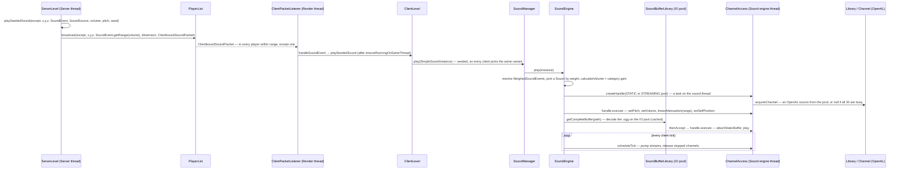

# Sound

> Verified against **Minecraft 26.2** · Part X · A block breaks near you and you hear it: from `Level.playSound` on the server to an OpenAL source on the Sound engine thread.

## Responsibility

The sound system turns *events* ("a stone block broke at this position") into
*audio* (a decoded `.ogg` playing on an OpenAL source at a volume that falls
off with distance from the camera). It is entirely client-side: the server
never decodes, mixes or knows what a sound *is* beyond an `Identifier` and a
range. It is also the smallest complete system in the game — one resource
loader, one engine, one thread, one native library — which is why it is the
first system after Anatomy.

The one sentence a player recognises: *the server says "play this here", the
client decides whether you can hear it.*

## The data it owns

- **`SoundEvent`** (in `net/minecraft/sounds`, shared) is a record of an `Identifier` and an
  optional fixed range. `SoundEvents` is the 2,000-line static registry of
  every one the game defines. It is a *name*, not a file.
- **`SoundSource`** is the volume category — `SoundSource.MASTER`, `SoundSource.MUSIC`, `SoundSource.BLOCKS`,
  `SoundSource.HOSTILE`, `SoundSource.PLAYERS`, `SoundSource.AMBIENT`, `SoundSource.VOICE`, `SoundSource.UI`… — each an options slider.
- **`sounds.json`**, one per namespace in every resource pack, maps a sound
  event name to a `SoundEventRegistration`: a weighted list of `Sound` entries
  (a file, or a redirect to another event — the `Sound` type enum), each with volume,
  pitch, weight, attenuation distance, and whether to *stream* rather than
  load whole. `SoundManager` owns the loaded form, a map of `Identifier` →
  `WeighedSoundEvents`, rebuilt on every resource reload.
- **`SoundInstance`** (`client/resources/sounds`) is one *playing or wanting
  to play* sound: event, source, volume, pitch, position, looping, relative,
  attenuation. `SimpleSoundInstance` is a one-shot at a point;
  `EntityBoundSoundInstance` follows an entity; `TickableSoundInstance`
  subclasses (`AbstractTickableSoundInstance`, minecarts, elytra, bees,
  ambient loops) re-evaluate themselves every tick.
- **`SoundEngine`** owns the runtime state: which instances are playing
  (`SoundEngine.instanceToChannel`), grouped by source (`SoundEngine.instanceBySource`), delayed
  (`SoundEngine.queuedSounds`) and ticking (`SoundEngine.tickingSounds`); the per-category gains; the
  `SoundBufferLibrary` cache of decoded buffers; and the `Library`, which owns
  the OpenAL device, context and the source pools.
- **`com/mojang/blaze3d/audio`** is the OpenAL wrapper: `Library` (device,
  context, listener, channel pools), `Channel` (one OpenAL source),
  `SoundBuffer` (one OpenAL buffer), `Listener` (the ear — position and
  orientation), and a `DeviceTracker` that notices headphones being unplugged.

Nothing outside `client/sounds` touches OpenAL. Everything else calls
`SoundManager.play` and forgets.

## When it runs

Four threads take part, and the page is mostly about which does what.

- **Server thread**: decides a sound happens (`ServerLevel.playSeededSound`),
  computes who is in range, sends packets. Never audio.
- **Render thread** (the client game thread): receives the packet, builds a
  `SoundInstance`, calls `SoundManager.play` → `SoundEngine.play`. Once per
  client tick `Minecraft.tick` calls `SoundManager.tick`, which walks the
  ticking sounds, updates positions and volumes, and expires finished
  channels; once per *frame* `Minecraft.runTick` calls
  `SoundManager.updateSource` with the camera so the listener moves smoothly.
  `MusicManager.tick` also runs here, choosing and fading background music.
- **Sound engine thread**: a `SoundEngineExecutor`, which is a
  `BlockableEventLoop` — the same event-loop pattern as the server thread —
  wrapped around a single daemon thread named "Sound engine". *Every* OpenAL
  call is a task on this executor, submitted through `ChannelAccess`. The
  Render thread never calls OpenAL itself.
- **`Util.nonCriticalIoPool`** (the "Download-" threads): reads and decodes
  `.ogg` files (`JOrbisAudioStream`, a Java Vorbis decoder) into a
  `SoundBuffer`, inside `SoundBufferLibrary.getCompleteBuffer`; the result
  is a `CompletableFuture` that, on completion, schedules the "attach and
  play" task onto the sound thread.

## The trace: a block breaks and you hear it

Narrated:

1. **The server picks who hears it.** `ServerLevel.playSeededSound` asks
   `SoundEvent.getRange` for the audible radius — a fixed range if the event
   declares one, otherwise 16 blocks scaled up by volumes above 1 — and
   `PlayerList.broadcast` sends `ClientboundSoundPacket` to every player in
   that dimension within range, *skipping the* except *player*. The seed
   travels in the packet so that all clients pick the same random variant
   and pitch.
2. **The client receives it on the game thread.**
   `ClientPacketListener.handleSoundEvent` goes through
   `PacketUtils.ensureRunningOnSameThread` (see Anatomy) and calls
   `ClientLevel.playSeededSound`, which builds a `SimpleSoundInstance` and
   hands it to `SoundManager.play`.
3. **`SoundEngine.play` resolves the name to a file.** The instance's
   `Identifier` is looked up in the `SoundManager` registry to get a
   `WeighedSoundEvents`; `WeighedSoundEvents.getSound` rolls the weighted
   choice (following event-to-event redirects) to a concrete `Sound`; volume is
   multiplied by the category gain and the master gain; a zero volume returns
   early with *not started* rather than occupying a channel. Any registered
   `SoundEventListener` is told first — `SubtitleOverlay` is the only one,
   which is how subtitles work.
4. **A channel is borrowed on the sound thread.** `ChannelAccess.createHandle`
   posts a task to the `SoundEngineExecutor`; on that thread `Library`
   acquires a `Channel` from the static or streaming pool (chosen by
   `Sound.shouldStream`). The Render thread *blocks* on that future — the one
   place the game thread waits on the sound thread — and gets a
   channel handle, or null when every source is in use, in which case the
   sound is silently dropped.
5. **Parameters are set, then the data arrives later.** The handle's
   `ChannelAccess.execute` posts the pitch/volume/attenuation/position setup; separately,
   `SoundBufferLibrary.getCompleteBuffer` returns a future for the decoded
   buffer (cached per path; decoding runs on `Util.nonCriticalIoPool`). When
   the buffer is ready its continuation posts "attach buffer, play" to the
   sound thread. A sound therefore starts one or two frames after the packet,
   never on the frame it arrives, unless the buffer is already cached — which
   is what `Sound.shouldPreload` and `SoundEngine.requestPreload` are for.
6. **Streams are pumped by the tick.** Long sounds (music, records) are
   streamed: `Channel.attachBufferStream` queues a few seconds of decoded
   audio, and `ChannelAccess.scheduleTick`, posted once per client tick from
   `SoundEngine.tick`, calls `Channel.updateStream` on each to refill. The
   same pass releases channels whose source reports stopped.
7. **The listener follows the camera.** `SoundEngine.updateSource` posts a
   `ListenerTransform` (position, forward, up) from the `Camera` to the sound
   thread every frame; OpenAL does the distance attenuation and panning from
   there. `SoundInstance.isRelative` sounds (UI clicks) are positioned
   relative to the listener instead, so they never attenuate.

## Interfaces

- **Called by:** anything with a `Level` — blocks, entities, items — through
  `Level.playSound`; `PlaySoundCommand`; `MusicManager` for music; the
  ambient handlers in `client/resources/sounds` (`BiomeAmbientSoundsHandler`,
  `UnderwaterAmbientSoundHandler`, `BubbleColumnAmbientSoundHandler`) for
  loops that exist only on the client.
- **Calls into:** `com/mojang/blaze3d/audio` → LWJGL's OpenAL bindings;
  `JOrbisAudioStream` → JOrbis for Vorbis decoding; the resource system for
  `sounds.json` and the `.ogg` files.
- **Crosses the network as:** `ClientboundSoundPacket` (a point in space),
  `ClientboundSoundEntityPacket` (attached to an entity, handled by
  `ClientPacketListener.handleSoundEntityEvent`), `ClientboundStopSoundPacket`
  (`/stopsound`). All clientbound. There is no serverbound sound packet: the
  server infers what you did from other packets and *tells others* about the
  sound.
- **Data-driven by:** `sounds.json` (resource packs, so the client's own),
  the `Registries.SOUND_EVENT` registry (static; data packs cannot add sound events, only
  reference them), and `options.txt` for category volumes, device, and HRTF.

## Invariants and surprises

- **Your own sounds are predicted, not received.** `Player.playSound` calls
  `Level.playSound` with itself as the *except* entity. On the server that broadcasts to
  everyone *but* you; on the client, `ClientLevel.playSeededSound` sees
  `except == Minecraft.player` and plays it locally at once. So the sound of
  your own footsteps, hits and block breaks never round-trips — and a
  laggy connection delays what you hear of others, never of yourself.
  `LocalPlayer.playSound` goes further and calls `ClientLevel.playLocalSound`
  directly.
- **The sound thread is an event loop, not a mixer.** `SoundEngineExecutor`
  does nothing but run tasks; OpenAL (the native library) does the mixing on
  its own threads. The Java thread exists only so that AL calls are
  serialised and never made from the Render thread.
- **Thirty sources, split by square root.** `Library` asks the device how many
  mono sources it offers (default 30), gives clamp(√n, 2, 8) of them to the
  streaming pool and the rest to the static pool. When a pool is empty new sounds
  are dropped, not queued; the game does not steal channels by priority.
- **Volume zero is not played.** `SoundEngine.play` returns *not started* for
  a computed volume of 0 unless the instance says `SoundInstance.canStartSilent` — which is
  why ticking sounds that fade in must opt in, and why muting a category
  frees its channels rather than playing silence.
- **Looping is two mechanisms.** Static sounds loop in OpenAL
  (`Channel.setLooping`); streamed sounds loop by wrapping the decoder in a
  `LoopingAudioStream`, since the source only ever holds a few seconds.
- **Attenuation is linear and per-sound.** `SoundInstance.getAttenuation` is
  linear or none; the distance is `Sound.getAttenuationDistance` (16 by
  default, from `sounds.json`) scaled by volume. The server's *range* and the
  client's *attenuation* are computed separately from the same numbers — a
  sound can be sent and inaudible, or (with a resource pack) audible beyond
  where the server would send it.
- **Reload is destroy-and-rebuild.** `SoundManager.reload` and
  `SoundEngine.reload` stop everything, tear down the OpenAL context in
  `Library.cleanup`, and `SoundEngine.loadLibrary` again. Changing the output device in
  options, or the `DeviceTracker` noticing a device change, takes the same
  path — so sounds cut out for a moment when you plug in headphones.

## Where to look

`SoundManager` · `SoundEngine` · `SoundInstance` · `SimpleSoundInstance` ·
`EntityBoundSoundInstance` · `WeighedSoundEvents` · `Sound` ·
`SoundEngineExecutor` · `ChannelAccess` · `SoundBufferLibrary` ·
`JOrbisAudioStream` · `Library` · `Channel` · `Listener` · `MusicManager` ·
`ServerLevel.playSeededSound` · `PlayerList.broadcast` ·
`ClientboundSoundPacket`
