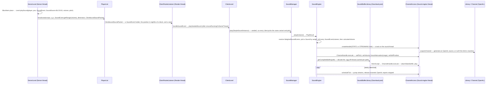

# Sound

> Verified against **Minecraft 26.2** · Part X · A block is placed near you and you hear it: from `Level.playSound` on the server to an OpenAL source on the Sound engine thread — and the larger, quieter path that plays a sound the server never named.

## Responsibility

The sound system turns *events* ("a stone block was placed at this position")
into *audio* (a decoded `.ogg` playing on an OpenAL source at a volume that
falls off with distance from the camera). It is entirely client-side: the
server never decodes, mixes or knows what a sound *is* beyond an `Identifier`
and a range. It is also the smallest complete system in the game — one
resource loader, one engine, one native library — which is why it is the
first system after Anatomy.

The one sentence a player recognises: *the server says "play this here", the
client decides whether you can hear it.*

## The data it owns

- **`SoundEvent`** (in `net/minecraft/sounds`, shared) is a record of an `Identifier` and an
  optional fixed range. `SoundEvents` is the 2,000-line static registry of
  every one the game defines. It is a *name*, not a file.
- **`SoundSource`** is the volume category — `SoundSource.MASTER`,
  `SoundSource.MUSIC`, `SoundSource.RECORDS`, `SoundSource.WEATHER`,
  `SoundSource.BLOCKS`, `SoundSource.HOSTILE`, `SoundSource.NEUTRAL`,
  `SoundSource.PLAYERS`, `SoundSource.AMBIENT`, `SoundSource.VOICE`,
  `SoundSource.UI` — each an options slider. `SoundSource.RECORDS` is the
  jukebox slider and `SoundSource.WEATHER` the rain one; neither is
  `SoundSource.AMBIENT`, which is a common mistake to make from the options
  screen alone.
- **`sounds.json`**, one per namespace in every resource pack, maps a sound
  event name to a `SoundEventRegistration`: a weighted list of `Sound` entries
  (a file, or a redirect to another event — the `Sound.Type` enum), each with volume,
  pitch, weight, attenuation distance, and whether to *stream* rather than
  load whole. `SoundManager` owns the loaded form, a map of `Identifier` →
  `WeighedSoundEvents`, rebuilt on every resource reload.
- **`SoundInstance`** (`client/resources/sounds`) is one *playing or wanting
  to play* sound: event, source, volume, pitch, position, looping, relative,
  attenuation. `SimpleSoundInstance` is a one-shot at a point;
  `EntityBoundSoundInstance` follows an entity; `TickableSoundInstance`
  subclasses (`AbstractTickableSoundInstance`, minecarts, elytra, bees,
  ambient loops) re-evaluate themselves every tick.
- **`SoundEngine`** owns the runtime state: which instances are playing
  (`SoundEngine.instanceToChannel`), grouped by source (`SoundEngine.instanceBySource`), delayed
  (`SoundEngine.queuedSounds`) and ticking (`SoundEngine.tickingSounds`); the
  per-category runtime gains (`SoundEngine.gainBySource`, which is *not* the
  options volume — see below); the `SoundBufferLibrary` cache of decoded
  buffers (`SoundEngine.soundBuffers`); and the `Library`, which owns the
  OpenAL device, context and the channel limits. Every entry point returns a
  `SoundEngine.PlayResult` — started, started silently, or not started — and
  `SoundManager.play` passes it through; `MusicManager` is the only caller
  that reads it.
- **`com/mojang/blaze3d/audio`** is the OpenAL wrapper: `Library` (device,
  context, listener, channel limits), `Channel` (one OpenAL source),
  `SoundBuffer` (one OpenAL buffer), `Listener` (the ear — position and
  orientation, set from a `ListenerTransform`), `DeviceList` and the
  device-tracker family (`AbstractDeviceTracker`, `CallbackDeviceTracker`)
  that notice headphones being unplugged.
- **The decode stack** is three interfaces deep: `AudioStream` →
  `FiniteAudioStream` → `FloatSampleSource`, with `ChunkedSampleByteBuf`
  assembling the samples and `JOrbisAudioStream` the one real
  implementation (JOrbis, a Java Vorbis decoder). `LoopingAudioStream`
  wraps any of them.

OpenAL is touched **only** inside `com/mojang/blaze3d/audio` (plus
`NativeLibrariesBootstrap`, which loads the native library). Nothing in
`client/sounds` makes an AL call itself; it calls into that wrapper, and
everything outside calls `SoundManager.play` and forgets.

## When it runs

Five threads take part, and the page is mostly about which does what.

- **Server thread**: decides a sound happens (`ServerLevel.playSeededSound`),
  computes who is in range, sends packets. Never audio.
- **Render thread** (the client game thread): receives the packet, builds a
  `SoundInstance`, calls `SoundManager.play` → `SoundEngine.play`. Once per
  client tick `Minecraft.tick` calls `MusicManager.tick` and then
  `SoundManager.tick`, which walks the ticking sounds, updates positions and
  volumes, releases finished channels and drains the delayed queue; once per
  *frame* `Minecraft.runTick` calls `SoundManager.updateSource` with the
  camera. It also does everything OpenAL that is *not* per-source: opening
  and closing the device and context (`SoundEngine.loadLibrary`,
  `Library.cleanup`), resetting the `Listener`, and deleting buffers.
- **Sound engine thread**: a `SoundEngineExecutor`, which is a
  `BlockableEventLoop` — the same event-loop pattern as the server thread —
  wrapped around a single daemon thread named "Sound engine". Every
  *per-source* AL call is a task on this executor: channel acquisition,
  parameter setting and release through `ChannelAccess`, and the listener
  transform, which `SoundEngine.updateSource` posts to the executor directly
  rather than through `ChannelAccess`.
- **`Util.nonCriticalIoPool`** (the "Download-" threads): reads and decodes
  `.ogg` files (`JOrbisAudioStream`) into a `SoundBuffer`, inside
  `SoundBufferLibrary.getCompleteBuffer`; the result is a
  `CompletableFuture` that, on completion, schedules the "attach and play"
  task onto the sound thread.
- **`Util.ioPool`** (the "IO-Worker-" threads): device enumeration.
  `AbstractDeviceTracker.tick` dispatches `DeviceList.query` there so that
  polling the ALC device list never stalls a frame.

And one thread the game does not own: OpenAL Soft's own event-callback
thread, which is what invokes the callback `CallbackDeviceTracker` installs
to notice that the default device changed.

## The trace: a block is placed near you and you hear it

Narrated:

1. **The server picks who hears it.** `ServerLevel.playSeededSound` asks
   `SoundEvent.getRange` for the audible radius — a fixed range if the event
   declares one, otherwise 16 blocks scaled up by volumes above 1 — and
   `PlayerList.broadcast` sends `ClientboundSoundPacket` to every player in
   that dimension within range, *skipping the* except *player*. The seed
   travels in the packet so that all clients pick the same random variant
   and pitch. The position is quantised: `ClientboundSoundPacket.LOCATION_ACCURACY`
   is 8, so the wire carries three ints in eighths of a block.
2. **The client receives it on the game thread.**
   `ClientPacketListener.handleSoundEvent` goes through
   `PacketUtils.ensureRunningOnSameThread` (see Anatomy) and calls
   `ClientLevel.playSeededSound`, which builds a `SimpleSoundInstance` and
   hands it to `SoundManager.play`.
3. **`SoundEngine.play` resolves the name to a file.** The instance's
   `Identifier` is looked up in the `SoundManager` registry to get a
   `WeighedSoundEvents`; `WeighedSoundEvents.getSound` rolls the weighted
   choice (following event-to-event redirects) to a concrete `Sound`. Then,
   in this order: the unknown-event and empty-sound cases return early;
   every registered `SoundEventListener` is told; and only then is the
   volume computed and a zero-volume sound possibly abandoned. The ordering
   is audible in play — a sound whose category is muted still produces a
   subtitle; a sound with no `sounds.json` entry does not.
   `SubtitleOverlay` is the only `SoundEventListener` in the game, which is
   what that ordering is for.
4. **A channel is borrowed on the sound thread.** `ChannelAccess.createHandle`
   posts a task to the `SoundEngineExecutor`; on that thread `Library`
   generates a new OpenAL source, provided the static or streaming *limit*
   (chosen by `Sound.shouldStream`) has room. The Render thread *blocks* on
   that future — the shorter of the two places the game thread waits on the
   sound thread — and gets a channel handle, or null when the limit is
   reached, in which case the sound is silently dropped.
5. **Parameters are set, then the data arrives later.**
   `ChannelAccess.ChannelHandle.execute` posts the
   pitch/volume/attenuation/position setup; separately,
   `SoundBufferLibrary.getCompleteBuffer` returns a future for the decoded
   buffer (cached per path; decoding runs on `Util.nonCriticalIoPool`). When
   the buffer is ready its continuation posts "attach buffer, play" to the
   sound thread. **A sound always starts at least one hop after the packet**
   — even on a cache hit, because `SoundEngine.play` never calls
   `Channel.play` itself. `Sound.shouldPreload` and `SoundEngine.requestPreload`
   remove the decode from that latency, not the hop.
6. **Streams are pumped by the tick.** Long sounds (music, records) are
   streamed: `Channel.attachBufferStream` queues
   `Channel.QUEUED_BUFFER_COUNT` buffers of `Channel.BUFFER_DURATION_SECONDS`
   each — four seconds in all — and `ChannelAccess.scheduleTick`, posted once
   per client tick from `SoundEngine.tick`, calls `Channel.updateStream` on
   each to refill. The same pass releases channels whose source reports
   stopped.
7. **The listener follows the camera.** `SoundEngine.updateSource` posts a
   `ListenerTransform` (position, forward, up) from the `Camera` to the sound
   thread every frame; OpenAL does the distance attenuation and panning from
   there. It no-ops until `Camera.isInitialized`, which is why sound is
   silent for the first frames of a world load and again after
   `GameRenderer.resetData`.

## The other path: the sound the server never named

Most world sounds do not travel as `ClientboundSoundPacket` at all. A block
*breaking* is one of them: `Level.destroyBlock` fires a **level event**
(`Level.levelEvent` with `LevelEvent.PARTICLES_DESTROY_BLOCK` and the block
state's id) rather than a sound, and `ClientboundLevelEventPacket` carries an
int and a block-state id. `ClientPacketListener.handleLevelEvent` →
`ClientLevel.levelEvent` → `LevelEventHandler` is where the *client* decides
what that means — for a break, `SoundType.getBreakSound` from the block's own
`SoundType` — and plays it with `ClientLevel.playLocalSound`.

The same handler owns dozens of these: dispensers, extinguishing fire, ghast
warnings, the wither spawn, the dragon's death. The distinction matters for
anyone reasoning about the wire. **A level event is an int, so the sound is
whatever that client's resource pack and block data say it is**, while a
`ClientboundSoundPacket` names the event — and can even carry an inline
`SoundEvent`, since `SoundEvent.STREAM_CODEC` sends either a registry id or
an id plus a range. A server can therefore name a sound that is in no
registry, which qualifies, without contradicting, the rule that data packs
cannot *register* sound events.

## Music and ambience are environment attributes

This is the biggest 26.2 change in the system and the one a 1.21 reader will
get wrong. *BiomeSpecialEffects* no longer carries music, ambient loops,
additions or mood — it is block tint only. Every one of those is now an
`EnvironmentAttribute` (see Part IV): `EnvironmentAttributes.BACKGROUND_MUSIC`,
`EnvironmentAttributes.MUSIC_VOLUME`, `EnvironmentAttributes.AMBIENT_SOUNDS`
and `EnvironmentAttributes.FIREFLY_BUSH_SOUNDS`, all syncable, all resolved
through the same dimension → biome → timeline → weather layer stack as fog
and sky colour.

- `Minecraft.getSituationalMusic` reads `EnvironmentAttributes.BACKGROUND_MUSIC`
  off the camera's attribute probe and asks `BackgroundMusic.select` for the
  creative or underwater variant; the End boss fight overrides it directly.
  `Minecraft.getMusicVolume` reads `EnvironmentAttributes.MUSIC_VOLUME` the
  same way, which is how a biome dims its own music without touching the
  slider.
- `BiomeAmbientSoundsHandler` reads `EnvironmentAttributes.AMBIENT_SOUNDS`
  from `Level.environmentAttributes` and drives three things from it: a
  cross-faded loop, random additions on a per-tick chance
  (`AmbientAdditionsSettings`), and the cave "mood" that accumulates in
  darkness (`AmbientMoodSettings`). `UnderwaterAmbientSoundHandler` and
  `BubbleColumnAmbientSoundHandler` are the two that remain plain
  client-side handlers with no attribute behind them.
- `MusicManager` owns the rest: a `MusicManager.MusicFrequency` setting that
  scales the gap between tracks, a fade implemented by driving
  `SoundManager.updateCategoryVolume` (which is why the music slider and the
  music *fade* are two different numbers), and the now-playing toast, shown
  or not depending on the `SoundEngine.PlayResult` the engine returned.

## Interfaces

- **Called by:** anything with a `Level` — blocks, entities, items — through
  `Level.playSound`; `PlaySoundCommand`; `MusicManager` for music; the
  ambient handlers in `client/resources/sounds` for loops that exist only on
  the client; `SoundPreviewHandler`, which previews a representative sound
  per category while a volume slider is dragged outside a world.
- **Calls into:** `com/mojang/blaze3d/audio` → LWJGL's OpenAL bindings;
  `JOrbisAudioStream` → JOrbis for Vorbis decoding; the resource system for
  `sounds.json` and the `.ogg` files; `EnvironmentAttributes` for music and
  ambience.
- **Crosses the network as:** `ClientboundSoundPacket` (a point in space, a
  `SoundEvent` holder, a seed), `ClientboundSoundEntityPacket` (attached to
  an entity, handled by `ClientPacketListener.handleSoundEntityEvent`),
  `ClientboundStopSoundPacket` (`/stopsound`) — and, for most world sounds,
  `ClientboundLevelEventPacket`, which carries no sound at all. All
  clientbound. There is no serverbound sound packet: the server infers what
  you did from other packets and *tells others* about the sound.
- **Data-driven by:** `sounds.json` (resource packs, so the client's own),
  the `Registries.SOUND_EVENT` registry (static; data packs cannot add sound
  events, only reference them — though a packet may carry an inline one),
  the `EnvironmentAttributes` stack for music and ambience, and `options.txt`
  for category volumes, device, and directional audio.

## Invariants and surprises

- **Your own sounds are predicted, not received.** `Player.playSound` calls
  `Level.playSound` with itself as the *except* entity. On the server that broadcasts to
  everyone *but* you; on the client, `ClientLevel.playSeededSound` sees
  `except == Minecraft.player` and plays it locally at once. So the sound of
  your own footsteps, hits and block breaks never round-trips — and a
  laggy connection delays what you hear of others, never of yourself.
  `LocalPlayer.playSound` goes further and calls `ClientLevel.playLocalSound`
  directly.
- **The sound thread is an event loop, not a mixer.** `SoundEngineExecutor`
  does nothing but run tasks; OpenAL (the native library) does the mixing on
  its own threads. The Java thread exists only so that per-source AL calls
  are serialised and never made from the Render thread.
- **But the device is not the sound thread's.** Opening and closing the
  OpenAL device and context, resetting the listener and deleting buffers all
  happen on the Render thread — teardown deliberately *after*
  `SoundEngineExecutor.shutDown` has joined the sound thread, which makes
  `SoundEngine.stopAll` the longer of the two places the game thread blocks
  on it. Device *enumeration* is a third thread again (`Util.ioPool`).
- **The channel limits are counters, not pools.** `Library` asks the device
  how many mono sources it offers (falling back to
  `Library.DEFAULT_CHANNEL_COUNT`, 30), gives the streaming limit
  clamp(√n, 2, 8) and the static limit a *clamped* remainder — floored at 8
  and capped at 255, so it is not simply "the rest". Sources are generated
  on acquire and deleted on release, one OpenAL source per playing sound.
  When a limit is reached new sounds are dropped, not queued; the game does
  not steal channels by priority.
- **Volume zero is not played — unless it is music.** `SoundEngine.play`
  abandons a computed volume of 0 only when the instance does not say
  `SoundInstance.canStartSilent` *and* the category is not
  `SoundSource.MUSIC`; music always starts, silently if need be, which is
  how a track fades in from nothing. Which of the three happened is what
  `SoundEngine.PlayResult` reports.
- **Muting a category does not free its channels.**
  `SoundEngine.refreshCategoryVolume` pushes the new volume to every playing
  channel of that category and stops nothing. A looping sound muted to zero
  holds its OpenAL source until it ends on its own. Muting suppresses *new*
  allocations; it does not reclaim old ones.
- **Volume is three factors, not two.** `SoundEngine.calculateVolume`
  multiplies the instance's volume, the options volume
  (`Options.getFinalSoundSourceVolume`, itself category × master) and the
  runtime gain in `SoundEngine.gainBySource`. The third exists so
  `MusicManager` can fade a category without touching the player's slider.
- **A channel is never reclaimed in its first second.**
  `SoundEngine.MIN_SOURCE_LIFETIME` holds a handle for 20 ticks even if
  OpenAL already reports the source stopped, and that is also what
  `SoundEngine.isActive` answers on.
- **Looping is three mechanisms.** Static sounds loop in OpenAL
  (`Channel.setLooping`); streamed sounds loop by wrapping the decoder in a
  `LoopingAudioStream`, since the source only ever holds a few seconds; and a
  looping instance with a delay is looped *manually*
  (`SoundEngine.shouldLoopManually`) by re-queueing it into
  `SoundEngine.queuedSounds` when its channel stops.
- **Sound has a speed.** `ClientLevel.playSound` defers a local sound more
  than ten blocks away by its distance over a fixed rate, through
  `SoundManager.playDelayed` into `SoundEngine.queuedSounds`. It is the only
  place in the game where propagation delay is modelled.
- **UI sounds do not attenuate because of their attenuation, not their
  relativity.** `SimpleSoundInstance.forUI` sets both
  `SoundInstance.Attenuation.NONE` and the relative flag; it is the former
  that makes the engine call `Channel.disableAttenuation`. A relative sound
  offset from the listener would still fall off.
- **The listener is one frame stale.** `Minecraft.runTick` posts the
  listener transform *before* it renders, and the camera is only advanced
  inside the frame, so the ear is positioned where the eye was last frame.
  At 60 fps nobody hears it; it is worth knowing before blaming OpenAL.
- **Pausing keeps music and UI.** `SoundManager.pauseAllExcept` leaves
  `SoundSource.MUSIC` and `SoundSource.UI` running, and
  `SoundEngine.tickMusicWhenPaused` is the pause-menu tick.
- **Two kinds of silence.** A `sounds.json` entry may point at
  `SoundManager.INTENTIONALLY_EMPTY_SOUND`, which silences an event with no
  log warning — the resource-pack way to remove a sound — as distinct from
  an unresolvable event, which logs. `SharedConstants.DEBUG_SUBTITLES` and
  `SoundEngine.MISSING_SOUND` are the development counterpart, which make a
  missing sound audible instead.
- **Packs merge or replace per event.** `SoundEventRegistration` carries a
  replace flag; without it a higher pack's entries are appended to the lower
  pack's list rather than replacing them, and a redirect entry
  (`Sound.Type.SOUND_EVENT`) multiplies volume and pitch through and ORs the
  streaming flag.
- **The device must meet three requirements.** `Library.init` refuses a
  device without the OpenAL distance-model and linear-distance extensions,
  or an ALC older than 1.1; HRTF is enabled from `Options.directionalAudio`.
- **Reload is destroy-and-rebuild, from three different doors.** The
  resource reload arrives as `SoundManager.apply` (the listener's apply
  phase), which ends by reloading the engine; `SoundManager.reload` is the
  *options* path, taken when the audio device is changed; and
  `SoundEngine.tick` reloads itself when the device tracker reports the
  default device changed. All three tear down the OpenAL context in
  `Library.cleanup` and call `SoundEngine.loadLibrary` again — which is why
  sounds cut out for a moment when you plug in headphones.

## Where to look

`SoundManager` · `SoundEngine` · `SoundEngine.PlayResult` · `SoundInstance` ·
`SimpleSoundInstance` · `EntityBoundSoundInstance` · `WeighedSoundEvents` ·
`Sound` · `SoundEventRegistration` · `SoundEngineExecutor` · `ChannelAccess` ·
`SoundBufferLibrary` · `AudioStream` · `JOrbisAudioStream` · `Library` ·
`Channel` · `Listener` · `AbstractDeviceTracker` · `MusicManager` ·
`BiomeAmbientSoundsHandler` · `SoundPreviewHandler` · `SubtitleOverlay` ·
`LevelEventHandler` · `ServerLevel.playSeededSound` · `PlayerList.broadcast` ·
`ClientboundSoundPacket` · `ClientboundLevelEventPacket`

---

*Rules: names, never code · how the system works, not how the code reads ·
newest version only · every backticked name passes `tools/verify_names.py`.*
